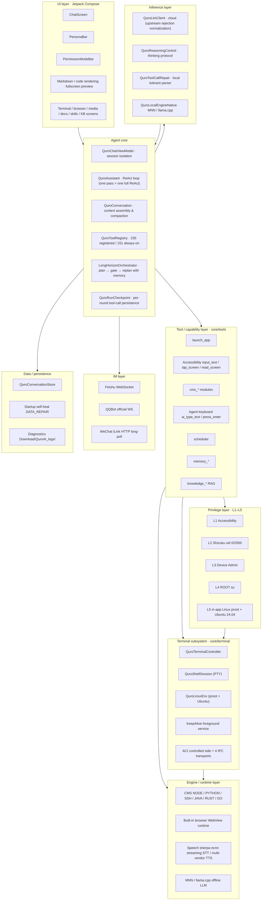

<div align="center">


# Zorv AI

### On-device AI Agent for Android

[](./LICENSE)
[](https://www.android.com)
[](https://github.com/Quor-a/ZorvAI/releases)
[](https://developer.android.com/about/versions/oreo)
[](https://developer.android.com)
[](https://kotlinlang.org)
[](https://developer.android.com/compose)

</div>

> **Package**: `com.ai.assistance.quro` ｜ **Stack**: Kotlin 2.3 + Jetpack Compose 1.10.2 (Material3 1.4.0) ｜ **AGP 8.13 / compileSdk 36 / minSdk 26 / targetSdk 34** ｜ **Current version**: `1.1.2` (`versionCode 1001002`)
>
> Zorv AI turns a chat assistant into an agent that can actually operate your phone. It runs on-device, drives the system through Accessibility / Shizuku / ROOT channels, calls **235 built-in tools**, runs **MNN / llama.cpp offline LLMs**, ships a terminal with a Linux sandbox, MCP, a knowledge base, TTS/STT — and stays reachable through Feishu, QQ and WeChat.
>
> It is also a **self-extensible agent runtime**: an APK-level plugin framework lets a standalone APK register extension points and give the AI **new tools, new ACI capabilities, new screens and new commands** — without changing a single line of host code.

**📘 Docs**: this file is the **feature & architecture overview**. Every architecture module and every feature module has its own full technical document — see [Documentation Index](#documentation-index).

**🌏 中文版**: [README.md](./README.md)

---

## Table of Contents

- [What it does](#what-it-does)
- [Open Source](#open-source)
- [Features](#features)
- [Architecture](#architecture)
- [Feature Map](#feature-map)
- [Build from Source](#build-from-source)
- [Troubleshooting](#troubleshooting)
- [Download](#download)
- [Documentation Index](#documentation-index)
- [License](#license)
- [Contributing / Feedback](#contributing--feedback)

---

## What it does

Most "phone AI assistants" are a cloud chat box in disguise — your words go to a server, the answer comes back rendered. Zorv AI is different: it keeps both **inference** and **execution** on your device, aiming to make the AI a real agent that operates your phone rather than a model that merely talks.

Three things it solves:

1. **The AI can act.** 235 built-in tools cover screen reading/tapping, files, messaging, scheduling, terminal and knowledge base. Higher-privilege capabilities (Shizuku, device admin, ROOT, in-app Linux) are graded **L1–L5**, and **every tier requires your explicit grant** — when ungranted the app returns guidance instead of silently executing.
2. **The AI works offline.** MNN and llama.cpp are compiled into the APK, together with on-device STT, on-device TTS, local RAG and an in-app Ubuntu 24.04 Linux sandbox (proot). Most tasks keep working with no network.
3. **The AI crosses app boundaries.** Through **ACI** (Agent Capability Interface) — a same-device, AIDL Binder based, root-free local protocol — any app can expose itself as "capabilities callable by an AI", orchestrated automatically by Zorv AI's LLM.

The design spine is **Tool-first**: every capability is expressed as a `QuroTool` (`name` / `description` / `parametersJson` / `run`) registered centrally in `QuroToolRegistry`. Adding a capability = implement the interface + one registration line. No rewiring.

---

## Open Source

> **Fully open source, mirrored on multiple platforms** · GitHub: [github.com/Quor-a/ZorvAI](https://github.com/Quor-a/ZorvAI) ｜ Gitee: [gitee.com/ZorvAI/ZorvAI](https://gitee.com/ZorvAI/ZorvAI) ｜ GitLab: [jihulab.com/quor-a-group/ZorvAI](https://jihulab.com/quor-a-group/ZorvAI)
>
> **🔌 The controlled browser (ZorvAI Browser) is open sourced separately** · [github.com/Quor-a/ZorvBrowser](https://github.com/Quor-a/ZorvBrowser)
>
> **🤖 5 official ACI controlled apps** (weather / document / terminal / build / file) are open sourced separately — see [Device Control / ACI](./docs/features/device-control/README.md).
>
> - 📦 Latest release (no login required): [github.com/Quor-a/ZorvAI/releases](https://github.com/Quor-a/ZorvAI/releases)
> - 🧩 **[APK plugin developer guide](./docs/PLUGIN_DEV_GUIDE.md)** — start here to add new tools / ACI capabilities / UI surfaces / commands to Zorv AI
> - 🧩 ACI core AAR: shipped as `aci-core-release.aar` with each release
> - 📖 ACI developer guide: [docs/ACI_DEVELOPER_GUIDE.md](./docs/ACI_DEVELOPER_GUIDE.md)
> - 🐛 Issues: [github.com/Quor-a/ZorvAI/issues](https://github.com/Quor-a/ZorvAI/issues)

---

## Features

| Domain | What it does |
|--------|--------------|
| **Chat UI (Compose)** | ChatScreen, PersonaBar persona cards, PermissionModeBar ("auto-save memory" + "deep thinking" pills), **in-chat IDE entry** (code editor / terminal / toolbox / files via the input "+" menu and `ui_open_*`), **7 programming languages**, **live ```mermaid rendering**, **AI-written code execution (`run_code`) with inline HTML preview**, jump-to-bottom FAB, fullscreen preview, Markdown and code rendering |
| **Agent core** | Multi-session isolation (`liveBuffers`), seed snapshots (`convBase`), display refresh gate (`canUpdateDisplay`), per-round `[round N]` hidden markers to prevent cross-talk, tool registry (`QuroToolRegistry`, 235 registered / 151 always-on per round), skill system (`QuroSkill` → registered as `skill__{name}` tools) |
| **Tool / capability layer** | **235 built-in tools** (151 always-on, the rest on demand via `tool_router` `get_schema`): accessibility `input_text` / `tap_screen` / `read_screen`, file read/write, **L1–L5 privileged execution**, `cms_*` modules, agent keyboard `ai_type_text` / `ai_press_enter`, scheduled tasks, memory tools, knowledge-base RAG, document processing |
| **Offline LLM engine** | Built-in **MNN / llama.cpp** inference (`QuroLocalEngineNative`) with streaming, live `<think>` streaming, local tool calling and persistent session reuse |
| **Privilege tiers L1–L5** | Accessibility → Shizuku (uid 0/2000) → Device Admin → ROOT (su) → in-app Linux (proot + Ubuntu 24.04). **L1–L4 are carried by the `PrivilegeLevel` enum** (system permissions); **L5 is not part of the enum** and is gated by whether the Linux environment is ready |
| **Terminal / Linux sandbox** | Full terminal emulator: proot + real Ubuntu 24.04 ARM64 user space; PTY (`/dev/ptmx` + `fork/exec`); foreground-service keep-alive (`specialUse`, survives screen-off and app switching); 26 ACI cross-process capabilities (single terminal entry point + `action` dispatch); 4 IPC transports (ContentProvider / Deep Link / Intent / BroadcastReceiver); multi-session management |
| **MCP** | MCP client (WebSocket / HTTP transports), in-app local MCP server deployable and callable by the AI, **MCP-ACI bridge** |
| **Engines / runtime** | CMS shared runtime (NODE / PYTHON / SSH / JAVA / RUST / GO), CMS v2 modules, built-in browser (Android WebView runtime), on-device STT / TTS |
| **IM channels** | Feishu (WebSocket) / QQBot (official WS) / WeChat iLink (HTTP long-poll 35s) |
| **Voice** | Multi-vendor TTS (EDGE_TTS / OPENAI_COMPAT / MINIMAX / SILICONFLOW / Alibaba Cloud …), on-device streaming STT (`sherpa-ncnn` streaming transducer, 5 bundled models 18MB-141MB), floating voice ball |
| **Knowledge / memory / persona / bots** | Vector semantic RAG knowledge base, memory store, persona & soul config, multi-channel bots (QQ / Feishu / WeChat / local) |
| **Visual popup & question** | **Visual popup** (`visual_popup` / `visual_custom_popup`); **Visual question** (`visual_question` / `visual_action`) — forces a choice/input dialog when a command is ambiguous or information is missing, instead of guessing |
| **Language runner** | `QuroLanguageRunner`: detection, execution and rendering of **7 languages** (JavaScript, Python, HTML, JSON, CSS, XML, C/C++/Java) inside the chat; **Python 3.14 native engine (PyEngine)** — on-device CPython 3.14 with the full standard library, plus a scripting sandbox (`SandboxRuntime` + `HostApiDispatcher` + `GitHostApi` + `TsTranspiler`) |
| **Generative UI (two coexisting stacks)** | ① **Web app** (`miniapp`): WebView runtime (`MiniAppEngine` + `native.*` bridge); ② **Built-in GenUI Agent** (`genui_agent_open`): GenUI JSON DSL → native Compose components (530+), standalone full-screen app. (The former third stack, the in-chat GenUI canvas `genui_open`, was removed in v1.0.96 together with the `genui` module) |
| **Visual components** | `ui_widget` tool: **60+ interactive components** rendered directly inside chat bubbles, with `command` syntax to trigger actions; **dynamic UI (```quro-ui fence)**: the AI writes a composable JSON DSL rendered natively as a coherent interactive screen |
| **Visual programming** | **Offline Mermaid rendering**: flowcharts / sequence / state / class / mind maps, fullscreen preview, SVG export, five themes |
| **AIP document layout** | **AIP layout engine** (AI Presentation Protocol): the AI emits a structured envelope (```aip fence / `aip_compose` tool) rendered natively as **long documents / slide decks / mind maps**; doc↔deck↔mindmap conversion, export to docx/pptx/md, fullscreen preview, slideshow, four-level graceful degradation |
| **APK-level plugin framework** | Install an APK and the AI gains capabilities; **14 extension points** (tools / ACI capabilities / screens / commands …); the AI drives plugins through a single `apk_plugin` tool |
| **i18n** | **11 UI languages**; reply language enforced by a unified injector covering chat (cloud + local), voice ball, video call, GenUI Agent, IM bots and sub-agents |

---

## Architecture



The core is not "a ReAct loop" but a **task-level closed loop** wrapped around it. `QuroAssistant` extracts a whole ReAct pass into `reactPass()` and hands it to `LongHorizonOrchestrator.runTask` as the `stepExecutor`:

```
plan (TaskPlanner) → run one ReAct pass → deliverability gate (judges the raw artifact)
      ↑                                                  │
      └── not deliverable: replan with the rejection reason, suggestion and failed steps ──┘
                        (past maxIterations, force-deliver the last pass)
```

The gate judges the **raw artifact**, not a summary — otherwise heuristics like `startsWith("工具执行失败")` can never fire and the gate degrades to "always deliverable". Replanning context is accumulated by the orchestrator itself (rejection reason, suggestion, failed steps, external tool-failure detail), not a placeholder.

| Layer | Entry point | Responsibility |
|-------|-------------|----------------|
| **UI** | `ui/ChatScreen.kt` | Chat rendering, bubbles, thinking cards, tool blocks, rich components; all secondary screens |
| **Agent core** | `core/QuroAssistant.kt` | ReAct loop (one pass = one full ReAct), round & loop guards, context assembly, tool dispatch, sub-agents; **true tool-result envelope** (`QuroToolResult`) unifying returned text |
| **Task orchestration** | `core/agent/orchestration/` | `LongHorizonOrchestrator` drives "plan → execute → deliverability gate → replan with memory"; `DefaultTaskPlanner` produces the plan; `HeuristicDeliverabilityJudge` plus model judging. **The gate and planning are inherent Agent stages, not a toggle** |
| **Inference** | `core/network/` | Cloud requests, mutually-exclusive thinking-field compilation across four vendors, on-device MNN / llama.cpp engines, tolerant tool-call parsing, upstream rejection normalization (no more surfacing `The request was rejected…` verbatim) |
| **Tools** | `core/tools/` | Registration, discovery, guard-rails, execution and failure feedback for 235 tools; **read-only tools run concurrently, side-effecting tools stay strictly serial**; `QuroToolRouter.PROGRESSIVE` progressive disclosure switch (off by default — see KDoc for the cost) |
| **Fault tolerance** | `core/tools/` | `QuroRunCheckpoint` persists every tool round (previously written but never wired); `onModelCorrect` correction channel (`CORRECT` / `ROLLBACK` / `ESCALATE`); `FailurePolicy` decides whether a failure is fed back for retry or terminates the run |
| **Memory** | `core/memory/` | Cognitive memory typing: **semantic / episodic / procedural / working**, each with its own retrieval and write strategy |
| **Privilege** | `QuroPrivilegeManager` | L1–L4 (`PrivilegeLevel` enum) escalation plus L5 (in-app Linux, gated by environment readiness), with unified auditing; ungranted tiers return guidance |
| **Terminal** | `core/terminal/` | PTY sessions, proot Linux env, foreground keep-alive, ACI and 4 IPC transports |
| **Engines** | `cms` / `browser` / `speech` / `llm` | Runtime provisioning, web rendering, speech, offline inference |
| **IM** | `im/` | Feishu / QQ / WeChat channels |

### Design patterns

- **Tool-first / Registry** — every capability is a `QuroTool`; adding one is an interface + a registration line.
- **ReAct loop** — "think → pick tool → execute → observe → think again" until the task completes; tool results flow back into the chat as cards.
- **Deliverability gate** — after the model produces a candidate answer, judge whether it can actually be delivered; if not, **replan with memory** and run another pass, instead of dumping the failure receipt at the user. The gate reads the raw artifact, not a summary.
- **Least-privilege tiers** — L1–L5 escalation where **an ungranted tier returns guidance rather than executing silently**.
- **Concurrent reads, serial writes** — `QuroTool.readOnly` defaults to `false`; the 14-tool read-only allowlist executes concurrently within a round to cut latency, while side-effecting tools stay strictly serial to preserve ordering.
- **Cognitive memory typing** — semantic / episodic / procedural / working memories are stored and retrieved separately, so procedural knowledge no longer shares a retrieval pool with episodic notes.
- **Strategy (swappable engines)** — cloud vendors and local MNN / llama.cpp share one `onToken` streaming interface; online/offline is transparent to upper layers.
- **SDUI** — the ACI console renders a snapshot JSON pushed by the controlled side, fully local, zero network.

> Full technical architecture per layer (layering details, key classes, sequences, design decisions and pitfalls) is in the **[architecture docs](#architecture-docs)**.

---

## Feature Map

| Module | One-liner | Docs |
|--------|-----------|------|
| **Chat core** | Message stream, streaming output, thinking cards, attachments, in-chat IDE, visual popup/question | [chat](./docs/features/chat/README.md) |
| **Built-in Skills** | 67 skills (verified in `assets/skills/zorv/manifest.json`) all seeded on first launch (only the 5 design-studio ones are enabled by default), registerable as `skill__{name}` tools | [skills](./docs/features/skills/README.md) |
| **MCP** | MCP client / local server / MCP-ACI bridge | [mcp](./docs/features/mcp/README.md) |
| **Offline LLM** | MNN / llama.cpp on-device inference: model import, loading, persistent sessions, local tool calling | [offline-llm](./docs/features/offline-llm/README.md) |
| **Terminal & Linux sandbox** | proot + Ubuntu 24.04 ARM64, multi-session, SSH/VNC, screen-off survival | [terminal](./docs/features/terminal/README.md) |
| **Voice / media / browser / docs** | Multi-vendor TTS, on-device streaming STT (sherpa-ncnn), built-in browser (WebView), document processing | [voice-media](./docs/features/voice-media/README.md) |
| **Device control / Shizuku / ACI** | L1–L5 privilege tiers, ACI controlled-app ecosystem, ACI console & HTTP transport | [device-control](./docs/features/device-control/README.md) |
| **KB / memory / persona / scheduling** | Vector-semantic RAG knowledge base, memory store (semantic / episodic / procedural / working), persona config, scheduled tasks & calendar | [knowledge-memory-persona](./docs/features/digital-human/README.md) |
| **APK-level plugin framework** | 14 extension points; install an APK and the AI gains capabilities | [extensibility](./docs/architecture/extensibility/README.md) |
| **i18n (11 languages)** | String key system, reply-language injection, translation pipeline | [i18n](./docs/architecture/i18n/README.md) |

---

## Build from Source

### Requirements

- **Android 8.0+ (API 26+)** device
- **Dev machine**: JDK **17+** (required by AGP 8.13), Android SDK (compileSdk 36 / minSdk 26 / targetSdk 34), Gradle via the bundled wrapper `./gradlew`
- **NDK** (side-by-side) to compile the MNN / llama.cpp native libraries

### Commands

```bash
# 1. Clone
git clone https://github.com/Quor-a/ZorvAI
cd ZorvAI

# 2. Prepare
#    - Install JDK 17+, set sdk.dir=/path/to/Android/Sdk in local.properties
#    - Make sure the NDK is installed in the Android SDK

# 3. Debug build
./gradlew assembleDebug
#    output: app/build/outputs/apk/*/debug/app-*-debug.apk

# 4. Release build (bring your own signing config)
./gradlew :app:assembleFullRelease
#    output: app/build/outputs/apk/full/release/app-full-release.apk

# Clean
./gradlew clean
```

> 💡 Release signing: `keystore.properties` lives at the **project root** (not `app/`), alias `zorvai`.
>
> 💡 If `./gradlew` fails with "no main manifest attribute / main class not found", the wrapper jar is missing `Main-Class` in its MANIFEST — repair the wrapper before building.

---

## Troubleshooting

| Symptom | Cause / fix |
|---------|-------------|
| **Long build times** | The first build compiles MNN / llama.cpp native libraries — high CPU with little disk churn is normal. Incremental builds are fast once `app/.cxx` is cached. |
| **`./gradlew` won't start** | The wrapper jar is missing `Main-Class`; repair it, or use a locally installed Gradle. |
| **Shizuku features unavailable** | Open the Shizuku app and start its service / finish pairing first, then grant in Zorv AI. The L2 channel stays off while Shizuku is not running. |
| **ROOT commands don't run** | ROOT mode runs through `sh -c`; confirm the device is rooted and `su` has been granted. |
| **In-app Linux (L5) won't run** | The terminal prompts "install Linux environment" on first use. `proot` ships with the APK; only the Ubuntu base rootfs needs to be downloaded (arm64 uses `ubuntu-ports`). |
| **Terminal killed on screen-off / app switch** | Check that the notification "Zorv AI terminal running" is present. Android 14+ requires `FOREGROUND_SERVICE_SPECIAL_USE`. |
| **Offline chat unavailable** | The offline LLM is bundled with release builds. Builds without the native engine libraries report "not available". |
| **Web / HTML preview blank** | The built-in browser runs on `android.webkit.WebView`: make sure the system WebView is installed and up to date (Developer options → WebView implementation). |
| **On-device STT unavailable** | On-device STT uses `sherpa-ncnn` **streaming transducer** models (not onnx/Whisper), 5 bundled tiers: zh 22MB (recommended) / zh-en 18MB / en 37MB / zh-en 141MB / ConvEmformer 27MB; they must be downloaded and extracted on first use. Recognition runs in a dedicated `:asr` process, so a crash cannot take down the main app. |
| **Duplicated or broken sessions** | Startup self-heal `DATA_REPAIR` de-duplicates on launch; restarting the app is enough. |
| **Need diagnostics** | Logs are written to the public folder `Download/QuroAI_logs/` — no adb required. |

---

## Download

[](https://github.com/Quor-a/ZorvAI/releases)

- 🟢 **[v1.1.2 Release](https://github.com/Quor-a/ZorvAI/releases)** (release-signed, **latest**)

  **The task-level closed loop is now actually wired into the main loop**

  - **`LongHorizonOrchestrator.runTask` went from dead code to backbone**: the orchestrator existed but had zero call sites repo-wide. This release extracts `QuroAssistant`'s ReAct loop into a local `reactPass()` and hands it to `runTask` as the `stepExecutor` — one pass = one full ReAct, and the chain becomes "plan → execute → deliverability gate → replan with memory if undeliverable → run another pass → force-deliver the last pass past the limit".
  - **The deliverability gate and task planning are inherent Agent stages**, no longer a switch that can be turned off: after the model produces a candidate answer, judge deliverability and replan with memory instead of dumping the failure receipt at the user.
  - **Two real "gate blindness" bugs fixed along the way**: ① the replanning context was the literal string `"ctx"`, making replanning 100% blind — the orchestrator now accumulates the rejection reason, suggestion and failed steps itself, plus a new `extraPlanContext` outlet for tool-layer failure detail; ② the gate judged a summary prefixed with `OK: ` and truncated to 200 chars, so `startsWith("工具执行失败")` could never hold and the gate always judged "deliverable" — it now judges the **raw artifact**.

  **Reliability**

  - **Read-only tools run concurrently**: `QuroTool.readOnly` defaults to `false`; a 14-tool read-only allowlist executes concurrently within a round to cut latency, while side-effecting tools stay strictly serial to preserve ordering.
  - **True tool-result envelope** (`QuroToolResult`): unified tool return text; successful results are no longer wrapped in failure packaging.
  - **`QuroRunCheckpoint` wired into the tool loop**: previously written but never connected — every tool round is now persisted.
  - **`onModelCorrect` correction channel**: the `CORRECT` / `ROLLBACK` / `ESCALATE` three-tier collapse is resolved; a `CORRECT` hit returns control to the upper layer.
  - **Upstream rejection normalization**: `The request was rejected…` is no longer surfaced verbatim to the user.
  - **Cognitive memory typing**: semantic / episodic / procedural / working, each with its own retrieval and write strategy.

  > ⚠️ **The v1.1.1 release notes are obsolete**: the three layers advertised there (three-tier cloud context budgeting / key-line rescue in tool results / honest archiving) were **fully rolled back** in `af5fe17` before v1.1.2 — real-device feedback showed the AI received *less* information after compression, producing off-topic answers and parroting. The rollback restored the tree to its pre-change state; no further compression/truncation layer is being added.

All releases: [Releases](https://github.com/Quor-a/ZorvAI/releases).

---

## Documentation Index

### Architecture Docs

| Module | Path |
|--------|------|
| **On-device inference** (MNN / llama.cpp, L0–L6) | [docs/architecture/inference-native/README.md](./docs/architecture/inference-native/README.md) |
| **Cloud inference** (thinking protocol / tool calling / context budget) | [docs/architecture/inference-cloud/README.md](./docs/architecture/inference-cloud/README.md) |
| **Tool system** (235 tools / registry / guard / feedback / read-only concurrency) | [docs/architecture/tool-system/README.md](./docs/architecture/tool-system/README.md) |
| **Agent loop** (ReAct / task-level closed-loop orchestration / deliverability gate / loop guards / sub-agents) | [docs/architecture/agent-loop/README.md](./docs/architecture/agent-loop/README.md) |
| **Terminal & Linux sandbox** | [docs/architecture/terminal-sandbox/README.md](./docs/architecture/terminal-sandbox/README.md) |
| **UI & rendering** (AIP / ui_widget / quro-ui / GenUI / MiniApp) | [docs/architecture/ui-rendering/README.md](./docs/architecture/ui-rendering/README.md) |
| **i18n** (11 languages) | [docs/architecture/i18n/README.md](./docs/architecture/i18n/README.md) |
| **Extensibility** (plugin framework / ACI / MCP / Skills) | [docs/architecture/extensibility/README.md](./docs/architecture/extensibility/README.md) |

### Feature Docs

| Module | Path |
|--------|------|
| Chat core | [docs/features/chat/README.md](./docs/features/chat/README.md) |
| Built-in Skills | [docs/features/skills/README.md](./docs/features/skills/README.md) |
| MCP | [docs/features/mcp/README.md](./docs/features/mcp/README.md) |
| Offline LLM engine | [docs/features/offline-llm/README.md](./docs/features/offline-llm/README.md) |
| Terminal & Linux sandbox | [docs/features/terminal/README.md](./docs/features/terminal/README.md) |
| Voice / media / browser / docs | [docs/features/voice-media/README.md](./docs/features/voice-media/README.md) |
| Device control / Shizuku / ACI | [docs/features/device-control/README.md](./docs/features/device-control/README.md) |
| KB / memory / persona / scheduling | [docs/features/digital-human/README.md](./docs/features/digital-human/README.md) |

### Developer Guides

| Guide | Audience | Path |
|-------|----------|------|
| **APK plugin development** | Adding new tools / ACI capabilities / UI surfaces / commands to the AI: 30-second framework, one-command skeleton, extension-point list, `apk_plugin` management tools, pitfalls and on-device verification | [docs/PLUGIN_DEV_GUIDE.md](./docs/PLUGIN_DEV_GUIDE.md) |
| **ACI controlled-app development** | Exposing your own app as an AI-callable capability | [docs/ACI_DEVELOPER_GUIDE.md](./docs/ACI_DEVELOPER_GUIDE.md) |
| **ACI technical architecture** | ACI protocol and implementation details | [docs/ACI_TECHNICAL_ARCHITECTURE.md](./docs/ACI_TECHNICAL_ARCHITECTURE.md) |
| **Terminal architecture** | PTY / proot / foreground keep-alive / IPC | [docs/TERMINAL_ARCHITECTURE.md](./docs/TERMINAL_ARCHITECTURE.md) |

### Other existing docs

- [docs/architecture/云端推理思考与工具调用架构.md](./docs/architecture/云端推理思考与工具调用架构.md) — cloud inference implementation log (N1–N15)
- [docs/architecture/本地推理引擎思考与工具调用架构.md](./docs/architecture/本地推理引擎思考与工具调用架构.md) — on-device engine log

---

## License

Zorv AI is released under **Apache-2.0** (see [LICENSE](./LICENSE)).

- **Main license**: Apache-2.0 (all application source).
- **GeckoView (Mozilla)**: distributed under **MPL-2.0** (file-level copyleft). The dependency ships with the build (an alternative built-in browser engine; rendering currently goes through the system `android.webkit.WebView`); corresponding source is provided with the build.
- **On-device CPython 3.14 (PyEngine / scripting sandbox)**: the interpreter itself is **PSF-2.0**; bundled OpenSSL (Apache-2.0) and SQLite (public domain) are listed in [NOTICE](./NOTICE).
- **Other third-party dependencies** (AndroidX / Jetpack Compose, Kotlin, OkHttp, Shizuku, QuickJS, Sherpa-NCNN, Chart.js / D3 / ECharts / KaTeX, React / Recharts / Lucide …) keep their own licenses; the full list is in [NOTICE](./NOTICE).

> License obligations are declared only for components **actually distributed with the build**; components not shipped create no additional copyleft obligations.
> `DesktopFriends/` at the repo root is a reference/research directory; it is **not part of the APK build and not distributed**, so its license does not create any obligation for this application.

---

## Contributing / Feedback

Contributions are welcome: core features, built-in tools, CMS modules, docs and translations.

1. Fork the repository
2. Create a feature branch (`git checkout -b feature/xxx`)
3. Commit (`git commit -m 'feat: xxx'`)
4. Push (`git push origin feature/xxx`)
5. Open a Pull Request

Found a bug or have an idea? Please [open an Issue](https://github.com/Quor-a/ZorvAI/issues) with a clear description, reproduction steps, device model, OS version and screenshots.

If you like the project, consider leaving a ⭐!

### Keywords (SEO)

Zorv AI open source, Android AI assistant open source, on-device AI agent, local AI chatbot, Kotlin Jetpack Compose LLM, Android automation agent, voice AI assistant, TTS STT assistant, AI tool use, Feishu QQ WeChat AI bot

> GitHub [github.com/Quor-a/ZorvAI](https://github.com/Quor-a/ZorvAI) ｜ Gitee [gitee.com/ZorvAI/ZorvAI](https://gitee.com/ZorvAI/ZorvAI) ｜ GitLab [jihulab.com/quor-a-group/ZorvAI](https://jihulab.com/quor-a-group/ZorvAI) ｜ Downloads: [Releases](https://github.com/Quor-a/ZorvAI/releases)

---

<div align="center">

Made with ❤️ by the Zorv AI Team

</div>
