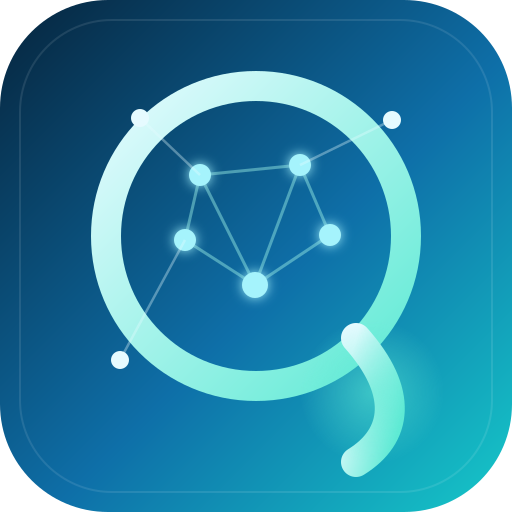
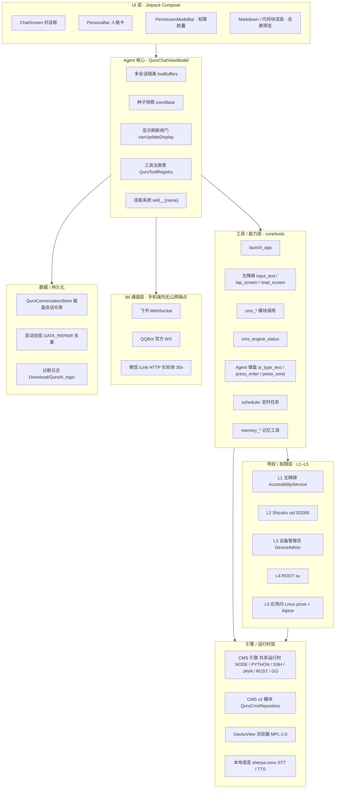

<div align="center">



# Zorv AI

### 运行在 Android 上的设备端 AI Agent · 智能体助手

*On-device AI Agent for Android — tools, personas, memory, and a shared runtime, all on your phone.*

[](./LICENSE)
[](https://www.android.com)
[](https://kotlinlang.org)
[](https://developer.android.com/compose)
[](https://mozilla.github.io/geckoview/)
[](https://github.com/Quor-a/ZorvAI/releases)
[](https://developer.android.com/about/versions/oreo)
[](https://developer.android.com)

</div>

> **包名**：`com.ai.assistance.quro` ｜ **技术栈**：Kotlin + Jetpack Compose ｜ **compileSdk 36 / minSdk 26 / targetSdk 34**
>
> Zorv AI 把「对话助手」做成一个真正能操作手机的 Agent：它在设备上运行，能用无障碍 / Shizuku / ROOT 等通道操控系统，调用内置工具，运行 Node / Python / SSH / Java / Rust / Go 共享运行时，并通过飞书、QQ、微信与你保持在线。

---

## 🌐 开源地址 · Open Source

> **本项目完全开源，双平台托管 · GitHub：[github.com/Quor-a/ZorvAI](https://github.com/Quor-a/ZorvAI) ｜ Gitee：[gitee.com/ZorvAI/ZorvAI](https://gitee.com/ZorvAI/ZorvAI)**
>
> **🔌 受控端浏览器（ZorvAI 浏览器）已独立开源 · GitHub：[github.com/Quor-a/ZorvBrowser](https://github.com/Quor-a/ZorvBrowser) ｜ Gitee：[gitee.com/ZorvAI/ZorvBrowser](https://gitee.com/ZorvAI/ZorvBrowser)**（独立仓库，含 v1.0.12 源码与 APK）
>
> - 📦 最新 Release（免登录下载）：[github.com/Quor-a/ZorvAI/releases](https://github.com/Quor-a/ZorvAI/releases)
> - 🔗 主程序 APK 直链（v1.0.6）：[ZorvAI-debug-v1.0.6.apk](https://github.com/Quor-a/ZorvAI/releases/download/v1.0.6/ZorvAI-debug-v1.0.6.apk)
> - 🔗 主程序 APK（v1.0.13，最新）：[ZorvAI-debug-v1.0.13.apk](https://github.com/Quor-a/ZorvAI/releases/download/v1.0.13/ZorvAI-debug-v1.0.13.apk)
- 🔗 主程序 APK（v1.0.12）：[ZorvAI-debug-v1.0.12.apk](https://github.com/Quor-a/ZorvAI/releases/download/v1.0.12/ZorvAI-debug-v1.0.12.apk)
> - 🔗 受控端浏览器 APK（ZorvAI 浏览器 v1.0.12 · 独立仓）：[ZorvBrowser-aci-debug-v1.0.12.apk](https://github.com/Quor-a/ZorvBrowser/releases/download/v1.0.12-browser/ZorvBrowser-aci-debug-v1.0.12.apk)
> - 🧩 ACI 核心库 AAR：[aci-core-release.aar](https://github.com/Quor-a/ZorvAI/releases/download/v1.0.6/aci-core-release.aar)
> - 📖 ACI 开发者手册：[docs/ACI_DEVELOPER_GUIDE.md](./docs/ACI_DEVELOPER_GUIDE.md)
> - 🐛 问题反馈：[github.com/Quor-a/ZorvAI/issues](https://github.com/Quor-a/ZorvAI/issues)
>
> 关键词：**Zorv AI 开源 / 安卓 AI 助手 开源 / Android AI agent open source / 本地 AI 智能体 / 设备端 AI Agent / Kotlin Compose LLM 助手 / ACI 跨应用调用**

---

## ✨ Features · 功能亮点

| 能力域 | 关键能力 |
|--------|----------|
| **对话 UI（Compose）** | ChatScreen 对话框、PersonaBar 人格卡、PermissionModeBar（「AI 自动保存记忆」+「深度思考」并排胶囊）、回到底部浮动按钮、全屏预览、Markdown 与代码块渲染 |
| **Agent 核心** | 多会话隔离（`liveBuffers` 按会话独立）、种子快照（`convBase`）、显示刷新闸门（`canUpdateDisplay`）、多轮 `[第N轮]` hidden 标记防串台、系统提示词构建、工具注册表（`QuroToolRegistry.active`）、技能系统（`QuroSkill` → 注册为 `skill__{name}` 工具） |
| **工具 / 能力层** | `launch_app`、无障碍 `input_text`/`tap_screen`/`read_screen`（节点树，非截图）、`cms_*` 模块调用、`cms_engine_status`、`Agent 键盘 ai_type_text`/`ai_press_enter`/`ai_press_send`（注册为系统输入法的极简 IME，向其他 App 灌字）、`scheduler` 定时任务、`memory_*` 记忆工具 |
| **特权层 L1–L5** | 无障碍 → Shizuku(uid 0/2000) → 设备管理员 → ROOT(su) → 应用内 Linux(proot + Alpine) |
| **引擎 / 运行时** | CMS 引擎共享运行时（NODE / PYTHON / SSH / JAVA / RUST / GO）、CMS v2 模块、GeckoView 浏览器（MPL-2.0）、本地语音 STT / TTS |
| **IM 通道** | 飞书（WebSocket）/ QQBot（官方 WS）/ 微信 iLink（HTTP 长轮询 35s）；三家手机端均无公网端点 |
| **ACI 控制台 UI（LAN 控制台）** | 控制端 `QuroAciCenterScreen` 按 `console_ui` 能力拉取 SDUI 快照、复用本地 `AciConsoleScreen` 渲染器（`core/aci` 包，已从 `lanui` LAN 范式解耦，纯本地零网络）；受控浏览器 `ConsoleBackend` 提供 `console_ui`(快照) / `console_action`(increment/reset/submit_note)；纯接线、零侵入 |
| **数据 / 持久化** | `QuroConversationStore` 磁盘会话仓库、启动自愈 `DATA_REPAIR` 去重、诊断日志写入手机公共 `Download/QuroAI_logs/` |
| **定时任务** | `QuroScheduler`：`once` / `recurring`（rrule）、`endAt` 结束机制 |

---

## 🏗️ Functional Architecture · 功能构架



---

## ⚙️ Engine · 引擎详解

### CMS 引擎（系统资源包）

CMS 引擎是一套**共享运行时**供给机制，按需在设备上提供 **NODE / PYTHON / SSH / JAVA / RUST / GO** 等环境（`DepKind.ENV` + `CmsEnvProvisioner` 按需供给）。你可以用 `cms_engine_status` 查询：

- 各运行时**就绪态**；
- 当前**共享服务**；
- **部署进度**（provisioning 进行到哪一步）。

> 🔑 **引擎 ≠ 模块**
> - **CMS 引擎**是底层「运行时骨架」——它负责把 NODE/PYTHON/SSH/JAVA/RUST/GO 这些环境供给到设备上，是能力运行的基础设施。
> - **CMS v2 模块**（`QuroCmsRepository`）是用户自建的、**可复用**的上层能力单元，通过 `serializeModule` / `parseModule` 导入导出，运行在引擎提供的运行时之上。
>
> 二者是「地基」与「楼栋」的关系：引擎提供环境，模块消费环境。

### GeckoView 浏览器引擎（MPL-2.0）

内置 [GeckoView](https://mozilla.github.io/geckoview/) 作为系统 WebView 的替代，用于渲染网页与 HTML 预览。GeckoView 以 **MPL-2.0**（file-level copyleft）分发，其对应源代码随构建提供（见 [NOTICE](./NOTICE)）。

### 本地语音

- **本地 STT**：`sherpa-onnx-whisper-tiny` 本地语音识别（约 85MB onnx 模型，离线可用）。
- **TTS**：单例 `QuroTtsHolder`，支持多服务商（如小米 MiMo 真情感合成），情绪标签跟随文本。

---

## 🔌 ACI · 智能体能力接口（开放调用）

Zorv AI 内置 **ACI（Agent Capability Interface）** —— 一套同设备、无 Root、基于 AIDL Binder 的本地跨应用调用框架。任何 Android App 都能通过 `aci-core` 库把自己暴露成「可被 AI 调用的能力」，由 Zorv AI 的 LLM 自动编排。

- 📖 **开发者手册**：[docs/ACI_DEVELOPER_GUIDE.md](./docs/ACI_DEVELOPER_GUIDE.md) —— 受控端 5 步接入、能力定义、权限模型、真实踩坑。
- 📦 **`aci-core` AAR**：随 **v1.0.6+ Release** 提供 `aci-core-release.aar`；开源独立分支 `aci-core` 提供完整可构建源码。
- 🌿 **开源分支**：`git checkout aci-core` 即可拿到一个可独立 `./gradlew assembleRelease` 的 Android 库工程。

**受控端最小接入（Kotlin）：**

```kotlin
class MyAciService : BaseACIService() {
    override fun onCreateCapabilities(caps: MutableList<Capability>) {
        caps.add(Capability.create("open_url", "在浏览器打开指定网址")
            .addParam("url", "string", true, "目标网址")
            .addFlag(Capability.FLAG_BACKGROUND))
    }
    override fun onCall(req: ACIRequest): ACIResponse =
        ACIResponse.success().putResult("ok", true)
}
```

> ⚠️ `Capability.create(id, description)` 的**第 2 参是给 LLM 的自然语言描述，不是版本号**（方法内部固定 `version="1.0"`）。受控端还需在 Manifest 写 `<queries>` 声明 `ACTION_BIND`/`ACTION_WAKE`，否则 Android 11+ 控制端发现不到。

**ZorvAI 浏览器（官方受控端）已暴露的能力：**

作为官方参考实现，ZorvAI 浏览器向控制端（主程序 LLM）暴露以下 7 个能力，可直接被 AI 编排调用：

| 能力 | 入参 | 返回 | 说明 |
|------|------|------|------|
| `browser_open` | `url`(必填) | `launched` | 打开并导航到指定网址 |
| `browser_read` | — | `url` / `title` / `html` / `truncated`（大页面附 `html_gz` gzip 字节） | 读取当前页 HTML（**v1.0.8** 修复 Binder 1MB 溢出） |
| `browser_crawl` | — | `url` / `title` / `text` / `links` / `link_count` / `truncated` | **🆕 v1.0.9** 抓取结构化正文（取 `article/main/body` innerText）+ 出站链接 `[{text,href}]` |
| `browser_search` | `query`(必填) / `engine`(可选：bing/google/baidu/ddg，默认 bing) | `query` / `engine` / `url` / `title` / `text` / `links` / `truncated` | **🆕 v1.0.9** 用搜索引擎检索关键词并返回结果页 |
| `browser_script` | `code`(必填) | `result` / `truncated` | **🆕 v1.0.9** 在当前页面执行任意 JavaScript 并返回结果 |
| `browser_list` | — | `tabs` | 列出当前打开的标签页 |
| `browser_info` | — | `package` / `versionName` / `versionCode` | 查询受控端版本信息 |

> 💡 `browser_crawl` / `browser_search` 让 AI 能做「网页检索 / 信息抽取 / 爬虫」类任务；`browser_script` 提供页面内任意 JS 执行（高危能力，仅在受信任会话中使用）。完整契约见 [ACI 开发者手册 §13](./docs/ACI_DEVELOPER_GUIDE.md#13-官方受控端能力清单zorvai-浏览器)。

---

## 🖥️ ACI 控制台 UI（LAN 控制台）

> 「LAN 控制台」即 **ACI 控制台 UI**：让受控端 App 在 Zorv AI 里直接显示一个**可交互的控制台**，用于手动操作受控端（如浏览器的打开 / 读 HTML / 爬取 / 运行 JS / 查找 / 截图 / 抓包等），而不必走 LLM 自动编排。

采用 **SDUI（Server-Driven UI）** 模式：

- 受控端只暴露两个 ACI 能力——`console_ui`（返回界面快照 JSON）与 `console_action`（处理按钮 / 输入）；
- 控制端 `QuroAciCenterScreen` 按 capability id `console_ui` 显示「打开控制台」入口，点击后通过**同设备 Binder** 拉取快照，用本地 `AciConsoleScreen`（`core/aci` 包）渲染；
- **纯本地、零网络**：不管 WiFi 还是移动网络均可用，不经过任何服务器；
- 受控端 `ConsoleBackend` 实现 `AciConsoleContract`（`buildUiSnapshot` + `applyAction`），即可被 Zorv AI 直接驱动。

接入细节（快照 JSON Schema、动作契约、最小示例、`consolekit` 复用）见 [ACI 开发者手册 §14](./docs/ACI_DEVELOPER_GUIDE.md#14-lan-控制台--控制台后台接入-zorvai)。

> 📌 早期版本曾误建「app 自连 `127.0.0.1` 环回 HTTP 控制台」（`lanui` 模块），已于 2026-07-31 彻底移除；现行方案改为受控端经 ACI 提供快照、控制端纯本地渲染，正确且零网络依赖。

---

## 🔐 Privilege Tiers · 特权 / 权限层（L1–L5）

更高层级的系统级执行通道**均需用户显式授权**后才会启用；未授权时返回引导提示，不会静默越权。

| 层级 | 是什么 | 用途 | 前置条件 |
|------|--------|------|----------|
| **L1** 无障碍 | `AccessibilityService` | 点击 / 输入 / 读屏（`read_screen` 读取无障碍节点树，非截图） | 在系统设置中开启 Zorv AI 的无障碍服务 |
| **L2** Shizuku | uid 0/2000，AIDL `UserService` 主路径，反射 `newProcess` 备选 | 高权限 shell 命令执行 | 安装并运行 Shizuku App，完成配对授权 |
| **L3** 设备管理员 | `DeviceAdmin` | 设备策略级能力（锁定 / 擦除等） | 在设置中激活设备管理员 |
| **L4** ROOT | `su` | 完整 root 权限，命令走 `sh -c` 执行 | 设备已 root |
| **L5** 应用内 Linux | `proot` + Alpine rootfs | 真 Linux 用户态执行 | 用户自备 `proot` 二进制与 Alpine rootfs |

---

## 🧰 Requirements & Quick Start · 系统要求与快速开始

### 系统要求

- Android 8.0+（API 26+）
- 建议 4GB+ 内存，存储空间 200MB+（本地语音模型另需约 85MB）

### 从源码构建

```bash
# 克隆仓库
git clone https://github.com/Quor-a/ZorvAI
cd QuroAI

# 准备环境
# - JDK 17
# - Android SDK（compileSdk 36 / minSdk 26 / targetSdk 34）
# - 在 local.properties 中配置 sdk.dir

# 构建 debug 包
./gradlew clean assembleDebug
```

构建产物：`app/build/outputs/apk/debug/app-debug.apk`

---

## 🔎 Troubleshooting · 排查与故障排查

| 现象 | 说明 / 处理 |
|------|-------------|
| **Shizuku 相关能力不可用** | 必须**先打开 Shizuku App 并启动其服务 / 完成配对**，再在 Zorv AI 中授权；Shizuku 未运行时 L2 通道不会启用。 |
| **ROOT 模式命令不执行** | ROOT 模式命令走 `sh -c` 执行，需确认设备已 root 且已授予 su 权限。 |
| **应用内 Linux（L5）无法运行** | 真执行依赖**用户自备的 `proot` 二进制**与 Alpine rootfs，请先准备好这些外部资源。 |
| **网页 / HTML 预览不显示** | 确认已随包集成 GeckoView（MPL-2.0）运行时。 |
| **本地语音识别不可用** | 本地 STT 模型为约 85MB 的 onnx 文件，首次使用需下载 / 放置到指定目录。 |
| **会话出现重复或异常** | 启动自愈 `DATA_REPAIR` 会在启动时去重清洗，重启 App 即可。 |
| **需要诊断日志** | 日志写到手机公共目录 `Download/QuroAI_logs/`，无需 adb 即可取出。 |

---

## 📦 Download · 下载 / APK

[](https://github.com/Quor-a/ZorvAI/releases)

直接从 Release 页面下载最新 APK：

- **v1.0.13（debug，主程序，最新）**：[ZorvAI-debug-v1.0.13.apk](https://github.com/Quor-a/ZorvAI/releases/download/v1.0.13/ZorvAI-debug-v1.0.13.apk)
- **v1.0.12（debug，主程序）**：[ZorvAI-debug-v1.0.12.apk](https://github.com/Quor-a/ZorvAI/releases/download/v1.0.12/ZorvAI-debug-v1.0.12.apk)
- **v1.0.12（debug，受控端浏览器 ACI · ZorvAI 浏览器 · 独立仓）**：[ZorvBrowser-aci-debug-v1.0.12.apk](https://github.com/Quor-a/ZorvBrowser/releases/download/v1.0.12-browser/ZorvBrowser-aci-debug-v1.0.12.apk)
- **v1.0.12（debug，主程序 · ACI 控制台 UI 版）**：[ZorvAI-debug-v1.0.12-console.apk](https://github.com/Quor-a/ZorvAI/releases/download/v1.0.12-console/ZorvAI-debug-v1.0.12-console.apk)
- **v1.0.12（debug，受控端浏览器 ACI · 控制台 UI 版 · 独立仓）**：[ZorvBrowser-aci-debug-v1.0.12-console.apk](https://github.com/Quor-a/ZorvBrowser/releases/download/v1.0.12-console/ZorvBrowser-aci-debug-v1.0.12-console.apk)
- **🧩 受控端浏览器·独立仓库（源码 + v1.0.12 APK）**：[github.com/Quor-a/ZorvBrowser](https://github.com/Quor-a/ZorvBrowser) ｜ [gitee.com/ZorvAI/ZorvBrowser](https://gitee.com/ZorvAI/ZorvBrowser)
- **v1.0.6（debug，主程序）**：[ZorvAI-debug-v1.0.6.apk](https://github.com/Quor-a/ZorvAI/releases/download/v1.0.6/ZorvAI-debug-v1.0.6.apk)
- **v1.0.6 附带的 ACI 核心库 AAR**：[aci-core-release.aar](https://github.com/Quor-a/ZorvAI/releases/download/v1.0.6/aci-core-release.aar)
- **v1.0.5（debug）**：[ZorvAI-debug-v1.0.5.apk](https://github.com/Quor-a/ZorvAI/releases/download/v1.0.5/ZorvAI-debug-v1.0.5.apk)
- **v1.0.2（debug）**：[QuroAI-v1.0.2-debug.apk](https://github.com/Quor-a/ZorvAI/releases/download/v1.0.2/QuroAI-v1.0.2-debug.apk)

> 💡 v1.0.6 起开放 **ACI（Agent Capability Interface）**：主程序作为控制端，可调用任意接入 `aci-core` 的受控端 App（官方参考实现「ZorvAI 浏览器」已独立开源，见上方独立仓库链接）；`aci-core-release.aar` 随本仓库 Release 提供。详见 [ACI 开发者手册](./docs/ACI_DEVELOPER_GUIDE.md)。

> ⚠️ 请务必从官方 Release 页面下载本应用。通过未知渠道获取的安装包可能被篡改，存在隐私泄露风险。

---

## 📜 License · 许可证

Zorv AI 本应用源码以 **Apache-2.0** 许可证发布（见 [LICENSE](./LICENSE)）。

- **主许可**：Apache-2.0（应用全部源码）。
- **GeckoView（Mozilla）**：以 **MPL-2.0** 分发（file-level copyleft）。其对应源代码随构建提供，符合该许可证义务。
- **其余第三方依赖**（AndroidX / Jetpack Compose、Kotlin、OkHttp、Shizuku、QuickJS、Sherpa-NCNN 等）各自保留其原有许可证，完整清单见 [NOTICE](./NOTICE)。

> 本仓库仅就**实际随包分发**的组件声明其许可证义务；未随包分发的组件不产生额外的 Copyleft 义务。

---

## 🗓️ Changelog · 版本历程

| 版本 | 日期 | 说明 |
|------|------|------|
| v1.0.13 | 2026-07-31 | **文档与许可对齐（LAN 控制台 / ACI 控制台）**：「设置 → 关于 Zorv AI → 开源许可声明」新增 ACI 控制台 UI（LAN 控制台）许可条目；README 新增「ACI 控制台 UI（LAN 控制台）」专节；开源 ACI 开发者手册新增 §14「LAN 控制台 / 控制台后台接入」；LICENSE 追加 LAN 控制台子系统许可说明；版本号升级至 versionCode 449 / versionName 1.0.13（受控浏览器保持 v1.0.12，未随本次发布） |
| v1.0.12-console | 2026-07-31 | **ACI 控制台 UI（新增功能，未升版号）**：受控浏览器 `ConsoleBackend` 新增 `console_ui`(SDUI 快照) / `console_action`(increment/reset/submit_note) 能力；控制端 `QuroAciCenterScreen` 按 capability 显示「打开控制台」并复用本地 `AciConsoleScreen` 渲染器（已从 `lanui` LAN 范式解耦到 `core/aci` 本地包，纯本地零网络——同设备 Binder 调用，不管 WiFi 还是移动网络均可用）；拆除错误的 `browserui` 自循环前端（端口 8081 本地 HTTP），清理 Manifest/shortcuts 声明；主程序与浏览器均保持 versionCode 448 / versionName 1.0.12 |
| v1.0.12 | 2026-07-30 | **ACI 被控方接入手册修正 + AAR 链接**：对齐真实 AAR API（`Capability.create(id, 描述)`、`onCreateCapabilities(caps)` 参数式、`onCall(req): ACIResponse` 返回值式）；补 3 个 `<permission>` 必须声明（缺则绑定必失败）；新增「二、依赖获取（aci-core AAR）」段含 AAR 直链、Gradle 依赖、`aci-core` 分支与网页手册；排障铁律补「绑定秒拒=漏写权限定义」 |
| v1.0.11 | 2026-07-30 | **关于页「检查更新」健壮性增强**：新增「检查中…」可见状态；GitHub API 不可达时自动回退 Gitee 镜像 API（国内网络适配）；失败给出明确报错而非静默；其余保持 v1.0.10 镜像选择流程 |
| v1.0.10 | 2026-07-30 | **关于页更新流程增强 + 受控浏览器移动端适配**：检测到新版本后弹出「GitHub / Gitee 镜像」选择框（不再直接跳转）；受控端浏览器 WebView 新增 `useWideViewPort` + `loadWithOverviewMode` + `NARROW_COLUMNS` 布局，页面缩放适配手机窄屏、消除横向溢出 |
| v1.0.8 | 2026-07-30 | **修复 `browser_read` Binder ~1MB 溢出**：采用「安全截断 HTML(≤15 万字符) + 大页面 gzip(byte[]) 经 `html_gz` 回传」混合方案，控制端解压还原完整 HTML；顺带修复标题延迟、读取时序与 AAR 依赖路径 |
| v1.0.6 | 2026-07-30 | **开放 ACI（Agent Capability Interface）**：新增受控端浏览器模块 `aci-browser`、控制端 `QuroAciManager` 修复 stopped-state 唤醒（bindWithWake）、`Capability.create` 描述修复、ACI 开发者手册与 `aci-core` 开源分支/AAR、Gitee 镜像推送 |
| v1.0.5 | 2026-07-30 | 仓库更名 ZorvAI、品牌视觉统一、关于页「检查更新」真实联网检测、全仓 URL 修正、开源地址与搜索可见性优化 |
| v1.0.2 | 2026-07-29 | Shizuku 授权按钮修复、AI 键盘输入通道、权限模型引导、GeckoView 内置浏览器、记忆库与 CMS v2 能力模块 |

---

## 🤝 Contributing · 贡献

欢迎各种贡献：核心功能开发、内置工具、CMS 模块、文档与翻译。

1. Fork 本仓库
2. 创建特性分支（`git checkout -b feature/xxx`）
3. 提交变更（`git commit -m 'feat: xxx'`）
4. 推送分支（`git push origin feature/xxx`）
5. 提交 Pull Request

---

## 💬 Feedback · 问题反馈

遇到问题或有建议？欢迎 [提交 Issue](https://github.com/Quor-a/ZorvAI/issues)。
请尽量提供：清晰描述、复现步骤、设备型号与系统版本、相关截图。

如果觉得项目不错，欢迎点个 ⭐ Star 支持我们！

---

## 🔎 关键词 · 便于搜索（SEO）

为了让大家在 GitHub 探索、Google、Bing、百度等搜索引擎更容易找到本项目，这里列出常用检索词：

- **中文**：Zorv AI 开源、安卓 AI 助手 开源、Android AI 智能体、本地 AI 助手、设备端 AI Agent、手机 AI 助手、Kotlin Compose AI 聊天机器人、离线 AI 助手、语音 AI 助手、安卓自动化助手、AI 工具调用、飞书 QQ 微信 AI 机器人
- **English**：Zorv AI open source, Android AI assistant open source, on-device AI agent, local AI chatbot, Kotlin Jetpack Compose LLM, Android automation agent, voice AI assistant, TTS STT assistant, AI tool use, Feishu QQ WeChat AI bot

> 仓库主页：GitHub [github.com/Quor-a/ZorvAI](https://github.com/Quor-a/ZorvAI) ｜ Gitee [gitee.com/ZorvAI/ZorvAI](https://gitee.com/ZorvAI/ZorvAI) ｜ 最新下载：[Releases](https://github.com/Quor-a/ZorvAI/releases)

> 🤖 **AI 友好入口**：根目录 `llms.txt` 与 `llms-full.txt` 供 LLM 检索接口（ChatGPT / Perplexity / 元宝联网搜 / Claude 等）直接读取项目上下文；`robots.txt` 已放行 AI 爬虫。

---

<div align="center">

Made with ❤️ by the Zorv AI Team

</div>
