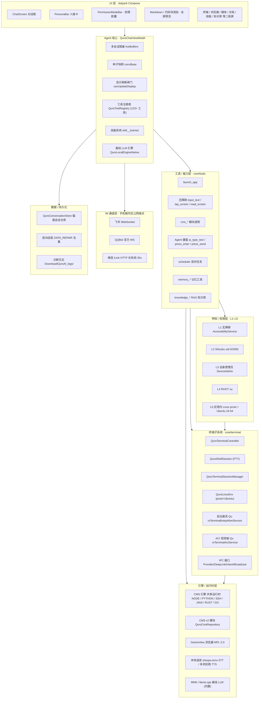
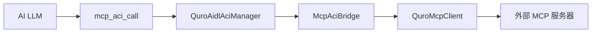
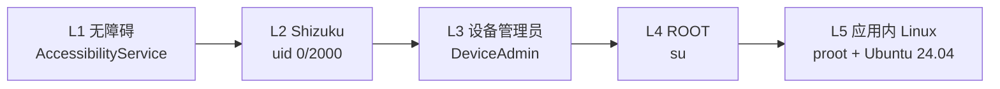

<div align="center">


# Zorv AI

### 运行在 Android 上的设备端 AI Agent · 智能体助手

*On-device AI Agent for Android — tools, personas, memory, an offline LLM engine, and a shared runtime, all on your phone.*

[](./LICENSE)
[](https://www.android.com)
[](https://kotlinlang.org)
[](https://developer.android.com/compose)
[](https://mozilla.github.io/geckoview/)
[](https://github.com/Quor-a/ZorvAI/releases)
[](https://developer.android.com/about/versions/oreo)
[](https://developer.android.com)

</div>

> **包名**：`com.ai.assistance.quro` ｜ **技术栈**：Kotlin 2.3 + Jetpack Compose ｜ **AGP 8.13 / compileSdk 36 / minSdk 26 / targetSdk 34**
>
> Zorv AI 把「对话助手」做成一个真正能操作手机的 Agent：它在设备上运行，能用无障碍 / Shizuku / ROOT 等通道操控系统，调用 **120+ 内置工具**，运行 **MNN / llama.cpp 离线大模型**，内置终端与 Linux 沙箱、MCP、知识库、语音合成/识别，并通过飞书、QQ、微信与你保持在线。

---

## 目录 Table of Contents

- [项目简介 · What it does](#项目简介-what-it-does)
- [开源地址 · Open Source](#开源地址-open-source)
- [功能亮点 · Features](#功能亮点-features)
- [功能全览 · Feature Map](#功能全览-feature-map)
- [界面导航 · Screens](#界面导航-screens)
- [对话框与消息能力 · Chat & Messages](#对话框与消息能力-chat--messages)
- [可视化弹窗 & 询问](#可视化弹窗--询问)
- [多语言运行器](#多语言运行器)
- [自研多语言小程序（MiniApp）](#自研多语言小程序miniapp)
- [可视化组件](#可视化组件)
- [可视化编程（Mermaid 图表）](#可视化编程mermaid-图表)
- [系统返回手势支持](#系统返回手势支持)
- [内置技能 · Skills（63 个）](#内置技能-skills63-个)
- [截图预览 · Screenshots](#截图预览-screenshots)
- [功能构架 · Architecture](#功能构架-architecture)
- [引擎详解 · Engine](#引擎详解-engine)
- [ACI · 智能体能力接口](#aci-智能体能力接口)
- [ACI 控制台 UI（LAN 控制台）](#aci-控制台-ui)
- [ACI HTTP 传输（局域网/本地组网）](#aci-http-传输)
- [MCP-ACI 桥接](#mcp-aci-桥接)
- [终端 & Linux 沙箱（完整技术架构）](#4-应用内终端-linux-沙箱完整技术架构)
- [特权 / 权限层 · L1–L5](#特权-权限层-l1l5)
- [工具箱 · Toolbox](#工具箱-toolbox)
- [开发工具与导入教程](#开发工具与导入教程)
- [组件画廊 · Component Gallery](#组件画廊-component-gallery)
- [插件运行时 · Plugin Runtime](#插件运行时-plugin-runtime)
- [系统要求与从源码构建](#系统要求与从源码构建)
- [排查与故障处理 · Troubleshooting](#排查与故障处理-troubleshooting)
- [下载 / APK · Download](#下载-apk-download)
- [许可证 · License](#许可证-license)
- [贡献 · Contributing](#贡献-contributing)
- [问题反馈 · Feedback](#问题反馈-feedback)
- [关键词 · 便于搜索（SEO）](#关键词-便于搜索seo)

---

## 项目简介 · What it does

大多数「手机 AI 助手」本质是云端聊天框——把你的话发给服务器，再把回答渲染出来。Zorv AI 不一样：它把**推理**和**执行**都放在你这台手机上，目标是让 AI 真正成为能替你操作设备的「智能体」，而不只是会聊天的模型。

从全局看，Zorv AI 解决了三件事：

1. **让 AI 能动手**。它内置 120+ 工具，覆盖读屏/点按、文件、通信、定时、终端、知识库等；更高权限的能力（Shizuku、设备管理员、ROOT、应用内 Linux）按 L1–L5 分级，且**每一级都要你显式授权**，不会偷偷越权。
2. **让 AI 能离线**。MNN / llama.cpp 两个本地推理引擎编译进 APK，配合本地 STT、本地 TTS、本地 RAG 与应用内 Ubuntu 24.04 Linux 沙箱（proot），断网也能完成大部分任务。
3. **让 AI 能跨应用**。通过 ACI（Agent Capability Interface）——一套同设备、基于 AIDL Binder、无 Root 的本地协议——任意 App 都能把自己暴露成「可被 AI 调用的能力」，由 Zorv AI 的 LLM 自动编排。

它的设计主线是 **Tool-first（一切皆工具）**：Agent 拥有的每一项能力都表达为一个 `QuroTool`，扩展系统只需要实现四成员的接口并注册，LLM 会自动发现并用它，无需改任何接线代码。

---

## 开源地址 · Open Source

> **本项目完全开源，多平台托管** · GitHub：[github.com/Quor-a/ZorvAI](https://github.com/Quor-a/ZorvAI) ｜ Gitee：[gitee.com/ZorvAI/ZorvAI](https://gitee.com/ZorvAI/ZorvAI) ｜ GitLab：[jihulab.com/quor-a-group/ZorvAI](https://jihulab.com/quor-a-group/ZorvAI)
>
> **🔌 受控端浏览器（ZorvAI 浏览器）已独立开源** · GitHub：[github.com/Quor-a/ZorvBrowser](https://github.com/Quor-a/ZorvBrowser)（ releases 页含各版本 APK）
>
> **🤖 5 个官方 ACI 受控端 App（天气 / 文档 / 终端 / 构建 / 文件）已独立开源**，仓库与能力清单见下方「ACI 受控端生态」专节。
>
> - 📦 最新 Release（免登录下载）：[github.com/Quor-a/ZorvAI/releases](https://github.com/Quor-a/ZorvAI/releases)
> - 🧩 ACI 核心库 AAR：随 Release 提供 `aci-core-release.aar`
> - 📖 ACI 开发者手册：[docs/ACI_DEVELOPER_GUIDE.md](./docs/ACI_DEVELOPER_GUIDE.md)
> - 🐛 问题反馈：[github.com/Quor-a/ZorvAI/issues](https://github.com/Quor-a/ZorvAI/issues)
>
> 关键词：**Zorv AI 开源 / 安卓 AI 助手 开源 / Android AI agent open source / 设备端 AI Agent / 手机端 AI 智能体 / Kotlin Compose LLM 助手 / ACI 跨应用调用**

---

## 功能亮点 · Features

| 能力域 | 关键能力 |
|--------|----------|
| **对话 UI（Compose）** | ChatScreen 对话框、PersonaBar 人格卡、PermissionModeBar（「AI 自动保存记忆」+「深度思考」并排胶囊，置于输入框**下方**）、对话框内 **IDE 能力入口**（代码编辑器 / 终端 / 工具箱 / 文件 经输入框「+」菜单与 `ui_open_*` 唤起，不叠加冗余按钮）、**支持 7 种编程语言**（JavaScript、Python、HTML、JSON、CSS、XML、C/C++/Java）、**mermaid 围栏即画即渲染**（AI 或用户写的 ` ```mermaid ` 代码块离线渲染成可缩放矢量图）、**AI 自写代码运行（run_code）：AI 直接写/跑代码，html 网页工件在对话框内联实时预览**（手机 AI IDE，可视化产出融入内容区）、回到底部浮动按钮、全屏预览、Markdown 与代码块渲染 |
| **Agent 核心** | 多会话隔离（`liveBuffers` 按会话独立）、种子快照（`convBase`）、显示刷新闸门（`canUpdateDisplay`）、多轮 `[第N轮]` hidden 标记防串台、系统提示词构建、工具注册表（`QuroToolRegistry.active`）、技能系统（`QuroSkill` → 注册为 `skill__{name}` 工具） |
| **工具 / 能力层** | **120+ 内置工具**（`buildQuroRegistry` 注册 123 项 + 导入工具 + 可调用技能）：无障碍 `input_text`/`tap_screen`/`read_screen`、文件读写、**L1–L5 特权执行**、`cms_*` 模块、Agent 键盘 `ai_type_text`/`ai_press_enter`、定时任务、记忆工具、知识库 RAG、文档处理 |
| **离线 LLM 引擎** | 应用内置 **MNN / llama.cpp** 本地推理（`QuroLocalEngineNative`），支持流式、`<think>` 剥离、本地工具调用、会话复用；离线也能对话 |
| **特权层 L1–L5** | 无障碍 → Shizuku(uid 0/2000) → 设备管理员 → ROOT(su) → 应用内 Linux(proot + Ubuntu 24.04) |
| **终端 / Linux 沙箱** | 完整终端模拟器：proot + Ubuntu 24.04 ARM64 真实用户空间（rootfs 首次使用自动下载）；PTY 伪终端（`/dev/ptmx` + `fork/exec`）；前台服务保活（specialUse，息屏/切 App 不被杀）；ACI 跨进程 12 个能力（exec/session/env/status）；4 种 IPC 接入（ContentProvider / Deep Link / Intent / BroadcastReceiver）；多会话管理；开机自启动；Android 14+ 兼容 |
| **MCP（Model Context Protocol）** | MCP 客户端（WebSocket / HTTP 传输）、应用内本地 MCP 服务，可由 AI 部署/调用、**MCP-ACI 桥接**（让 ACI 控制方调用外部 MCP 服务器工具） |
| **引擎 / 运行时** | CMS 引擎共享运行时（NODE / PYTHON / SSH / JAVA / RUST / GO）、CMS v2 模块、GeckoView 浏览器（MPL-2.0）、本地语音 STT / TTS |
| **IM 通道** | 飞书（WebSocket）/ QQBot（官方 WS）/ 微信 iLink（HTTP 长轮询 35s）；三家手机端均无公网端点 |
| **语音** | 多供应商 TTS（EDGE_TTS / OPENAI_COMPAT / MINIMAX / SILICONFLOW / 阿里云 等）、端侧 Whisper STT、语音悬浮球 |
| **知识 / 记忆 / 人格 / Bot** | 向量语义 RAG 知识库、记忆库、人格/灵魂配置、多通道机器人（QQ/飞书/微信/本地） |
| **ACI 控制台 UI（LAN 控制台）** | 控制端 `QuroAidlAciCenterScreen` 按 `console_ui` 能力拉取 SDUI 快照、复用本地 `AciConsoleScreen` 渲染器（`core/aci` 包，纯本地零网络） |
| **可视化弹窗 & 询问** | **可视化弹窗**（`visual_popup` / `visual_custom_popup`）：AI 创建结构化弹窗或自写 HTML 弹窗，对话框内小卡片展示历史；**可视化询问**（`visual_question` / `visual_action`）：AI 遇到模糊命令/缺少信息时强制弹出选择题/输入框，禁止猜测 |
| **多语言运行器** | `QuroLanguageRunner`：对话框内支持 **7 种编程语言**（JavaScript、Python、HTML、JSON、CSS、XML、C/C++/Java）的检测、运行和渲染，手机端轻量 IDE |
| **自研多语言小程序（MiniApp）** | AI 生成完整小程序代码（HTML + JS + CSS），对话框内实时渲染为可交互小程序页面；支持 Page/Component 生命周期、data-bind 数据绑定、data-action 事件绑定；通过 JSBridge 调用原生能力（存储、网络、设备信息、UI、路由） |
| **可视化组件** | `ui_widget` 工具：**60+ 种可交互组件**（按钮、表单、图表、进度、评分、轮播、时间线等），直接融进聊天气泡；支持 `command` 语法触发动作（打开页面、执行命令、调用 AI 等） |
| **可视化编程** | **Mermaid 图表离线渲染**：AI 或用户写 ` ```mermaid ` 围栏代码块，离线渲染成流程图/时序图/状态机/类图/思维导图等；支持全屏预览、SVG 导出、五种主题 |
| **系统返回手势** | 完整支持 Android 系统返回手势，包括从屏幕边缘滑动返回、分层返回策略、导航栏适配、全屏模式处理；所有弹窗和二级界面均使用 `BackHandler` 处理返回事件 |

---

## 功能全览 · Feature Map

下面按模块列出 Zorv AI **已在代码中实现**的全部能力（每项均可在 `app/src/main/java/com/ai/assistance/quro/` 下查证）。

### 1. 智能对话核心（Chat & Messages）
- 消息流 + **流式输出**（云端/本地共用 `onToken` 增量回调）
- **Markdown / 代码渲染**：围栏代码块、标题、引用、列表、行内 HTML；代码块支持「代码 / 预览」双 Tab、复制、运行（预览用 WebView 且已禁用 JS）
- **ThinkBlock 思考段可视化**：受「深度思考」开关控制，折叠展示 `<think>` 推理链路
- **ToolCallBlock 工具调用可视化**：AI 经 ReAct 循环调用的工具以结构化卡片内嵌在气泡中，展示参数、状态（运行/成功/警告/失败）、**执行耗时（ms / s）** 与执行轨迹
- **消息操作栏**：每条 AI 回复下方提供 `复制 / 追问 / 分享 / 删除 / 重试`——删除可精确移除单条消息或聚合气泡对应的全部底层消息（含连带清理隐藏 tool 结果消息），实时同步内存 store 与磁盘
- **多轮聚合**：同一回合连续的 assistant(+隐藏 tool) 消息聚合成单个气泡流式增长
- **富组件融进气泡（QuroChatCard）**：AI 经 `ui_widget` / `ui_card` 下发的图表、待办、表单、进度等可视化组件直接合体进气泡
- **历史会话管理 / 会话导出**：创建 / 删除单条 / 清空全部、侧栏会话列表；设置入口「导出对话 → 导出为文本」

### 1.5 对话框 IDE 能力（v1.0.56 重构 → v1.0.57 AI IDE 能力地图）
对话框本身就是一个可自由使用的轻量 IDE，**不靠额外按钮堆叠**——IDE 级能力直接复用输入框「+」菜单与 AI 侧 `ui_open_*` 工具唤起，避免与已有入口重复：
- **代码**：内置 CodeMirror 离线代码编辑器，支持以下语言的语法高亮和运行：
  - **JavaScript**：App 内置 QuickJS 原生沙箱离线执行
  - **Python**：内置 Brython 引擎，无需 Termux 即可在对话框运行
  - **HTML**：完整 HTML 源码渲染为可交互网页（支持内联样式/脚本、SVG、Three.js 三维）
  - **JSON**：数据/配置可视化
  - **CSS**：样式代码支持
  - **XML**：数据/配置文件支持
  - **C/C++/Java**：语法高亮和算法逻辑撰写（端侧沙箱不能直接编译，需借助工作区或 ACI 构建台）
- **终端**：打开 proot / 本地 Shell（应用内 Ubuntu 24.04 沙箱），可直接跑命令、查设备环境（入口：输入框「+」→ 终端，或 `ui_open_terminal`）
- **工具箱**：文件 / 包名 / 浏览器等内置工具集合（入口：输入框「+」→ 工具箱，或 `ui_open_toolbox`）
- **文件**：直接附件 / 上传到对话框（入口：输入框「+」→ 上传，或 `ui_open_upload`）
- **mermaid 围栏即画即渲染（v1.0.56 新增的「可视化编程」缺口）**：无论是 AI 还是**用户自己**，只要在对话框里写 ` ```mermaid ` 代码块（流程 / 时序 / 状态机 / 思维导图 / 类图 / git 图 / 饼图等），对话框都会用离线 Mermaid.js 直接渲染成可缩放的真图——支持全屏查看、下载 SVG、复制源码。这补齐了此前「可视化编程只走 `ui_widget` JSON」的局限，让对话框真正成为人人可画的自由画布。
- **手机 AI IDE（带可视化）——AI 自写代码并运行（v1.0.57 核心新增）**：`run_code` 工具不只是「给人点运行按钮」，而是 **AI 自己写代码、自己跑、产出物直接渲染在对话框里**的端侧编程能力（解决「手机上人手敲代码体验差」的痛点）。各语言在对话框里能做什么（已写入系统提示词「能力地图」，AI 会自动按此调用）：
  - `python`（默认）：**数据处理/清洗、网络爬虫（抓真实网页数据）、调用 AI/LLM API、算法计算、自动化脚本**——输出回灌给 AI 推理/总结，再做成图表。
  - `node`/`javascript`/`js`：App 内置 **QuickJS 原生沙箱离线执行**（无需 Termux），逻辑计算与 JSON/字符串处理。
  - `shell`：应用沙盒内 sh 命令。
  - `html`/`htm`/`markup`：把**完整 HTML 源码作为「网页工件」返回**，对话框用 WebView **实时渲染成可交互网页**（支持内联样式/脚本、SVG、离线 Three.js 三维；在线时可用 Chart.js/ECharts 画图）——AI 生成的网页/图表/游戏**直接长在对话框里**，无需用户复制出去打开。
  - `json`/`xml`：数据/配置/Android 布局/**SVG**（SVG 走 HTML 预览直接成图）。
  - `java`/`c`/`c++`：撰写与算法逻辑；端侧沙箱不能直接编译，需借助 `workspace_write` + ACI 构建台（云端编译）。
  - **组合拳**：例如「抓数据(python) → 算指标(python) → 画看板(html 工件)」整条链路 AI 一人完成，全部在对话框呈现。工作流口诀：**算/抓/分析 → `run_code(python)`；画网页/图表/三维 → 返回 `html` 工件（或 ```html 围栏，二者等效）；画流程/架构图 → mermaid**。
- 系统提示词（[`QuroPlatformManifest`](app/src/main/java/com/ai/assistance/quro/core/QuroPlatformManifest.kt) 「能力环境」段与 [`QuroChatViewModel`](app/src/main/java/com/ai/assistance/quro/ui/QuroChatViewModel.kt) 的「手机 AI IDE 能力地图」指引）已同步：引导 AI 主动用 `run_code` 跑代码、用 html 工件/```html 围栏渲染可视化、用 mermaid 画图，把「说」和「做 / 画 / 跑」自由组合。

### 1.6 可视化弹窗 & 询问（v1.0.62 新增）
AI 在执行任务时可以通过可视化方式与用户交互，**强制规则**：遇到模糊命令/缺少信息/需要确认时，必须立刻调用可视化工具询问用户，禁止猜测、禁止假设、禁止跳过。

- **可视化弹窗（`visual_popup`）**：AI 创建结构化弹窗，支持 Markdown/HTML/纯文本内容、多按钮（不同样式）、输入框（文本/数字/密码/邮箱）、图片显示、自定义宽高、超时控制。弹窗在对话框中显示为可点击的小卡片，用户操作后结果返回给 AI。
  - **AI自写UI弹窗（`visual_custom_popup`）**：AI 完全自写 HTML/CSS/JS 代码，UI 完全自由控制（表单、图表、游戏、任何交互式 UI）。支持 `overlay=true` 模式：通过 `VisualPopupOverlayService` 在 App 外以系统级悬浮窗显示。
- **可视化询问（`visual_question` / `visual_action`）**：AI 遇到模糊命令/缺少信息/需要确认时，弹出选择题/输入框让用户回答。问答弹窗不允许关闭（`dismissOnBackPress=false, dismissOnClickOutside=false`），必须回答。
  - 询问方式选择器提供 5 种类型：选择题、输入框、评分、开关、自由HTML
  - 评分和开关类型会转为 `visual_custom_popup` 调用

### 1.7 多语言运行器（`QuroLanguageRunner`）
对话框内支持 **7 种编程语言**的检测、运行和渲染，手机端轻量 IDE：

| 语言 | 运行方式 | 说明 |
|------|----------|------|
| **JavaScript** | QuickJS 原生沙箱 | App 内置 QuickJS 原生沙箱离线执行，带内存上限 16MB + 超时中断 2s |
| **Python** | Brython 引擎 | 内置 Brython 引擎，无需 Termux 即可在对话框运行 |
| **HTML** | WebView 渲染 | 完整 HTML 源码渲染为可交互网页（支持内联样式/脚本、SVG、Three.js 三维） |
| **JSON** | 数据可视化 | 数据/配置可视化 |
| **CSS** | 样式支持 | 样式代码支持 |
| **XML** | 数据/配置 | 数据/配置文件支持 |
| **C/C++/Java** | 语法高亮 | 语法高亮和算法逻辑撰写（端侧沙箱不能直接编译，需借助工作区或 ACI 构建台） |

### 1.8 自研多语言小程序（MiniApp）
AI 可以生成完整小程序代码（HTML + JS + CSS），在对话框中实时渲染为可交互的小程序页面。

- **小程序框架**：支持完整的 Page/Component 生命周期、data-bind 数据绑定、data-action 事件绑定
- **JSBridge 架构**：`MiniAppBridgeInterface` 通过 `@JavascriptInterface` 注解暴露原生能力给 JS
- **模块化设计**：Storage（存储）、Device（设备信息）、Ui（Toast、导航栏）、Network（HTTP 请求）、Router（页面导航）五个内置模块
- **双后端运行时**：逻辑层可选 QuickJS（Native 线程，带内存上限 + 超时中断 + 关闭 eval）或 WebView（零 NDK 依赖）
- **完全离线**：所有运行时代码内联打包进 APK

**使用方式**：AI 通过 `ui_widget` 工具下发 `type: "miniapp"` 组件：
```json
{
  "type": "miniapp",
  "title": "计算器",
  "html": "<div data-bind='count'>0</div><button data-action='increment'>+1</button><script>Page({data:{count:0},increment(){this.setData({count:this.data.count+1})}})</script>"
}
```

### 1.9 可视化组件（`ui_widget`）
`ui_widget` 工具支持 **60+ 种可交互组件**，直接融进聊天气泡（而非浮层）。

**支持的组件类型（7 大归类）：**

| 归类 | 组件 |
|------|------|
| **Input 类** | button、toggle、slider、form、chips、quickreply、quickaction |
| **Data 类** | stat、progress、gauge、counter、rating、pie、chart、heatmap、radar、compare |
| **Media 类** | media、mediaplay、image、video |
| **Layout 类** | tabs、expandable、carousel、kanban、steps、timeline |
| **Action 类** | actions、toolcall、timer |
| **Navigation 类** | breadcrumb、segmented、list |
| **Decoration 类** | alert、badge、avatargroup、tagcloud、color、note、info |

**技术特点：**
- 组件通过 `QuroUiActionBridge.onCard` 桥接函数直接挂进聊天气泡
- 所有组件都是真正可交互的 Compose 控件，支持实时状态联动
- `command` 语法支持丰富动作：`ui_open_*`、`ui_toggle_*`、`linux:install`、`run:<命令>`、`open:<url>`、`copy:<文本>`、`ai:<提示词>`、`screen:<名称>`
- 组件画廊入口：对话框 → 设置底部弹层 → 「可视化组件画廊」

### 1.10 可视化编程（Mermaid 图表）
AI 可以通过 Mermaid 语法创建流程图、架构图、时序图、状态机、类图、思维导图等可视化图表。

**两种触发方式：**
1. AI 调用 `ui_widget` 工具，`type: "mermaid"`
2. AI 或用户直接在消息中写 ` ```mermaid ` 围栏代码块，对话框自动渲染

**支持的图表类型：**
- `flowchart` - 流程图
- `sequenceDiagram` - 时序图
- `stateDiagram-v2` - 状态机
- `classDiagram` - 类图
- `mindmap` - 思维导图
- `gitGraph` - Git 图
- `pie` - 饼图
- `timeline` - 时间线

**技术特点：**
- **完全离线**：Mermaid.js 库内联打包进 APK（`assets/libs/mermaid.min.js`），不依赖 CDN
- **WebView 渲染**：通过 `mermaid_render.html` 桥接页面加载 Mermaid.js 并将 SVG 注入 WebView
- **SVG 导出**：渲染完成后可将 SVG 保存到 Downloads 目录
- **全屏模式**：支持手势缩放、横屏适配
- **主题自动切换**：支持 default/dark/forest/neutral/base 五种主题，缺省按系统深浅色自动选择
- **人与 AI 共享**：用户也能发 mermaid 围栏画图，可视化编程对人与 AI 都开放

### 1.11 系统返回手势支持
Zorv AI 完整支持 Android 系统返回手势，确保用户在任何界面都能通过手势自然导航。

**技术实现：**
- **Jetpack Compose BackHandler**：所有弹窗、设置页面、二级界面均使用 `BackHandler` 组件处理返回事件
- **分层返回策略**：复杂界面（如知识库详情→列表→关闭）实现逐层返回，而非直接关闭整个界面
- **手势导航兼容**：完全兼容 Android 10+ 的手势导航系统，支持从屏幕边缘滑动返回
- **导航栏适配**：使用 `navigationBarsPadding()` 适配不同设备的导航栏高度，避免内容被遮挡
- **全屏模式处理**：全屏查看图片、视频、文档时，返回手势优先关闭全屏视图而非退出应用

**支持的手势操作：**
| 手势 | 操作 | 适用场景 |
|------|------|----------|
| **从屏幕左侧边缘向右滑动** | 返回上一级 | 系统级手势，所有界面通用 |
| **从屏幕右侧边缘向左滑动** | 返回上一级 | 系统级手势（部分设备） |
| **按返回键/手势返回** | 关闭当前弹窗或返回上一级 | 所有弹窗和二级界面 |
| **长按返回键** | 多任务/应用切换 | 系统级手势 |

**分层返回示例：**
```kotlin
// 知识库详情视图：返回键先回到列表（不选清空 selected）
BackHandler(enabled = selected != null) {
    selected = null
}

// 知识库列表视图：返回键关闭整个知识库屏
BackHandler { showKnowledge = false }
```

### 2. 内置技能 Skills（63 个 · 首次启动自动注入）
- 轻量技能系统：`QuroSkill` → 注册为 `skill__{name}` 工具，可被 LLM 自动编排
- v1.0.16 起将 WorkBuddy 技能库全部 **63 个技能**转化为 Zorv AI 品牌版本，打包进 `app/src/main/assets/skills/zorv/`（含 `manifest.json`，每个技能含稳定 id `zorv_<sha1>`、名称、描述与正文）
- 首次启动经 `QuroSkillStore.seedBuiltinZorvSkills` **幂等注入**为默认启用、可调用内置技能；用户在「设置 → 技能」可查看/启停
- 技能方向（部分）：前端/设计、部署/云、内容/创作、搜索/情报、IM/媒体、效率/工程、短视频/爬虫、写作/文档、付费咨询等

### 3. 离线 LLM 引擎（MNN / llama.cpp）
- 应用**内置**本地推理运行时（`QuroLocalEngineNative`），驱动 `MNNLlmSession` / `LlamaSession`，支持流式、`<think>` 剥离、本地工具调用解析、会话常驻与门禁；离线（无网络、无 API Key）也能对话
- `core/model/QuroLocalModelRepository.kt` 负责本地模型仓库/加载

### 4. 应用内终端 & Linux 沙箱（完整技术架构）

Zorv AI 终端是一个**完整的 Android 终端模拟器**，集成了 Linux 沙箱、前台服务保活、ACI 跨进程调用、多种 IPC 接入方式，支持真实的 Ubuntu 24.04 ARM64 用户空间。

#### 4.1 架构概览

```
┌─────────────────────────────────────────────────────────────────┐
│                        终端 UI 层                                │
│  ChatScreen 输入框「+」→ 终端  /  AI 调用 ui_open_terminal        │
└─────────────────────────┬───────────────────────────────────────┘
                          │
┌─────────────────────────▼───────────────────────────────────────┐
│                    QuroTerminalController                        │
│  会话管理 · 命令路由 · proot/设备shell 自动选择                    │
└──┬──────────────────────┬──────────────────────┬────────────────┘
   │                      │                      │
┌──▼──────────┐  ┌────────▼────────┐  ┌─────────▼────────────────┐
│QuroShellSession│ │QuroLinuxEnv     │  │QuroTerminalSessionManager│
│PTY会话载体   │  │proot+Ubuntu24.04│  │多会话管理·跨进程访问      │
│fork/exec    │  │rootfs下载/解压   │  │默认/额外/UI/历史会话      │
└──┬──────────┘  └────────┬────────┘  └─────────┬────────────────┘
   │                      │                      │
┌──▼──────────────────────▼──────────────────────▼────────────────┐
│                    前台服务层（保活）                              │
│  Qu roTerminalKeepAliveService · Qu roTerminalAciService         │
│  specialUse 前台服务 · shell子进程归属服务进程 · 15秒巡检          │
└──┬──────────────────────┬──────────────────────┬────────────────┘
   │                      │                      │
┌──▼──────────┐  ┌────────▼────────┐  ┌─────────▼────────────────┐
│ACI 跨进程    │  │Intent/Provider  │  │BroadcastReceiver/DeepLink│
│12个能力      │  │ContentProvider  │  │6个广播Action              │
│AIDL绑定     │  │content://URI    │  │quro://terminal/...       │
└─────────────┘  └─────────────────┘  └──────────────────────────┘
```

#### 4.2 核心组件

| 组件 | 文件位置 | 职责 |
|------|----------|------|
| **QuroTerminalController** | `core/terminal/QuroTerminalController.kt` | 终端控制器：proot 优先、否则设备 `sh`；命令路由、超时控制、Linux 环境自动检测 |
| **QuroShellSession** | `core/terminal/QuroShellSession.kt` | PTY Shell 会话载体：`/dev/ptmx` 伪终端、`fork/exec` 进程控制、`TIOCSWINSZ` 窗口大小、输出流读取 |
| **QuroLinuxEnv** | `core/linux/QuroLinuxEnv.kt` | Linux 环境后端：proot + **Ubuntu 24.04 ARM64**；`proot`/`libbash`/`libbusybox` 以 `.so` 内置，rootfs 首次使用自动从 Ubuntu 官方镜像下载 |
| **QuroTerminalSessionManager** | `core/terminal/QuroTerminalSessionManager.kt` | 多会话管理：默认会话 / 额外会话 / UI 会话 / 历史会话；跨进程会话访问 |
| **QuroTerminalKeepAliveService** | `service/QuroTerminalKeepAliveService.kt` | 前台保活服务：shell 子进程归属服务进程，15 秒巡检，息屏/切 App 不被杀 |
| **QuroTerminalAciService** | `service/QuroTerminalAciService.kt` | ACI 受控端服务：暴露 12 个能力给外部应用调用 |
| **TerminalProvider** | `core/terminal/TerminalProvider.kt` | ContentProvider：`content://com.ai.assistance.quro.terminal/...` |
| **TerminalDeepLinkHandler** | `core/terminal/TerminalDeepLinkHandler.kt` | Deep Link 处理：`quro://terminal/...` |
| **TerminalIntentActivity** | `core/terminal/TerminalIntentActivity.kt` | 透明 Activity：外部应用通过 Intent 调用终端的标准入口（显式/隐式 Intent + startActivityForResult + ACTION_SEND + ACTION_PICK + Deep Link） |
| **TerminalBroadcastReceiver** | `core/terminal/TerminalBroadcastReceiver.kt` | 广播接收：7 个 Action，结果通过 `TERMINAL_RESULT` 返回 |

#### 4.3 Linux 沙箱（proot + Ubuntu 24.04 ARM64）

- **架构**：proot 用户空间模拟（无需 ROOT），`--bind` 挂载系统目录
- **rootfs 来源**：`assets/linux_env/ubuntu-noble-aarch64-pd-v4.18.0.tar.xz`（Ubuntu 24.04 Noble ARM64，xz 格式）
- **内置工具**：`proot`/`libbash`/`libbusybox` 以 `.so` 形式内置（`nativeLibraryDir` + `assets/linux_env` 兜底）
- **路径全动态**：`rootfsPath=File(context.filesDir,"linux-sandbox")`、`prootPath=applicationInfo.nativeLibraryDir`、`homePath=context.getExternalFilesDir(...)`
- **关键能力**：
  - 交互终端常驻 `/bin/sh`
  - link2symlink 符号链接（Android 限制兼容）
  - apt 源自动切 `ubuntu-ports`（arm64）
  - bash/busybox 内置命令
  - CMS 引擎 `bootstrap.sh` 提供 NODE / PYTHON / RUST / GO / JAVA 共享运行时

#### 4.4 前台服务保活（息屏 / 切 App 不被杀）

**核心原理**：前台服务调 `startForeground()` → 系统不杀这个进程 → 进程内 fork 的 shell 子进程也不会被杀 → 息屏/切 App 不死。

```kotlin
// Qu roTerminalKeepAliveService.kt 核心逻辑
class Qu roTerminalKeepAliveService : Service() {
    private var heldSession: QuroShellSession? = null  // 服务直接持有终端会话

    override fun onCreate() {
        startForeground(NOTIF_ID, buildNotification("终端运行中…"),
            ServiceInfo.FOREGROUND_SERVICE_TYPE_SPECIAL_USE)
        startLoop()  // 每 15 秒巡检
    }

    private fun ensureSessionSafe() {
        // 在服务进程内创建 shell 子进程
        heldSession = QuroShellSession.create(context, env, "keepalive") { /* onOutput */ }
        // shell 子进程是服务进程的 fork → 服务存活 = shell 子进程存活
    }
}
```

**关键特性**：
| 特性 | 实现 |
|------|------|
| **前台服务类型** | `specialUse`（Android 14+ 兼容，需 `<property>` 标签） |
| **巡检间隔** | 每 15 秒检查会话状态，死亡自动重建 |
| **通知栏** | 常驻「Zorv AI 终端运行中」，点击跳转主界面 |
| **开机自启动** | `QuroTerminalBootReceiver` 监听 `BOOT_COMPLETED` |
| **Android 14+ 兼容** | `<property android:name="android.app.PROPERTY_SPECIAL_USE_FGS_SUBTYPE"/>` + `FOREGROUND_SERVICE_SPECIAL_USE` 权限 |

**Manifest 配置**：
```xml
<uses-permission android:name="android.permission.FOREGROUND_SERVICE" />
<uses-permission android:name="android.permission.FOREGROUND_SERVICE_SPECIAL_USE" />

<service
    android:name=".service.QuroTerminalKeepAliveService"
    android:exported="false"
    android:foregroundServiceType="specialUse">
    <property
        android:name="android.app.PROPERTY_SPECIAL_USE_FGS_SUBTYPE"
        android:value="终端会话保活：保持终端会话在息屏/切换应用时不被杀死" />
</service>
```

#### 4.5 ACI 跨进程接口（12 个能力）

`QuroTerminalAciService` 继承 `BaseAidlAciService`，以前台服务身份运行，暴露终端全部能力给外部应用调用。

| 能力 | 入参 | 返回 | 说明 |
|------|------|------|------|
| `exec` | `command`(必填) / `timeout`(可选) / `session_id`(可选) | `output` / `exit_code` / `error` | 在终端中执行命令并返回结果 |
| `create_session` | `name`(可选) | `session_id` / `name` | 创建新的终端会话 |
| `destroy_session` | `session_id`(必填) | `destroyed` | 销毁指定会话 |
| `send_input` | `session_id`(必填) / `input`(必填) | `sent` | 向指定会话发送输入 |
| `get_session_status` | `session_id`(必填) | `session_id` / `is_alive` / `pid` / `uptime` | 获取会话状态 |
| `list_sessions` | — | `sessions` (array) | 列出所有终端会话状态 |
| `set_session_env` | `session_id`(必填) / `key`(必填) / `value`(必填) | `set` | 设置会话环境变量 |
| `get_session_env` | `session_id`(必填) / `key`(必填) | `value` | 获取会话环境变量 |
| `list_capabilities` | — | `capabilities` (array) | 列出所有可用能力 |
| `get_service_status` | — | `running` / `session_count` / `uptime` | 获取服务状态 |
| `get_audit_log` | `limit`(可选) | `logs` (array) | 获取审计日志 |
| `help` | — | `help_text` | 显示帮助信息 |

**调用方式**：
1. **ACI AIDL 绑定**：其他应用通过 `bindService()` 绑定 `QuroTerminalAciService`
2. **ACI HTTP（本地 HTTP 传输）**：通过本地 HTTP 服务器调用
3. **MCP 桥接**：通过 `McpAciBridge` 将终端能力转换为 MCP 工具

#### 4.6 Intent / Provider / BroadcastReceiver / Deep Link

终端支持 4 种标准 Android IPC 接入方式，其他应用可通过任意一种方式调用终端能力：

**4.6.1 ContentProvider（TerminalProvider）**

```kotlin
// URI 格式
content://com.ai.assistance.quro.terminal/sessions     // 会话列表
content://com.ai.assistance.quro.terminal/exec?cmd=ls  // 执行命令
content://com.ai.assistance.quro.terminal/status        // 服务状态

// 使用示例
val cursor = contentResolver.query(
    Uri.parse("content://com.ai.assistance.quro.terminal/sessions"),
    null, null, null, null
)
```

**4.6.2 Deep Link（TerminalDeepLinkHandler）**

```kotlin
// URI 格式
quro://terminal/exec?cmd=ls -la           // 执行命令
quro://terminal/sessions                   // 会话列表
quro://terminal/create?name=my-session     // 创建会话
quro://terminal/status                     // 服务状态

// 使用示例
val intent = Intent(Intent.ACTION_VIEW, Uri.parse("quro://terminal/exec?cmd=uname -a"))
startActivity(intent)
```

**4.6.3 Intent Activity（TerminalIntentActivity）— 标准 Android Activity 入口**

透明 Activity，无可见 UI，仅作为 Intent 处理器。支持 3 种调用模式：

```kotlin
// 模式 1：显式 Intent（推荐，指定 ComponentName）
val intent = Intent()
intent.component = ComponentName("com.ai.assistance.quro",
    "com.ai.assistance.quro.core.terminal.TerminalIntentActivity")
intent.action = "com.ai.assistance.quro.action.TERMINAL_EXEC"
intent.putExtra("command", "ls -la")
val result = startActivityForResult(intent, 0)  // 结果通过 onActivityResult 回传

// 模式 2：隐式 Intent（通过 Intent Filter 匹配）
val intent = Intent("com.ai.assistance.quro.action.TERMINAL_EXEC")
intent.putExtra("command", "uname -a")
startActivity(intent)

// 模式 3：Deep Link（quro://terminal/...）
val intent = Intent(Intent.ACTION_VIEW, Uri.parse("quro://terminal/exec?cmd=ls -la"))
startActivity(intent)

// 支持的 Action（8 个）
com.ai.assistance.quro.action.TERMINAL_EXEC          // 执行命令（extras: command, timeout）
com.ai.assistance.quro.action.TERMINAL_STATUS         // 获取状态
com.ai.assistance.quro.action.TERMINAL_SESSIONS       // 列出会话
com.ai.assistance.quro.action.TERMINAL_CREATE_SESSION // 创建会话（extras: session_name）
com.ai.assistance.quro.action.TERMINAL_DESTROY_SESSION // 销毁会话（extras: session_id）
com.ai.assistance.quro.action.TERMINAL_SEND_INPUT     // 发送输入（extras: session_id, input）
com.ai.assistance.quro.action.TERMINAL_GET_OUTPUT     // 获取输出（extras: session_id, output_limit）
com.ai.assistance.quro.action.TERMINAL_PICK_SESSION   // ACTION_PICK 模式（Intent + Provider 协作）
android.intent.action.SEND                            // 分享文本到终端（extras: EXTRA_TEXT）
android.intent.action.VIEW + quro://terminal           // Deep Link
```

**4.6.4 BroadcastReceiver（TerminalBroadcastReceiver）**

```kotlin
// 支持的 Action（7 个）
com.ai.assistance.quro.action.TERMINAL_EXEC
com.ai.assistance.quro.action.TERMINAL_STATUS
com.ai.assistance.quro.action.TERMINAL_SESSIONS
com.ai.assistance.quro.action.TERMINAL_CREATE_SESSION
com.ai.assistance.quro.action.TERMINAL_DESTROY_SESSION
com.ai.assistance.quro.action.TERMINAL_SEND_INPUT
com.ai.assistance.quro.action.TERMINAL_GET_OUTPUT

// 结果通过 extras 返回
intent.getStringExtra("output")      // 命令输出
intent.getIntExtra("exit_code", -1)  // 退出码
intent.getStringExtra("error")       // 错误信息
```

#### 4.7 技术实现细节

**PTY 会话创建（QuroShellSession）**：
```kotlin
// 核心流程
val masterFd = Os.open("/dev/ptmx", O_RDWR or O_NOCTTY)  // 打开伪终端主设备
val slaveName = Os.slavename(masterFd)                     // 获取从设备名
Os.grantpt(masterFd)                                       // 授权从设备
Os.unlockpt(masterFd)                                      // 解锁从设备
val slaveFd = Os.open(slaveName, O_RDWR or O_NOCTTY)      // 打开从设备
Os.setsid()                                                // 创建新会话
Os.ioctl(masterFd, TIOCSWINSZ, winsize)                   // 设置窗口大小

// fork 子进程
val pid = fork()
if (pid == 0) {
    // 子进程：重定向标准输入/输出/错误到从设备
    Os.dup2(slaveFd, 0)
    Os.dup2(slaveFd, 1)
    Os.dup2(slaveFd, 2)
    Os.execve("/bin/sh", arrayOf("/bin/sh"), envp)  // 启动 shell
}
```

**命令执行路由（QuroTerminalController）**：
```kotlin
// 自动选择执行环境
fun runCommand(command: String, timeout: Long = 14000): String {
    val env = QuroLinuxEnv.getInstance(context)
    return if (env.isReady()) {
        // Linux 环境可用 → 使用 proot
        runCommandInLinux(command, timeout)
    } else {
        // 回退到设备 shell
        runCommandInDeviceShell(command, timeout)
    }
}

private fun runCommandInLinux(command: String, timeout: Long): String {
    val prootPath = applicationInfo.nativeLibraryDir + "/libproot.so"
    val prootArgs = listOf("-0", "root", "--link2symlink",
        "-w", "/root", "--bind=/proc", "--bind=/sys", "--bind=/dev",
        "--bind=/sdcard:/mnt/sdcard")
    val fullCommand = listOf(prootPath) + prootArgs + listOf("/bin/sh", "-c", command)
    return ProcessBuilder(fullCommand).start().inputStream.bufferedReader().readText()
}
```

#### 4.8 终端 UI 入口

- **对话框输入框「+」→ 终端**：点击输入框左侧「+」按钮，选择「终端」
- **AI 调用 `ui_open_terminal`**：AI 在对话中主动打开终端界面
- **Deep Link 直接启动**：`quro://terminal/exec?cmd=...`
- **ACI 跨进程调用**：其他应用通过 ACI 协议调用终端能力

#### 4.9 关键特性总结

| 特性 | 状态 | 说明 |
|------|------|------|
| **真实用户空间** | ✅ | Ubuntu 24.04 ARM64，完整的 Linux 工具链 |
| **前台服务保活** | ✅ | specialUse 类型，息屏/切 App 不被杀 |
| **ACI 跨进程** | ✅ | 12 个能力，AIDL/HTTP/MCP 三种调用方式 |
| **Intent/Provider** | ✅ | ContentProvider + Deep Link + Intent + BroadcastReceiver |
| **多会话支持** | ✅ | 默认/额外/UI/历史会话，会话隔离 |
| **开机自启动** | ✅ | BOOT_COMPLETED 广播接收器 |
| **Android 14+ 兼容** | ✅ | specialUse + property 标签 |
| **PTY 伪终端** | ✅ | /dev/ptmx，fork/exec，TIOCSWINSZ |
| **proot 沙箱** | ✅ | 无需 ROOT，link2symlink 符号链接 |
| **CMS 运行时** | ✅ | NODE/PYTHON/RUST/GO/JAVA 共享环境 |

### 5. MCP（Model Context Protocol）
- `core/mcp/QuroMcpClient`：外部 MCP 服务器客户端，`initialize` 握手（2025-03-26 协议）、`listTools` / `callTool`
- 传输层：WebSocket（`QuroMcpWsClient`）、本地 HTTP（`QuroMcpHttpServer`）
- 应用内本地 MCP 服务：`QuroLocalMcpManager` / `QuroLocalMcpServer` / `QuroLocalMcpDispatcher`（`McpDeployTool` / `McpUndeployTool` 可让 AI 把 MCP 服务部署到应用内）
- **MCP-ACI 桥接**：`core/mcp/McpAciBridge` 将外部 MCP 服务器工具转换为 ACI 能力，让 ACI 控制方也能调用 MCP 工具
- 设置 UI：`QuroMcpSettingsScreen`

#### 5.1 接入一个外部 MCP 服务器（实操）
1. 打开 **设置 → MCP**（`QuroMcpSettingsScreen`）；
2. 新增服务器，填：
   - **别名 alias**：工具集在 `mcp_call` 里的引用名（如 `weather`）；
   - **URL**：远端 JSON-RPC 端点（如 `https://example.com/mcp`）或本地 `http://127.0.0.1:<port>/mcp`；
   - **Token**：Bearer 鉴权（可选，严格 MCP 服务器需要）；
   - **类型 kind**：`remote`（默认，HTTP/SSE）｜`ws`（走 `QuroMcpWsClient`）｜`local`（AI 部署到本应用内）；
   - **握手 handshake**：服务器要求 `initialize` 才放行时勾选（开启后会自动跟踪 `Mcp-Session-Id` 并在后续请求携带）。
3. 保存后系统自动 `listTools` 拉取工具清单；对话中 AI 用 `mcp_call(alias, tool, args)` 调用，**失败会返回带 HTTP 状态码的可读错误**，便于排查。

#### 5.2 让 AI 自己部署本地 MCP（mcp_deploy）
> 这是「AI 写代码扩展自己能力」的闭环：AI 在对话里提交工具定义 JSON，`QuroLocalMcpManager.deploy` 落地并启动一个监听 `127.0.0.1` 的本地 HTTP Server（`/mcp`），随即被现有 `mcp_call` 按别名发现与调用。

- `mcp_deploy(alias, toolDefs)`：部署/更新一个本地 MCP（工具定义为合法 JSON 数组，每项含 `name`）；
- `mcp_undeploy(alias)`：停服务 + 删配置；
- `mcp_list_local`：列出已部署的本地 MCP；
- 应用启动 `QuroLocalMcpManager.startAll` 自动拉起所有已持久化的本地 MCP，实现「界面自动拉取注册」。

### 6. 工具系统（120+ 内置工具）
注册入口 `core/tools/QuroBuiltInTools.kt : buildQuroRegistry()`，实际注册 **123** 项（另含导入工具与可调用技能，运行时更多）。按能力归类：

| 类别 | 代表工具 |
|------|----------|
| 基础/演示 | Clock、DeviceInfo、Calculator |
| 系统/设备（L0） | GetBattery、GetWifi、GetNetwork、GetSensors、Vibrate、Clipboard、ListApps、LaunchApp、GetNotifications、Bluetooth、ToggleFlashlight |
| 通信 | ReadSms、SendSms、ReadContacts |
| 日历 | ReadCalendar、WriteCalendar |
| 文件 | ListFiles、ReadTextFile、WriteFile、DeleteFile、MakeDirectory、MoveFile、CopyFile、FindFiles、FileInfo、BrowseFiles |
| 位置 | GetLocation、Geocode |
| 媒体 | ListMedia、LocalMusicPlayer、MusicPlay、LocalVideoPlayer |
| 闹钟/定时 | SetAlarm、ScheduleTask、ListScheduledTasks、DeleteScheduledTask |
| 网络/Web | HttpRequest、OpenWeb、AiBrowser |
| 语音合成 | Speak、StopSpeak（TTS 工具） |
| Intent/广播 | ExecuteIntent、SendBroadcast、RunCode |
| CMS v2 模块 | QuroCmsList/Call/Deploy/Undeploy/Status/EngineStatus/Logs/Result/RunDag |
| ACI / 特权 | QuroAidlAciList/Call、QuroPrivStatus |
| 记忆/经验 | QuroMemorySave/List/Search/Delete、QuroExperienceLog/Query/Correct/VersionCheck |
| L1 无障碍控屏 | ReadScreen、GetForegroundApp、TapScreen、SwipeScreen、InputText、AiKeyboardType/PressEnter/Send、ScrollScreen、GlobalAction |
| L2 Shizuku | ShizukuExec、ShizukuRootExec、FreezeApp、InstallApp、ShizukuStatus |
| L3 设备管理员 | LockScreen、DeviceAdminStatus、SetCameraDisabled |
| L4 Root | RootExec、RootStatus |
| L5 应用内 Linux | LinuxRun/Install/Start/Stop/Status |
| 终端驱动 | TerminalDrive/Exec/Write/Kill/Status/Interrupt |
| 知识库 | KnowledgeSearch/Add、KnowledgeManage、QuroRagKnowledge（向量语义 RAG，无 Key 降级词法检索） |
| 文档 | AiwpsCreate/Read/Edit（docx/xlsx/pptx/pdf…） |
| UI 动作/卡片/组件 | UiAction 系列、UiCard、UiWidget（可交互内联 UI） |
| MCP | McpServers/ListTools/Call、McpDeploy/Undeploy/ListLocal、**McpAciBridge/List/Call**（MCP-ACI 桥接） |

### 7. 语音 / TTS / STT
- **TTS 合成（多供应商）**：`QuroTtsProvider` 支持 EDGE_TTS、OPENAI_COMPAT、MINIMAX、SILICONFLOW、TTS302、COZECN、GIZWITS、ACGN、ALIYUN 等；情绪标签跟随文本
- **STT 语音识别**：Android `SpeechRecognizer` + 端侧 `QuroOnDeviceAsr`（sherpa-onnx-whisper-tiny 本地 Whisper，约 85MB onnx，离线可用）
- **悬浮球**：`QuroVoiceBallView`，语音输入入口，由 `voiceBallEnabled` 开关控制
- **AI 自主语音（`speak` 工具）与「自动朗读」开关解耦**：`speak` 是独立语音通道，不受「自动朗读」开关限制——即使关闭自动朗读，AI 仍可主动调用 `speak` 唱歌 / 讲故事 / 朗诵 / 分角色演绎，且播报文本可与回复文字不同；自动朗读开启时 `speak` 优先、自动朗读自动让位，不会重复念

### 8. 媒体 / 浏览器 / 文档
- **内置浏览器**：`QuroBrowserScreen`（GeckoView）
- **媒体浏览器 / 音乐 / 视频**：`QuroMediaBrowser`、`QuroMusicPlayerScreen`、`QuroVideoPlayerScreen`
- **文档查看**：`QuroDocumentViewer` / `QuroDocOpener`（分发 docx/xlsx/pptx/pdf 等）
- **OnlyOffice**：`QuroOnlyOfficeScreen`

### 9. 知识库 / 记忆 / 人格 / 机器人
- **知识库（RAG）**：`core/knowledge/QuroKnowledgeRag.kt`，离线可用的向量语义检索，无 API Key 降级词法检索
- **记忆库**：`core/memory/QuroMemoryStore.kt`（MemorySave/List/Search/Delete）
- **人格 / 灵魂**：`core/soul/QuroSoulPrompt.kt`、`QuroSoulUi`、`QuroPersonaViewModel`
- **机器人 Bot**：`core/bot/`（QQ / 飞书 / 微信 iLink / 本地适配器），`QuroBotSettingsScreen` 配置
  - **QQ 机器人（直连官方网关，零公网端点）**：`QuroQqBotAdapter` + `QuroDirectBotAdapter`，仅用 OkHttp(含 WebSocket) + org.json，不依赖官方 SDK。
    - 接入：在 `QuroBotSettingsScreen` 填 **AppID / AppSecret**（对应 `qq_appid` / `qq_secret` 偏好）；
    - 协议：换 token（`bots.qq.com/app/getAppAccessToken`）→ 拿 WS 网关（`api.sgroup.qq.com/gateway/bot`）→ 长连收 `C2C_MESSAGE_CREATE` / `GROUP_AT_MESSAGE_CREATE` → 被动回 `v2/users|groups/{openid}/messages`（5 分钟内，带 `msg_seq` 去重，`event_id` 标记群回复）；
    - 健壮性：自动心跳、断线退避重连、token 过期(401/403)自动刷新重试、限流(429)退避 2s 重试、发送节流（两次回包≥250ms 规避限流）；
    - 沙箱期仅私聊(C2C)可用，群@需审核开通（intent `1<<25 | 1<<30`）。

### 10. 设备控制 / 权限 / Shizuku / ACI
- **Shizuku 集成**：`core/shizuku/`（QuroShizuku、QuroShellService），工具 ShizukuExec/FreezeApp/InstallApp
- **特权管理**：`core/privilege/`（Root/Shizuku 桥、审计）
- **ACI（Agent Capability Interface）**：`core/aci/`（Manager/Registry/Protocol/Adapter/CredentialVault/CallAudit），工具 QuroAidlAciList/Call，`QuroAidlAciCenterScreen`
- **权限管理**：`core/permissions/QuroPermissionHelper`、`QuroPermissionScreen`（含审计入口）

### 11. 模型配置
- **在线多供应商**：`core/model/ApiProviderType`（OPENAI / ANTHROPIC / GEMINI / MOONSHOT / DEEPSEEK / OLLAMA / OPENAI_LOCAL 等），`QuroModelConfigScreen` / `QuroFeatureModelConfigScreen`
- **离线本地模型**：`QuroLocalModelRepository`、`QuroLocalModelType`（MNN / LLAMA_CPP）
- **数字人模型**：`QuroDigitalHumanConfig`、`QuroDigitalHumanScreen`

### 12. 定时 / 日程 / 天气 / 数字人 / 插件 / 关于 等
- **日程/定时**：`QuroScheduleScreen`（对应 SetAlarm/ScheduleTask 工具）
- **天气**：`ui/weather/WeatherCard`（与天气技能联动）
- **数字人**：`QuroDigitalHumanScreen`
- **插件系统**：`plugin/PluginRuntime`（QuickJS 原生 `nativeEvalPlugin` + WebView 双后端），`PluginsScreen`
- **关于 / 审计 / 系统状态 / 工具箱 / 分享桥 / 组件库**：`QuroAboutScreen`（含「法律与合规」：权限使用声明、用户使用协议全屏合规文档阅读页）、`QuroAuditScreen`、`QuroSystemStatusScreen`、`QuroToolboxScreen`、`QuroShareBridge`（接收系统分享）、`QuroComponentGalleryScreen`
- **主界面导航**：`QuroMainScreen`（全屏 ChatScreen + 设置覆盖层 + 崩溃自报告 `CrashViewerScreen`），二级屏由 ChatScreen 的 `show*` 标志位承载

### 13. 数字人 3D 模型查看器（GLB / glTF · 离线 Three.js + Draco）
- **功能**：`QuroDigitalHumanScreen` 把 `.glb` / `.gltf` 3D 模型（数字人 / 虚拟形象）渲染到对话框内的 WebView 画布，支持旋转 / 缩放查看。
- **完全离线**：Three.js（r128）、`GLTFLoader`、`BufferGeometryUtils` 全部以 UMD 形式**内联打包进 APK**（`app/src/main/assets/www/three/`），不依赖任何 CDN，断网也能加载。
- **Draco 压缩支持**：内置**离线 Draco 解码器**（`DRACOLoader.js` + `draco_decoder.{js,wasm}` + `draco_wasm_wrapper.js`，运行时解包到 `cacheDir/three/draco/`），离线也能解析 Draco 压缩模型。
- **可视报错**：WebView 加载失败 / WebGL 不可用 / 首帧画布 0 尺寸 / GLB 解析失败等异常**全部在屏幕上以错误条显示**，并写诊断日志到手机公共 `Download/QuroAI_logs/`（`GLB` / `GLB-JS` 标签）。
- **首帧修复**：首帧显式 `setSize` 取 `clientWidth/Height`，避免画布 0 尺寸；模型材质默认 `DoubleSide`；包围盒退化时 `fit()` 兜底，模型始终居中可见。

---

## 界面导航 · Screens

| 屏幕（文件） | 功能 |
|------|------|
| `QuroMainScreen` / `QuroApp` | 主壳：全屏聊天 + 设置覆盖层 + 崩溃自报告 |
| `ChatScreen` | 聊天主界面、消息流/流式/Markdown/Think/ToolCall、消息操作、所有二级屏入口 |
| `QuroSkillsScreen` | 内置/自定义技能管理（63 个内置） |
| `QuroTerminalController` | 应用内终端控制器（proot / Ubuntu 24.04 Linux 沙箱，PTY `QuroShellSession`） |
| `QuroBrowserScreen` | 内置 GeckoView 浏览器 |
| `QuroMediaBrowser` / `QuroMusicPlayerScreen` / `QuroVideoPlayerScreen` | 媒体浏览 / 音乐 / 视频播放 |
| `QuroDocumentViewer` / `QuroDocOpener` / `QuroOnlyOfficeScreen` | 文档查看 / 分发 / OnlyOffice |
| `QuroKnowledgeScreen` | 知识库（RAG）管理 |
| `QuroModelConfigScreen` / `QuroFeatureModelConfigScreen` | 在线模型 / 专项模型 / API Key 配置 |
| `QuroMcpSettingsScreen` | MCP 服务器连接管理 |
| `QuroPermissionScreen` / `QuroAuditScreen` | 权限管理 / 能力审计 |
| `QuroAidlAciCenterScreen` | ACI 设备能力中心 / LAN 控制台 |
| `QuroBotSettingsScreen` | 机器人（QQ/飞书/微信/本地）配置 |
| `QuroVoiceSettingsScreen` / `QuroTtsSettingsScreen` / `QuroCloudTtsConfigScreen` / `QuroSttSettingsScreen` / `QuroVoiceServiceScreen` / `QuroVoiceBallView` | 语音总设置 / TTS / 云端 TTS / STT / 语音服务 / 悬浮球 |
| `QuroDigitalHumanScreen` | 数字人 / 虚拟形象 |
| `QuroScheduleScreen` | 日程 / 定时 |
| `PluginsScreen` | 插件管理与市场 |
| `QuroCmsScreen` | CMS v2 模块 / 引擎管理 |
| `EditorScreen` | 内置代码 / 文本编辑器 |
| `QuroSoulUi` | 人格 / 灵魂配置 |
| `QuroSystemStatusScreen` / `QuroToolboxScreen` / `QuroShareBridge` / `QuroComponentGalleryScreen` / `QuroAboutScreen` | 系统状态 / 工具箱 / 分享桥 / 组件库 / 关于 |

---

## 对话框与消息能力 · Chat & Messages

Zorv AI 的对话框（ChatScreen）是 Agent 与用户交互的主界面，强调「工具调用可见化」「多轮聚合」「操作可达」：

- **消息操作栏（AI 消息专用）**：每条 AI 回复气泡下方提供 `复制 / 追问 / 分享 / 删除 / 重试` 五个动作——复制全文到剪贴板、基于该回复一键发起追问、分享文本、精确删除该条消息（含聚合气泡对应的全部底层消息，并连带清理隐藏的 tool 结果消息）、以最后一条用户消息重新生成。
- **工具调用可见化（ToolCallBlock）**：AI 经 ReAct 循环调用的工具（launch_app / 无障碍操作 / cms_* / scheduler / memory_* 等）以结构化卡片内嵌在气泡中，展示参数、状态（运行/成功/警告/失败，按结果前 200 字启发式判定，避免正文误判）、**执行耗时（ms / s）** 与执行轨迹，不再是隐藏管道或独立浮层。
- **思考过程（ThinkBlock）**：受「深度思考」开关控制，折叠展示 `<think>` 推理链路。
- **多轮聚合**：同一回合（相邻用户消息之间）连续的 assistant(+隐藏 tool) 消息聚合成单个气泡流式增长，避免「每段输出重开一个气泡」。
- **富组件融进气泡（QuroChatCard）**：AI 经 `ui_widget` / `ui_card` 下发的图表、待办、表单、进度等可视化组件直接合体进聊天气泡，而非浮层。
- **代码块 / Markdown 渲染**：围栏代码块、标题、引用、列表与行内 HTML 渲染，代码块支持点「预览」以 WebView（已禁用 JS）渲染 HTML 片段。
- **回到底部**：内容超出一屏时右下角浮现回底浮动按钮；列表滚动使用 `lastIndex` 精准定位，避免越界。

> 所有消息持久化于 `QuroConversationStore`，删除/重试等操作实时同步内存 store 与磁盘，重启不丢失。

---

## 可视化弹窗 & 询问

AI 在执行任务时可以通过可视化方式与用户交互，**强制规则**：遇到模糊命令/缺少信息/需要确认时，必须立刻调用可视化工具询问用户，禁止猜测、禁止假设、禁止跳过。

### 可视化弹窗（`visual_popup` / `visual_custom_popup`）

**固定UI组件弹窗（`visual_popup`）**：
- AI 创建结构化弹窗，支持 Markdown/HTML/纯文本内容
- 多按钮（不同样式：primary/secondary/danger）
- 输入框（文本/数字/密码/邮箱）
- 图片显示、自定义宽高、超时控制
- 弹窗在对话框中显示为可点击的小卡片，用户操作后结果返回给 AI

**AI自写UI弹窗（`visual_custom_popup`）**：
- AI 完全自写 HTML/CSS/JS 代码，UI 完全自由控制
- 支持表单、图表、游戏、任何交互式 UI
- 支持 `overlay=true` 模式：通过 `VisualPopupOverlayService` 在 App 外以系统级悬浮窗显示
- 需要 `SYSTEM_ALERT_WINDOW` 权限，无权限时自动请求并回退到普通模式

### 可视化询问（`visual_question` / `visual_action`）

AI 遇到模糊命令/缺少信息/需要确认时，弹出选择题/输入框让用户回答。

**技术特点：**
- 问答弹窗不允许关闭（`dismissOnBackPress=false, dismissOnClickOutside=false`），必须回答
- 支持预设选项 + 自定义输入两种模式
- 询问方式选择器提供 5 种类型：选择题、输入框、评分、开关、自由HTML
- 评分和开关类型会转为 `visual_custom_popup` 调用

---

## 多语言运行器

`QuroLanguageRunner`：对话框内支持 **7 种编程语言**的检测、运行和渲染，手机端轻量 IDE。

| 语言 | 运行方式 | 说明 |
|------|----------|------|
| **JavaScript** | QuickJS 原生沙箱 | App 内置 QuickJS 原生沙箱离线执行，带内存上限 16MB + 超时中断 2s |
| **Python** | Brython 引擎 | 内置 Brython 引擎，无需 Termux 即可在对话框运行 |
| **HTML** | WebView 渲染 | 完整 HTML 源码渲染为可交互网页（支持内联样式/脚本、SVG、Three.js 三维） |
| **JSON** | 数据可视化 | 数据/配置可视化 |
| **CSS** | 样式支持 | 样式代码支持 |
| **XML** | 数据/配置 | 数据/配置文件支持 |
| **C/C++/Java** | 语法高亮 | 语法高亮和算法逻辑撰写（端侧沙箱不能直接编译，需借助工作区或 ACI 构建台） |

---

## 自研多语言小程序（MiniApp）

AI 可以生成完整小程序代码（HTML + JS + CSS），在对话框中实时渲染为可交互的小程序页面。

### 核心特性

- **小程序框架**：支持完整的 Page/Component 生命周期、data-bind 数据绑定、data-action 事件绑定
- **JSBridge 架构**：`MiniAppBridgeInterface` 通过 `@JavascriptInterface` 注解暴露原生能力给 JS
- **模块化设计**：Storage（存储）、Device（设备信息）、Ui（Toast、导航栏）、Network（HTTP 请求）、Router（页面导航）五个内置模块
- **双后端运行时**：逻辑层可选 QuickJS（Native 线程，带内存上限 + 超时中断 + 关闭 eval）或 WebView（零 NDK 依赖）
- **完全离线**：所有运行时代码内联打包进 APK

### 使用方式

AI 通过 `ui_widget` 工具下发 `type: "miniapp"` 组件：
```json
{
  "type": "miniapp",
  "title": "计算器",
  "html": "<div data-bind='count'>0</div><button data-action='increment'>+1</button><script>Page({data:{count:0},increment(){this.setData({count:this.data.count+1})}})</script>"
}
```

---

## 可视化组件

`ui_widget` 工具支持 **60+ 种可交互组件**，直接融进聊天气泡（而非浮层）。

### 支持的组件类型（7 大归类）

| 归类 | 组件 |
|------|------|
| **Input 类** | button、toggle、slider、form、chips、quickreply、quickaction |
| **Data 类** | stat、progress、gauge、counter、rating、pie、chart、heatmap、radar、compare |
| **Media 类** | media、mediaplay、image、video |
| **Layout 类** | tabs、expandable、carousel、kanban、steps、timeline |
| **Action 类** | actions、toolcall、timer |
| **Navigation 类** | breadcrumb、segmented、list |
| **Decoration 类** | alert、badge、avatargroup、tagcloud、color、note、info |

### 技术特点

- 组件通过 `QuroUiActionBridge.onCard` 桥接函数直接挂进聊天气泡
- 所有组件都是真正可交互的 Compose 控件，支持实时状态联动
- `command` 语法支持丰富动作：`ui_open_*`、`ui_toggle_*`、`linux:install`、`run:<命令>`、`open:<url>`、`copy:<文本>`、`ai:<提示词>`、`screen:<名称>`
- 组件画廊入口：对话框 → 设置底部弹层 → 「可视化组件画廊」

---

## 可视化编程（Mermaid 图表）

AI 可以通过 Mermaid 语法创建流程图、架构图、时序图、状态机、类图、思维导图等可视化图表。

### 两种触发方式

1. AI 调用 `ui_widget` 工具，`type: "mermaid"`
2. AI 或用户直接在消息中写 ` ```mermaid ` 围栏代码块，对话框自动渲染

### 支持的图表类型

- `flowchart` - 流程图
- `sequenceDiagram` - 时序图
- `stateDiagram-v2` - 状态机
- `classDiagram` - 类图
- `mindmap` - 思维导图
- `gitGraph` - Git 图
- `pie` - 饼图
- `timeline` - 时间线

### 技术特点

- **完全离线**：Mermaid.js 库内联打包进 APK（`assets/libs/mermaid.min.js`），不依赖 CDN
- **WebView 渲染**：通过 `mermaid_render.html` 桥接页面加载 Mermaid.js 并将 SVG 注入 WebView
- **SVG 导出**：渲染完成后可将 SVG 保存到 Downloads 目录
- **全屏模式**：支持手势缩放、横屏适配
- **主题自动切换**：支持 default/dark/forest/neutral/base 五种主题，缺省按系统深浅色自动选择
- **人与 AI 共享**：用户也能发 mermaid 围栏画图，可视化编程对人与 AI 都开放

---

## 内置技能 · Skills（63 个）

Zorv AI 内置一套**轻量技能系统**（`QuroSkill` → 注册为 `skill__{name}` 工具，可被 LLM 自动编排）。v1.0.16 起将 WorkBuddy 技能库全部 **63 个技能**转化为 Zorv AI 品牌版本，打包进 `app/src/main/assets/skills/zorv/`（含 `manifest.json`，每个技能含稳定 id `zorv_<sha1>`、名称、描述与正文），**首次启动经 `QuroSkillStore.seedBuiltinZorvSkills` 幂等注入**为默认启用、可被调用的内置技能。

技能覆盖以下方向（部分列举）：

| 方向 | 代表技能 |
|------|----------|
| 前端 / 设计 | `frontend-design`、`frontend-dev`、`ui-design-system`、`awesome-design-md`、`landing-page-generator`、`product-showcase-site`、`algorithmic-poster-philosophy`、`page-editor`、`html-deploy`、`static-app`、`responsiveness-check`、`web-performance-audit` |
| 部署 / 云 | `cloudflare`、`cloudflare-worker-builder`、`edgeone`、`edgeone-pages-deploy`、`netlify-deploy`、`vercel-deploy`、`web-deploy`、`web-deploy-github`、`shippage`、`github-pages-auto-deploy` |
| 内容 / 创作 | `tomato-novelist`、`ppt-generator`、`processon-mindmap-generator`、`patent-disclosure-skill`、`official-document-skill`、`contract-review`、`humanizer`、`humanizer-zh`、`yourself-skill` |
| 搜索 / 情报 | `aihot`、`news-summary`、`github-ai-trends`、`github-trending-cn`、`multi-search-engine`、`overseas-trending-search`、`perplexity`、`tavily`、`web-search-exa`、`tencent-yuanbao-standard-search`、`tencent-weather`、`weather-open-meteo` |
| IM / 媒体 | `qq-bot-messaging`、`qqmusic`、`kugou-skill`、`douyin-video-downloader`、`douyin-works-crawler`、`douyin_copy_extract`、`tiktok-video-downloader`、`twitter-video-downloader`、`wechat-article-search`、`视频号账号诊断与拆解` |
| 效率 / 工程 | `memory-manager-v2`、`Docker`、`evolution-engine`、`agent-mbti`、`ima-skill`、`uniapp-expert`、`wxa-skills-generate`、`code-reviewer` |

> 用户在「设置 → 技能」中可查看/启停这些内置技能；LLM 会根据对话上下文自动选择合适的 `skill__{name}` 注入系统提示词来辅助完成任务。

---

## 截图预览 · Screenshots

> 以下截图来自真机（Android），展示 ZorvAI 的核心界面与能力验证结果。

<table>
  <tr>
    <td align="center"><br><sub>ACI 关联启动 · 受控端 30 项能力清单</sub></td>
    <td align="center"><br><sub>ACI 能力模块全量测试报告（28/30 通过）</sub></td>
  </tr>
  <tr>
    <td align="center"><br><sub>CMSv2 模块 · CMS 引擎</sub></td>
    <td align="center"><br><sub>终端 · proot / Ubuntu 24.04 Linux 沙箱</sub></td>
  </tr>
  <tr>
    <td align="center"><br><sub>插件运行时 / MCP 服务 / ACI 管理中心</sub></td>
    <td align="center"><br><sub>能力分类列表（设备控制 / 信息管理 / 文件操作 等）</sub></td>
  </tr>
  <tr>
    <td align="center" colspan="2"><br><sub>Quro AI 对话示例</sub></td>
  </tr>
</table>

---

## 功能构架 · Architecture

### 分层架构



数据流自上而下：UI 委托给 Agent 核心，核心解析工具，工具按合适的特权层级或引擎运行时调用能力；持久化与 IM 通道作为独立子系统并行存在。

### 设计模式（Design Patterns）

Zorv AI 的代码组织刻意围绕几条可复用的模式，这也是它「扩展极简」的原因：

- **Tool-first / Registry（一切皆工具）**：所有能力统一为 `QuroTool`（`name` / `description` / `parametersJson` / `run`），由 `QuroToolRegistry` 集中注册。LLM 只需看注册表就能发现并调用任意工具，新增能力 = 实现接口 + 一行注册，无需改接线。
- **ReAct Loop（推理-行动循环）**：`QuroChatViewModel` 驱动「LLM 思考 → 选工具 → 执行 → 观察结果 → 再思考」的循环，直到任务完成；工具结果以 `ToolCallBlock` 卡片回流到对话。
- **Least-Privilege Tiers（最小特权分层）**：L1–L5 是逐级升权的执行通道，**未授权即返回引导文案而非静默执行**，`QuroPrivilegeManager` 统一审计所有升权。
- **Strategy（引擎可替换）**：云端多供应商与本地 MNN/llama.cpp 共用一套 `onToken` 流式接口，离线/在线对上层透明。
- **SDUI（Server-Driven UI）**：ACI 控制台 UI 由受控端下发快照 JSON、控制端纯本地渲染，零网络依赖。

---

## 引擎详解 · Engine

### CMS 引擎（系统资源包）

CMS 引擎是一套**共享运行时**供给机制，按需在设备上提供 **NODE / PYTHON / SSH / JAVA / RUST / GO** 等环境（`DepKind.ENV` + `CmsEnvProvisioner` 按需供给）。你可以用 `cms_engine_status` 查询：

- 各运行时**就绪态**；
- 当前**共享服务**；
- **部署进度**（provisioning 进行到哪一步）。

> 🔑 **引擎 ≠ 模块**
> - **CMS 引擎**是底层「运行时骨架」——它负责把 NODE/PYTHON/SSH/JAVA/RUST/GO 这些环境供给到设备上，是能力运行的基础设施。
> - **CMS v2 模块**（`QuroCmsRepository`）是用户自建的、**可复用**的上层能力单元，通过 `serializeModule` / `parseModule` 导入导出，运行在引擎提供的运行时之上。
>
> 二者是「地基」与「楼栋」的关系：引擎提供环境，模块消费环境。

### 离线 LLM 引擎（MNN / llama.cpp）

应用**内置**本地推理运行时（`QuroLocalEngineNative`），驱动 **MNN**（`llm/mnn`）与 **llama.cpp**（`llm/llama`）两个后端：

- 支持流式输出、`<think>` 思考段**流式上屏**（边想边显示，与云端一致）、本地工具调用解析、会话常驻复用与门禁；
- 离线（无网络、无 API Key）也能对话，无需额外配置。

### GeckoView 浏览器引擎（MPL-2.0）

内置 [GeckoView](https://mozilla.github.io/geckoview/) 作为系统 WebView 的替代，用于渲染网页与 HTML 预览。GeckoView 以 **MPL-2.0**（file-level copyleft）分发，其对应源代码随构建提供（见 [NOTICE](./NOTICE)）。

### 本地语音

- **本地 STT**：`sherpa-onnx-whisper-tiny` 本地语音识别（约 85MB onnx 模型，离线可用）。
- **TTS**：单例 `QuroTtsHolder`，支持多服务商（如小米 MiMo 真情感合成），情绪标签跟随文本。

---

## ACI · 智能体能力接口

Zorv AI 内置 **ACI（Agent Capability Interface）** —— 一套同设备、无 Root、基于 AIDL Binder 的本地跨应用调用框架。任何 Android App 都能通过 `aci-core` 库把自己暴露成「可被 AI 调用的能力」，由 Zorv AI 的 LLM 自动编排。

- 📖 **开发者手册**：[docs/ACI_DEVELOPER_GUIDE.md](./docs/ACI_DEVELOPER_GUIDE.md) —— 受控端 5 步接入、能力定义、权限模型、真实踩坑。
- 📦 **`aci-core` AAR**：随 Release 提供 `aci-core-release.aar`；开源独立分支 `aci-core` 提供完整可构建源码。
- 🌿 **开源分支**：`git checkout aci-core` 即可拿到一个可独立 `./gradlew assembleRelease` 的 Android 库工程。

**受控端最小接入（Kotlin）：**

```kotlin
class MyAciService : BaseAidlAciService() {
    override fun onCreateCapabilities(caps: MutableList<Capability>) {
        caps.add(Capability.create("open_url", "在浏览器打开指定网址")
            .addParam("url", "string", true, "目标网址")
            .addFlag(Capability.FLAG_BACKGROUND))
    }
    override fun onCall(req: AidlAciRequest): AidlAciResponse =
        AidlAciResponse.success().putResult("ok", true)
}
```

> ⚠️ `Capability.create(id, description)` 的**第 2 参是给 LLM 的自然语言描述，不是版本号**（方法内部固定 `version="1.0"`）。受控端还需在 Manifest 写 `<queries>` 声明 `ACTION_BIND`/`ACTION_WAKE`，否则 Android 11+ 控制端发现不到。

**ZorvAI 浏览器（官方受控端）已暴露的能力：**

作为官方参考实现，ZorvAI 浏览器向控制端（主程序 LLM）暴露 **38 个能力**，下表节选常用项，完整契约见 [ACI 开发者手册 §13](./docs/ACI_DEVELOPER_GUIDE.md)：

| 能力 | 入参 | 返回 | 说明 |
|------|------|------|------|
| `browser_open` | `url`(必填) | `launched` | 打开并导航到指定网址 |
| `browser_read` | — | `url` / `title` / `html` / `truncated`（大页面附 `html_gz` gzip 字节） | 读取当前页 HTML（修复 Binder 1MB 溢出） |
| `browser_crawl` | — | `url` / `title` / `text` / `links` / `link_count` / `truncated` | 抓取结构化正文 + 出站链接 |
| `browser_search` | `query`(必填) / `engine`(可选：bing/google/baidu/ddg，默认 bing) | `query` / `engine` / `url` / `title` / `text` / `links` / `truncated` | 用搜索引擎检索关键词并返回结果页 |
| `browser_script` | `code`(必填) | `result` / `truncated` | 在当前页面执行任意 JavaScript 并返回结果 |
| `browser_list` | — | `tabs` | 列出当前打开的标签页 |
| `browser_info` | — | `package` / `versionName` / `versionCode` | 查询受控端版本信息 |
| `http_request` | `url`(必填) / `method`(可选) / `headers`(可选) / `body`(可选) | `status_code` / `response_headers` / `response_body` / `truncated`（大响应体附 `response_body_gz` gzip） | 经 ACI 让受控浏览器发起任意 HTTP 请求，**支持同网段 LAN 明文**（http://192.168.x.x、http://10.x、*.local mDNS） |
| `ui_snapshot` | — | `nodes`（`string_array`，每项 `text\|resId\|left,top,right,bottom` 屏幕像素整数） | 当前可视区域元素快照（屏幕坐标），供控制端 `clickText`/`clickResourceId` 语义点击解析锚点坐标 |
| `tap` | `x`(int,必填) / `y`(int,必填) | `x` / `y` | 在屏幕坐标模拟单击（与 `ui_snapshot` 同一坐标空间）；受控端无系统特权也能派发视图级触摸 |

> 💡 `browser_crawl` / `browser_search` 让 AI 能做「网页检索 / 信息抽取 / 爬虫」类任务；`browser_script` 提供页面内任意 JS 执行（高危能力，仅在受信任会话中使用）；`http_request` 让 AI 经受控浏览器发起 HTTP 请求，重点支持**局域网明文**（LAN），用于访问同网段设备/私有 API。完整契约见 [ACI 开发者手册 §13](./docs/ACI_DEVELOPER_GUIDE.md) 与 [§15 HTTP 传输](./docs/ACI_DEVELOPER_GUIDE.md)。

### ACI 受控端生态 · 5 个官方受控端 App

除官方参考实现「ZorvAI 浏览器」外，Zorv AI 还配套 **5 个独立开源的 ACI 受控端 App**（天气 / 文档 / 终端 / 构建 / 文件）。它们各自是独立仓库、独立 Release、独立 ZorvAI 风格自适应图标；安装后 Zorv AI 主程序会在同设备自动发现并按需调用，把对应能力交给 AI 在对话中静默使用，也可在「ACI 管理中心 / LAN 控制台」手动操作。

| 受控端 | 仓库 | 强调色 | 版本 | 能力数 | 一句话定位 |
|--------|------|--------|------|--------|------------|
| **WeatherAci** | [Quor-a/weather-aci](https://github.com/Quor-a/weather-aci/releases) | 天蓝 `#38BDF8` | v1.5.0 | 8 | 天气查询（实时 / 预报 / 逐时 / 空气 / 预警 / 指数）+ 通用 `http_request` |
| **DocAci** | [Quor-a/doc-aci](https://github.com/Quor-a/doc-aci/releases) | 紫罗兰 `#A78BFA` | v1.5.0 | 10 | 本地文档管理（增删改查 / 搜索 / 导入导出） |
| **TermAci** | [Quor-a/term-aci](https://github.com/Quor-a/term-aci/releases) | 翠绿 `#34D399` | v1.5.0 | 9 | 本地终端（前后台命令 / 任务 / 文件 / 状态） |
| **Zorv 构建台**（BuildAci） | [Quor-a/build-aci](https://github.com/Quor-a/build-aci/releases) | 琥珀 `#FBBF24` | v1.5.0 | 8 | 端侧 APK 构建（工具链检测 / 源码写入 / 编译 / 状态 / 日志） |
| **FileAci** | [Quor-a/file-aci](https://github.com/Quor-a/file-aci/releases) | 粉红 `#F472B6` | v1.4.2 | 12 | 设备文件管理（含 `MANAGE_EXTERNAL_STORAGE` 设备存储 + 复制 / 解压） |

**各受控端暴露的能力（供 LLM 自动编排）：**

- **WeatherAci（8）**：`weather_search` · `weather_now` · `weather_forecast` · `weather_hourly` · `weather_air` · `weather_alerts` · `weather_indices` · `http_request`
- **DocAci（10）**：`doc_list` · `doc_read` · `doc_create` · `doc_update` · `doc_append` · `doc_delete` · `doc_rename` · `doc_search` · `doc_import` · `doc_export`
- **TermAci（9）**：`term_exec` · `term_exec_bg` · `term_jobs` · `term_job_output` · `term_kill` · `term_read_file` · `term_write_file` · `term_list_dir` · `term_status`
- **Zorv 构建台（8）**：`build_tools` · `build_init` · `build_set_source` · `build_list` · `build_assemble` · `build_status` · `build_logs` · `build_stop`
- **FileAci（12）**：`file_roots` · `file_list` · `file_read` · `file_write` · `file_mkdir` · `file_rename` · `file_delete` · `file_move` · `file_copy` · `file_unzip` · `file_info` · `file_search`

> 每个受控端的完整 README（特性 / 图标 / 权限表 / 能力明细 / 操控台 / 构建 / 接入 §16）见各自仓库首页；接入方式统一遵循 [ACI 开发者手册](./docs/ACI_DEVELOPER_GUIDE.md)。受控端仅声明 `ai.aci.permission.*`（normal 级，随 AAR 合并），不含 Android 危险权限，无需运行时弹窗。

---

## ACI 控制台 UI（LAN 控制台）

> 「LAN 控制台」即 **ACI 控制台 UI**：让受控端 App 在 Zorv AI 里直接显示一个**可交互的控制台**，用于手动操作受控端（如浏览器的打开 / 读 HTML / 爬取 / 运行 JS / 查找 / 截图 / 抓包等），而不必走 LLM 自动编排。

采用 **SDUI（Server-Driven UI）** 模式：

- 受控端只暴露两个 ACI 能力——`console_ui`（返回界面快照 JSON）与 `console_action`（处理按钮 / 输入）；
- 控制端 `QuroAidlAciCenterScreen` 按 capability id `console_ui` 显示「打开控制台」入口，点击后通过**同设备 Binder** 拉取快照，用本地 `AciConsoleScreen`（`core/aci` 包）渲染；
- **纯本地、零网络**：不管 WiFi 还是移动网络均可用，不经过任何服务器；
- 受控端 `ConsoleBackend` 实现 `AciConsoleContract`（`buildUiSnapshot` + `applyAction`），即可被 Zorv AI 直接驱动。

接入细节（快照 JSON Schema、动作契约、最小示例、`consolekit` 复用）见 [ACI 开发者手册 §14](./docs/ACI_DEVELOPER_GUIDE.md)。

> 📌 早期版本曾误建「app 自连 `127.0.0.1` 环回 HTTP 控制台」（`lanui` 模块），已于 2026-07-31 彻底移除；现行方案改为受控端经 ACI 提供快照、控制端纯本地渲染，正确且零网络依赖。

---

## ACI HTTP 传输（局域网/本地组网）

ZorvAI 浏览器（受控端）新增 `http_request` 能力：AI 可经 ACI 让受控浏览器代为发起任意 HTTP 请求，**重点是「本地组网（相同网络下）」**——直接访问同网段设备的明文 HTTP 服务，无需因公网明文限制而却步。

**能做什么**
- 调用 Web API / 私有接口、抓取网页、对接第三方服务；
- 访问路由器后台、NAS、智能家居（HomeAssistant 等）、IoT 设备、树莓派等局域网 HTTP 服务（http://192.168.x.x、http://10.x、*.local mDNS）；
- GET/POST/PUT/DELETE/PATCH/HEAD 及任意自定义方法，支持自定义请求头与请求体。

**为什么能通 LAN 明文（平台要点）**
- Android 9+ 默认禁止明文 HTTP（`targetSdk≥28` 直接拦 `http://`）；受控浏览器通过 `networkSecurityConfig` 把 `base-config` 的 `cleartextTrafficPermitted` 设为 `true`，并对 `localhost`/`127.0.0.1`/`10.0.2.2`/`local` 放开，因此 LAN 明文可通。
- Android NSC **无法按「私有网段」写白名单**（如不能写 `192.168.0.0/16`），只能整体放开——这是平台限制，非缺陷。

**契约（参数 / 返回）**

| 项 | 说明 |
|----|------|
| 入参 `url` | 目标 URL（必填） |
| 入参 `method` | HTTP 方法，默认 GET |
| 入参 `headers` | 请求头 JSON 字符串 |
| 入参 `body` | 请求体（原样发送） |
| 返回 `status_code` | HTTP 状态码（int） |
| 返回 `response_headers` | 响应头 JSON |
| 返回 `response_body` | 响应体（>15 万字符截断，附 `response_body_gz`） |
| 返回 `truncated` | 是否截断（boolean） |

控制端 `QuroAidlAciTools.renderHttpResult` 自动解压 `response_body_gz` 并把「状态码 / 响应头 / 响应体」喂给 LLM。

> ⚠️ 安全权衡：明文放开后公网明文 HTTP 也会一并放行。**仅在可信局域网内**用 `http_request` 访问内网地址，不要经它请求公网明文站点；远程生产通信（HTTPS）不受影响。

开发者接入细节（受控端如何自己加 `http_request`、NSC 配置、gzip 解压）见 [ACI 开发者手册 §15](./docs/ACI_DEVELOPER_GUIDE.md)。

---

## MCP-ACI 桥接

Zorv AI 支持 **MCP-ACI 桥接**功能，让 ACI 控制方能够调用外部 MCP 服务器的工具。

### 桥接原理



### 能力映射规则

MCP 工具名称自动转换为 ACI 能力 ID：
- MCP 工具 `weather_query` → ACI 能力 `mcp_weather_query`
- MCP 工具 `web_search` → ACI 能力 `mcp_web_search`

### 桥接工具

| 工具 | 参数 | 说明 |
|------|------|------|
| `mcp_aci_list` | — | 列出所有可通过 ACI 调用的 MCP 工具 |
| `mcp_aci_call` | `serverAlias`(必填) / `toolName`(必填) / `arguments`(可选) | 通过 ACI 调用 MCP 工具 |
| `mcp_aci_bridge` | `action`(必填: refresh/list) | 管理 MCP-ACI 桥接器 |

### 使用示例

```json
{
  "name": "mcp_aci_call",
  "arguments": {
    "serverAlias": "weather",
    "toolName": "get_current_weather",
    "arguments": {"city": "北京"}
  }
}
```

---

## 特权 / 权限层 · L1–L5

更高层级的系统级执行通道**均需用户显式授权**后才会启用；未授权时返回引导提示，不会静默越权。



| 层级 | 是什么 | 用途 | 前置条件 |
|------|--------|------|----------|
| **L1** 无障碍 | `AccessibilityService` | 点击 / 输入 / 读屏（`read_screen` 读取无障碍节点树，非截图） | 在系统设置中开启 Zorv AI 的无障碍服务 |
| **L2** Shizuku | uid 0/2000，AIDL `UserService` 主路径，反射 `newProcess` 备选 | 高权限 shell 命令执行 | 安装并运行 Shizuku App，完成配对授权 |
| **L3** 设备管理员 | `DeviceAdmin` | 设备策略级能力（锁定 / 擦除等） | 在设置中激活设备管理员 |
| **L4** ROOT | `su` | 完整 root 权限，命令走 `sh -c` 执行 | 设备已 root |
| **L5** 应用内 Linux | `proot` + Ubuntu 24.04 rootfs | 真 Linux 用户态执行 | `proot`/`libbash`/`libbusybox` 随包内置；Ubuntu base rootfs 首次使用自动下载 |

> 📋 **完整权限与系统能力申请清单（每项用途 / 授予方式 / 隐私边界）见 [PERMISSIONS.md](./PERMISSIONS.md)。**

### 系统能力与权限清单（18 项）

下表即 PERMISSIONS.md 中用户可授权的系统能力，**均已写入 `AndroidManifest.xml` 并在本版本声明**。带 ⚠️ 者为高敏感项，需用户在系统设置中显式授予后才启用，未授权不会静默越权。

| # | 能力 | 权限 / 实现 | 状态 |
|---|------|------------|------|
| 1 | 自由浮窗（悬浮窗） | `SYSTEM_ALERT_WINDOW` | ✅ 已声明 |
| 2 | 发送全屏通知 | `POST_NOTIFICATIONS` + `setFullScreenIntent`（`USE_FULL_SCREEN_INTENT`） | ✅ 已声明 |
| 3 | 画中画 PiP | `supportsPictureInPicture` | ✅ 已声明 |
| 4 | 自动填充服务 | `BIND_AUTOFILL_SERVICE`（`QuroAutofillService`） | ✅ 已实现 |
| 5 | 内容拖拽（工具调用） | DragAndDrop 框架（跨应用走无障碍桥接） | ✅ 已声明 |
| 6 | 截屏手势（AI 学习各品牌手势） | 端侧知识库 + `MediaProjection` | ✅ 已声明 |
| 7 | 屏幕录制（工具调用） | `MediaProjection`（`FOREGROUND_SERVICE_MEDIA_PROJECTION`） | ✅ 已声明 |
| 8 | 设备和应用通知 | `BIND_NOTIFICATION_LISTENER_SERVICE`（`QuroNotificationListenerService`）⚠️ | ✅ 已实现 |
| 9 | 闹钟和提醒 | `SCHEDULE_EXACT_ALARM` / `USE_EXACT_ALARM` | ✅ 已声明 |
| 10 | 开启屏幕 | `WAKE_LOCK` + `FLAG_TURN_SCREEN_ON` | ✅ 已声明 |
| 11 | 媒体管理应用 | `MANAGE_EXTERNAL_STORAGE` + `READ_MEDIA_*` ⚠️ | ✅ 已声明 |
| 12 | 网页端访问本机（注册成工具） | 轻量 LAN Web 服务 + NSD（`CHANGE_WIFI_MULTICAST_STATE`） | ✅ 已实现 |
| 13 | Google 服务（GMS） | 平台依赖 | ℹ️ 无 GMS 时核心能力降级可用 |
| 14 | Android System WebView | 平台依赖 | ℹ️ 依赖系统 WebView |
| 15 | 多窗口显示不可调整大小应用 | 开发者选项（需用户手动开启） | 🔧 工具箱引导开启 |
| 16 | 强制桌面模式（辅助显示屏） | 开发者选项（实验性） | 🔧 工具箱引导开启 |
| 17 | 覆盖「强制启用 SmartDark」 | 开发者选项 | 🔧 工具箱引导开启 |
| 18 | USB / 无线调试授权（工具箱内直接授权） | ADB 桥 + Shizuku（`moe.shizuku.manager.permission.API_V23`）⚠️ | ✅ 已实现 |

---

## 工具箱 · Toolbox

入口：**对话框输入框「+」工具 → 工具箱**（亦可从对话框 → 设置底部弹层进入）。首页为 2 列卡片网格，**全部能力在设备上运行，无需联网**即可使用大部分功能。

| 卡片 | 说明 |
|------|------|
| 文件管理 | 浏览应用私有内 / 外部存储，查看文本 / 代码内容（>512KB 提示用其他方式） |
| 查看软件包名 | 输入应用显示名（如「微信」），反查其精确包名 |
| 工作区 | 在应用沙箱内（`externalFiles/QuroWorkspace`）创建 / 编辑 / 删除文件与文件夹 |
| 文档生成（aiWPS） | 本地生成真实 `docx / xlsx / pptx / pdf / md / txt / csv / html`（后台 IO 协程执行，避免 ANR），可用应用内查看器或系统 WPS 打开 |
| **已有工具** | 查看已注册工具清单（内置 120+ + 技能 `skill__*` + 导入工具），可删除技能工具（级联删技能）/ 导入工具（持久化移除防重启复活）；并可「导入工具（AI 自写 / 粘贴 JSON）」——详见下方「开发工具与导入教程」 |
| 文档 | 应用内预览本地与生成文档，文本可编辑，Office 文档调起系统 WPS 打开 |
| 音乐 / 视频播放器 | 应用内后台播放本地媒体 |
| 数字人 | 3D 模型查看器（GLB / glTF，离线 Three.js + Draco） |
| AI 键盘 | 注册为系统输入法，任意 App 可用 |

> **「已有工具」是工具能力的统一入口**：它把「内置工具 + 用户技能 + 导入工具」合并展示，并支持删除与导入，是扩展 Zorv AI 能力的可视化面板。

---

## 开发工具与导入教程

Zorv AI 的工具（`QuroTool`）是 AI 真正能调用的「动作」。提供两条扩展路径：

### 路径 A — 零代码导入（推荐，无需重新编译）

在 **工具箱 → 已有工具 → 导入工具** 粘贴一段 JSON 即可。字段说明：

| 字段 | 含义 |
|------|------|
| `name` | 工具名（全局唯一，AI 据此调用） |
| `description` | 给 AI 看的自然语言描述（决定 AI 何时调用，**最重要**） |
| `parametersJson` | OpenAI function-calling 风格的 JSON-Schema，描述入参 |
| `kind` | `http` / `intent` / `broadcast` 三选一 |
| `config` | 对应类型的配置 JSON |

**示例 1 · http（调一个外部接口）**
```json
{
  "name": "my_weather",
  "description": "查询指定城市天气，入参 {\"city\":\"城市名\"}",
  "parametersJson": "{\"type\":\"object\",\"properties\":{\"city\":{\"type\":\"string\",\"description\":\"城市名，如 北京\"}}}",
  "kind": "http",
  "config": "{\"url\":\"https://wttr.in/\",\"method\":\"GET\",\"headers\":\"{\\\"Accept\\\":\\\"application/json\\\"}\"}"
}
```
> http 工具：执行时把 `arguments` 里的 `query` 字段拼到 URL 查询串；`config` 支持 `url / method / headers / body`；返回体截断到 8000 字符。

**示例 2 · intent（拉起一个 Activity）**
```json
{
  "name": "open_example",
  "description": "打开示例网页，无需参数",
  "parametersJson": "{\"type\":\"object\",\"properties\":{}}",
  "kind": "intent",
  "config": "{\"action\":\"android.intent.action.VIEW\",\"data\":\"https://example.com\"}"
}
```

**示例 3 · broadcast（发系统广播）**
```json
{
  "name": "send_my_broadcast",
  "description": "发送自定义广播，入参 {\"key\":\"值\"}",
  "parametersJson": "{\"type\":\"object\",\"properties\":{\"key\":{\"type\":\"string\"}}}",
  "kind": "broadcast",
  "config": "{\"action\":\"com.example.MY_ACTION\",\"extras\":\"{\\\"key\\\":\\\"val\\\"}\"}"
}
```

**持久化**：导入后写入 `filesDir/imported_tools.json`，每次 `buildQuroRegistry()` 自动并入运行时注册表，AI **默认可见可调**；在「已有工具」里删除即持久化移除（防重启复活）。

### 路径 B — 开发 Kotlin 原生工具（需重新构建）

1. 实现 `QuroTool` 接口（4 个成员 + 一个 `run`）：
```kotlin
package com.ai.assistance.quro.core.tools

import android.content.Context
import org.json.JSONObject

class HelloTool : QuroTool {
    override val name = "hello"
    override val description = "向用户问好，入参 {\"name\":\"名字\"}"
    override val parametersJson = """{"type":"object","properties":{"name":{"type":"string"}}}"""
    // 可选：override val requiredPermissions = listOf("android.permission.XXX")
    override fun run(context: Context, arguments: String): String {
        val n = JSONObject(arguments).optString("name", "世界")
        return JSONObject().put("ok", true).put("msg", "你好, $n!").toString()
    }
}
```
2. 在 `app/src/main/java/com/ai/assistance/quro/core/tools/QuroBuiltInTools.kt` 的 `buildQuroRegistry()` 中注册一行：`r.register(HelloTool())`。
3. 重新构建并安装。`run` 的返回字符串（建议 JSON）即 AI 看到的工具执行结果；危险权限通过 `requiredPermissions` 声明，运行前由系统弹窗授予。

> 内置 120+ 工具（`buildQuroRegistry` 注册）与导入工具共用同一份 `QuroTool` 真相源；默认下发给 LLM 的是「核心集」（`coreSpecs()`，约 120 工具名，压低 token 避免代理静默丢弃），直连 OpenAI / DeepSeek / SiliconFlow 等可在 `QuroAssistant.ask` 改用 `fullSpecs()` 解锁全部。

---

## 组件画廊 · Component Gallery

入口：**对话框 → 设置底部弹层 → 「可视化组件画廊」**（亦可经 `ui_open_plugins` 类入口直达）。`QuroComponentGalleryScreen` 是一个**全交互**的 Material3 组件 showcase——所有 Demo 真实可点可拖，而非静态截图：

- **卡片组件**：状态卡 / 指标卡 / 人物卡（带「操作」按钮，`onComponentSelected` 回调可回传选中组件名）
- **按钮组件**：主按钮 / 描边 / 文字 / 色调 / IconButton / FilterChip / AssistChip / 小型 FAB
- **输入框组件**：文本框 / 搜索栏（带搜索图标）
- **展示组件**：徽标 Badge / 头像 / 线性进度 / 圆形进度 / 空状态
- **交互组件**：Switch / Checkbox / Slider / RadioButton（全部带实时状态联动）
- **覆盖层组件**：信息提示条 / AlertDialog / Snackbar / ModalBottomSheet

用途：既是内部设计系统的可视化参考，也是组件可用性（真实点击 / 滑动手感）的验证场。

---

## 插件运行时 · Plugin Runtime

入口：**对话框 → 设置底部弹层 → 「插件运行时」**。`PluginsScreen` 采用 **逻辑层 + 渲染层双后端**架构：

- **逻辑层 = QuickJS 原生沙箱**：每个插件一个 `JSRuntime`，带**内存上限 + 超时中断 + 关闭 `eval`**；引擎编入 `libquroplugin.so`（`app/src/main/cpp`，经 `externalNativeBuild`）。若该原生库未编入（理论上不会发生），自动回退到自包含 `plugin_runtime/plugin_runtime.html`，保证可运行。
- **渲染层 = WebView DOM**：默认渲染层绕开 Cax 的 `License:None`，直接用 WebView + DOM 渲染，零额外许可负担。
- **数据流向**：
  - 逻辑层 `setData` → `hostSetData(path, value)` → Kotlin `onSetData` → `window.RenderRuntime.applyDiff(path, value)` → **增量 patch DOM**
  - 渲染层事件 → `NativeBridge.callEvent` → `QuickJsEngine.invokeMethod` → `globalThis.__page[method](value)`
- **宿主能力（`my.*`）**：`storage.get / storage.set`（KV 存储）、`ui.toast`（系统 Toast）；未实现的能力返回错误 JSON。
- **并发与 ANR 防护**：QuickJS 引擎单线程串行（`Executors.newSingleThreadExecutor`），避免 `JSRuntime` 跨线程并发；原生库可用性探测与 `System.loadLibrary` 在**后台线程**触发，初始化完成前只显示占位，避免主线程冻结 → ANR。

---

## 系统要求与从源码构建

### 系统要求

- **Android 8.0+（API 26+）** 设备
- **开发机**：JDK **17+**（AGP 8.13 要求；本机用 JDK 21 验证通过）、Android SDK（compileSdk 36 / minSdk 26 / targetSdk 34）、Gradle（用仓库自带 wrapper `./gradlew`）
- **离线引擎原生编译需要 NDK**（side-by-side，任意较新版本均可）：用于源码编译 MNN / llama.cpp 原生库

### 构建命令

```bash
# 1. 克隆仓库
git clone https://github.com/Quor-a/ZorvAI
cd ZorvAI

# 2. 准备环境
#    - 安装 JDK 17+，并在 local.properties 配置 sdk.dir=/path/to/Android/Sdk
#    - 确保 Android SDK 中已安装 NDK（side-by-side，离线引擎原生库编译所需）

# 3. 构建 debug 包
./gradlew assembleDebug
#    产物：app/build/outputs/apk/*/debug/app-*-debug.apk

# 清理
./gradlew clean
```

> 💡 若克隆后 `./gradlew` 报「没有主清单属性 / 找不到主类」，是 `gradle-wrapper.jar` 的 MANIFEST 缺失 `Main-Class`，需修复 wrapper 后再构建（此文件被 `.gitignore` 排除，属本地环境修复项）。

---

## 排查与故障处理 · Troubleshooting

| 现象 | 说明 / 处理 |
|------|-------------|
| **构建耗时较长** | 首次构建需编译 MNN/llama.cpp 原生库，CPU 满载、落盘较少属正常，并非卡死；`app/.cxx` 缓存存在时增量构建很快。 |
| **`./gradlew` 无法启动** | wrapper jar 缺失 `Main-Class` 时需修复；或改用本机已安装的 Gradle 直接构建。 |
| **Shizuku 相关能力不可用** | 必须**先打开 Shizuku App 并启动其服务 / 完成配对**，再在 Zorv AI 中授权；Shizuku 未运行时 L2 通道不会启用。 |
| **ROOT 模式命令不执行** | ROOT 模式命令走 `sh -c` 执行，需确认设备已 root 且已授予 su 权限。 |
| **应用内 Linux（L5）无法运行** | 首次进入终端会提示「安装 Linux 环境」，`proot` 已随包内置，仅 Ubuntu base rootfs 需联网从官方镜像下载（arm64 走 `ubuntu-ports`）；下载失败检查网络/镜像连通性，日志在 `Download/QuroAI_logs/`。 |
| **终端息屏/切 App 后被杀** | 确认前台服务已启动：通知栏应显示「Zorv AI 终端运行中」。若无通知，检查 AndroidManifest 中 `Qu roTerminalKeepAliveService` 的 `foregroundServiceType="specialUse"` 和 `<property>` 标签是否完整。Android 14+ 需要 `FOREGROUND_SERVICE_SPECIAL_USE` 权限。 |
| **终端 ACI 跨进程调用失败** | 检查 `Qu roTerminalAciService` 是否在 Manifest 中注册，权限 `ai.aci.permission.CALL` 是否声明。调用方需通过 `bindService()` 绑定服务。 |
| **终端 Intent/Provider 不响应** | 检查 `TerminalProvider`、`TerminalBroadcastReceiver`、`TerminalDeepLinkHandler` 是否在 Manifest 中注册。Deep Link 需在 `QuroMainActivity` 的 `intent-filter` 中配置 `quro://terminal` scheme。 |
| **终端会话状态不一致** | `QuroTerminalSessionManager` 管理多会话（默认/额外/UI/历史）。调用 `listSessions()` 获取真实状态。若默认会话丢失，前台服务每 15 秒自动重建。 |
| **终端命令执行报 Illegal option -0** | 这是 proot 参数重复问题。`QuroTerminalController.runCommandInLinux` 中 `prootArgs` 已包含 `-0 root`，不应重复添加。更新到 v1.0.67+ 已修复。 |
| **离线对话不可用** | 离线 LLM 随发布包内置；若所用构建不含离线引擎原生库则会提示未接入，请使用包含离线引擎的版本。 |
| **网页 / HTML 预览不显示** | 确认已随包集成 GeckoView（MPL-2.0）运行时。 |
| **本地语音识别不可用** | 本地 STT 模型为约 85MB 的 onnx 文件，首次使用需下载 / 放置到指定目录。 |
| **会话出现重复或异常** | 启动自愈 `DATA_REPAIR` 会在启动时去重清洗，重启 App 即可。 |
| **需要诊断日志** | 日志写到手机公共目录 `Download/QuroAI_logs/`，无需 adb 即可取出。 |

---

## 下载 / APK · Download

[](https://github.com/Quor-a/ZorvAI/releases)

**最新版本：`v1.0.67`**（2026-08-29，终端前台服务保活 + ACI 跨进程 + Intent/Provider）：

- 🟢 **[app-full-release.apk](https://github.com/Quor-a/ZorvAI/releases/download/v1.0.67/app-full-release-v1.0.67.apk)**（约 233MB，Release 签名，**最新**）

### v1.0.67 新增功能

**终端前台服务保活**：
- 修复 Android 14+ 前台服务被系统静默拒绝（dataSync → specialUse）
- 息屏/切 App 终端会话不再被杀
- 通知栏常驻「Zorv AI 终端运行中」
- 开机自启动保活

**ACI 跨进程接口（12 个能力）**：
- exec / create_session / destroy_session / send_input
- get_session_status / list_sessions / set/get_session_env
- list_capabilities / get_service_status / get_audit_log / help

**Intent / Provider / BroadcastReceiver / Deep Link**：
- TerminalProvider: `content://com.ai.assistance.quro.terminal/...`
- Deep Link: `quro://terminal/exec?cmd=...`
- BroadcastReceiver: 6 个广播 Action
- IntentHandler: TERMINAL_EXEC / TERMINAL_STATUS 等

**屏幕视觉双模感知**：
- `screenshot` - 截图保存文件
- `screenshot_base64` - 截图返回 Base64（用于视觉模型）
- `visual_analysis` - 截图 + 视觉模型分析（游戏/WebView/Flutter 场景）

**系统级控制动作（一等公民）**：
- `take_photo` - 拍照
- `screen_record` - 录屏
- `volume_control` - 音量控制
- `brightness_control` - 亮度控制
- `wifi_control` / `bluetooth_control` - WiFi/蓝牙开关
- `notification_control` - 通知栏控制
- `airplane_mode` - 飞行模式
- `screen_rotation` - 屏幕旋转
- `set_timer` - 倒计时
- `open_app` - 打开应用

> 💡 完整（含离线引擎）APK 体积较大；受 GitLab / Gitee 附件体积限制，大体积主程序包**仅 GitHub Releases 提供**，请勿到 GitLab / Gitee 找主程序 APK。所有历史版本（v1.0.2 起）与受控端浏览器、ACI 核心库 AAR 均在 [Releases 页面](https://github.com/Quor-a/ZorvAI/releases) 提供。

**受控端浏览器（独立仓库，最新 APK 见其 [Releases](https://github.com/Quor-a/ZorvBrowser/releases)）**：[github.com/Quor-a/ZorvBrowser](https://github.com/Quor-a/ZorvBrowser)

> ⚠️ 请务必从官方 Release 页面下载本应用。通过未知渠道获取的安装包可能被篡改，存在隐私泄露风险。

---

## 许可证 · License

Zorv AI 本应用源码以 **Apache-2.0** 许可证发布（见 [LICENSE](./LICENSE)）。

- **主许可**：Apache-2.0（应用全部源码）。
- **GeckoView（Mozilla）**：以 **MPL-2.0** 分发（file-level copyleft）。其对应源代码随构建提供，符合该许可证义务。
- **Live2D 伙伴（工具箱 Live2D 桌宠）**：相关组件各自保留其许可证，详细说明见 [NOTICE](./NOTICE) 的「Live2D 栈」一节：
  - 渲染引擎 **PixiJS**（MIT，PixiJS 团队）与 **pixi-live2d-display**（MIT）。
  - **Live2D Cubism Core SDK**（`live2dcubismcore`）：**Live2D Open Software License**（Live2D Inc.）。
  - **Live2D Cubism 2 SDK Runtime**（`live2d.min.js`）：**Live2D Open Software License**（Live2D Inc.）；pixi-live2d-display 加载时要求其提供 `window.Live2D`/`Live2DMotion` 全局（即便仅用 Cubism 4 模型亦需先行加载）。
  - 默认搭载模型 **Hiyori**：**Live2D Open Software License**（Live2D Inc.），取自 Live2D 官方 CubismWebSamples。
  - 情绪 / 说话逻辑移植自开源项目 **DesktopFriends**（Tosuke-sama，**MIT**），已做完全去品牌化处理，仅保留 MIT 必需的版权与许可声明。
- **其余第三方依赖**（AndroidX / Jetpack Compose、Kotlin、OkHttp、Shizuku、QuickJS、Sherpa-NCNN 等）各自保留其原有许可证，完整清单见 [NOTICE](./NOTICE)。

> 本仓库仅就**实际随包分发**的组件声明其许可证义务；未随包分发的组件不产生额外的 Copyleft 义务。

---


## 贡献 · Contributing

欢迎各种贡献：核心功能开发、内置工具、CMS 模块、文档与翻译。

1. Fork 本仓库
2. 创建特性分支（`git checkout -b feature/xxx`）
3. 提交变更（`git commit -m 'feat: xxx'`）
4. 推送分支（`git push origin feature/xxx`）
5. 提交 Pull Request

---

## 问题反馈 · Feedback

遇到问题或有建议？欢迎 [提交 Issue](https://github.com/Quor-a/ZorvAI/issues)。
请尽量提供：清晰描述、复现步骤、设备型号与系统版本、相关截图。

如果觉得项目不错，欢迎点个 ⭐ Star 支持我们！

---

## 关键词 · 便于搜索（SEO）

为了让大家在 GitHub 探索、Google、Bing、百度等搜索引擎更容易找到本项目，这里列出常用检索词：

- **中文**：Zorv AI 开源、安卓 AI 助手 开源、Android AI 智能体、本地 AI 助手、设备端 AI Agent、手机 AI 助手、Kotlin Compose AI 聊天机器人、离线 AI 助手、语音 AI 助手、安卓自动化助手、AI 工具调用、飞书 QQ 微信 AI 机器人
- **English**：Zorv AI open source, Android AI assistant open source, on-device AI agent, local AI chatbot, Kotlin Jetpack Compose LLM, Android automation agent, voice AI assistant, TTS STT assistant, AI tool use, Feishu QQ WeChat AI bot

> 仓库主页：GitHub [github.com/Quor-a/ZorvAI](https://github.com/Quor-a/ZorvAI) ｜ Gitee [gitee.com/ZorvAI/ZorvAI](https://gitee.com/ZorvAI/ZorvAI) ｜ GitLab [jihulab.com/quor-a-group/ZorvAI](https://jihulab.com/quor-a-group/ZorvAI) ｜ 最新下载：[Releases](https://github.com/Quor-a/ZorvAI/releases)

> 🤖 **AI 友好入口**：根目录 `llms.txt` 与 `llms-full.txt` 供 LLM 检索接口（ChatGPT / Perplexity / 联网搜索 / Claude 等）直接读取项目上下文；`robots.txt` 已放行 AI 爬虫。

---

<div align="center">

Made with ❤️ by the Zorv AI Team

</div>
