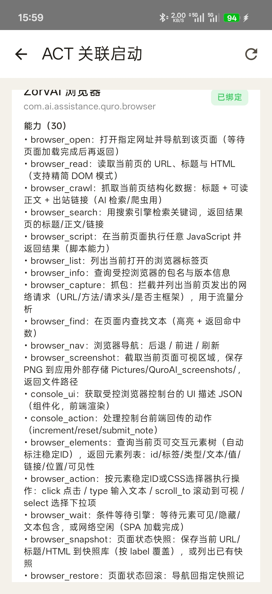
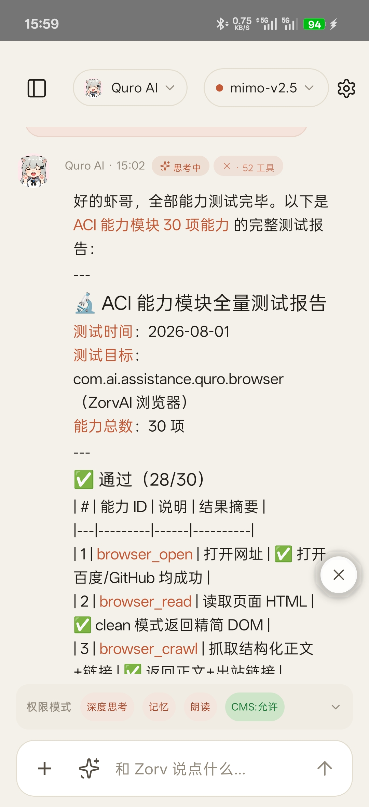
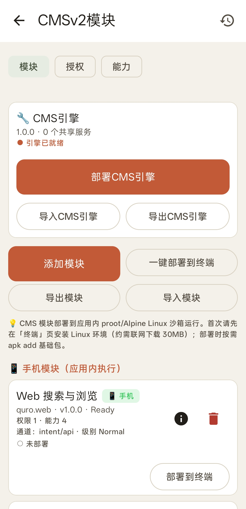
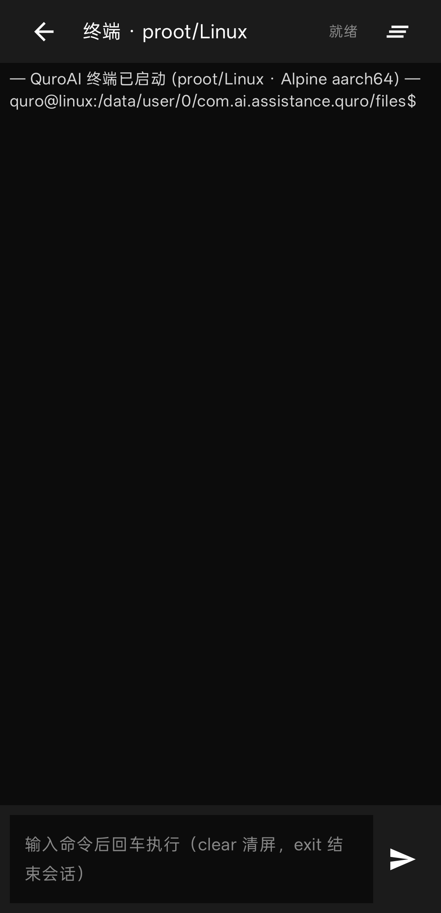
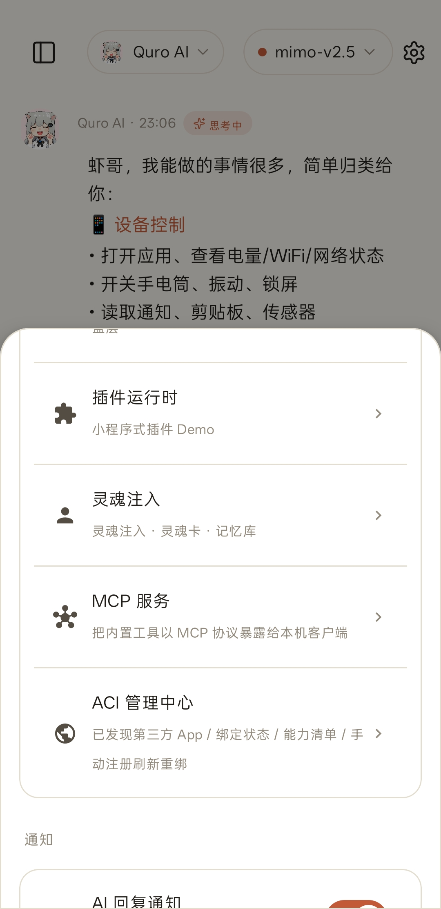
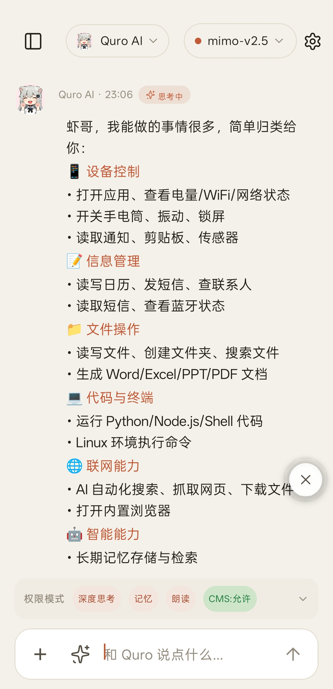
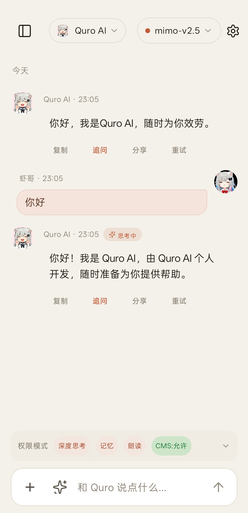
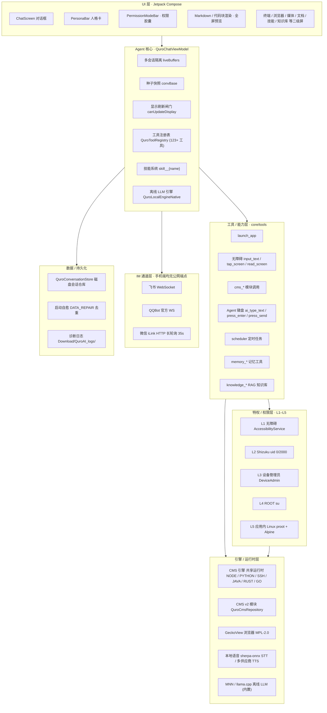

<div align="center">


# Zorv AI

### 运行在 Android 上的设备端 AI Agent · 智能体助手

*On-device AI Agent for Android — tools, personas, memory, an offline LLM engine, and a shared runtime, all on your phone.*

[](./LICENSE)
[](https://www.android.com)
[](https://kotlinlang.org)
[](https://developer.android.com/compose)
[](https://mozilla.github.io/geckoview/)
[](https://github.com/Quor-a/ZorvAI/releases)
[](https://developer.android.com/about/versions/oreo)
[](https://developer.android.com)

</div>

> **包名**：`com.ai.assistance.quro` ｜ **技术栈**：Kotlin 2.3 + Jetpack Compose ｜ **AGP 8.13 / compileSdk 36 / minSdk 26 / targetSdk 34**
>
> Zorv AI 把「对话助手」做成一个真正能操作手机的 Agent：它在设备上运行，能用无障碍 / Shizuku / ROOT 等通道操控系统，调用 **120+ 内置工具**，运行 **MNN / llama.cpp 离线大模型**，内置终端与 Linux 沙箱、MCP、知识库、语音合成/识别，并通过飞书、QQ、微信与你保持在线。

---

## 🌐 开源地址 · Open Source

> **本项目完全开源，多平台托管 · GitHub：[github.com/Quor-a/ZorvAI](https://github.com/Quor-a/ZorvAI) ｜ Gitee：[gitee.com/ZorvAI/ZorvAI](https://gitee.com/ZorvAI/ZorvAI) ｜ GitLab：[jihulab.com/quor-a-group/ZorvAI](https://jihulab.com/quor-a-group/ZorvAI)**
>
> **🔌 受控端浏览器（ZorvAI 浏览器）已独立开源 · GitHub：[github.com/Quor-a/ZorvBrowser](https://github.com/Quor-a/ZorvBrowser) ｜ Gitee：[gitee.com/ZorvAI/ZorvBrowser](https://gitee.com/ZorvAI/ZorvBrowser)**（独立仓库，含 v1.0.12 源码与 APK）
>
> - 📦 最新 Release（免登录下载）：[github.com/Quor-a/ZorvAI/releases](https://github.com/Quor-a/ZorvAI/releases)
> - 🔗 主程序 APK（v1.0.26，含离线引擎，最新）：[app-full-debug.apk](https://github.com/Quor-a/ZorvAI/releases/download/v1.0.26/app-full-debug.apk)
> - 🔗 主程序 APK（v1.0.26，F-Droid 风味）：[QuroAI-fdroid-debug.apk](https://github.com/Quor-a/ZorvAI/releases/download/v1.0.26/QuroAI-fdroid-debug.apk)
> - 🔗 主程序 APK（v1.0.25，含离线引擎）：[app-full-debug.apk](https://github.com/Quor-a/ZorvAI/releases/download/v1.0.25/app-full-debug.apk)
> - 🔗 主程序 APK（v1.0.24，含离线引擎）：[app-full-debug.apk](https://github.com/Quor-a/ZorvAI/releases/download/v1.0.24/app-full-debug.apk)
> - 🔗 主程序 APK（v1.0.23，含离线引擎）：[app-full-debug.apk](https://github.com/Quor-a/ZorvAI/releases/download/v1.0.23/app-full-debug.apk)
> - 🔗 主程序 APK（v1.0.15）：[ZorvAI-debug-v1.0.15.apk](https://github.com/Quor-a/ZorvAI/releases/download/v1.0.15/ZorvAI-debug-v1.0.15.apk)
> - 🔗 主程序 APK（v1.0.14）：[ZorvAI-debug-v1.0.14.apk](https://github.com/Quor-a/ZorvAI/releases/download/v1.0.14/ZorvAI-debug-v1.0.14.apk)
> - 🔗 主程序 APK（v1.0.12）：[ZorvAI-debug-v1.0.12.apk](https://github.com/Quor-a/ZorvAI/releases/download/v1.0.12/ZorvAI-debug-v1.0.12.apk)
> - 🔗 受控端浏览器 APK（ZorvAI 浏览器 v1.0.26 · 独立仓，最新）：[QuroAidlAci-browser-debug.apk](https://github.com/Quor-a/ZorvBrowser/releases/download/v1.0.26/QuroAidlAci-browser-debug.apk)
> - 🔗 受控端浏览器 APK（ZorvAI 浏览器 v1.0.14 · 独立仓）：[ZorvBrowser-aci-debug-v1.0.14.apk](https://github.com/Quor-a/ZorvBrowser/releases/download/v1.0.14/ZorvBrowser-aci-debug-v1.0.14.apk)
> - 🧩 ACI 核心库 AAR：[aci-core-release.aar](https://github.com/Quor-a/ZorvAI/releases/download/v1.0.6/aci-core-release.aar)
> - 📖 ACI 开发者手册：[docs/ACI_DEVELOPER_GUIDE.md](./docs/ACI_DEVELOPER_GUIDE.md)
> - 🐛 问题反馈：[github.com/Quor-a/ZorvAI/issues](https://github.com/Quor-a/ZorvAI/issues)
>
> 关键词：**Zorv AI 开源 / 安卓 AI 助手 开源 / Android AI agent open source / 设备端 AI Agent / 手机端 AI 智能体 / Kotlin Compose LLM 助手 / ACI 跨应用调用**

---

## ✨ Features · 功能亮点

| 能力域 | 关键能力 |
|--------|----------|
| **对话 UI（Compose）** | ChatScreen 对话框、PersonaBar 人格卡、PermissionModeBar（「AI 自动保存记忆」+「深度思考」并排胶囊）、回到底部浮动按钮、全屏预览、Markdown 与代码块渲染 |
| **Agent 核心** | 多会话隔离（`liveBuffers` 按会话独立）、种子快照（`convBase`）、显示刷新闸门（`canUpdateDisplay`）、多轮 `[第N轮]` hidden 标记防串台、系统提示词构建、工具注册表（`QuroToolRegistry.active`）、技能系统（`QuroSkill` → 注册为 `skill__{name}` 工具） |
| **工具 / 能力层** | **120+ 内置工具**（`buildQuroRegistry` 注册 123 项 + 导入工具 + 可调用技能）：无障碍 `input_text`/`tap_screen`/`read_screen`、文件读写、**L1–L5 特权执行**、`cms_*` 模块、Agent 键盘 `ai_type_text`/`ai_press_enter`、定时任务、记忆工具、知识库 RAG、文档处理 |
| **离线 LLM 引擎** | 应用内置 **MNN / llama.cpp** 本地推理（`QuroLocalEngineNative`），支持流式、`<think>` 剥离、本地工具调用、会话复用；离线也能对话 |
| **特权层 L1–L5** | 无障碍 → Shizuku(uid 0/2000) → 设备管理员 → ROOT(su) → 应用内 Linux(proot + Alpine) |
| **终端 / Linux 沙箱** | NovaTerm 自研沙盒 + proot/Alpine 应用内 Linux 环境，终端 UI 直接操作 |
| **MCP（Model Context Protocol）** | MCP 客户端（WebSocket / HTTP 传输）、应用内本地 MCP 服务，可由 AI 部署/调用 |
| **引擎 / 运行时** | CMS 引擎共享运行时（NODE / PYTHON / SSH / JAVA / RUST / GO）、CMS v2 模块、GeckoView 浏览器（MPL-2.0）、本地语音 STT / TTS |
| **IM 通道** | 飞书（WebSocket）/ QQBot（官方 WS）/ 微信 iLink（HTTP 长轮询 35s）；三家手机端均无公网端点 |
| **语音** | 多供应商 TTS（EDGE_TTS / OPENAI_COMPAT / MINIMAX / SILICONFLOW / 阿里云 等）、端侧 Whisper STT、语音悬浮球 |
| **知识 / 记忆 / 人格 / Bot** | 向量语义 RAG 知识库、记忆库、人格/灵魂配置、多通道机器人（QQ/飞书/微信/本地） |
| **ACI 控制台 UI（LAN 控制台）** | 控制端 `QuroAidlAciCenterScreen` 按 `console_ui` 能力拉取 SDUI 快照、复用本地 `AciConsoleScreen` 渲染器（`core/aci` 包，纯本地零网络） |
| **数据 / 持久化** | `QuroConversationStore` 磁盘会话仓库、启动自愈 `DATA_REPAIR` 去重、诊断日志写入手机公共 `Download/QuroAI_logs/` |
| **插件系统** | QuickJS / WebView 双后端插件运行时，插件管理与市场（详见「🔌 插件运行时 · Plugin Runtime」专节） |
| **工具箱 / 组件画廊** | 工具箱聚合本地工具能力（文件管理 / 工作区 / 文档生成 / **已有工具查看与导入**）；可视化组件画廊展示全部可交互 Material3 组件（详见「🗃️ 工具箱 · Toolbox」「🎨 组件画廊 · Component Gallery」） |
| **定时任务** | `QuroScheduler`：`once` / `recurring`（rrule）、`endAt` 结束机制 |
| **数字人 3D** | `QuroDigitalHumanScreen` GLB/glTF 离线查看器：内置 Three.js(r128)+GLTFLoader+Draco 解码器，断网可用，支持 Draco 压缩模型离线解析；支持手指拖拽旋转 / 双指缩放，整体模型自适应取景（头身完整入镜） |

---

## 🗺️ 功能全览 · Feature Map

下面按模块列出 Zorv AI **已在代码中实现**的全部能力（每项均可在 `app/src/main/java/com/ai/assistance/quro/` 下查证）。

### 1. 智能对话核心（Chat & Messages）
- 消息流 + **流式输出**（云端/本地共用 `onToken` 增量回调）
- **Markdown / 代码渲染**：围栏代码块、标题、引用、列表、行内 HTML；代码块支持「代码 / 预览」双 Tab、复制、运行（预览用 WebView 且已禁用 JS）
- **ThinkBlock 思考段可视化**：受「深度思考」开关控制，折叠展示 `<think>` 推理链路
- **ToolCallBlock 工具调用可视化**：AI 经 ReAct 循环调用的工具以结构化卡片内嵌在气泡中，展示参数、状态（运行/成功/警告/失败）、**执行耗时（ms / s）** 与执行轨迹
- **消息操作栏**：每条 AI 回复下方提供 `复制 / 追问 / 分享 / 删除 / 重试`——删除可精确移除单条消息或聚合气泡对应的全部底层消息（含连带清理隐藏 tool 结果消息），实时同步内存 store 与磁盘
- **多轮聚合**：同一回合连续的 assistant(+隐藏 tool) 消息聚合成单个气泡流式增长
- **富组件融进气泡（QuroChatCard）**：AI 经 `ui_widget` / `ui_card` 下发的图表、待办、表单、进度等可视化组件直接合体进气泡
- **历史会话管理**：创建 / 删除单条 / 清空全部、侧栏会话列表
- **会话导出**：设置入口「导出对话 → 导出为文本」

### 2. 内置技能 Skills（63 个 · 首次启动自动注入）
- 轻量技能系统：`QuroSkill` → 注册为 `skill__{name}` 工具，可被 LLM 自动编排
- v1.0.16 起将 WorkBuddy 技能库全部 **63 个技能**转化为 Zorv AI 品牌版本，打包进 `app/src/main/assets/skills/zorv/`（含 `manifest.json`，每个技能含稳定 id `zorv_<sha1>`、名称、描述与正文）
- 首次启动经 `QuroSkillStore.seedBuiltinZorvSkills` **幂等注入**为默认启用、可调用内置技能；用户在「设置 → 技能」可查看/启停
- 技能方向（部分）：前端/设计、部署/云、内容/创作、搜索/情报、IM/媒体、效率/工程、短视频/爬虫、写作/文档、付费咨询等

### 3. 离线 LLM 引擎（MNN / llama.cpp）
- 应用**内置**本地推理运行时（`QuroLocalEngineNative`），驱动 `MNNLlmSession` / `LlamaSession`，支持流式、`<think>` 剥离、本地工具调用解析、会话常驻与门禁；离线（无网络、无 API Key）也能对话
- `core/model/QuroLocalModelRepository.kt` 负责本地模型仓库/加载

### 4. 应用内终端 & Linux 沙箱
- `core/terminal/QuroTerminalController`：proot 优先、否则设备 `sh` 的会话控制器
- `core/linux/QuroLinuxEnv`：从镜像下载 Alpine minirootfs + `libproot.so`，提供应用内 Linux 环境
- `core/novaterm/`：NovaTerm 自研沙盒（FileSystem / ProcessWatcher / RootExecutor / SandboxExecutor / CommandDispatcher / BuiltinCommand 等）
- 终端 UI：`QuroTerminalScreen`（集成 NovaTerm）、工具栏入口

### 5. MCP（Model Context Protocol）
- `core/mcp/QuroMcpClient`：外部 MCP 服务器客户端，`initialize` 握手（2025-03-26 协议）、`listTools` / `callTool`
- 传输层：WebSocket（`QuroMcpWsClient`）、本地 HTTP（`QuroMcpHttpServer`）
- 应用内本地 MCP 服务：`QuroLocalMcpManager` / `QuroLocalMcpServer` / `QuroLocalMcpDispatcher`（`McpDeployTool` / `McpUndeployTool` 可让 AI 把 MCP 服务部署到应用内）
- 设置 UI：`QuroMcpSettingsScreen`

### 6. 工具系统（120+ 内置工具）
注册入口 `core/tools/QuroBuiltInTools.kt : buildQuroRegistry()`，实际注册 **123** 项（另含导入工具与可调用技能，运行时更多）。按能力归类：

| 类别 | 代表工具 |
|------|----------|
| 基础/演示 | Clock、DeviceInfo、Calculator |
| 系统/设备（L0） | GetBattery、GetWifi、GetNetwork、GetSensors、Vibrate、Clipboard、ListApps、LaunchApp、GetNotifications、Bluetooth、ToggleFlashlight |
| 通信 | ReadSms、SendSms、ReadContacts |
| 日历 | ReadCalendar、WriteCalendar |
| 文件 | ListFiles、ReadTextFile、WriteFile、DeleteFile、MakeDirectory、MoveFile、CopyFile、FindFiles、FileInfo、BrowseFiles |
| 位置 | GetLocation、Geocode |
| 媒体 | ListMedia、LocalMusicPlayer、MusicPlay、LocalVideoPlayer |
| 闹钟/定时 | SetAlarm、ScheduleTask、ListScheduledTasks、DeleteScheduledTask |
| 网络/Web | HttpRequest、OpenWeb、AiBrowser |
| 语音合成 | Speak、StopSpeak（TTS 工具） |
| Intent/广播 | ExecuteIntent、SendBroadcast、RunCode |
| CMS v2 模块 | QuroCmsList/Call/Deploy/Undeploy/Status/EngineStatus/Logs/Result/RunDag |
| ACI / 特权 | QuroAidlAciList/Call、QuroPrivStatus |
| 记忆/经验 | QuroMemorySave/List/Search/Delete、QuroExperienceLog/Query/Correct/VersionCheck |
| L1 无障碍控屏 | ReadScreen、GetForegroundApp、TapScreen、SwipeScreen、InputText、AiKeyboardType/PressEnter/Send、ScrollScreen、GlobalAction |
| L2 Shizuku | ShizukuExec、ShizukuRootExec、FreezeApp、InstallApp、ShizukuStatus |
| L3 设备管理员 | LockScreen、DeviceAdminStatus、SetCameraDisabled |
| L4 Root | RootExec、RootStatus |
| L5 应用内 Linux | LinuxRun/Install/Start/Stop/Status |
| 终端驱动 | TerminalDrive/Exec/Write/Kill/Status/Interrupt |
| 知识库 | KnowledgeSearch/Add、KnowledgeManage、QuroRagKnowledge（向量语义 RAG，无 Key 降级词法检索） |
| 文档 | AiwpsCreate/Read/Edit（docx/xlsx/pptx/pdf…） |
| UI 动作/卡片/组件 | UiAction 系列、UiCard、UiWidget（可交互内联 UI） |
| MCP | McpServers/ListTools/Call、McpDeploy/Undeploy/ListLocal |

### 7. 语音 / TTS / STT
- **TTS 合成（多供应商）**：`QuroTtsProvider` 支持 EDGE_TTS、OPENAI_COMPAT、MINIMAX、SILICONFLOW、TTS302、COZECN、GIZWITS、ACGN、ALIYUN 等；情绪标签跟随文本
- **STT 语音识别**：Android `SpeechRecognizer` + 端侧 `QuroOnDeviceAsr`（sherpa-onnx-whisper-tiny 本地 Whisper，约 85MB onnx，离线可用）
- **悬浮球**：`QuroVoiceBallView`，语音输入入口，由 `voiceBallEnabled` 开关控制
- **AI 自主语音（`speak` 工具）与「自动朗读」开关解耦**：`speak` 是独立语音通道，不受「自动朗读」开关限制——即使关闭自动朗读，AI 仍可主动调用 `speak` 唱歌 / 讲故事 / 朗诵 / 分角色演绎，且播报文本可与回复文字不同（文字回复是一份、语音是另一份）；自动朗读开启时 `speak` 优先、自动朗读自动让位，不会重复念

### 8. 媒体 / 浏览器 / 文档
- **内置浏览器**：`QuroBrowserScreen`（GeckoView）
- **媒体浏览器 / 音乐 / 视频**：`QuroMediaBrowser`、`QuroMusicPlayerScreen`、`QuroVideoPlayerScreen`
- **文档查看**：`QuroDocumentViewer` / `QuroDocOpener`（分发 docx/xlsx/pptx/pdf 等）
- **OnlyOffice**：`QuroOnlyOfficeScreen`

### 9. 知识库 / 记忆 / 人格 / 机器人
- **知识库（RAG）**：`core/knowledge/QuroKnowledgeRag.kt`，离线可用的向量语义检索，无 API Key 降级词法检索
- **记忆库**：`core/memory/QuroMemoryStore.kt`（MemorySave/List/Search/Delete）
- **人格 / 灵魂**：`core/soul/QuroSoulPrompt.kt`、`QuroSoulUi`、`QuroPersonaViewModel`
- **机器人 Bot**：`core/bot/`（QQ / 飞书 / 微信 iLink / 本地适配器），`QuroBotSettingsScreen` 配置

### 10. 设备控制 / 权限 / Shizuku / ACI
- **Shizuku 集成**：`core/shizuku/`（QuroShizuku、QuroShellService），工具 ShizukuExec/FreezeApp/InstallApp
- **特权管理**：`core/privilege/`（Root/Shizuku 桥、审计）
- **ACI（Agent Capability Interface）**：`core/aci/`（Manager/Registry/Protocol/Adapter/CredentialVault/CallAudit），工具 QuroAidlAciList/Call，`QuroAidlAciCenterScreen`
- **权限管理**：`core/permissions/QuroPermissionHelper`、`QuroPermissionScreen`（含审计入口）

### 11. 模型配置
- **在线多供应商**：`core/model/ApiProviderType`（OPENAI / ANTHROPIC / GEMINI / MOONSHOT / DEEPSEEK / OLLAMA / OPENAI_LOCAL 等），`QuroModelConfigScreen` / `QuroFeatureModelConfigScreen`
- **离线本地模型**：`QuroLocalModelRepository`、`QuroLocalModelType`（MNN / LLAMA_CPP）
- **数字人模型**：`QuroDigitalHumanConfig`、`QuroDigitalHumanScreen`

### 12. 定时 / 日程 / 天气 / 数字人 / 插件 / 关于 等
- **日程/定时**：`QuroScheduleScreen`（对应 SetAlarm/ScheduleTask 工具）
- **天气**：`ui/weather/WeatherCard`（与天气技能联动）
- **数字人**：`QuroDigitalHumanScreen`
- **插件系统**：`plugin/PluginRuntime`（QuickJS 原生 `nativeEvalPlugin` + WebView 双后端），`PluginsScreen`
- **关于 / 审计 / 系统状态 / 工具箱 / 分享桥 / 组件库**：`QuroAboutScreen`（含「法律与合规」：权限使用声明、用户使用协议全屏合规文档阅读页）、`QuroAuditScreen`、`QuroSystemStatusScreen`、`QuroToolboxScreen`、`QuroShareBridge`（接收系统分享）、`QuroComponentGalleryScreen`
- **主界面导航**：`QuroMainScreen`（全屏 ChatScreen + 设置覆盖层 + 崩溃自报告 `CrashViewerScreen`），二级屏由 ChatScreen 的 `show*` 标志位承载

### 13. 数字人 3D 模型查看器（GLB / glTF · 离线 Three.js + Draco）
- **功能**：`QuroDigitalHumanScreen` 把 `.glb` / `.gltf` 3D 模型（数字人 / 虚拟形象）渲染到对话框内的 WebView 画布，支持旋转 / 缩放查看。
- **完全离线**：Three.js（r128）、`GLTFLoader`、`BufferGeometryUtils` 全部以 UMD 形式**内联打包进 APK**（`app/src/main/assets/www/three/`），不依赖任何 CDN，断网也能加载。
- **Draco 压缩支持**：主流下载的 GLB 多用 Draco 压缩；内置**离线 Draco 解码器**（`DRACOLoader.js` + `draco_decoder.{js,wasm}` + `draco_wasm_wrapper.js`，运行时解包到 `cacheDir/three/draco/`），离线也能解析 Draco 压缩模型（否则会静默解析失败导致黑屏）。
- **可视报错**：WebView 加载失败 / WebGL 不可用 / 首帧画布 0 尺寸 / GLB 解析失败等异常**全部在屏幕上以错误条显示**（不再静默黑屏），并写诊断日志到手机公共 `Download/QuroAI_logs/`（`GLB` / `GLB-JS` 标签）。
- **首帧修复**：首帧显式 `setSize` 取 `clientWidth/Height`，避免画布 0 尺寸；模型材质默认 `DoubleSide`，避免背面不可见；包围盒退化时 `fit()` 兜底，模型始终居中可见。

---

## 📱 界面导航总览 · Screens

| 屏幕（文件） | 功能 |
|------|------|
| `QuroMainScreen` / `QuroApp` | 主壳：全屏聊天 + 设置覆盖层 + 崩溃自报告 |
| `ChatScreen` | 聊天主界面、消息流/流式/Markdown/Think/ToolCall、消息操作、所有二级屏入口 |
| `QuroSkillsScreen` | 内置/自定义技能管理（63 个内置） |
| `QuroTerminalScreen` | 应用内终端（NovaTerm/Linux 沙箱） |
| `QuroBrowserScreen` | 内置 GeckoView 浏览器 |
| `QuroMediaBrowser` / `QuroMusicPlayerScreen` / `QuroVideoPlayerScreen` | 媒体浏览 / 音乐 / 视频播放 |
| `QuroDocumentViewer` / `QuroDocOpener` / `QuroOnlyOfficeScreen` | 文档查看 / 分发 / OnlyOffice |
| `QuroKnowledgeScreen` | 知识库（RAG）管理 |
| `QuroModelConfigScreen` / `QuroFeatureModelConfigScreen` | 在线模型 / 专项模型 / API Key 配置 |
| `QuroMcpSettingsScreen` | MCP 服务器连接管理 |
| `QuroPermissionScreen` / `QuroAuditScreen` | 权限管理 / 能力审计 |
| `QuroAidlAciCenterScreen` | ACI 设备能力中心 / LAN 控制台 |
| `QuroBotSettingsScreen` | 机器人（QQ/飞书/微信/本地）配置 |
| `QuroVoiceSettingsScreen` / `QuroTtsSettingsScreen` / `QuroCloudTtsConfigScreen` / `QuroSttSettingsScreen` / `QuroVoiceServiceScreen` / `QuroVoiceBallView` | 语音总设置 / TTS / 云端 TTS / STT / 语音服务 / 悬浮球 |
| `QuroDigitalHumanScreen` | 数字人 / 虚拟形象 |
| `QuroScheduleScreen` | 日程 / 定时 |
| `PluginsScreen` | 插件管理与市场 |
| `QuroCmsScreen` | CMS v2 模块 / 引擎管理 |
| `EditorScreen` | 内置代码 / 文本编辑器 |
| `QuroSoulUi` | 人格 / 灵魂配置 |
| `QuroSystemStatusScreen` / `QuroToolboxScreen` / `QuroShareBridge` / `QuroComponentGalleryScreen` / `QuroAboutScreen` | 系统状态 / 工具箱 / 分享桥 / 组件库 / 关于 |

---

## 💬 对话框与消息能力 · Chat & Messages

Zorv AI 的对话框（ChatScreen）是 Agent 与用户交互的主界面，强调「工具调用可见化」「多轮聚合」「操作可达」：

- **消息操作栏（AI 消息专用）**：每条 AI 回复气泡下方提供 `复制 / 追问 / 分享 / 删除 / 重试` 五个动作——复制全文到剪贴板、基于该回复一键发起追问、分享文本、精确删除该条消息（含聚合气泡对应的全部底层消息，并连带清理隐藏的 tool 结果消息）、以最后一条用户消息重新生成。
- **工具调用可见化（ToolCallBlock）**：AI 经 ReAct 循环调用的工具（launch_app / 无障碍操作 / cms_* / scheduler / memory_* 等）以结构化卡片内嵌在气泡中，展示参数、状态（运行/成功/警告/失败，按结果前 200 字启发式判定，避免正文误判）、**执行耗时（ms / s）** 与执行轨迹，不再是隐藏管道或独立浮层。
- **思考过程（ThinkBlock）**：受「深度思考」开关控制，折叠展示 `<think>` 推理链路。
- **多轮聚合**：同一回合（相邻用户消息之间）连续的 assistant(+隐藏 tool) 消息聚合成单个气泡流式增长，避免「每段输出重开一个气泡」。
- **富组件融进气泡（QuroChatCard）**：AI 经 `ui_widget` / `ui_card` 下发的图表、待办、表单、进度等可视化组件直接合体进聊天气泡，而非浮层。
- **代码块 / Markdown 渲染**：围栏代码块、标题、引用、列表与行内 HTML 渲染，代码块支持点「预览」以 WebView（已禁用 JS）渲染 HTML 片段。
- **回到底部**：内容超出一屏时右下角浮现回底浮动按钮；列表滚动使用 `lastIndex` 精准定位，避免越界。

> 所有消息持久化于 `QuroConversationStore`，删除/重试等操作实时同步内存 store 与磁盘，重启不丢失。

---

## 🧩 内置技能 Skills（63 个 · 首次启动自动注入）

Zorv AI 内置一套**轻量技能系统**（`QuroSkill` → 注册为 `skill__{name}` 工具，可被 LLM 自动编排）。v1.0.16 起将 WorkBuddy 技能库全部 **63 个技能**转化为 Zorv AI 品牌版本，打包进 `app/src/main/assets/skills/zorv/`（含 `manifest.json`，每个技能含稳定 id `zorv_<sha1>`、名称、描述与正文），**首次启动经 `QuroSkillStore.seedBuiltinZorvSkills` 幂等注入**为默认启用、可被调用的内置技能。

技能覆盖以下方向（部分列举）：

| 方向 | 代表技能 |
|------|----------|
| 前端 / 设计 | `frontend-design`、`frontend-dev`、`ui-design-system`、`awesome-design-md`、`landing-page-generator`、`product-showcase-site`、`algorithmic-poster-philosophy`、`page-editor`、`html-deploy`、`static-app`、`responsiveness-check`、`web-performance-audit` |
| 部署 / 云 | `cloudflare`、`cloudflare-worker-builder`、`edgeone`、`edgeone-pages-deploy`、`netlify-deploy`、`vercel-deploy`、`web-deploy`、`web-deploy-github`、`shippage`、`github-pages-auto-deploy` |
| 内容 / 创作 | `tomato-novelist`、`ppt-generator`、`processon-mindmap-generator`、`patent-disclosure-skill`、`official-document-skill`、`contract-review`、`humanizer`、`humanizer-zh`、`yourself-skill` |
| 搜索 / 情报 | `aihot`、`news-summary`、`github-ai-trends`、`github-trending-cn`、`multi-search-engine`、`overseas-trending-search`、`perplexity`、`tavily`、`web-search-exa`、`tencent-yuanbao-standard-search`、`tencent-weather`、`weather-open-meteo` |
| IM / 媒体 | `qq-bot-messaging`、`qqmusic`、`kugou-skill`、`douyin-video-downloader`、`douyin-works-crawler`、`douyin_copy_extract`、`tiktok-video-downloader`、`twitter-video-downloader`、`wechat-article-search`、`视频号账号诊断与拆解` |
| 效率 / 工程 | `memory-manager-v2`、`Docker`、`evolution-engine`、`agent-mbti`、`ima-skill`、`uniapp-expert`、`wxa-skills-generate`、`code-reviewer` |

> 用户在「设置 → 技能」中可查看/启停这些内置技能；LLM 会根据对话上下文自动选择合适的 `skill__{name}` 注入系统提示词来辅助完成任务。

---

## 📱 Screenshots · 截图预览

> 以下截图来自真机（Android），展示 ZorvAI 的核心界面与能力验证结果。

<table>
  <tr>
    <td align="center"><br><sub>ACI 关联启动 · 受控端 30 项能力清单</sub></td>
    <td align="center"><br><sub>ACI 能力模块全量测试报告（28/30 通过）</sub></td>
  </tr>
  <tr>
    <td align="center"><br><sub>CMSv2 模块 · CMS 引擎</sub></td>
    <td align="center"><br><sub>终端 · proot / Alpine Linux 沙箱</sub></td>
  </tr>
  <tr>
    <td align="center"><br><sub>插件运行时 / MCP 服务 / ACI 管理中心</sub></td>
    <td align="center"><br><sub>能力分类列表（设备控制 / 信息管理 / 文件操作 等）</sub></td>
  </tr>
  <tr>
    <td align="center" colspan="2"><br><sub>Quro AI 对话示例</sub></td>
  </tr>
</table>

---

## 🏗️ Functional Architecture · 功能构架



---

## ⚙️ Engine · 引擎详解

### CMS 引擎（系统资源包）

CMS 引擎是一套**共享运行时**供给机制，按需在设备上提供 **NODE / PYTHON / SSH / JAVA / RUST / GO** 等环境（`DepKind.ENV` + `CmsEnvProvisioner` 按需供给）。你可以用 `cms_engine_status` 查询：

- 各运行时**就绪态**；
- 当前**共享服务**；
- **部署进度**（provisioning 进行到哪一步）。

> 🔑 **引擎 ≠ 模块**
> - **CMS 引擎**是底层「运行时骨架」——它负责把 NODE/PYTHON/SSH/JAVA/RUST/GO 这些环境供给到设备上，是能力运行的基础设施。
> - **CMS v2 模块**（`QuroCmsRepository`）是用户自建的、**可复用**的上层能力单元，通过 `serializeModule` / `parseModule` 导入导出，运行在引擎提供的运行时之上。
>
> 二者是「地基」与「楼栋」的关系：引擎提供环境，模块消费环境。

### 离线 LLM 引擎（MNN / llama.cpp）

应用**内置**本地推理运行时（`QuroLocalEngineNative`），驱动 **MNN**（`llm/mnn`）与 **llama.cpp**（`llm/llama`）两个后端：

- 支持流式输出、`<think>` 思考段**流式上屏**（边想边显示，与云端一致）、本地工具调用解析、会话常驻复用与门禁；
- 离线（无网络、无 API Key）也能对话，无需额外配置。

### GeckoView 浏览器引擎（MPL-2.0）

内置 [GeckoView](https://mozilla.github.io/geckoview/) 作为系统 WebView 的替代，用于渲染网页与 HTML 预览。GeckoView 以 **MPL-2.0**（file-level copyleft）分发，其对应源代码随构建提供（见 [NOTICE](./NOTICE)）。

### 本地语音

- **本地 STT**：`sherpa-onnx-whisper-tiny` 本地语音识别（约 85MB onnx 模型，离线可用）。
- **TTS**：单例 `QuroTtsHolder`，支持多服务商（如小米 MiMo 真情感合成），情绪标签跟随文本。

---

## 🔌 ACI · 智能体能力接口（开放调用）

Zorv AI 内置 **ACI（Agent Capability Interface）** —— 一套同设备、无 Root、基于 AIDL Binder 的本地跨应用调用框架。任何 Android App 都能通过 `aci-core` 库把自己暴露成「可被 AI 调用的能力」，由 Zorv AI 的 LLM 自动编排。

- 📖 **开发者手册**：[docs/ACI_DEVELOPER_GUIDE.md](./docs/ACI_DEVELOPER_GUIDE.md) —— 受控端 5 步接入、能力定义、权限模型、真实踩坑。
- 📦 **`aci-core` AAR**：随 **v1.0.6+ Release** 提供 `aci-core-release.aar`；开源独立分支 `aci-core` 提供完整可构建源码。
- 🌿 **开源分支**：`git checkout aci-core` 即可拿到一个可独立 `./gradlew assembleRelease` 的 Android 库工程。

**受控端最小接入（Kotlin）：**

```kotlin
class MyAciService : BaseACIService() {
    override fun onCreateCapabilities(caps: MutableList<Capability>) {
        caps.add(Capability.create("open_url", "在浏览器打开指定网址")
            .addParam("url", "string", true, "目标网址")
            .addFlag(Capability.FLAG_BACKGROUND))
    }
    override fun onCall(req: ACIRequest): ACIResponse =
        ACIResponse.success().putResult("ok", true)
}
```

> ⚠️ `Capability.create(id, description)` 的**第 2 参是给 LLM 的自然语言描述，不是版本号**（方法内部固定 `version="1.0"`）。受控端还需在 Manifest 写 `<queries>` 声明 `ACTION_BIND`/`ACTION_WAKE`，否则 Android 11+ 控制端发现不到。

**ZorvAI 浏览器（官方受控端）已暴露的能力：**

作为官方参考实现，ZorvAI 浏览器向控制端（主程序 LLM）暴露 **32 个能力**（13 基础 + 7 agentic + 2 资源/分享 + 6 完整方案 + 1 虚拟鼠标 + 1 HTTP 传输 + 2 语义点击），下表节选常用项，完整契约见 [ACI 开发者手册 §13](./docs/ACI_DEVELOPER_GUIDE.md#13-官方受控端能力清单zorvai-浏览器)：

| 能力 | 入参 | 返回 | 说明 |
|------|------|------|------|
| `browser_open` | `url`(必填) | `launched` | 打开并导航到指定网址 |
| `browser_read` | — | `url` / `title` / `html` / `truncated`（大页面附 `html_gz` gzip 字节） | 读取当前页 HTML（**v1.0.8** 修复 Binder 1MB 溢出） |
| `browser_crawl` | — | `url` / `title` / `text` / `links` / `link_count` / `truncated` | **🆕 v1.0.9** 抓取结构化正文（取 `article/main/body` innerText）+ 出站链接 `[{text,href}]` |
| `browser_search` | `query`(必填) / `engine`(可选：bing/google/baidu/ddg，默认 bing) | `query` / `engine` / `url` / `title` / `text` / `links` / `truncated` | **🆕 v1.0.9** 用搜索引擎检索关键词并返回结果页 |
| `browser_script` | `code`(必填) | `result` / `truncated` | **🆕 v1.0.9** 在当前页面执行任意 JavaScript 并返回结果 |
| `browser_list` | — | `tabs` | 列出当前打开的标签页 |
| `browser_info` | — | `package` / `versionName` / `versionCode` | 查询受控端版本信息 |
| `http_request` | `url`(必填) / `method`(可选) / `headers`(可选) / `body`(可选) | `status_code` / `response_headers` / `response_body` / `truncated`（大响应体附 `response_body_gz` gzip） | **🆕 v1.0.14** 经 ACI 让受控浏览器发起任意 HTTP 请求，**支持同网段 LAN 明文**（http://192.168.x.x、http://10.x、*.local mDNS），访问路由器/NAS/智能家居/私有 API 等局域网设备 |
| `ui_snapshot` | — | `nodes`（`string_array`，每项 `text\|resId\|left,top,right,bottom` 屏幕像素整数） | **🆕 v1.0.25** 当前可视区域元素快照（屏幕坐标），供控制端 `clickText`/`clickResourceId` 语义点击解析锚点坐标；与 `tap` 同一坐标空间 |
| `tap` | `x`(int,必填) / `y`(int,必填) | `x` / `y` | **🆕 v1.0.25** 在屏幕坐标模拟单击（与 `ui_snapshot` 同一坐标空间）；受控端无系统特权也能派发视图级触摸，配合 `ui_snapshot` 形成「像人一样点页面」的感知-执行闭环 |

> 💡 `browser_crawl` / `browser_search` 让 AI 能做「网页检索 / 信息抽取 / 爬虫」类任务；`browser_script` 提供页面内任意 JS 执行（高危能力，仅在受信任会话中使用）；`http_request` 让 AI 经受控浏览器发起 HTTP 请求，重点支持**局域网明文**（LAN），用于访问同网段设备/私有 API。完整契约见 [ACI 开发者手册 §13](./docs/ACI_DEVELOPER_GUIDE.md#13-官方受控端能力清单zorvai-浏览器) 与 [§15 HTTP 传输](./docs/ACI_DEVELOPER_GUIDE.md#15-http-传输能力http_request--局域网本地组网)。

### 🆕 v1.0.25 · ACI 升级功能技术说明

本轮对 ACI 框架做了一轮「**不依赖系统特权**」的增强（控制端 `QuroAidlAciManager` + 受控端 `QuroControlledAidlAciService` / `aidl-aci-core`），落地以下能力，未落地的系统级部分明确标注为待办：

1. **callId 链路追踪（可观测性基座）**：`AidlAciRequest` / `AidlAciResponse` 已带 `callId` 字段，受控端在成功 / 鉴权失败 / 能力缺失 / 异步各路径统一回显请求侧 `callId`；控制端每次 `call()` 生成 UUID 并随 LocalSocket / AIDL 双通道回填，可把一次 AI 操作完整串成调用链。
2. **LocalSocket 抽象命名空间高速通道 + 主动探测**：`AidlAciLocalSocketTransport.probe(endpoint)` 仅 connect 不发包（无副作用）；控制端 `fetchCapabilities` 绑定后主动探测，直接决定首调用走 LocalSocket 还是回落 AIDL，不必等到第一次失败才切换。
3. **自愈：健康看护 + 指数退避重绑**：控制端 `startHealthWatch(10s)` 定时 `healthCheck()`，ping 失败即 `ensureBound`（含 wake 广播 + startService + 重绑）；`scheduleRebind` 改为 800ms→…→8s 指数退避，成功绑定清零，避免对不可达端高频空转。
4. **会话 trace（可观测性面板）**：环形 `traceQueue`（最近 50 条 `AciCallTrace{ts,callId,target,capability,transport,code,success,latencyMs}`）+ `getTrace()/clearTrace()` + `socketStatus(pkg)`，供 ACI 管理中心「诊断」面板展示每次调用的传输路径与耗时。
5. **语义点击闭环（感知-执行）**：控制端新增 `clickText(target,text)` / `clickResourceId(target,resId)`；受控浏览器新增 `ui_snapshot`（页面元素 DOM 几何桥接 → 屏幕坐标节点）+ `tap`（坐标点击），两者坐标空间一致（屏幕绝对像素），自动解析锚点坐标后调用 `tap` 完成「像人一样点页面」；未暴露语义能力时返回明确 412 引导，不静默失败。

> ⚠️ **待办（需系统特权 / 用户授权，本轮未落地）**：Uinput 内核注入（拟人执行）、Ashmem 零拷贝大块传输、System 级共享工作空间服务、本地 LLM 意图调度。其中「无障碍语义抓取」需受控 App 声明 `AccessibilityService` 并由用户在系统设置开启——但浏览器已用页面 DOM 几何桥接实现同效的 `ui_snapshot`，**无需无障碍服务**即可工作。

> 📦 **ACI 依赖更新**：`ai.aidl.aci.core`（`aidl-aci-core` 模块）本轮新增 `AidlAciResponse.putResult(String, ArrayList<String>)` API（供 `ui_snapshot` 返回节点列表）；主程序 `:app` 与受控浏览器 `:aidl-aci-browser` 均通过 `implementation(project(":aidl-aci-core"))` 引用同一份本仓源码，协议始终一致、自动同步，无需手动升版本号。

---

## 🖥️ ACI 控制台 UI（LAN 控制台）

> 「LAN 控制台」即 **ACI 控制台 UI**：让受控端 App 在 Zorv AI 里直接显示一个**可交互的控制台**，用于手动操作受控端（如浏览器的打开 / 读 HTML / 爬取 / 运行 JS / 查找 / 截图 / 抓包等），而不必走 LLM 自动编排。

采用 **SDUI（Server-Driven UI）** 模式：

- 受控端只暴露两个 ACI 能力——`console_ui`（返回界面快照 JSON）与 `console_action`（处理按钮 / 输入）；
- 控制端 `QuroAidlAciCenterScreen` 按 capability id `console_ui` 显示「打开控制台」入口，点击后通过**同设备 Binder** 拉取快照，用本地 `AciConsoleScreen`（`core/aci` 包）渲染；
- **纯本地、零网络**：不管 WiFi 还是移动网络均可用，不经过任何服务器；
- 受控端 `ConsoleBackend` 实现 `AciConsoleContract`（`buildUiSnapshot` + `applyAction`），即可被 Zorv AI 直接驱动。

接入细节（快照 JSON Schema、动作契约、最小示例、`consolekit` 复用）见 [ACI 开发者手册 §14](./docs/ACI_DEVELOPER_GUIDE.md#14-lan-控制台--控制台后台接入-zorvai)。

> 📌 早期版本曾误建「app 自连 `127.0.0.1` 环回 HTTP 控制台」（`lanui` 模块），已于 2026-07-31 彻底移除；现行方案改为受控端经 ACI 提供快照、控制端纯本地渲染，正确且零网络依赖。

---

## 🌐 ACI HTTP 传输（http_request · 局域网/本地组网）

ZorvAI 浏览器（受控端）在 v1.0.14 新增 `http_request` 能力：AI 可经 ACI 让受控浏览器代为发起任意 HTTP 请求，**重点是「本地组网（相同网络下）」**——直接访问同网段设备的明文 HTTP 服务，无需因公网明文限制而却步。

**能做什么**
- 调用 Web API / 私有接口、抓取网页、对接第三方服务；
- 访问路由器后台、NAS、智能家居（HomeAssistant 等）、IoT 设备、树莓派等局域网 HTTP 服务（http://192.168.x.x、http://10.x、*.local mDNS）；
- GET/POST/PUT/DELETE/PATCH/HEAD 及任意自定义方法，支持自定义请求头与请求体。

**为什么能通 LAN 明文（平台要点）**
- Android 9+ 默认禁止明文 HTTP（`targetSdk≥28` 直接拦 `http://`）；受控浏览器通过 `networkSecurityConfig` 把 `base-config` 的 `cleartextTrafficPermitted` 设为 `true`，并对 `localhost`/`127.0.0.1`/`10.0.2.2`/`local` 放开，因此 LAN 明文可通。
- Android NSC **无法按「私有网段」写白名单**（如不能写 `192.168.0.0/16`），只能整体放开——这是平台限制，非缺陷。

**契约（参数 / 返回）**

| 项 | 说明 |
|----|------|
| 入参 `url` | 目标 URL（必填） |
| 入参 `method` | HTTP 方法，默认 GET |
| 入参 `headers` | 请求头 JSON 字符串 |
| 入参 `body` | 请求体（原样发送） |
| 返回 `status_code` | HTTP 状态码（int） |
| 返回 `response_headers` | 响应头 JSON |
| 返回 `response_body` | 响应体（>15 万字符截断，附 `response_body_gz`） |
| 返回 `truncated` | 是否截断（boolean） |

控制端 `QuroAidlAciTools.renderHttpResult` 自动解压 `response_body_gz` 并把「状态码 / 响应头 / 响应体」喂给 LLM。

> ⚠️ 安全权衡：明文放开后公网明文 HTTP 也会一并放行。**仅在可信局域网内**用 `http_request` 访问内网地址，不要经它请求公网明文站点；远程生产通信（HTTPS）不受影响。

开发者接入细节（受控端如何自己加 `http_request`、NSC 配置、gzip 解压）见 [ACI 开发者手册 §15](./docs/ACI_DEVELOPER_GUIDE.md#15-http-传输能力http_request--局域网本地组网)。

---

## 🔐 Privilege Tiers · 特权 / 权限层（L1–L5）

更高层级的系统级执行通道**均需用户显式授权**后才会启用；未授权时返回引导提示，不会静默越权。

| 层级 | 是什么 | 用途 | 前置条件 |
|------|--------|------|----------|
| **L1** 无障碍 | `AccessibilityService` | 点击 / 输入 / 读屏（`read_screen` 读取无障碍节点树，非截图） | 在系统设置中开启 Zorv AI 的无障碍服务 |
| **L2** Shizuku | uid 0/2000，AIDL `UserService` 主路径，反射 `newProcess` 备选 | 高权限 shell 命令执行 | 安装并运行 Shizuku App，完成配对授权 |
| **L3** 设备管理员 | `DeviceAdmin` | 设备策略级能力（锁定 / 擦除等） | 在设置中激活设备管理员 |
| **L4** ROOT | `su` | 完整 root 权限，命令走 `sh -c` 执行 | 设备已 root |
| **L5** 应用内 Linux | `proot` + Alpine rootfs | 真 Linux 用户态执行 | 用户自备 `proot` 二进制与 Alpine rootfs |

---

## 🗃️ 工具箱 · Toolbox（已有工具 / 文档生成 / 工作区 / 文件管理…）

入口：**对话框输入框「+」工具 → 工具箱**（亦可从对话框 → 设置底部弹层进入）。首页为 2 列卡片网格，**全部能力在设备上运行，无需联网**即可使用大部分功能。

| 卡片 | 说明 |
|------|------|
| 文件管理 | 浏览应用私有内 / 外部存储，查看文本 / 代码内容（>512KB 提示用其他方式） |
| 查看软件包名 | 输入应用显示名（如「微信」），反查其精确包名 |
| 工作区 | 在应用沙箱内（`externalFiles/QuroWorkspace`）创建 / 编辑 / 删除文件与文件夹 |
| 文档生成（aiWPS） | 本地生成真实 `docx / xlsx / pptx / pdf / md / txt / csv / html`（后台 IO 协程执行，避免 ANR），可用应用内查看器或系统 WPS 打开 |
| **已有工具** | 查看已注册工具清单（内置 120+ + 技能 `skill__*` + 导入工具），可删除技能工具（级联删技能）/ 导入工具（持久化移除防重启复活）；并可「导入工具（AI 自写 / 粘贴 JSON）」——详见下方「开发工具与导入教程」 |
| 文档 | 应用内预览本地与生成文档，文本可编辑，Office 文档调起系统 WPS 打开 |
| 音乐 / 视频播放器 | 应用内后台播放本地媒体 |
| 数字人 | 3D 模型查看器（GLB / glTF，离线 Three.js + Draco） |
| AI 键盘 | 注册为系统输入法，任意 App 可用 |

> **「已有工具」是工具能力的统一入口**：它把「内置工具 + 用户技能 + 导入工具」合并展示，并支持删除与导入，是扩展 Zorv AI 能力的可视化面板。

## 🛠️ 开发工具与导入教程 · Build & Import Your Own Tool

Zorv AI 的工具（`QuroTool`）是 AI 真正能调用的「动作」。提供两条扩展路径：

### 路径 A — 零代码导入（推荐，无需重新编译）

在 **工具箱 → 已有工具 → 导入工具** 粘贴一段 JSON 即可。字段说明：

| 字段 | 含义 |
|------|------|
| `name` | 工具名（全局唯一，AI 据此调用） |
| `description` | 给 AI 看的自然语言描述（决定 AI 何时调用，**最重要**） |
| `parametersJson` | OpenAI function-calling 风格的 JSON-Schema，描述入参 |
| `kind` | `http` / `intent` / `broadcast` 三选一 |
| `config` | 对应类型的配置 JSON |

**示例 1 · http（调一个外部接口）**
```json
{
  "name": "my_weather",
  "description": "查询指定城市天气，入参 {\"city\":\"城市名\"}",
  "parametersJson": "{\"type\":\"object\",\"properties\":{\"city\":{\"type\":\"string\",\"description\":\"城市名，如 北京\"}}}",
  "kind": "http",
  "config": "{\"url\":\"https://wttr.in/\",\"method\":\"GET\",\"headers\":\"{\\\"Accept\\\":\\\"application/json\\\"}\"}"
}
```
> http 工具：执行时把 `arguments` 里的 `query` 字段拼到 URL 查询串；`config` 支持 `url / method / headers / body`；返回体截断到 8000 字符。

**示例 2 · intent（拉起一个 Activity）**
```json
{
  "name": "open_example",
  "description": "打开示例网页，无需参数",
  "parametersJson": "{\"type\":\"object\",\"properties\":{}}",
  "kind": "intent",
  "config": "{\"action\":\"android.intent.action.VIEW\",\"data\":\"https://example.com\"}"
}
```

**示例 3 · broadcast（发系统广播）**
```json
{
  "name": "send_my_broadcast",
  "description": "发送自定义广播，入参 {\"key\":\"值\"}",
  "parametersJson": "{\"type\":\"object\",\"properties\":{\"key\":{\"type\":\"string\"}}}",
  "kind": "broadcast",
  "config": "{\"action\":\"com.example.MY_ACTION\",\"extras\":\"{\\\"key\\\":\\\"val\\\"}\"}"
}
```

**持久化**：导入后写入 `filesDir/imported_tools.json`，每次 `buildQuroRegistry()` 自动并入运行时注册表，AI **默认可见可调**；在「已有工具」里删除即持久化移除（防重启复活）。

### 路径 B — 开发 Kotlin 原生工具（需重新构建）

1. 实现 `QuroTool` 接口（4 个成员 + 一个 `run`）：
```kotlin
package com.ai.assistance.quro.core.tools

import android.content.Context
import org.json.JSONObject

class HelloTool : QuroTool {
    override val name = "hello"
    override val description = "向用户问好，入参 {\"name\":\"名字\"}"
    override val parametersJson = """{"type":"object","properties":{"name":{"type":"string"}}}"""
    // 可选：override val requiredPermissions = listOf("android.permission.XXX")
    override fun run(context: Context, arguments: String): String {
        val n = JSONObject(arguments).optString("name", "世界")
        return JSONObject().put("ok", true).put("msg", "你好, $n!").toString()
    }
}
```
2. 在 `app/src/main/java/com/ai/assistance/quro/core/tools/QuroBuiltInTools.kt` 的 `buildQuroRegistry()` 中注册一行：`r.register(HelloTool())`。
3. 重新构建并安装。`run` 的返回字符串（建议 JSON）即 AI 看到的工具执行结果；危险权限通过 `requiredPermissions` 声明，运行前由系统弹窗授予。

> 内置 120+ 工具（`buildQuroRegistry` 注册）与导入工具共用同一份 `QuroTool` 真相源；默认下发给 LLM 的是「核心集」（`coreSpecs()`，约 120 工具名，压低 token 避免代理静默丢弃），直连 OpenAI / DeepSeek / SiliconFlow 等可在 `QuroAssistant.ask` 改用 `fullSpecs()` 解锁全部。

## 🎨 组件画廊 · Component Gallery

入口：**对话框 → 设置底部弹层 → 「可视化组件画廊」**（亦可经 `ui_open_plugins` 类入口直达）。`QuroComponentGalleryScreen` 是一个**全交互**的 Material3 组件 showcase——所有 Demo 真实可点可拖，而非静态截图：

- **卡片组件**：状态卡 / 指标卡 / 人物卡（带「操作」按钮，`onComponentSelected` 回调可回传选中组件名）
- **按钮组件**：主按钮 / 描边 / 文字 / 色调 / IconButton / FilterChip / AssistChip / 小型 FAB
- **输入框组件**：文本框 / 搜索栏（带搜索图标）
- **展示组件**：徽标 Badge / 头像 / 线性进度 / 圆形进度 / 空状态
- **交互组件**：Switch / Checkbox / Slider / RadioButton（全部带实时状态联动）
- **覆盖层组件**：信息提示条 / AlertDialog / Snackbar / ModalBottomSheet

用途：既是内部设计系统的可视化参考，也是组件可用性（真实点击 / 滑动手感）的验证场。

## 🔌 插件运行时 · Plugin Runtime

入口：**对话框 → 设置底部弹层 → 「插件运行时」**。`PluginsScreen` 采用 **逻辑层 + 渲染层双后端**架构：

- **逻辑层 = QuickJS 原生沙箱**：每个插件一个 `JSRuntime`，带**内存上限 + 超时中断 + 关闭 `eval`**；引擎编入 `libquroplugin.so`（`app/src/main/cpp`，经 `externalNativeBuild`）。若该原生库未编入（理论上不会发生），自动回退到自包含 `plugin_runtime/plugin_runtime.html`，保证可运行。
- **渲染层 = WebView DOM**：默认渲染层绕开 Cax 的 `License:None`，直接用 WebView + DOM 渲染，零额外许可负担。
- **数据流向**：
  - 逻辑层 `setData` → `hostSetData(path, value)` → Kotlin `onSetData` → `window.RenderRuntime.applyDiff(path, value)` → **增量 patch DOM**
  - 渲染层事件 → `NativeBridge.callEvent` → `QuickJsEngine.invokeMethod` → `globalThis.__page[method](value)`
- **宿主能力（`my.*`）**：`storage.get / storage.set`（KV 存储）、`ui.toast`（系统 Toast）；未实现的能力返回错误 JSON。
- **并发与 ANR 防护**：QuickJS 引擎单线程串行（`Executors.newSingleThreadExecutor`），避免 `JSRuntime` 跨线程并发；原生库可用性探测与 `System.loadLibrary` 在**后台线程**触发，初始化完成前只显示占位，避免主线程冻结 → ANR。

---

## 🧰 Requirements & Build · 系统要求与从源码构建

### 系统要求

- **Android 8.0+（API 26+）** 设备
- **开发机**：JDK **17+**（AGP 8.13 要求；本机用 JDK 21 验证通过）、Android SDK（compileSdk 36 / minSdk 26 / targetSdk 34）、Gradle（用仓库自带 wrapper `./gradlew`）
- **离线引擎原生编译需要 NDK**（side-by-side，任意较新版本均可）：用于源码编译 MNN / llama.cpp 原生库

### 构建命令

```bash
# 1. 克隆仓库
git clone https://github.com/Quor-a/ZorvAI
cd QuroAI

# 2. 准备环境
#    - 安装 JDK 17+，并在 local.properties 配置 sdk.dir=/path/to/Android/Sdk
#    - 确保 Android SDK 中已安装 NDK（side-by-side，离线引擎原生库编译所需）

# 3. 构建 debug 包
./gradlew assembleDebug
#    产物：app/build/outputs/apk/*/debug/app-*-debug.apk

# 清理
./gradlew clean
```

> 💡 若克隆后 `./gradlew` 报「没有主清单属性 / 找不到主类」，是 `gradle-wrapper.jar` 的 MANIFEST 缺失 `Main-Class`，需修复 wrapper 后再构建（此文件被 `.gitignore` 排除，属本地环境修复项）。

---

## 🔎 Troubleshooting · 排查与故障排查

| 现象 | 说明 / 处理 |
|------|-------------|
| **构建耗时较长** | 首次构建需编译 MNN/llama.cpp 原生库，CPU 满载、落盘较少属正常，并非卡死；`app/.cxx` 缓存存在时增量构建很快。 |
| **`./gradlew` 无法启动** | wrapper jar 缺失 `Main-Class` 时需修复；或改用本机已安装的 Gradle 直接构建。 |
| **Shizuku 相关能力不可用** | 必须**先打开 Shizuku App 并启动其服务 / 完成配对**，再在 Zorv AI 中授权；Shizuku 未运行时 L2 通道不会启用。 |
| **ROOT 模式命令不执行** | ROOT 模式命令走 `sh -c` 执行，需确认设备已 root 且已授予 su 权限。 |
| **应用内 Linux（L5）无法运行** | 真执行依赖**用户自备的 `proot` 二进制**与 Alpine rootfs，请先准备好这些外部资源。 |
| **离线对话不可用** | 离线 LLM 随发布包内置；若所用构建不含离线引擎原生库则会提示未接入，请使用包含离线引擎的版本。 |
| **网页 / HTML 预览不显示** | 确认已随包集成 GeckoView（MPL-2.0）运行时。 |
| **本地语音识别不可用** | 本地 STT 模型为约 85MB 的 onnx 文件，首次使用需下载 / 放置到指定目录。 |
| **会话出现重复或异常** | 启动自愈 `DATA_REPAIR` 会在启动时去重清洗，重启 App 即可。 |
| **需要诊断日志** | 日志写到手机公共目录 `Download/QuroAI_logs/`，无需 adb 即可取出。 |

---

## 📦 Download · 下载 / APK

[](https://github.com/Quor-a/ZorvAI/releases)

直接从 Release 页面下载最新 APK：

- **v1.0.26（debug，含离线 MNN/llama.cpp 引擎，最新）**：[app-full-debug.apk](https://github.com/Quor-a/ZorvAI/releases/download/v1.0.26/app-full-debug.apk)（约 355MB，含离线引擎，已随 v1.0.26 Release 上传）
- **v1.0.26（debug，F-Droid 风味）**：[QuroAI-fdroid-debug.apk](https://github.com/Quor-a/ZorvAI/releases/download/v1.0.26/QuroAI-fdroid-debug.apk)（F-Droid 风味，已随 v1.0.26 Release 上传）
- **v1.0.25（debug，含离线 MNN/llama.cpp 引擎）**：[app-full-debug.apk](https://github.com/Quor-a/ZorvAI/releases/download/v1.0.25/app-full-debug.apk)（约 357MB，含离线引擎）
- **v1.0.24（debug，含离线 MNN/llama.cpp 引擎）**：[app-full-debug.apk](https://github.com/Quor-a/ZorvAI/releases/download/v1.0.24/app-full-debug.apk)（约 356MB，含离线引擎，已随 v1.0.24 Release 上传）
- **v1.0.23（debug，含离线 MNN/llama.cpp 引擎）**：[app-full-debug.apk](https://github.com/Quor-a/ZorvAI/releases/download/v1.0.23/app-full-debug.apk)（约 356MB，含离线引擎，已随 v1.0.23 Release 上传）
- **v1.0.22（debug，含离线 MNN/llama.cpp 引擎）**：[app-full-debug.apk](https://github.com/Quor-a/ZorvAI/releases/download/v1.0.22/app-full-debug.apk)（约 356MB，含离线引擎，已随 v1.0.22 Release 上传）
- 💡 完整（含离线引擎）APK 约 356MB；受 GitLab / Gitee 附件体积限制，大体积主程序包**仅 GitHub Releases 提供**，请勿到 GitLab / Gitee 找主程序 APK。
- **v1.0.16（debug，含离线 MNN/llama.cpp 引擎）**：[app-full-debug.apk](https://github.com/Quor-a/ZorvAI/releases/download/v1.0.16/app-full-debug.apk)（约 350MB+，含离线引擎，已随 v1.0.16 Release 上传）
- **v1.0.15（debug，主程序）**：[ZorvAI-debug-v1.0.15.apk](https://github.com/Quor-a/ZorvAI/releases/download/v1.0.15/ZorvAI-debug-v1.0.15.apk)
- **v1.0.14（debug，主程序）**：[ZorvAI-debug-v1.0.14.apk](https://github.com/Quor-a/ZorvAI/releases/download/v1.0.14/ZorvAI-debug-v1.0.14.apk)
- **v1.0.26（debug，受控端浏览器 ACI · ZorvAI 浏览器 · 独立仓，最新）**：[QuroAidlAci-browser-debug.apk](https://github.com/Quor-a/ZorvBrowser/releases/download/v1.0.26/QuroAidlAci-browser-debug.apk)
- **v1.0.14（debug，受控端浏览器 ACI · ZorvAI 浏览器 · 独立仓）**：[ZorvBrowser-aci-debug-v1.0.14.apk](https://github.com/Quor-a/ZorvBrowser/releases/download/v1.0.14/ZorvBrowser-aci-debug-v1.0.14.apk)
- **v1.0.13（debug，主程序）**：[ZorvAI-debug-v1.0.13.apk](https://github.com/Quor-a/ZorvAI/releases/download/v1.0.13/ZorvAI-debug-v1.0.13.apk)
- **v1.0.12（debug，主程序）**：[ZorvAI-debug-v1.0.12.apk](https://github.com/Quor-a/ZorvAI/releases/download/v1.0.12/ZorvAI-debug-v1.0.12.apk)
- **v1.0.12（debug，受控端浏览器 ACI · ZorvAI 浏览器 · 独立仓）**：[ZorvBrowser-aci-debug-v1.0.12.apk](https://github.com/Quor-a/ZorvBrowser/releases/download/v1.0.12-browser/ZorvBrowser-aci-debug-v1.0.12.apk)
- **v1.0.12（debug，主程序 · ACI 控制台 UI 版）**：[ZorvAI-debug-v1.0.12-console.apk](https://github.com/Quor-a/ZorvAI/releases/download/v1.0.12-console/ZorvAI-debug-v1.0.12-console.apk)
- **v1.0.12（debug，受控端浏览器 ACI · 控制台 UI 版 · 独立仓）**：[ZorvBrowser-aci-debug-v1.0.12-console.apk](https://github.com/Quor-a/ZorvBrowser/releases/download/v1.0.12-console/ZorvBrowser-aci-debug-v1.0.12-console.apk)
- **🧩 受控端浏览器·独立仓库（源码 + v1.0.12 APK）**：[github.com/Quor-a/ZorvBrowser](https://github.com/Quor-a/ZorvBrowser) ｜ [gitee.com/ZorvAI/ZorvBrowser](https://gitee.com/ZorvAI/ZorvBrowser)
- **v1.0.6（debug，主程序）**：[ZorvAI-debug-v1.0.6.apk](https://github.com/Quor-a/ZorvAI/releases/download/v1.0.6/ZorvAI-debug-v1.0.6.apk)
- **v1.0.6 附带的 ACI 核心库 AAR**：[aci-core-release.aar](https://github.com/Quor-a/ZorvAI/releases/download/v1.0.6/aci-core-release.aar)
- **v1.0.5（debug）**：[ZorvAI-debug-v1.0.5.apk](https://github.com/Quor-a/ZorvAI/releases/download/v1.0.5/ZorvAI-debug-v1.0.5.apk)
- **v1.0.2（debug）**：[QuroAI-v1.0.2-debug.apk](https://github.com/Quor-a/ZorvAI/releases/download/v1.0.2/QuroAI-v1.0.2-debug.apk)

> 💡 v1.0.6 起开放 **ACI（Agent Capability Interface）**：主程序作为控制端，可调用任意接入 `aci-core` 的受控端 App（官方参考实现「ZorvAI 浏览器」已独立开源，见上方独立仓库链接）；`aci-core-release.aar` 随本仓库 Release 提供。详见 [ACI 开发者手册](./docs/ACI_DEVELOPER_GUIDE.md)。

> ⚠️ 请务必从官方 Release 页面下载本应用。通过未知渠道获取的安装包可能被篡改，存在隐私泄露风险。

---

## 📜 License · 许可证

Zorv AI 本应用源码以 **Apache-2.0** 许可证发布（见 [LICENSE](./LICENSE)）。

- **主许可**：Apache-2.0（应用全部源码）。
- **GeckoView（Mozilla）**：以 **MPL-2.0** 分发（file-level copyleft）。其对应源代码随构建提供，符合该许可证义务。
- **其余第三方依赖**（AndroidX / Jetpack Compose、Kotlin、OkHttp、Shizuku、QuickJS、Sherpa-NCNN 等）各自保留其原有许可证，完整清单见 [NOTICE](./NOTICE)。

> 本仓库仅就**实际随包分发**的组件声明其许可证义务；未随包分发的组件不产生额外的 Copyleft 义务。

---

## 🗓️ Changelog · 版本历程

| 版本 | 日期 | 说明 |
|------|------|------|
| v1.0.26 | 2026-08-11 | **onServiceDisconnected NPE 修复 + ACI 框架增强落地 + 中性化注释**：① **断连 NPE 修复**——控制端 `QuroAidlAciManager.onServiceDisconnected` 将 `socketOk[packageName] = null` 改为 `socketOk.remove(packageName)`，`ConcurrentHashMap` 禁止 null 值，原写法会在后续 socket 探测状态读取时抛 NPE（v1.0.26 核心修复）；② **ACI 框架增强落地**——受控浏览器语义点击闭环（`ui_snapshot` + `tap`）、`aidl-aci-core` 模块重命名（`aci-core`→`aidl-aci-core`，类名 `BaseACIService`→`BaseAidlAciService` / `IACIService`→`IAidlAciService` / `ACIRequest`→`AidlAciRequest` / `ACIResponse`→`AidlAciResponse`）完成；③ **文档同步**——ACI 开发者手册新增 §17 记载 v1.0.25/1.0.26 框架增强（callId 链路追踪 / LocalSocket 主动探测 / 自愈指数退避重绑 / 会话 trace 可观测性面板）；④ 链接回答卡片保持 `YuanbaoCard` / `yuanbao` wire-type 原行为并兼容 `linkAnswer` 双 wire-type；版本号 versionCode 461→462 / versionName 1.0.25→1.0.26 |
| v1.0.25 | 2026-08-10 | **ACI 框架强化 + 受控浏览器语义点击闭环**：① **ACI 可观测性基座**——`AidlAciResponse` 新增 `putResult(String, ArrayList<String>)`，`callId` 在受控端成功/鉴权失败/能力缺失/异步全路径回显，控制端每次 `call()` 生成 UUID 并经 LocalSocket/AIDL 双通道回填；② **LocalSocket 抽象命名空间高速通道 + 主动探测**——`probe()` 仅 connect 不发包，绑定后主动决定首调用走 LocalSocket 还是回落 AIDL；③ **自愈**——`startHealthWatch(10s)` 定时 ping，失败即重绑，`scheduleRebind` 改为 800ms→8s 指数退避；④ **会话 trace**——环形 `traceQueue`（最近 50 条 `AciCallTrace`）+ `getTrace()/clearTrace()` + `socketStatus(pkg)`，供 ACI 管理中心诊断面板；⑤ **语义点击闭环**——控制端新增 `clickText`/`clickResourceId`，受控浏览器新增 `ui_snapshot`（页面 DOM 几何桥接→屏幕坐标节点）+ `tap`（坐标点击），两者同坐标空间，自动解析锚点坐标完成「像人一样点页面」（无需无障碍服务）；版本号 versionCode 460→461 / versionName 1.0.24→1.0.25 |
| v1.0.24 | 2026-08-10 | **数字人 3D 查看器「头被固定边框裁切」修复 + 自由旋转 + AI 发文件工具 + 对话多附件内联预览**：① **数字人头部位裁切修复**——自定义 GLB 容器从固定 220dp 方框放大为自适应且去掉圆角裁剪（此前固定边框限制了头像 WebView 尺寸，导致看不到头）；`fit()` 改用真实画布宽高比 + 整体模型 1.5× 留白取景，保证头身完整入镜；② **自由旋转 / 缩放**——内置离线 `OrbitControls.js`（r128 全局构建，`assets/www/three/`），支持手指拖拽旋转、双指捏合缩放，去掉强制自动旋转；③ **新增 AI 发文件工具 `attach_file`**（`QuroToolsAttachFile.kt`，注册进 `buildQuroRegistry` 并接入助手循环）——AI 可把设备上的图片 / 视频 / 文档作为消息附件发到对话框，用户直接在气泡预览；④ **对话多附件内联预览**——消息附件模型由单附件改为多附件列表，气泡内支持图片 / 视频 / 文档缩略图预览、全屏图片查看器、系统文档打开器；版本号 versionCode 459→460 / versionName 1.0.23→1.0.24 |
| v1.0.23 | 2026-08-10 | **数字人 3D 查看器黑屏修复 + 语音服务与自动朗读解耦 + 关于页法律合规文档**：① **数字人 3D GLB 查看器黑屏修复**——内置离线 Three.js(r128) + GLTFLoader + **Draco 解码器(wasm)**（`assets/www/three/` 打包，运行时解包到 `cacheDir/three/draco/`），支持 Draco 压缩 GLB 离线加载；WebView 加载失败 / WebGL 不可用 / 首帧画布 0 尺寸 / GLB 解析失败等全部在屏幕可视报错（不再静默黑屏），并写诊断日志到 `Download/QuroAI_logs/`；② **语音服务与「自动朗读」开关解耦**——`speak` 工具改为独立 AI 自主语音通道，无论自动朗读是否开启，AI 均可主动用 `speak` 唱歌 / 讲故事 / 朗诵 / 分角色，且语音文本可与回复文字不同（文字回复是一份、语音是另一份），自动朗读开启时 `speak` 优先、自动朗读自动让位不重复念；③ **关于页新增「法律与合规」**——权限使用声明、用户使用协议（全屏合规文档阅读页 `QuroLegalDocScreen`）；版本号 versionCode 458→459 / versionName 1.0.22→1.0.23 |
| v1.0.21 | 2026-08-06 | **语音球工具调用引导修复 + 工具调用指令去软化收尾 + 多语色朗读去写死**：① **语音球（语音助手入口）工具调用引导对齐对话框**——移除"纯聊天→直接回答"分类后门（该后门曾让"今天天气怎么样"等实时问题被误判为闲聊而跳过工具），改为"何时必须调用工具"（天气/时间/设备状态/联网信息永远用工具取真实值，不凭记忆瞎编；真实动作调对应工具真正执行）+"如何组合说话与用工具"（同轮先说再调、多轮 思考→调用→再思考→再回答 直到完成），与对话框入口行为一致；② **多语色 / 分角色朗读编排去写死**——语色标记名称由模型按内容自由定（角色名/情绪/旁白/叙述者/场景等任意类型），不再限定固定几种，且任意内容类型只要用户要求多语色演绎都可加标记；③ **工具调用指令去软化收尾**——全链路清除"不必调用 / 不强求"类退路措辞，确保"依赖实时/外部/最新信息的问题必须主动调工具"成为硬约束，不再因问题"看起来简单"就跳过本应调用的工具；版本号 versionCode 456→457 / versionName 1.0.20→1.0.21 |
| v1.0.20 | 2026-08-06 | **云端工具调用全面修复 + 回复自然化 + 品牌提示词重写**：① **云端端点兼容**（裸 host→`/v1/chat/completions`、以 `/v1` 结尾→`/chat/completions`、末尾 `#` 可关闭自动补全，修复裸 host 如 `https://api.openai.com` 被拼成错误 URL 导致静默不回复）；② **Kimi K3 工具协议修复**（`role:"tool"` 消息显式写 `name` 字段，解决 HTTP 400 `tool messages need a resolvable tool name`）；③ **工具配对孤儿清理**（`toLlmMessages` 按轮数/ token 预算裁剪后做 call/result 成对校验，剔除残缺配对，修复长对话或设「保留轮数」后 tool_calls 与结果被切断导致的 400 / 工具卡消失）；④ **工具轮正文保留**（`QuroLlmResult.ToolCalls` 加 `content` 字段，模型"边说边调工具"的前言不再被丢弃，恢复「思考→回复→调用工具→再思考→调用工具→回复」自由组合）；⑤ **回复约束软化**（移除"必须调用工具 / 绝对不能只回复文字"等硬指令，是否调工具、调哪个、调几次交由模型自行判断）；⑥ **深度思考开关真正生效**（透传进引擎，开启注入深度思考指令、关闭注入轻量指令，双向有效，非推理模型也会被真正引导多想）；⑦ **品牌提示词重写**（`QuroPlatformManifest.SYSTEM` 按「身份与人格（依据人格卡）/ 运行环境 / 工具执行环境 / 能力环境 / 技术构架」结构重写为陈述式，去除强制思考/强制调工具的硬写）；版本号 versionCode 455→456 / versionName 1.0.19→1.0.20 |
| v1.0.16 | 2026-08-04 | **对话框全面修复 + 单条消息删除 + 内置 63 技能**：① 对话框 BUG 修复——**B1** 离线/工具调用场景下流式 loading 占位气泡残留（生成结束未清除占位，已先 `store.remove` 再落终态）；**B2** 跨会话卡片串台（后台会话延迟卡片误挂当前可见会话，已按「后台且非可见则丢弃」拦截）；**B3** 流式内容兜底（`content` 为空时回落 `streamedContent`，不再显示「(已思考完毕)」空壳）；**B5** 工具结果状态启发式误判（仅扫描结果前 200 字，避免正文中含「失败/error」被误标为错误）+ 工具调用**耗时展示**（`QuroToolCall→ToolCallUi` 全链路 `durationMs`，气泡内显示 `ms`/`s`）；**B6** 列表滚动越界（`scrollToItem` 改用 `lastIndex`）；**B8** 代码预览 WebView 关闭 JavaScript（`settings.javaScriptEnabled=false`，防止不可信 AI 生成 HTML 执行脚本）；② UI 新增——单条消息操作栏「复制 / 追问 / 分享 / 删除 / 重试」，**删除**可精确移除单条消息或聚合气泡对应的全部底层消息（含连带清理隐藏 tool 结果消息），实时同步内存 store 与磁盘持久化；③ 内置技能——将 WorkBuddy 技能库全部 **63 个技能**转化为 Zorv AI 品牌版本（`app/src/main/assets/skills/zorv/`，含 `manifest.json`），首次启动经 `QuroSkillStore.seedBuiltinZorvSkills` 自动注入为内置 `skill__{name}` 工具可被 LLM 编排；④ **B4** `QuroChatCard` JSON 解析已由 `runCatching` 守护（缺字段不崩溃，仅忽略该卡片）；**B7** 双 Markdown 渲染路径（RichText + 块级解析）标记待统一，无崩溃；⑤ **离线思考流式上屏 + 离线设备工具集**：打通离线推理 `onThinking` 通道（`StreamingThinkStripper` 实时累积思考文本、`QuroLocalEngine.run` 新增 `onThinking` 回调、`routeLocal` 接入 `emitThinkingToken`），离线模型思考过程现在像云端一样边想边显示（受「深度思考」开关控制）；离线工具集放开设备/系统类工具（手电筒、振动、电量、WiFi、传感器、剪贴板、应用、通知、蓝牙、时间、设备信息、计算、TTS、闹钟），「打开手电筒」等离线设备指令可正常调用（此前一刀切只留 memory_* 导致离线设备指令完全失效）；版本号保持 versionCode 452 / versionName 1.0.16 |
| v1.0.15 | 2026-08-01 | **ACI 2.0 治理层（错误模型 / 协议版本化 / 事件总线）+ 真机全能力 42/42 通过**：新增 `QuroAidlAciErrors`（ACI 2.0 标准化错误模型 `{code,message,suggestion,layer}`，aci-protocol 命名空间 15xx/24xx/25xx，避开 aci-core 标准码 0/400/403/404/500/503/504/505）+ `QuroAidlAciProtocol`（`aci-protocol-v1` 协议版本化与 `negotiate(peer)` 协商）+ `QuroAidlAciEvents`（进程内事件总线，含 SERVICE_BOUND/UNBOUND/CALL_FAILED/DISCOVERED/PROTOCOL_NEGOTIATED）；受控端 `QuroMainAciService` 新增 `aci_protocol` 能力暴露并统一错误码/超时/坏请求返回；控制端 `QuroAidlAciManager` 接入协议协商、错误解析与事件下发；真机测试 42/42 全过 0 失败（浏览器 30 + WorkflowACI 10 + 主程序 2）；版本号 versionCode 450→451 / versionName 1.0.14→1.0.15 |
| v1.0.14 | 2026-08-01 | **HTTP 传输（http_request · 局域网/本地组网）+ 文档与版本齐步**：受控浏览器新增 `http_request` 能力并经 ACI 暴露（支持同网段 LAN 明文 http://192.168.x.x、*.local）；受控端 `networkSecurityConfig` 放开局域网明文（base-config cleartextTrafficPermitted=true + localhost/127.0.0.1/10.0.2.2/local 域名放开）；主程序系统提示词 ACI 部分柔性化（可自由组合/链式调用能力）并补 HTTP(LAN) 说明；ACI 开发者手册新增 §15 HTTP 传输、应用内「被控方接入手册」补 HTTP(LAN) 小节、能力数 29→30；主程序版本号 versionCode 449→450 / versionName 1.0.13→1.0.14，受控浏览器 versionCode 13→14 / versionName 1.0.13→1.0.14 |
| v1.0.13 | 2026-07-31 | **文档与许可对齐（LAN 控制台 / ACI 控制台）**：「设置 → 关于 Zorv AI → 开源许可声明」新增 ACI 控制台 UI（LAN 控制台）许可条目；README 新增「ACI 控制台 UI（LAN 控制台）」专节；开源 ACI 开发者手册新增 §14「LAN 控制台 / 控制台后台接入」；LICENSE 追加 LAN 控制台子系统许可说明；版本号升级至 versionCode 449 / versionName 1.0.13（受控浏览器保持 v1.0.12，未随本次发布） |
| v1.0.12-console | 2026-07-31 | **ACI 控制台 UI（新增功能，未升版号）**：受控浏览器 `ConsoleBackend` 新增 `console_ui`(SDUI 快照) / `console_action`(increment/reset/submit_note) 能力；控制端 `QuroAidlAciCenterScreen` 按 capability 显示「打开控制台」并复用本地 `AciConsoleScreen` 渲染器（已从 `lanui` LAN 范式解耦到 `core/aci` 本地包，纯本地零网络——同设备 Binder 调用，不管 WiFi 还是移动网络均可用）；拆除错误的 `browserui` 自循环前端（端口 8081 本地 HTTP），清理 Manifest/shortcuts 声明；主程序与浏览器均保持 versionCode 448 / versionName 1.0.12 |
| v1.0.12 | 2026-07-30 | **ACI 被控方接入手册修正 + AAR 链接**：对齐真实 AAR API（`Capability.create(id, 描述)`、`onCreateCapabilities(caps)` 参数式、`onCall(req): ACIResponse` 返回值式）；补 3 个 `<permission>` 必须声明（缺则绑定必失败）；新增「二、依赖获取（aci-core AAR）」段含 AAR 直链、Gradle 依赖、`aci-core` 分支与网页手册；排障铁律补「绑定秒拒=漏写权限定义」 |
| v1.0.11 | 2026-07-30 | **关于页「检查更新」健壮性增强**：新增「检查中…」可见状态；GitHub API 不可达时自动回退 Gitee 镜像 API（国内网络适配）；失败给出明确报错而非静默；其余保持 v1.0.10 镜像选择流程 |
| v1.0.10 | 2026-07-30 | **关于页更新流程增强 + 受控浏览器移动端适配**：检测到新版本后弹出「GitHub / Gitee 镜像」选择框（不再直接跳转）；受控端浏览器 WebView 新增 `useWideViewPort` + `loadWithOverviewMode` + `NARROW_COLUMNS` 布局，页面缩放适配手机窄屏、消除横向溢出 |
| v1.0.8 | 2026-07-30 | **修复 `browser_read` Binder ~1MB 溢出**：采用「安全截断 HTML(≤15 万字符) + 大页面 gzip(byte[]) 经 `html_gz` 回传」混合方案，控制端解压还原完整 HTML；顺带修复标题延迟、读取时序与 AAR 依赖路径 |
| v1.0.6 | 2026-07-30 | **开放 ACI（Agent Capability Interface）**：新增受控端浏览器模块 `aci-browser`、控制端 `QuroAidlAciManager` 修复 stopped-state 唤醒（bindWithWake）、`Capability.create` 描述修复、ACI 开发者手册与 `aci-core` 开源分支/AAR、Gitee 镜像推送 |
| v1.0.5 | 2026-07-30 | 仓库更名 ZorvAI、品牌视觉统一、关于页「检查更新」真实联网检测、全仓 URL 修正、开源地址与搜索可见性优化 |
| v1.0.2 | 2026-07-29 | Shizuku 授权按钮修复、AI 键盘输入通道、权限模型引导、GeckoView 内置浏览器、记忆库与 CMS v2 能力模块 |

---

## 🤝 Contributing · 贡献

欢迎各种贡献：核心功能开发、内置工具、CMS 模块、文档与翻译。

1. Fork 本仓库
2. 创建特性分支（`git checkout -b feature/xxx`）
3. 提交变更（`git commit -m 'feat: xxx'`）
4. 推送分支（`git push origin feature/xxx`）
5. 提交 Pull Request

---

## 💬 Feedback · 问题反馈

遇到问题或有建议？欢迎 [提交 Issue](https://github.com/Quor-a/ZorvAI/issues)。
请尽量提供：清晰描述、复现步骤、设备型号与系统版本、相关截图。

如果觉得项目不错，欢迎点个 ⭐ Star 支持我们！

---

## 🔎 关键词 · 便于搜索（SEO）

为了让大家在 GitHub 探索、Google、Bing、百度等搜索引擎更容易找到本项目，这里列出常用检索词：

- **中文**：Zorv AI 开源、安卓 AI 助手 开源、Android AI 智能体、本地 AI 助手、设备端 AI Agent、手机 AI 助手、Kotlin Compose AI 聊天机器人、离线 AI 助手、语音 AI 助手、安卓自动化助手、AI 工具调用、飞书 QQ 微信 AI 机器人
- **English**：Zorv AI open source, Android AI assistant open source, on-device AI agent, local AI chatbot, Kotlin Jetpack Compose LLM, Android automation agent, voice AI assistant, TTS STT assistant, AI tool use, Feishu QQ WeChat AI bot

> 仓库主页：GitHub [github.com/Quor-a/ZorvAI](https://github.com/Quor-a/ZorvAI) ｜ Gitee [gitee.com/ZorvAI/ZorvAI](https://gitee.com/ZorvAI/ZorvAI) ｜ GitLab [jihulab.com/quor-a-group/ZorvAI](https://jihulab.com/quor-a-group/ZorvAI) ｜ 最新下载：[Releases](https://github.com/Quor-a/ZorvAI/releases)

> 🤖 **AI 友好入口**：根目录 `llms.txt` 与 `llms-full.txt` 供 LLM 检索接口（ChatGPT / Perplexity / 联网搜索 / Claude 等）直接读取项目上下文；`robots.txt` 已放行 AI 爬虫。

---

<div align="center">

Made with ❤️ by the Zorv AI Team

</div>
