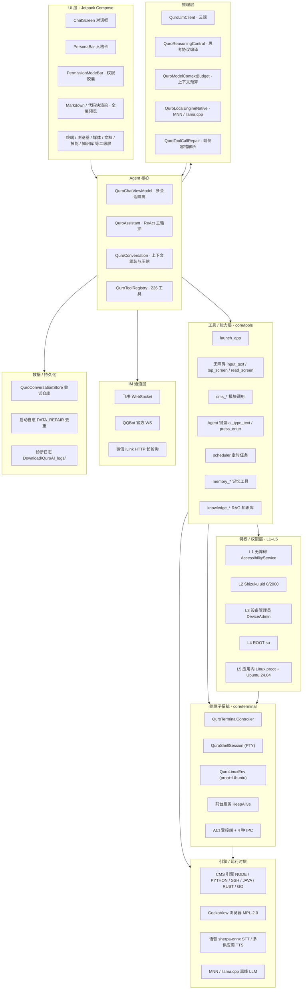

<div align="center">


# Zorv AI

### 运行在 Android 上的设备端 AI Agent · 智能体助手

*On-device AI Agent for Android — tools, personas, memory, an offline LLM engine, and a shared runtime, all on your phone.*

[](./LICENSE)
[](https://www.android.com)
[](https://github.com/Quor-a/ZorvAI/releases)
[](https://developer.android.com/about/versions/oreo)
[](https://developer.android.com)
[](https://developer.android.com/build)

**核心语言 / UI**

[](https://kotlinlang.org)
[](https://developer.android.com/compose)
[](https://developer.android.com/jetpack/androidx/releases/compose-material3)
[](https://mozilla.github.io/geckoview/)

**端侧运行时 / 脚本引擎**

[](https://www.python.org)
[](https://github.com/sebastienwae/quickjs-android)
[](https://react.dev)
[](https://developer.android.com/reference/android/webkit/WebView)

**离线 AI / 推理引擎**

[](https://github.com/alibaba/MNN)
[](https://github.com/ggml-org/llama.cpp)
[](https://github.com/k2-fsa/sherpa-ncnn)

**可视化 / 数据**

[](https://github.com/apache/echarts)
[](https://github.com/chartjs/Chart.js)
[](https://github.com/d3/d3)
[](https://github.com/mermaid-js/mermaid)
[](https://github.com/KaTeX/KaTeX)

**系统能力 / 平台通道**

[](https://github.com/RikkaApps/Shizuku)
[](https://github.com/proot-me/proot)
[](https://developer.android.com/jetpack/androidx/releases/room)
[](https://developer.android.com/topic/libraries/architecture/workmanager)
[](https://www.eclipse.org/jgit/)

</div>

> **包名**：`com.ai.assistance.quro` ｜ **技术栈**：Kotlin 2.3 + Jetpack Compose 1.10.2（Material3 1.4.0）｜ **AGP 8.13 / compileSdk 36 / minSdk 26 / targetSdk 34** ｜ **当前版本**：`1.1.1`（`versionCode 1001001`）
>
> Zorv AI 把「对话助手」做成一个真正能操作手机的 Agent：它在设备上运行，能用无障碍 / Shizuku / ROOT 等通道操控系统，调用 **220+ 内置工具**，运行 **MNN / llama.cpp 离线大模型**，内置终端与 Linux 沙箱、MCP、知识库、语音合成/识别，并通过飞书、QQ、微信与你保持在线。
>
> 它还是一套**可自我扩展的 Agent 运行时**：APK 级插件框架让「独立 APK」注册扩展点，就能给 AI 加**新工具 / 新 ACI 能力 / 新界面 / 新指令** —— 宿主不用改一行代码。

**📘 文档导航**：本文是**功能与架构总纲**。每个架构模块、每个功能模块各有一份完整技术文档，见 [文档索引](#文档索引--documentation-index)。

---

## 目录 · Table of Contents

- [项目简介 · What it does](#项目简介-what-it-does)
- [开源地址 · Open Source](#开源地址-open-source)
- [功能亮点 · Features](#功能亮点-features)
- [架构总纲 · Architecture](#架构总纲-architecture)
- [功能地图 · Feature Map](#功能地图-feature-map)
- [系统要求与从源码构建](#系统要求与从源码构建)
- [排查与故障处理 · Troubleshooting](#排查与故障处理-troubleshooting)
- [下载 / APK · Download](#下载-apk-download)
- [文档索引 · Documentation Index](#文档索引--documentation-index)
- [许可证 · License](#许可证-license)
- [贡献 / 反馈 / 关键词](#贡献-contributing)

---

## 项目简介 · What it does

大多数「手机 AI 助手」本质是云端聊天框 —— 把你的话发给服务器，再把回答渲染出来。Zorv AI 不一样：它把**推理**和**执行**都放在你这台手机上，目标是让 AI 真正成为能替你操作设备的「智能体」，而不只是会聊天的模型。

从全局看，Zorv AI 解决了三件事：

1. **让 AI 能动手**。内置 220+ 工具，覆盖读屏/点按、文件、通信、定时、终端、知识库等；更高权限的能力（Shizuku、设备管理员、ROOT、应用内 Linux）按 **L1–L5** 分级，**每一级都要你显式授权**，未授权即返回引导文案而非静默执行。
2. **让 AI 能离线**。MNN / llama.cpp 两个本地推理引擎编译进 APK，配合本地 STT、本地 TTS、本地 RAG 与应用内 Ubuntu 24.04 Linux 沙箱（proot），断网也能完成大部分任务。
3. **让 AI 能跨应用**。通过 **ACI**（Agent Capability Interface）—— 一套同设备、基于 AIDL Binder、无 Root 的本地协议 —— 任意 App 都能把自己暴露成「可被 AI 调用的能力」，由 Zorv AI 的 LLM 自动编排。

设计主线是 **Tool-first（一切皆工具）**：Agent 拥有的每一项能力都表达为一个 `QuroTool`（`name` / `description` / `parametersJson` / `run`），由 `QuroToolRegistry` 集中注册。LLM 只需看注册表就能发现并调用任意工具；新增能力 = 实现接口 + 一行注册，无需改任何接线代码。

---

## 开源地址 · Open Source

> **本项目完全开源，多平台托管** · GitHub：[github.com/Quor-a/ZorvAI](https://github.com/Quor-a/ZorvAI) ｜ Gitee：[gitee.com/ZorvAI/ZorvAI](https://gitee.com/ZorvAI/ZorvAI) ｜ GitLab：[jihulab.com/quor-a-group/ZorvAI](https://jihulab.com/quor-a-group/ZorvAI)
>
> **🔌 受控端浏览器（ZorvAI 浏览器）已独立开源** · GitHub：[github.com/Quor-a/ZorvBrowser](https://github.com/Quor-a/ZorvBrowser)
>
> **🤖 5 个官方 ACI 受控端 App（天气 / 文档 / 终端 / 构建 / 文件）已独立开源**，能力清单见 [设备控制 / ACI](./docs/features/device-control/README.md)。
>
> - 📦 最新 Release（免登录下载）：[github.com/Quor-a/ZorvAI/releases](https://github.com/Quor-a/ZorvAI/releases)
> - 🧩 ACI 核心库 AAR：随 Release 提供 `aci-core-release.aar`
> - 📖 ACI 开发者手册：[docs/ACI_DEVELOPER_GUIDE.md](./docs/ACI_DEVELOPER_GUIDE.md)
> - 🐛 问题反馈：[github.com/Quor-a/ZorvAI/issues](https://github.com/Quor-a/ZorvAI/issues)

---

## 功能亮点 · Features

| 能力域 | 关键能力 |
|--------|----------|
| **对话 UI（Compose）** | ChatScreen 对话框、PersonaBar 人格卡、PermissionModeBar（「AI 自动保存记忆」+「深度思考」并排胶囊）、对话框内 **IDE 能力入口**（代码编辑器 / 终端 / 工具箱 / 文件，经输入框「+」菜单与 `ui_open_*` 唤起）、**支持 7 种编程语言**、**```mermaid 围栏即画即渲染**、**AI 自写代码运行（`run_code`，html 网页工件内联预览）**、回到底部浮动按钮、全屏预览、Markdown 与代码块渲染 |
| **Agent 核心** | 多会话隔离（`liveBuffers`）、种子快照（`convBase`）、显示刷新闸门（`canUpdateDisplay`）、多轮 `[第N轮]` hidden 标记防串台、工具注册表（`QuroToolRegistry`，226 项）、技能系统（`QuroSkill` → 注册为 `skill__{name}` 工具） |
| **工具 / 能力层** | **220+ 内置工具**：无障碍 `input_text` / `tap_screen` / `read_screen`、文件读写、**L1–L5 特权执行**、`cms_*` 模块、Agent 键盘 `ai_type_text` / `ai_press_enter`、定时任务、记忆工具、知识库 RAG、文档处理 |
| **离线 LLM 引擎** | 内置 **MNN / llama.cpp** 本地推理（`QuroLocalEngineNative`），支持流式、`<think>` 思考段流式上屏、本地工具调用、会话常驻复用 |
| **特权层 L1–L5** | 无障碍 → Shizuku（uid 0/2000）→ 设备管理员 → ROOT（su）→ 应用内 Linux（proot + Ubuntu 24.04） |
| **终端 / Linux 沙箱** | 完整终端模拟器：proot + Ubuntu 24.04 ARM64 真实用户空间；PTY 伪终端（`/dev/ptmx` + `fork/exec`）；前台服务保活（specialUse，息屏/切 App 不被杀）；ACI 跨进程 12 个能力；4 种 IPC 接入（ContentProvider / Deep Link / Intent / BroadcastReceiver）；多会话管理 |
| **MCP** | MCP 客户端（WebSocket / HTTP 传输）、应用内本地 MCP 服务，可由 AI 部署/调用、**MCP-ACI 桥接** |
| **引擎 / 运行时** | CMS 引擎共享运行时（NODE / PYTHON / SSH / JAVA / RUST / GO）、CMS v2 模块、GeckoView 浏览器（MPL-2.0）、本地语音 STT / TTS |
| **IM 通道** | 飞书（WebSocket）/ QQBot（官方 WS）/ 微信 iLink（HTTP 长轮询 35s） |
| **语音** | 多供应商 TTS（EDGE_TTS / OPENAI_COMPAT / MINIMAX / SILICONFLOW / 阿里云 等）、端侧 Whisper STT（`sherpa-onnx`）、语音悬浮球 |
| **知识 / 记忆 / 人格 / Bot** | 向量语义 RAG 知识库、记忆库、人格/灵魂配置、多通道机器人（QQ / 飞书 / 微信 / 本地） |
| **可视化弹窗 & 询问** | **可视化弹窗**（`visual_popup` / `visual_custom_popup`）；**可视化询问**（`visual_question` / `visual_action`）：AI 遇到模糊命令或缺少信息时强制弹出选择题/输入框，禁止猜测 |
| **多语言运行器** | `QuroLanguageRunner`：对话框内 **7 种编程语言**（JavaScript、Python、HTML、JSON、CSS、XML、C/C++/Java）的检测、运行与渲染；**Python 3.14 原生引擎（PyEngine）**：端侧 CPython 3.14 + 完整标准库，配 Scripting 沙箱（`SandboxRuntime` + `HostApiDispatcher` + `GitHostApi` + `TsTranspiler`） |
| **生成式界面（三套并存）** | ① **Web 应用**（`miniapp`）：WebView 运行时（`MiniAppEngine` + `native.*` 原生桥）；② **生成式 UI 画布**（`genui_open`）：对话框内隔离 WebView 渲染；③ **内置 GenUI Agent**（`genui_agent_open`）：GenUI JSON DSL → 原生 Compose 组件（530+ 组件），独立全屏应用 |
| **可视化组件** | `ui_widget` 工具：**60+ 种可交互组件**直接融进聊天气泡，支持 `command` 语法触发动作；**动态 UI（```quro-ui 围栏）**：AI 写组合式 JSON DSL，原生渲染成体系的交互界面 |
| **可视化编程** | **Mermaid 图表离线渲染**：流程图 / 时序图 / 状态机 / 类图 / 思维导图，支持全屏预览、SVG 导出、五种主题 |
| **AIP 对话框文档排版** | **AIP 排版引擎**（AI Presentation Protocol）：AI 输出结构化信封（```aip 围栏 / `aip_compose` 工具），对话框原生渲染**长文档 / PPT 演示 / 思维导图**卡片；支持 doc↔deck↔mindmap 互转、导出 docx/pptx/md、全屏预览、演示放映、四级容错降级 |
| **APK 级插件框架** | 装一个 APK 就给 AI 加能力；**14 种扩展点**（工具 / ACI 能力 / 界面 / 指令 …），AI 可通过唯一工具 `apk_plugin` 直接操控插件 |
| **国际化** | **11 种界面语言**；AI 回复语言由统一注入器约束，覆盖主对话（云端 + 本地）、语音球、视频通话、GenUI Agent、IM 机器人、子智能体六条路径 |

---

## 架构总纲 · Architecture

### 分层视图


```mermaid
flowchart TB
    subgraph UI["UI 层 · Jetpack Compose"]
        A1["ChatScreen 对话框"]
        A2["PersonaBar 人格卡"]
        A3["PermissionModeBar · 权限胶囊"]
        A4["Markdown / 代码块渲染 · 全屏预览"]
        A5["终端 / 浏览器 / 媒体 / 文档 / 技能 / 知识库 等二级屏"]
    end
    subgraph CORE["Agent 核心"]
        B1["QuroChatViewModel · 多会话隔离"]
        B2["QuroAssistant · ReAct 主循环"]
        B3["QuroConversation · 上下文组装与压缩"]
        B4["QuroToolRegistry · 226 工具"]
    end
    subgraph INFER["推理层"]
        I1["QuroLlmClient · 云端"]
        I2["QuroReasoningControl · 思考协议编译"]
        I3["QuroModelContextBudget · 上下文预算"]
        I4["QuroLocalEngineNative · MNN / llama.cpp"]
        I5["QuroToolCallRepair · 端侧容错解析"]
    end
    subgraph TOOLS["工具 / 能力层 · core/tools"]
        C1["launch_app"]
        C2["无障碍 input_text / tap_screen / read_screen"]
        C3["cms_* 模块调用"]
        C4["Agent 键盘 ai_type_text / press_enter"]
        C5["scheduler 定时任务"]
        C6["memory_* 记忆工具"]
        C7["knowledge_* RAG 知识库"]
    end
    subgraph PRIV["特权 / 权限层 · L1–L5"]
        D1["L1 无障碍 AccessibilityService"]
        D2["L2 Shizuku uid 0/2000"]
        D3["L3 设备管理员 DeviceAdmin"]
        D4["L4 ROOT su"]
        D5["L5 应用内 Linux proot + Ubuntu 24.04"]
    end
    subgraph TERM["终端子系统 · core/terminal"]
        T1["QuroTerminalController"]
        T2["QuroShellSession (PTY)"]
        T3["QuroLinuxEnv (proot+Ubuntu)"]
        T4["前台服务 KeepAlive"]
        T5["ACI 受控端 + 4 种 IPC"]
    end
    subgraph ENGINE["引擎 / 运行时层"]
        E1["CMS 引擎 NODE / PYTHON / SSH / JAVA / RUST / GO"]
        E2["GeckoView 浏览器 MPL-2.0"]
        E3["语音 sherpa-onnx STT / 多供应商 TTS"]
        E4["MNN / llama.cpp 离线 LLM"]
    end
    subgraph IM["IM 通道层"]
        F1["飞书 WebSocket"]
        F2["QQBot 官方 WS"]
        F3["微信 iLink HTTP 长轮询"]
    end
    subgraph DATA["数据 / 持久化"]
        G1["QuroConversationStore 会话仓库"]
        G2["启动自愈 DATA_REPAIR 去重"]
        G3["诊断日志 Download/QuroAI_logs/"]
    end

    UI --> CORE
    CORE --> INFER
    INFER --> CORE
    CORE --> TOOLS
    TOOLS --> PRIV
    TOOLS --> TERM
    TOOLS --> ENGINE
    PRIV --> TERM
    TERM --> ENGINE
    CORE --> IM
    CORE --> DATA
```

数据流自上而下：UI 委托给 Agent 核心，核心调用推理层；推理层返回文本或工具调用，工具按合适的特权层级或引擎运行时执行；结果回流进上下文，直到模型给出最终答复。持久化与 IM 通道作为独立子系统并行存在。

### 各层职责

| 层 | 入口 | 职责 |
|----|------|------|
| **UI** | `ui/ChatScreen.kt` 等 | 渲染对话、气泡、思考卡、工具块、富组件；所有二级功能屏 |
| **Agent 核心** | `core/QuroAssistant.kt` | ReAct 主循环、轮次与死循环防护、上下文组装、工具调度、子智能体 |
| **推理** | `core/network/` | 云端请求与思考字段编译；端侧 MNN / llama.cpp 引擎；工具调用解析与上下文预算 |
| **工具** | `core/tools/` | 226 个工具的注册、发现、护栏、执行与失败回喂 |
| **特权** | `QuroPrivilegeManager` | L1–L5 分级升权，统一审计；未授权返回引导文案 |
| **终端** | `core/terminal/` | PTY 会话、proot Linux 环境、前台保活、ACI 与 4 种 IPC |
| **引擎** | `cms` / `browser` / `speech` / `llm` | 运行时供给、网页渲染、语音、离线推理 |
| **IM** | `im/` | 飞书 / QQ / 微信 三条通道 |

### 设计模式

- **Tool-first / Registry（一切皆工具）**：所有能力统一为 `QuroTool`，新增能力 = 实现接口 + 一行注册。
- **ReAct Loop（推理-行动循环）**：「LLM 思考 → 选工具 → 执行 → 观察 → 再思考」直到任务完成；工具结果以卡片回流对话。
- **Least-Privilege Tiers（最小特权分层）**：L1–L5 逐级升权，**未授权即返回引导文案而非静默执行**。
- **Strategy（引擎可替换）**：云端多供应商与本地 MNN / llama.cpp 共用一套 `onToken` 流式接口，离线/在线对上层透明。
- **SDUI（Server-Driven UI）**：ACI 控制台由受控端下发快照 JSON、控制端纯本地渲染，零网络依赖。

> 每层的完整技术架构（分层细节、关键类、时序、设计决策与踩坑）见 **[架构分文档](#架构文档-architecture-docs)**。

---

## 功能地图 · Feature Map

| 模块 | 一句话 | 完整文档 |
|------|--------|----------|
| **智能对话核心** | 消息流、流式输出、思考卡、附件、对话框 IDE、可视化弹窗/询问 | [chat](./docs/features/chat/README.md) |
| **内置技能 Skills** | 63 个内置技能，首次启动自动注入，可注册为 `skill__{name}` 工具供 AI 调用 | [skills](./docs/features/skills/README.md) |
| **MCP** | MCP 客户端 / 本地服务 / MCP-ACI 桥接 | [mcp](./docs/features/mcp/README.md) |
| **离线 LLM 引擎** | MNN / llama.cpp 端侧推理，模型导入、加载、常驻会话、本地工具调用 | [offline-llm](./docs/features/offline-llm/README.md) |
| **终端 & Linux 沙箱** | proot + Ubuntu 24.04 ARM64，多会话、SSH/VNC、息屏保活 | [terminal](./docs/features/terminal/README.md) |
| **语音 / 媒体 / 浏览器 / 文档** | 多供应商 TTS、端侧 Whisper STT、GeckoView 浏览器、文档处理 | [voice-media](./docs/features/voice-media/README.md) |
| **设备控制 / Shizuku / ACI** | L1–L5 特权层、ACI 受控端生态、ACI 控制台与 HTTP 传输 | [device-control](./docs/features/device-control/README.md) |
| **数字人 / 知识库 / 记忆 / 人格** | 3D 模型查看器（GLB/glTF）、向量 RAG、记忆库、人格配置、定时任务 | [digital-human](./docs/features/digital-human/README.md) |
| **APK 级插件框架** | 14 种扩展点，装 APK 即给 AI 加能力 | [extensibility](./docs/architecture/extensibility/README.md) |
| **国际化（11 语言）** | 字符串键体系、AI 回复语言注入、翻译流水线 | [i18n](./docs/architecture/i18n/README.md) |

---

## 系统要求与从源码构建

### 系统要求

- **Android 8.0+（API 26+）** 设备
- **开发机**：JDK **17+**（AGP 8.13 要求）、Android SDK（compileSdk 36 / minSdk 26 / targetSdk 34）、Gradle（用仓库自带 wrapper `./gradlew`）
- **离线引擎原生编译需要 NDK**（side-by-side）：用于编译 MNN / llama.cpp 原生库

### 构建命令

```bash
# 1. 克隆仓库
git clone https://github.com/Quor-a/ZorvAI
cd ZorvAI

# 2. 准备环境
#    - 安装 JDK 17+，并在 local.properties 配置 sdk.dir=/path/to/Android/Sdk
#    - 确保 Android SDK 中已安装 NDK

# 3. 构建 debug 包
./gradlew assembleDebug
#    产物：app/build/outputs/apk/*/debug/app-*-debug.apk

# 4. 构建 release 包（需自备签名配置）
./gradlew :app:assembleFullRelease
#    产物：app/build/outputs/apk/full/release/app-full-release.apk

# 清理
./gradlew clean
```

> 💡 Release 签名：`keystore.properties` 位于**项目根**（非 `app/`），alias `zorvai`。
>
> 💡 若 `./gradlew` 报「没有主清单属性 / 找不到主类」，是 `gradle-wrapper.jar` 的 MANIFEST 缺失 `Main-Class`，需修复 wrapper 后再构建。

---

## 排查与故障处理 · Troubleshooting

| 现象 | 说明 / 处理 |
|------|-------------|
| **构建耗时较长** | 首次构建需编译 MNN / llama.cpp 原生库，CPU 满载、落盘较少属正常；`app/.cxx` 缓存存在时增量构建很快。 |
| **`./gradlew` 无法启动** | wrapper jar 缺失 `Main-Class` 时需修复；或改用本机已安装的 Gradle 直接构建。 |
| **Shizuku 相关能力不可用** | 必须先打开 Shizuku App 并启动其服务 / 完成配对，再在 Zorv AI 中授权；Shizuku 未运行时 L2 通道不会启用。 |
| **ROOT 模式命令不执行** | ROOT 模式走 `sh -c` 执行，需确认设备已 root 且已授予 su 权限。 |
| **应用内 Linux（L5）无法运行** | 首次进入终端会提示「安装 Linux 环境」；`proot` 随包内置，仅 Ubuntu base rootfs 需联网下载（arm64 走 `ubuntu-ports`）。 |
| **终端息屏 / 切 App 后被杀** | 检查通知栏是否显示「Zorv AI 终端运行中」；Android 14+ 需要 `FOREGROUND_SERVICE_SPECIAL_USE` 权限。 |
| **离线对话不可用** | 离线 LLM 随发布包内置；若所用构建不含离线引擎原生库则会提示未接入。 |
| **网页 / HTML 预览不显示** | 确认已随包集成 GeckoView（MPL-2.0）运行时。 |
| **本地语音识别不可用** | 本地 STT 模型为约 85MB 的 onnx 文件，首次使用需下载 / 放置到指定目录。 |
| **会话出现重复或异常** | 启动自愈 `DATA_REPAIR` 会在启动时去重清洗，重启 App 即可。 |
| **需要诊断日志** | 日志写到手机公共目录 `Download/QuroAI_logs/`，无需 adb 即可取出。 |

---

## 下载 / APK · Download

[](https://github.com/Quor-a/ZorvAI/releases)

- 🟢 **[v1.1.1 Release](https://github.com/Quor-a/ZorvAI/releases)**（Release 签名，**最新**）
  - **云端上下文预算**：上下文预算不再「未知即 1M」。`/models` 未回填模型上下文长度时，旧逻辑把预算当成 1M → 上下文裁剪几乎永不触发 → 长对话/多工具轮直接上游 500。现按「接口实测值 → 模型名族表 → 保守回落 32768」三级取值。
  - **工具结果关键行保留**：截断不再整段丢弃中间部分。编译错误 / 堆栈 `Caused by` 恰在输出中间，旧逻辑只留头尾 → 模型看不到错误 → 反复盲重试。现从被丢弃段抽回关键行，并新增合计预算，超限时从最旧的工具结果开始削。
  - **归档诚实化**：截断文案不再承诺「完整日志见本机文件」（此前没有任何代码落盘，等于引导模型去找不存在的文件 → 编造内容）。现完整原文真实归档到 `filesDir/tool_outputs/`，文案给出真实路径。
  - **端侧工具调用容错解析**（上一版）：自研宽松 JSON 解析器，容忍裸键名 / 单引号 / 尾随逗号 / 缺闭合 / 全角标点，支持多标签族、`name(args)` 函数式写法与工具名纠错。
  - **端侧思考展示解耦**：「深度思考」开关只对云端生效，不再误剔除本地模型的思考过程。

完整历史版本见 [Releases](https://github.com/Quor-a/ZorvAI/releases)。

---

## 文档索引 · Documentation Index

### 架构文档（Architecture Docs）

| 模块 | 路径 |
|------|------|
| **端侧推理**（MNN / llama.cpp 分层 L0–L6） | [docs/architecture/inference-native/README.md](./docs/architecture/inference-native/README.md) |
| **云端推理**（思考协议 / 工具调用 / 上下文预算） | [docs/architecture/inference-cloud/README.md](./docs/architecture/inference-cloud/README.md) |
| **工具系统**（226 工具 / 注册表 / 护栏 / 回喂） | [docs/architecture/tool-system/README.md](./docs/architecture/tool-system/README.md) |
| **Agent 循环**（ReAct / 死循环防护 / 子智能体 / 压缩） | [docs/architecture/agent-loop/README.md](./docs/architecture/agent-loop/README.md) |
| **终端与 Linux 沙箱** | [docs/architecture/terminal-sandbox/README.md](./docs/architecture/terminal-sandbox/README.md) |
| **UI 与渲染**（AIP / ui_widget / quro-ui / GenUI / MiniApp） | [docs/architecture/ui-rendering/README.md](./docs/architecture/ui-rendering/README.md) |
| **国际化**（11 语言） | [docs/architecture/i18n/README.md](./docs/architecture/i18n/README.md) |
| **可扩展性**（插件框架 / ACI / MCP / Skills） | [docs/architecture/extensibility/README.md](./docs/architecture/extensibility/README.md) |

### 功能文档（Feature Docs）

| 模块 | 路径 |
|------|------|
| 智能对话核心 | [docs/features/chat/README.md](./docs/features/chat/README.md) |
| 内置技能 Skills | [docs/features/skills/README.md](./docs/features/skills/README.md) |
| MCP | [docs/features/mcp/README.md](./docs/features/mcp/README.md) |
| 离线 LLM 引擎 | [docs/features/offline-llm/README.md](./docs/features/offline-llm/README.md) |
| 终端 & Linux 沙箱 | [docs/features/terminal/README.md](./docs/features/terminal/README.md) |
| 语音 / 媒体 / 浏览器 / 文档 | [docs/features/voice-media/README.md](./docs/features/voice-media/README.md) |
| 设备控制 / Shizuku / ACI | [docs/features/device-control/README.md](./docs/features/device-control/README.md) |
| 数字人 / 知识库 / 记忆 / 人格 | [docs/features/digital-human/README.md](./docs/features/digital-human/README.md) |

### 其他既有文档

- [docs/ACI_DEVELOPER_GUIDE.md](./docs/ACI_DEVELOPER_GUIDE.md) · [docs/ACI_TECHNICAL_ARCHITECTURE.md](./docs/ACI_TECHNICAL_ARCHITECTURE.md)
- [docs/PLUGIN_DEV_GUIDE.md](./docs/PLUGIN_DEV_GUIDE.md) · [docs/TERMINAL_ARCHITECTURE.md](./docs/TERMINAL_ARCHITECTURE.md)
- [docs/architecture/云端推理思考与工具调用架构.md](./docs/architecture/云端推理思考与工具调用架构.md)（N1–N15 实施记录）
- [docs/architecture/本地推理引擎思考与工具调用架构.md](./docs/architecture/本地推理引擎思考与工具调用架构.md)

---

## 许可证 · License

Zorv AI 本应用源码以 **Apache-2.0** 许可证发布（见 [LICENSE](./LICENSE)）。

- **主许可**：Apache-2.0（应用全部源码）。
- **GeckoView（Mozilla）**：以 **MPL-2.0** 分发（file-level copyleft）。对应源代码随构建提供。
- **端侧 CPython 3.14（PyEngine / Scripting 沙箱）**：Python 解释器本体以 **PSF-2.0** 分发；随包链接的 OpenSSL（Apache-2.0）、SQLite（Public Domain）见 [NOTICE](./NOTICE)。
- **其余第三方依赖**（AndroidX / Jetpack Compose、Kotlin、OkHttp、Shizuku、QuickJS、Sherpa-NCNN、Chart.js / D3 / ECharts / KaTeX、React / Recharts / Lucide 等）各自保留原有许可证，完整清单见 [NOTICE](./NOTICE)。

> 本仓库仅就**实际随包分发**的组件声明其许可证义务；未随包分发的组件不产生额外的 Copyleft 义务。
> 仓库根目录下的 `DesktopFriends/` 为参考研究目录，**不参与 APK 构建、不随包分发**，故其许可证不构成本应用的发布义务。

---

## 贡献 · Contributing

欢迎各种贡献：核心功能开发、内置工具、CMS 模块、文档与翻译。

1. Fork 本仓库
2. 创建特性分支（`git checkout -b feature/xxx`）
3. 提交变更（`git commit -m 'feat: xxx'`）
4. 推送分支（`git push origin feature/xxx`）
5. 提交 Pull Request

## 问题反馈 · Feedback

遇到问题或有建议？欢迎 [提交 Issue](https://github.com/Quor-a/ZorvAI/issues)。请尽量提供：清晰描述、复现步骤、设备型号与系统版本、相关截图。

如果觉得项目不错，欢迎点个 ⭐ Star 支持我们！

## 关键词 · 便于搜索（SEO）

- **中文**：Zorv AI 开源、安卓 AI 助手 开源、Android AI 智能体、本地 AI 助手、设备端 AI Agent、手机 AI 助手、Kotlin Compose AI 聊天机器人、离线 AI 助手、语音 AI 助手、安卓自动化助手、AI 工具调用、飞书 QQ 微信 AI 机器人
- **English**：Zorv AI open source, Android AI assistant open source, on-device AI agent, local AI chatbot, Kotlin Jetpack Compose LLM, Android automation agent, voice AI assistant, TTS STT assistant, AI tool use, Feishu QQ WeChat AI bot

> 仓库主页：GitHub [github.com/Quor-a/ZorvAI](https://github.com/Quor-a/ZorvAI) ｜ Gitee [gitee.com/ZorvAI/ZorvAI](https://gitee.com/ZorvAI/ZorvAI) ｜ GitLab [jihulab.com/quor-a-group/ZorvAI](https://jihulab.com/quor-a-group/ZorvAI) ｜ 最新下载：[Releases](https://github.com/Quor-a/ZorvAI/releases)

---

<div align="center">

Made with ❤️ by the Zorv AI Team

</div>
