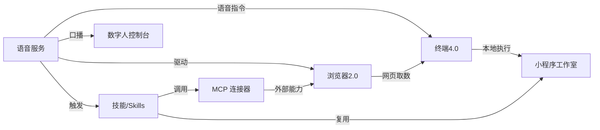

```mermaid
graph TB
  subgraph L5[集成层]
    A1[对话框内联渲染] --> A2[工具中心小程序面板]
    A2 --> A3[节点编辑器联动 / 分享导出]
  end
  subgraph L4[运行层]
    B1[MiniAppFramework Runtime] --> B2[app:// 协议解析]
    B2 --> B3[资源解析 data URI / 生命周期]
  end
  subgraph L3[编辑层]
    C1[小程序面板 新建/编辑/删除] --> C2[run 对话框预览]
    C2 --> C3[模板示例 / 快照状态]
  end
  subgraph L2[生成层]
    D1[AI 代码生成 HTML/JS] --> D2[安全化校验 防越界]
    D2 --> D3[writeFlow 工程写入]
  end
  subgraph L1[存储层]
    E1[小程序工程目录] --> E2[同目录资源 / 配置元数据]
  end
  subgraph L0[引擎层]
    F1[WebView / 内联渲染内核] --> F2[JS 执行沙箱]
  end
```

```mermaid
graph TB
  subgraph L6[服务层]
    A1[后台下载/推送] --> A2[保活常驻 / 跨设备同步]
  end
  subgraph L5[联动层]
    B1[语音驱动浏览] --> B2[技能/MCP 唤起]
    B2 --> B3[终端4.0 协同 / 对话框回显]
  end
  subgraph L4[安全层]
    C1[追踪/广告拦截] --> C2[权限管理 / 无痕 / 安全浏览]
  end
  subgraph L3[AI 层]
    D1[browser_act 动作引擎] --> D2[agent-browser 技能]
    D2 --> D3[页面理解 DOM/视觉 / 总结翻译 / 截图]
  end
  subgraph L2[界面层]
    E1[Compose 浏览器 UI] --> E2[标签条/工具栏 / 阅读模式 / 下载管理]
  end
  subgraph L1[核心层]
    F1[SessionManager 多标签] --> F2[Navigation / 历史书签 / Cookie]
  end
  subgraph L0[内核层]
    G1[GeckoView] --> G2[System WebView 兜底 / 网络栈]
  end
```

```mermaid
graph TB
  subgraph L5[集成层]
    A1[Agent Loop 动态调用] --> A2[expert-manager / Connector 桥接]
  end
  subgraph L4[绑定层]
    B1[Skill 工具装载] --> B2[上下文注入 / 反思修正]
  end
  subgraph L3[审计层]
    C1[skills-security-check] --> C2[P0/P1/P2 定级 / 用户确认闸门]
  end
  subgraph L2[管理层]
    D1[SkillManage 建改删列] --> D2[marketplace 安装器]
    D2 --> D3[用户级/项目级落盘]
  end
  subgraph L1[发现层]
    E1[find-skills 检索] --> E2[recommend-connectors / 市场仓库URL源]
  end
  subgraph L0[包体层]
    F1[SKILL.md] --> F2[scripts/references/assets / agent_created]
  end
```

```mermaid
graph TB
  subgraph L6[呈现层]
    A1[3D 虚拟形象 角色卡] --> A2[口型/表情同步 / 对话播报]
  end
  subgraph L5[联动层]
    B1[语音指令→terminal_exec] --> B2[技能/MCP 触发 / QuroAssistant 编排]
  end
  subgraph L4[合成层]
    C1[LatticeTTS 7.5M] --> C2[音色/韵律 / 流式 TTS]
  end
  subgraph L3[理解层]
    D1[NLU 意图识别] --> D2[LLM 应答 / 上下文记忆]
  end
  subgraph L2[识别层]
    E1[LatticeASR 7.2M] --> E2[VAD 端点 / 流式 ASR]
  end
  subgraph L1[前端]
    F1[AudioRecord 采集] --> F2[降噪/AGC / 唤醒词 / AudioTrack 播放]
  end
  subgraph L0[守护]
    G1[语音服务后台] --> G2[唤醒监听 / 保活权限]
  end
```

# ZorvAI 技术构架总览

> 一份文档汇总 ZorvAI 全栈技术构架。每个模块均包含 **构架介绍** + **分层技术构架（Mermaid 图）** + **核心组件表** + **关键流程** + **跨模块联动**。
> 品牌：ZorvAI ｜ 包名：`com.ai.assistance.quro` ｜ 终端引擎模块：`terminal-core`

---

## 目录

- [一、终端 4.0](#一终端-40)
- [二、终端 3.0](#二终端-30)
- [三、小程序工作室](#三小程序工作室)
- [四、浏览器 2.0](#四浏览器-20)
- [五、插件 Skills](#五插件-skills)
- [六、技能 Skills](#六技能-skills)
- [七、MCP](#七-mcp)
- [八、语音服务](#八语音服务)
- [九、模块联动总图](#九模块联动总图)

---

## 一、终端 4.0

### 构架介绍
终端 4.0 是 ZorvAI 内置的「开箱即用」Linux 终端引擎，直接继承并去品牌化移植自 **OperitTerminal v1.2**：把 **64MB 完整 Ubuntu rootfs** 作为 `assets` 打包进 APK，`TerminalManager.extractAssets()` 直接从 `context.assets.open` 解压，首启即拥有完整发行版，彻底取代旧方案「ubuntu-base 微镜像 + 运行时 apt-get 下载」的脆弱链路。

- **Native 软链而非拷贝**：proot / loader / bash / busybox / sudo 五个预编译 `.so` 经 Java NIO `Files.createSymbolicLink` 软链进 `binDir`。
- **Provider 抽象**：本地 proot Ubuntu 与远程 SSH 终端统一在 `TerminalProvider` 接口之后。
- **AI 双向接入**：AI 的 `terminal_exec` / `terminal_write` 与用户手敲命令走同一条 `TerminalManager → LocalTerminalProvider → Pty` 管线。

### 分层技术构架


### 核心组件
| 组件 | 职责 | 关键方法 / 文件 |
|---|---|---|
| TerminalManager | 环境总控 | `initializeEnvironment()` / `linkNativeLibs()` / `extractAssets()` |
| SessionManager | 多会话生命周期 | `createNewSession()` / `switchToSession()` |
| Pty | JNI 封装 pty | `pty.c` → `libpty.so` |
| LocalTerminalProvider | 拉起 proot Ubuntu | `startSession()` / `resolve_proot_runtime()` |
| QuroTerminalBridge | AI 命令总线 | `QuroToolsTerminal` / `QuroTerminalTool` |
| UbuntuDocumentsProvider | 系统文件管理器访问 rootfs | Manifest 注册 |

### 关键流程
1. **首启初始化**：`initializeEnvironment()` → 建目录 → `linkNativeLibs()` 软链 native → `extractAssets()` 解压 rootfs → `generateStartScript()` 写 `common.sh` → 首条命令触发 `install_ubuntu()` 解压并写 `.operit_installed_ok`。
2. **命令执行（用户/AI 通用）**：输入 / `terminal_exec` → `QuroTerminalBridge` → `SessionManager` 取会话 → `LocalTerminalProvider` 拉起 proot → 经 pty 回显 → `OutputProcessor` + ANSI 模拟器渲染。

---

## 二、终端 3.0

### 构架介绍
终端 3.0 是终端 4.0 的**前代原生终端栈**：UI 侧复用 Termux 式 **VT 终端模拟器**（`QuroTerminalPane`），环境侧依赖「ubuntu-base 微镜像 + 运行时 apt-get 下载」的 proot 方案，经 `QuroTerminalController` / `QuroTerminalBridge` 打通 AI `terminal_exec`。

该方案「能用但脆弱」：首启需联网从 apt 源下载补全工具链，受源可用性 / 网络 / 架构兼容影响，易失败、启动慢——这正是终端 4.0 用「完整 rootfs 打包 assets、开箱即用」取代它的原因。VT 渲染、AI 接入、保活/特权桥等成熟控制面被保留并复用。

### 分层技术构架
```mermaid
graph TB
  subgraph L6[UI 层]
    A1[novaterm TerminalScreen/ViewModel] --> A2[QuroTerminalPane]
    A2 --> A3[QuroTerminalInputView / TerminalScreen(vt)]
  end
  subgraph L5[接入层]
    B1[QuroTerminalBridge] --> B2[QuroToolsTerminal / Drive]
    B2 --> B3[QuroTerminalTool / ChatScreen 面板]
  end
  subgraph L4[服务层]
    C1[KeepAliveService] --> C2[QuroTerminalAciService]
    C2 --> C3[BootReceiver / Reaper / Sentinel]
  end
  subgraph L3[控制层]
    D1[QuroTerminalController] --> D2[SessionManager]
    D2 --> D3[History / Prefs]
  end
  subgraph L2[环境层]
    E1[QuroLinuxEnv ubuntu-base+apt] --> E2[QuroTerminalJNI pty]
    E2 --> E3[PrivilegeBridge / CmsTerminalRuntime]
  end
  subgraph L1[渲染层]
    F1[VT Emulator] --> F2[TerminalKeys / Mouse / Snapshot]
  end
  subgraph L0[原生层]
    G1[proot libproot-loader] --> G2[ubuntu-base 微镜像 apt下载]
    G2 --> G3[pty JNI]
  end
```

### 核心组件
| 组件 | 职责 | 文件 |
|---|---|---|
| QuroTerminalPane | VT 终端渲染主体 | `terminal/vt/QuroTerminalPane.kt` |
| QuroTerminalController | 会话与命令调度 | `core/terminal/QuroTerminalController.kt` |
| QuroLinuxEnv | proot + ubuntu-base（apt 补全） | `core/linux/QuroLinuxEnv.kt` |
| QuroTerminalBridge | AI terminal_exec 总线 | `core/terminal/QuroTerminalBridge.kt` |
| QuroTerminalKeepAliveService | 常驻保活 | `service/QuroTerminalKeepAliveService.kt` |
| QuroTerminalPrivilegeBridge | ROOT/LSPosed/ADB/Shizuku 桥 | `core/privilege/QuroTerminalPrivilegeBridge.kt` |

### 与终端 4.0 的关系
- 终端 3.0：ubuntu-base + apt（联网脆弱）
- 终端 4.0：完整 rootfs 打包 assets（开箱即用）
- 演进：`QuroLinuxEnv` 的 apt 方案被 `terminal-core` 的 `TerminalManager` 取代；VT 渲染与 AI 接入层保留，UI 侧另叠加 Compose `TerminalScreen`。

---

## 三、小程序工作室

### 构架介绍
小程序工作室是 ZorvAI 内「AI 生成即可运行」的可视化小程序工作台，核心是 **MiniAppFramework**：把 LLM 产出的 HTML/JS 在应用内渲染容器中沙箱运行，支持同目录资源（图片自动转 `data URI`）、私有 `app://` 协议、对话框内联预览与独立面板编辑。用户/AI 可在面板新建、编辑、运行小程序，无需打包上架。

- **内联渲染**：HTML/JS 跑在应用内 WebView/内联容器，免安装、即写即跑。
- **资源自包含**：同目录图片预览时转 `data URI`，与面板内 `app://` 渲染一致。
- **安全写入**：工程名/路径安全化，防止 `..` 越界写入 studio 目录外。

### 分层技术构架


### 核心组件
| 组件 | 职责 | 说明 |
|---|---|---|
| MiniAppFramework | 小程序运行内核 | 内联渲染 HTML/JS、沙箱隔离 |
| 小程序面板 | 可视化编辑入口 | 新建示例、编辑、删除、运行 |
| run 对话框预览 | 对话框内联运行 | 同目录图片转 data URI，与 app:// 一致 |
| app:// 协议 | 私有资源寻址 | 面板内资源定位，与预览同源 |
| writeFlow | 工程写入 | 工程名/路径防 `..` 越界 |

### 关键流程
用户/AI「新建示例」→ AI 生成 HTML/JS → 安全化校验 → `writeFlow` 落盘 studio 目录 → MiniAppFramework 内联渲染（图片转 data URI）→ 面板/对话框运行 → 导出/分享。

---

## 四、浏览器 2.0

### 构架介绍
浏览器 2.0 是 ZorvAI 内置的新一代 AI 浏览器：以 **GeckoView**（Mozilla 开源引擎，独立于系统 WebView、版本可控）为内核，叠加「AI 理解 + 自动化操作」能力，让浏览器从「看网页」升级为「替用户办事」的 Agent 入口。脱胎于项目内 TitaniumBrowser 参考实现，对接 `agent-browser` 技能与 `browser_act` 动作引擎。

- **双内核兜底**：主力 GeckoView，低端机/受限环境回退系统 WebView。
- **AI 原生**：页面 DOM/视觉双通道理解，配合 LLM 做总结、抽取、决策。
- **自动化闭环**：`browser_act` 把「打开→定位→操作→取数」串成可重放动作流。

### 分层技术构架


### 核心组件
| 组件 | 职责 | 说明 |
|---|---|---|
| GeckoView | 渲染内核 | 官方仓库 `maven.mozilla.org`，独立于系统 WebView |
| SessionManager | 多标签会话 | 每标签一个 GeckoSession |
| browser_act | 自动化动作引擎 | open/click/fill/extract/screenshot |
| agent-browser | 浏览器操控技能 | 自然语言 → browser_act 动作流 |
| 页面理解 | DOM+视觉双通道 | 抽取可交互元素供 AI 决策 |

### 关键流程
语音/对话框指令 → 打开目标页（GeckoView Session）→ 页面理解抽取元素+截图 → LLM 规划 browser_act 动作序列 → agent-browser 回放（视觉纠偏）→ 结果页抽取总结 → 联动终端4.0 做本地处理。

---

## 五、插件 Skills

### 构架介绍
插件 Skills 是 Skills 体系中「可分发、可安装」的扩展形态。相对**内置技能**（随平台发布、默认可信），插件技能来自**市场 / 外部仓库 / URL**，以 `SKILL.md` + `scripts/` + `references/` + `assets/` 打包，经 `find-skills` 发现、`skills-security-check` 审计、`SkillManage` 安装后，与主理人运行时动态绑定。

它让 ZorvAI 的能力像插件一样热插拔扩展，并可与 **MCP 连接器桥接**（connector-bridged skills），把外部服务封装成「会自己调工具的技能」。所有安装动作强制走安全审计，按 P0/P1/P2 定级，P0 须用户显式确认。

### 分层技术构架


### 核心组件
| 组件 | 职责 | 关键点 |
|---|---|---|
| SKILL.md | 插件定义文件 | frontmatter 声明名称/描述/触发词 |
| find-skills | 发现可安装插件 | 能力缺口时首调 |
| skills-security-check | 安装前审计 | 输出 P0/P1/P2，P0 须确认 |
| SkillManage | 安装/修改/删除 | 用户级优先 |
| marketplace 安装器 | 市场安装 | 一句话检索并安装 |
| Connector 桥接 | 内嵌 MCP 调用 | 外部服务封装为技能 |

### 安装生命周期
发现（find-skills）→ 获取（download/import/URL）→ 审计（skills-security-check）→ 确认（P0 需用户确认）→ 落盘（SkillManage 写入用户级/项目级）→ 装载（命中触发词注入执行，可桥接外部能力）。

---

## 六、技能 Skills

### 构架介绍
技能（Skill）是 WorkBuddy / ZorvAI 的「可复用专业能力包」：一段结构化的 `SKILL.md` + 可选的 `scripts/`、`references/`、`assets/`，在需要时由 Skill 工具加载进上下文，赋予主理人领域知识与标准化工作流。当前可见 100+ 专家/技能。

- **两级作用域**：用户级 `~/.workbuddy/skills/`（跨项目）与项目级 `{workspace}/.workbuddy/skills/`（团队）。
- **安装即审计**：任何安装/导入须先过 `skills-security-check`，P0/P1/P2 定级。
- **积累即沉淀**：完成多步任务或修正 tricky 错误后，用 `SkillManage` 回写为新技能。

### 分层技术构架
```mermaid
graph TB
  subgraph L5[集成层]
    A1[Agent Loop] --> A2[expert-manager / 域技能]
  end
  subgraph L4[执行层]
    B1[Skill 工具调用] --> B2[命令路由 / 反思修正]
  end
  subgraph L3[发现层]
    C1[find-skills] --> C2[recommend-connectors / marketplace]
  end
  subgraph L2[加载层]
    D1[Skill 注册表] --> D2[SkillManage / skills-security-check]
  end
  subgraph L1[定义层]
    E1[SKILL.md] --> E2[scripts/references/assets / agent_created]
  end
  subgraph L0[存储层]
    F1[用户级 ~/.workbuddy/skills] --> F2[项目级 {workspace}/.workbuddy/skills]
  end
```

### 生命周期
发现 → 安装（过审计）→ 加载（注入上下文）→ 执行 → 反思（修正 SKILL.md）→ 沉淀（回写为新技能）。

---

## 七、MCP

### 构架介绍
**MCP（Model Context Protocol，模型上下文协议）** 是一套开放标准，让 AI 应用以统一方式接入外部工具、资源与数据源。ZorvAI 通过 **MCP 服务器**把「第三方能力」变成可调用的工具（`mcp__<server>__<tool>`），无需把每种集成写死进代码。

- **配置即接入**：所有服务器集中于 `~/.workbuddy/mcp.json` 的 `mcpServers`。
- **信任即启用**：写入配置后须到连接器管理页面对新服务器点「信任」才生效。
- **三种传输**：stdio（本地进程）、SSE / Streamable HTTP（远程）。

### 分层技术构架


```mermaid
graph TB
  subgraph L5[业务层]
    A1[Agent Loop 调用 mcp 工具] --> A2[飞书/Git/云盘 业务流 / 浏览器自动化]
  end
  subgraph L4[集成层]
    B1[连接器管理页] --> B2[信任启用闸门 / recommend-connectors]
  end
  subgraph L3[客户端]
    C1[WorkBuddy MCP Client] --> C2[tools/list / tools/call]
  end
  subgraph L2[协议层]
    D1[JSON-RPC 2.0] --> D2[initialize / resources / prompts]
  end
  subgraph L1[传输层]
    E1[stdio] --> E2[SSE / Streamable HTTP / 鉴权]
  end
  subgraph L0[服务层]
    F1[MCP Server command/args] --> F2[MCP Server url / mcp.json]
  end
```

### 接入流程
查官方文档取准确参数 → 读/合并 `mcp.json` → 写入 `mcpServers` → 到连接器管理页「信任」启用 → Agent Loop 经 `tools/list` 发现、`tools/call` 执行。

---

## 八、语音服务

### 构架介绍
语音服务是 ZorvAI 数字人控制台的自然交互底座：用户用说话代替打字，AI 用语音代替文本，配合 3D 虚拟形象形成「听—想—说—演」闭环。脱胎于 OpenClaw AI Engine 的 **LatticeASR / LatticeTTS** 轻量自研模型（合计约 14.7M 参数），可端侧离线运行。

- **离线优先**：ASR/TTS 本地推理，弱网/无网可用。
- **流式流水线**：采集、VAD、识别、合成均支持流式，降低延迟。
- **数字人联动**：合成音频的韵律信号同步驱动 3D 形象口型与表情。

### 分层技术构架


### 关键流程
唤醒（Wake-word 命中）→ 采集（AudioRecord + VAD 切句）→ 识别（LatticeASR 流式）→ LLM 生成 → 合成（LatticeTTS 流式，韵律驱动数字人）→ 播放/演绎 → 指令类语句路由到 terminal_exec / 技能 / MCP。

---

## 九、模块联动总图



> 浏览器 2.0 是「行动入口」，终端 4.0 是「执行底座」，技能/Skills 与 MCP 是「能力扩展面」，语音服务是「输入/输出总线」，小程序工作室是「轻量可编程面」，数字人控制台是「拟人呈现终端」。

---

*文档由 ZorvAI 架构梳理生成，对应 `docs/architecture/` 下各独立 HTML 构架文档。*
