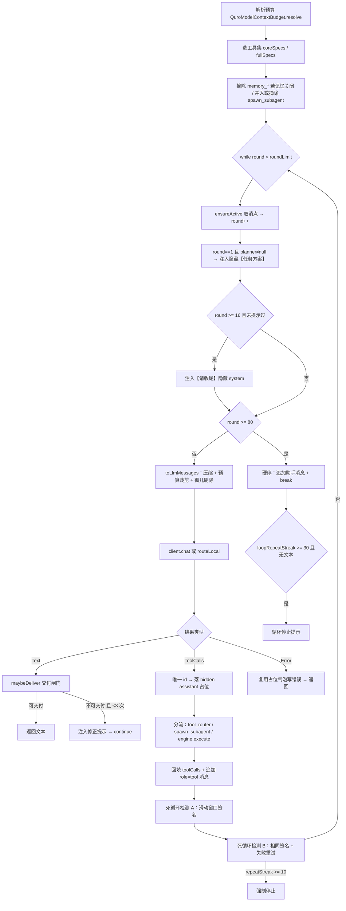

# Agent 循环架构

ZorvAI 的 ReAct 主循环：轮次控制、死循环制动、子智能体、交付闸门、上下文预算与压缩。

盘点时间 2026-10-01。所有类名 / 常量 / 数值均已对照源码核实（行号随版本可能漂移，以类名为准）。

---

## 1. 职责边界

**负责：**

- `while (round < roundLimit)` 的 ReAct 主循环：LLM → tool_calls → 执行 → 回灌 → 再问
- 轮次上限、两套死循环检测、收尾提示与硬停
- 子智能体派发（隔离上下文、工具白名单、限轮数）
- 长程任务编排的两个可注入点：`TaskPlanner`（首轮策划）与 `DeliverabilityJudge`（交付闸门）
- 上下文预算解析与工具结果压缩 / 归档的**接线**（算法本身在 `QuroConversation` 与 `QuroModelContextBudget`）

**不负责：**

- 单个工具怎么跑、失败怎么重试 —— 见 `../tool-system/README.md`
- `tools` 数组的 JSON 拼装与上游协议 —— `QuroLlmClient`
- 思考参数的请求侧编译 —— `QuroReasoningControl`（见 `../云端推理思考与工具调用架构.md`）

---

## 2. 关键类与文件

| 文件路径 | 职责 |
|---|---|
| `core/QuroAssistant.kt` | 主循环 `ask()`、死循环检测、`runSubAgent`、`toolOutputArchiver`、`compactForLocal` |
| `core/QuroConversation.kt` | `compactToolResults` / `truncateToolResult` / `extractKeyLines` / `pruneOrphanToolMessages` / `attachToolNames` / `QuroConversationStore` |
| `core/network/QuroModelContextBudget.kt` | 上下文预算三级解析（接口值 → 模型名族 → 保守回落） |
| `core/agent/orchestration/TaskPlanner.kt` | `fun interface TaskPlanner { suspend fun plan(brief, context): TaskPlan }` |
| `core/agent/orchestration/DeliverabilityJudge.kt` | `DeliverabilityJudge` / `AlwaysDeliverable` / `HeuristicDeliverabilityJudge` |
| `core/agent/orchestration/OrchestrationTrace.kt` | 编排阶段轨迹（strategize / execute / deliver） |
| `core/agent/QuroAgentTrace.kt` | 执行轨迹总线（thought / action / result / status） |
| `core/tools/QuroToolEngine.kt`→实际在 `core/tools/QuroTool.kt:334` | 工具执行（本循环的唯一调用点） |

---

## 3. 数据流 / 控制流



单轮关键顺序（**不可调换**）：① `ensureActive()` —— 用户点「停止生成」后下一轮立即抛 `CancellationException`，避免卡死在「思考中」；② `toLlmMessages` 组装上下文（压缩与裁剪在**请求前**，每轮重算，归档器因此必须幂等）；③ 发请求，`CancellationException` **原样上抛**、绝不包成「请求失败」假错误；④ `Text` 分支先过交付闸门，不可交付则注入 `nudge` 后 `continue`；⑤ `ToolCalls` 分支先落 `hidden` assistant 占位（UI 立即显示进度），再执行，最后回填。

---

## 4. 关键设计决策

### 4.1 轮次上限：不靠「低轮次封顶」防死循环

```kotlin
val roundLimit = if (isLocal) 12 else if (cfg.maxToolRounds in 1..2000) cfg.maxToolRounds else 2000
```

| 路径 | 上限 |
|---|---|
| 本地（MNN / LLAMA_CPP） | **12** |
| 云端，`cfg.maxToolRounds` 在 1..2000 | `cfg.maxToolRounds` |
| 云端，其它（含默认 0） | **2000** |

`QuroModelConfig.maxToolRounds` 默认值为 `0`（注释：0 = 不限制，ReAct 循环持续到模型给出最终答复）。

**为什么不设小上限**：连续多轮只发工具调用、不出文本，是 AI 修 bug 的**常态**，不是卡死。低轮次封顶会直接腰斩合法长任务。真正的防御是下方的两套精确检测。

**本地为什么是 12**：1.2B~3B 小模型在「无上限历史」下极易把较早轮次当成当前指令回放 / 续写（乱恢复）。根因不在 KV 残留（原生层每轮已 `llm->reset()` 并从完整 history 重新 prefill），而在喂给小模型的上下文过长且无界。12 轮足够覆盖正常多轮。

### 4.2 死循环检测 A：滑动窗口签名（`LOOP_WINDOW = 16`）

```kotlin
val sig = result.calls.joinToString("|") { "${it.name}:${it.arguments}" }
val hitWindow = recentSigs.contains(sig)
if (hitWindow) loopRepeatStreak++ else { loopRepeatStreak = 0; loopSegmentHadText = false; recentSigs.add(sig); if (recentSigs.size > LOOP_WINDOW) recentSigs.removeAt(0) }
```

签名 = 本轮全部 `tool_calls` 的 `name:arguments` 拼接。
- **命中窗口内已有签名** = 原地打转 → 计数累加；
- **新签名** = 合法探索 → 计数归零，签名入窗口（超过 16 个淘汰最旧）。

循环外判停：`loopRepeatStreak >= 30 && !loopSegmentHadText` —— 连续 30 轮原地打转且全程没产出最终文本，才确认真·死循环。

**为什么放在循环外**：只有真正跑完 `roundLimit` 才需要这个兜底；`loopSegmentHadText` 记录当前潜在循环段内是否产出过文本，避免把「边探索边小结」的任务误杀。

### 4.3 死循环检测 B：相同签名 + 失败重试

与 A 并行，判据更窄：`sig == prevCallSig`（**严格等于上一轮**，而非窗口内出现过）且 `results.any { toolResultLooksFailed(it.result) }`。

- **成功的重复调用完全不干预**（连计数都不累积）—— 批量 `input_text` 逐字输入、连续 `tap_screen` 都是合法的。
- 真正需要干预的是：调用重复**且**结果呈现失败特征 → 说明调用未生效、模型在盲目重试。
- 首次命中注入一条 hidden system 提示；同一签名只提示一次（`warnedForSig`），避免污染上下文。
- `repeatStreak >= 10` 才强制停止并落助手消息。

`toolResultLooksFailed` 是**高置信判定**：先看明确成功信号（"成功"/`"ok"`/`"success"`/`done`）→ 直接不算失败；再匹配强失败短语（`"error:"`/`Traceback`/`http 5`/`no such file`…）；最后仅当结果 ≤200 字时才接受裸「失败/错误/异常/超时」整词。**踩过的坑**：用裸子串匹配会把「正文里恰好提到这些字样」的成功结果误判为失败，进而误灌「停止重试」提示、打断正常调用。

### 4.4 收尾提示与硬停

| 阈值 | 行为 |
|---|---|
| `round >= 16` | 注入一次 hidden system：「请基于已有结果直接给出最终结论，不要再发起新的工具调用」（`concludedNudgeInjected` 保证只注入一次） |
| `round >= 80` | 追加可见助手消息「（已自动停止：连续执行的工具调用过多…）」并 `break` |

**为什么需要 16 这一档**：终端 / 排查类任务下，模型会反复发起**全新**的探测命令（签名各不相同），检测 A 的计数持续归零 —— 跑到 2000 轮都不停，对话框持续重复「测试终端」式文本。`round >= 16` 是补这个盲区的软引导；`round >= 80` 是硬闸。

### 4.5 子智能体：隔离 + 白名单 + 限轮

```kotlin
private val SUBAGENT_SAFE_TOOLS = setOf( /* 21 个只读 / 检索 / 计算工具 */ )
const val SUBAGENT_TOOL_NAME = "spawn_subagent"
```

| 约束 | 值 |
|---|---|
| 最大轮数 | `maxRounds = 6`（`runSubAgent` 内 `for (round in 0 until 6)`） |
| 工具集 | `registry.coreSpecs().filter { it.name in SUBAGENT_SAFE_TOOLS }` |
| 上下文 | 独立 `QuroConversationStore`，不污染主会话 |
| 递归 | 白名单内不含 `spawn_subagent`，且下发时已摘除 |
| 越权 | 白名单外的调用返回 `子智能体无权使用该工具：<name>` |

白名单内容：`get_current_time`、`calculate`、`get_device_info`、`get_battery`、`get_network_info`、`get_wifi_info`、`web_search`、`read_url`、`http_request`、`knowledge_search`、`knowledge_rag_search`、`memory_search`、`read_text_file`、`browse_files`、`list_files`、`file_read`、`file_info`、`find_files`、`github_search`、`github_read`、`crossref_search`。

**本地不派发**：`subAgentEnabled && !isLocal` 才并入下发列表（本地小模型不适用）。

**⚠️ 已修的坑**：子智能体路径 `subStore.toLlmMessages(system, 0, 0)` 传 `contextWindow = 0` 会走「完全不设防」分支（`ceiling = MODEL_MAX_INPUT_TOKENS`，即 1M）。现在 `toLlmMessages` 对 `contextWindow <= 0` 一律按 `CONSERVATIVE_INPUT_TOKENS` 兜底。

### 4.6 交付闸门（默认关闭）

```kotlin
var taskPlanner: TaskPlanner? = null
var deliverabilityJudge: DeliverabilityJudge? = null
var deliverAttempts = 0
```

两者为 `null` 时保持旧行为（LLM 返回文本即终态交付）。启用后：首轮 `taskPlanner.plan(brief, "")` 生成「策划 / 规划 / 设计方案 / 执行步骤」作为 **hidden system** 注入；每个 `Text` 结果过 `maybeDeliver` —— `Deliverable` 返回，`NotDeliverable` 则 `deliverAttempts++`，**`>= 3` 强制放行**（避免长程任务陷入死循环），否则注入修正提示后 `continue`。

`HeuristicDeliverabilityJudge` 的 `BAD` 列表：`工具执行失败` / `工具执行异常` / `工具执行超时` / `未知工具` / `需要权限`；空产物或 `"(已思考完毕)"` 也判不可交付。

### 4.7 上下文预算：绝不把「未知」当成 1M

```kotlin
val ctxBudget = QuroModelContextBudget.resolve(
    modelName = cfg.model, provider = cfg.provider,
    apiContextLength = cfg.modelContextLength, userContextWindow = cfg.contextWindow,
)
```

三级取值：① `/models` 实测值（`>= 1024` 才采信）→ ② 模型名族前缀表 → ③ provider 兜底 → ④ **保守回落 32768**。

| 常量 | 值 | 语义 |
|---|---|---|
| `QuroModelContextBudget.ABSOLUTE_MAX_INPUT_TOKENS` | `1_048_576` | 绝对天花板，只用于**向上钳制** |
| `QuroModelContextBudget.CONSERVATIVE_INPUT_TOKENS` | `32_768` | 未知时的兜底预算 |
| `MODEL_MAX_INPUT_TOKENS`（`QuroConversation.kt:62`） | `= ABSOLUTE_MAX_INPUT_TOKENS` | 同上 |

**踩过的坑**：改造前 `hardMax = if (modelContextLength > 0) 它 else 1048576`。大量第三方中转不返回 `context_length` → 预算被当成 1M → 裁剪几乎永不触发 → 而真实上限可能只有 32K → 上游 `400/500 context length exceeded`。这个「安全网」恰在它最该生效的场景里等于不存在。

族表按「先具体后宽泛」排序（`gpt-4.1` 必须在 `gpt-4` 之前），且 ≤3 字符的短关键字（`o1`/`o3`/`glm`）必须落在**词边界**上 —— 否则 `o1` 会命中 `foo1-bar`，把预算**猜大**，而猜大正是触发上游超限的那个方向。

### 4.8 工具结果压缩：头 + 关键行 + 尾

```kotlin
internal const val TOOL_RESULT_CAP = 1600            // 单条上限
internal const val TOOL_RESULTS_TOTAL_CAP = 24_000   // 合计预算
private const val TOOL_RESULT_CAP_TIGHT = 400        // 二次激进截断的单条上限
private const val KEY_LINE_SCAN_LIMIT = 2_000_000
private const val KEY_LINE_MAX_SOURCE = 2_000
```

两阶段：① 单条超 1600 → `truncateToolResult`（头 40% + 关键行 + 尾 60%）；② 合计仍超 24000 → **从最旧开始**二次激进截到 400。

**为什么必须有「关键行」**：编译错误、堆栈 `Caused by`、`FAILED` 常出现在输出的**中间**，纯头尾保留恰好把它们整段丢掉 → 模型看不到错误 → 反复盲重试。`extractKeyLines(dropped, maxLines = 12, maxChars = 600)` 从被丢弃的中间段按中英双语词表捞回，去重、保序、跳过超长单行（避免把整行 minified JS 当错误行）。

### 4.9 归档必须「真落盘」

`toolOutputArchiver(context)` 把完整原文写入 `filesDir/tool_outputs/tool_<摘要>.txt`：**原子写**（先 `.tmp` 再 `renameTo`，进程中途被杀不留半截）、**幂等**（文件名取内容 MD5 前 8 位 —— 每轮上下文组装都会重新压缩同一批结果，不幂等会迅速堆满）、**容量** `TOOL_ARCHIVE_KEEP = 60`（超出按最后修改时间淘汰最旧）。

**踩过的坑**：旧文案写「完整日志见本机文件」，但**没有任何代码真的落盘** —— 模型据此去找一个不存在的文件，要么白跑一轮，要么直接编造内容（幻觉制造机）。现在归档成功给**真实路径**，失败时文案退化为「请重新执行该工具并缩小输出范围」—— 两种情况下都不会出现指向不存在文件的虚假指引。

### 4.10 孤儿工具消息必须剔除

`pruneOrphanToolMessages` 在 `toLlmMessages` 收尾处成对校验：`role=tool` 且其 `tool_call_id` 在全部 `assistant.tool_calls` 的 id 集合里找不到 → 丢弃；`assistant` 且其 `toolCalls` 中任一 id 在 `role=tool` 的 `tool_call_id` 集合里找不到 → 整条丢弃。

**为什么**：`capRecentRounds`（按轮数 `takeLast`）与 token 预算裁剪（丢最旧）都可能把工具轮的边界切断，形成「带 tool_calls 却没有对应结果」的非法组合 → 严格上游 400 / 工具调用失效 / 模型乱回复。云端路径此前一直缺失这层（本地路径在 `compactForLocal` 有同款），现已统一。

`attachToolNames` 在其后按 id 反查补全 tool 消息的 `name` 字段 —— Kimi K3 会 400 报 `tool messages need a resolvable tool name`。

### 4.11 巨型消息降权，但必须按原始下标还原顺序

`GIANT_THRESHOLD = 3000`：超 3000 字符的消息（HTML / 代码 / 长文本）降为低优先级，预算紧张时率先被裁，降低「把旧任务结果当当前回复」的串台。

**踩过的坑**：旧逻辑把 normal / giant 分两路各自 `asReversed` 后拼接、再整体 `asReversed`，会把**所有巨型消息**排到**所有普通消息**之前，彻底打乱时序 —— `role=tool` 可能排到它对应的 `tool_calls` 之前 → 严格上游 400/500。现在 greedy 决策只收集**下标**，最后一步 `keptIdx.sort()` 按原始顺序还原。

---

## 5. 对外接口 / 契约

### `QuroAssistant.ask`

```kotlin
suspend fun ask(context: Context, cfg: QuroModelConfig, systemPrompt: String = "", autoSaveMemory: Boolean = true,
    stream: Boolean = false, historyRounds: Int = 0, deepThink: Boolean = false, subAgentEnabled: Boolean = true,
    onUpdate: (() -> Unit)? = null): String
```

可注入的编排点：`var taskPlanner: TaskPlanner?`、`var deliverabilityJudge: DeliverabilityJudge?`、`var deliverAttempts = 0`。

### 子智能体常量（`QuroAssistant.Companion`）

| 常量 | 值 |
|---|---|
| `SUBAGENT_TOOL_NAME` | `"spawn_subagent"` |
| `SUBAGENT_TOOL_DESC` | 「派发一个独立的子智能体去完成一个聚焦的子任务…」 |
| `SUBAGENT_TOOL_PARAMS` | `{"type":"object","properties":{"task":{...}},"required":["task"]}` |
| `SUBAGENT_SYSTEM_PROMPT` | 聚焦、克制、只产出结果的三条要求 |

### 归档常量（`QuroAssistant.kt` 文件级 private）

| 常量 | 值 |
|---|---|
| `TOOL_ARCHIVE_DIR` | `"tool_outputs"` |
| `TOOL_ARCHIVE_KEEP` | `60` |

### `QuroConversationStore.toLlmMessages`

```kotlin
fun toLlmMessages(system: QuroMessage? = null, contextWindow: Int = 0, historyRounds: Int = 0, archive: ((String) -> String?)? = null): List<QuroChatMessage>
```

`contextWindow <= 0` → 按 `CONSERVATIVE_INPUT_TOKENS` 兜底（**不再等于不设防**）。

### 压缩函数（`QuroConversation.kt`，internal）

```kotlin
internal fun compactToolResults(list: List<QuroChatMessage>, archive: ((String) -> String?)? = null): List<QuroChatMessage>
internal fun truncateToolResult(text: String, cap: Int = TOOL_RESULT_CAP, archive: ((String) -> String?)? = null): String
internal fun extractKeyLines(dropped: String, maxLines: Int = 12, maxChars: Int = 600): String
```

### `QuroModelContextBudget`

```kotlin
object QuroModelContextBudget {
    const val ABSOLUTE_MAX_INPUT_TOKENS: Int = 1_048_576
    const val CONSERVATIVE_INPUT_TOKENS: Int = 32_768
    fun resolve(modelName: String, provider: String = "", apiContextLength: Int = 0, userContextWindow: Int = 0): Budget
    fun describe(budget: Budget): String
}
enum class Source { API_META, MODEL_TABLE, USER_SETTING, CONSERVATIVE }

data class Budget(val inputTokens: Int, val hardLimit: Int, val source: Source, val familyHint: String? = null) {
    val inferred: Boolean get() = source == Source.MODEL_TABLE || source == Source.CONSERVATIVE
}
```

---

## 6. 已知约束与待办

| # | 约束 / 待办 | 位置 |
|---|---|---|
| 1 | 无 `FinishTool` 式显式结束工具（PokeClaw 有），任务终止靠 `round >= 16` 收尾提示 + 系统提示约定 | `QuroAssistant.kt:376` |
| 2 | `deliverAttempts >= 3` 是硬编码的交付闸门上限，不可配置 | `QuroAssistant.kt:120` |
| 3 | 无 token 成本护栏：`QuroLlmMeta.usage` 已解析（`finish_reason` / `reasoning_tokens`），但**未累计、未设成本上限** | — |
| 4 | `tool_choice` 当前硬编码 `auto`，`parallel_tool_calls` 未下发 | `QuroLlmClient` |
| 5 | 子智能体是**串行同步等待**（在主会话的 IO 协程内 `runSubAgent`），不能并行派发多个 | `QuroAssistant.kt:1174` |
| 6 | 子智能体的工具结果**不走主循环的压缩与归档**（它自己调 `engine.execute`，结果直接进 `subStore`） | `QuroAssistant.kt:1231` |
| 7 | 死循环检测 A 的 `>= 30` 判停只在**循环正常跑完 `roundLimit` 后**才生效；`round >= 80` 硬停会先触发，云端默认 2000 轮下 A 实际很少走到 | `QuroAssistant.kt:381 / 950` |
| 8 | `QuroToolRouter.loaded` 跨 `ask()` 不重置（PROGRESSIVE 未启用，暂不暴露） | `QuroToolRouter.kt:109` |
| 9 | `estTokens` 是 `length / 4` 的粗估，中英混排下偏差较大；裁剪精度依赖它 | `QuroConversation.kt:439` |
| 10 | `cfg.maxToolRounds` 默认 0 → 云端按 2000 天花板跑，`round >= 80` 是唯一现实制动 | `QuroModelConfig.kt:23` |
