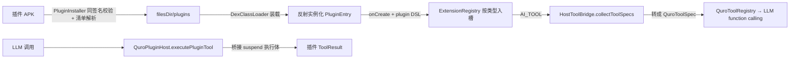
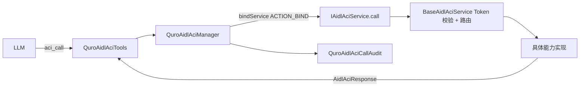
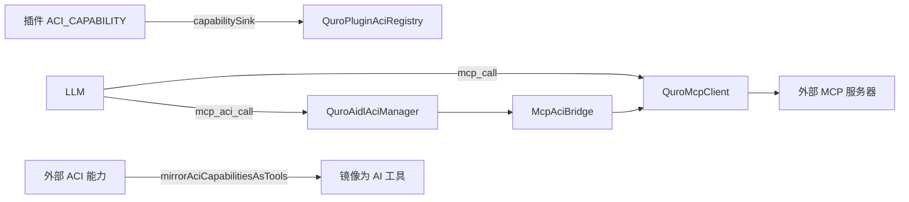

# 可扩展性架构（Extensibility）

宿主不认识任何具体扩展实现，只认识「扩展点 / 能力 / 工具」这三种抽象；APK 插件、ACI 受控端、MCP 服务器、Skill 四条接入路径全部收敛到同一套工具注册表与特权闸门。

## 1. 职责边界

**负责**

- **APK 级插件**：以独立 APK 为单位装载 / 卸载 / 热重载，把插件声明的扩展收进按类型分的收纳槽。
- **ACI**：同设备、无 Root、基于 AIDL Binder 的跨应用能力调用；控制端发现与编排，受控端暴露能力。
- **MCP**：外部 / 本地 MCP 服务器的接入、工具清单拉取与调用，以及向 ACI 的桥接。
- **Skills**：内置技能的种子注入、可调用技能的 `skill__*` 工具注册、外部插件技能的安装生命周期。
- **特权层 L1–L5**：系统级执行通道的探测、仲裁、审计，未授权时返回引导而非静默越权。

**不负责**

- 不校验扩展实现本身的业务正确性（只校验签名、清单、扩展点类型）。
- 不代理网络：ACI 默认走同设备 Binder，ACI HTTP 仅在受控端显式提供 `http_request` 能力时存在。
- 不把外部 Skill 当作可信代码：外部来源必须走 `skills-security-check` 的 P0/P1/P2 定级。
- 不自动提升特权：L1–L5 每一级都需用户显式授权。

## 2. 分层与关键类

### 2.1 APK 级插件框架

| 文件路径 | 职责 |
|---|---|
| `plugin-contract/src/main/java/.../contract/PluginEntry.kt` | 插件入口接口（`onCreate` / `onDestroy`），宿主反射实例化 |
| `plugin-contract/src/main/java/.../contract/PluginContext.kt` | 插件可用的宿主能力：`register` / `unregisterAll` / `hasHostCapability` / KV 存取 / `getFilesDir` / `appContext` |
| `plugin-contract/src/main/java/.../contract/ToolSpec.kt` | `ToolSpec` / `ToolParamSpec` / `ToolArgs` / `ToolResult` / `ToolExecutor`；`ParamType` |
| `plugin-contract/src/main/java/.../dsl/PluginDsl.kt` | 声明式 DSL：`plugin { aiTool { param / requireConfirm / execute } }` |
| `plugin-contract/src/main/java/.../extension/ExtensionPoints.kt` | `ExtensionType`（14 种）+ `PluginExtension` + 各扩展点数据载体 |
| `plugin-engine/src/main/java/.../core/PluginEngine.kt` | `QuroPluginEngine` 门面：init / install / uninstall / load / unload / reload |
| `plugin-engine/src/main/java/.../core/PluginClassLoader.kt` / `PluginContextImpl.kt` | `DexClassLoader` 装载插件 dex / 插件侧 `PluginContext` 实现 |
| `plugin-engine/src/main/java/.../install/PluginInstaller.kt` | 同签名校验 + 清单解析 + 持久化 + native lib 抽取 |
| `plugin-engine/src/main/java/.../registry/ExtensionRegistry.kt` | 按 `ExtensionType` 分槽的全局收纳槽 |
| `plugin-engine/src/main/java/.../bridge/HostToolBridge.kt` | 宿主侧取用插件 `AI_TOOL` |
| `plugin-engine/src/main/java/.../bridge/AciBridge.kt` | ACI 双向桥（插件能力出口 / 外部 ACI 能力入口） |
| `app/src/main/java/.../core/plugin/QuroPluginHost.kt` | 宿主**唯一**接入点：`attach()` |
| `app/src/main/java/.../core/plugin/PluginSigning.kt` | 导入 APK 的补签（复用构建台 apksig） |
| `app/src/main/java/.../core/tools/QuroPluginTools.kt` | AI 入口：单一工具 `apk_plugin` |
| `app/src/main/java/.../ui/PluginSurfaceActivity.kt` | 插件界面通用承载 Activity |

示例插件模块：`plugin-devkit` / `plugin-express` / `plugin-todo` / `plugin-units` / `plugin-sysinfo` / `plugin-zorvweb`（6 个）。

### 2.2 ACI

| 文件路径 | 职责 |
|---|---|
| `aidl-aci-core/src/main/aidl/ai/aidl/aci/core/IAidlAciService.aidl` | 受控端服务接口：`call` / `callAsync` / `getCapabilities` / `ping` |
| `aidl-aci-core/src/main/aidl/ai/aidl/aci/core/IAidlAciCallback.aidl` | 异步回调：`onResult` / `onProgress` |
| `aidl-aci-core/src/main/aidl/ai/aidl/aci/core/AidlAciRequest.aidl` / `AidlAciResponse.aidl` | 统一请求 / 响应 parcelable |
| `aidl-aci-core/src/main/java/ai/aidl/aci/core/BaseAidlAciService.kt` / `AidlAciLocalSocketTransport.java` | 受控端基类（Token 验证 / 能力注册 / 路由 / 审计）/ 本地 socket 传输 |
| `app/src/main/java/.../core/aidlaci/QuroAidlAciManager.kt` | 控制端管理器：绑定、发现、Token、调用、审计 |
| `app/src/main/java/.../core/aidlaci/QuroAidlAciRegistry.kt` | 已发现受控端 / 能力注册表 |
| `app/src/main/java/.../core/aidlaci/QuroAidlAciTools.kt` | LLM 工具：`aci_list` / `aci_call` / `aci_http_server` |
| `app/src/main/java/.../core/aidlaci/QuroAidlAciCallAudit.kt` / `QuroAidlAciCredentialVault.kt` / `AciNativeBridge.kt` | 调用审计 / 凭据保管（AndroidKeyStore）/ 原生侧桥接 |
| `app/src/main/java/.../core/aidlaci/AidlAciConsoleScreen.kt` | 控制台 SDUI 渲染 |
| `app/src/main/java/.../service/QuroMainAciService.kt` | 宿主自身作为受控端对外暴露能力 |
| `aci-app/` | 规范参考实现（`echo` / `device_info` / `health`） |

### 2.3 MCP

| 文件路径 | 职责 |
|---|---|
| `app/src/main/java/.../core/mcp/QuroMcpClient.kt` | 外部 MCP 客户端：`initialize`（2025-03-26）/ `listTools` / `callTool` |
| `app/src/main/java/.../core/mcp/QuroMcpWsClient.kt` | WebSocket 传输 |
| `app/src/main/java/.../core/mcp/QuroMcpHttpServer.kt` | 本地 HTTP 传输 |
| `app/src/main/java/.../core/mcp/QuroLocalMcpManager.kt` / `QuroLocalMcpServer.kt` / `QuroLocalMcpDispatcher.kt` | 应用内本地 MCP 服务部署与派发 |
| `app/src/main/java/.../core/mcp/McpAciBridge.kt` | MCP 工具 → ACI 能力桥接 |
| `app/src/main/java/.../core/mcp/QuroMcpAciTools.kt` / `QuroMcpClientPrefs.kt` | `mcp_aci_list` / `mcp_aci_call` / `mcp_aci_bridge`；服务器配置持久化 |

### 2.4 Skills 与特权层

| 文件路径 | 职责 |
|---|---|
| `app/src/main/java/.../core/skill/QuroSkill.kt` | `QuroSkill` 数据类、`QuroSkillSuites`（套件分组）、`SkillSigner`、`QuroSkillStore` |
| `app/src/main/assets/skills/zorv/` | 内置技能包（68 个文件，含 `manifest.json`） |
| `docs/architecture/插件Skills技术架构.md` | 外部插件技能（`SKILL.md` 形态）的生命周期定义 |
| `app/src/main/java/.../core/privilege/QuroPrivilegeManager.kt` | `PrivilegeLevel` 枚举、`probe`、`requestElevation`、`launchIntentFor` |
| `app/src/main/java/.../core/privilege/QuroPrivilegeAudit.kt` | 提权审计日志 |
| `app/src/main/java/.../core/privilege/QuroRootGateway.kt` / `QuroShizukuBridge.kt` | `Shizuku → su` 自动降级 / Shizuku `UserService` 绑定 |
| `app/src/main/java/.../core/policy/QuroPolicy.kt` / `QuroPolicyStore.kt` | 策略检查（提权四阶段第二阶段） |

## 3. 数据流 / 调用链

### 3.1 插件：从 APK 到 LLM 工具



热重载：`apk_plugin` 的 `reload` action 走 `unload` + `load`，改完插件不用重启应用。

### 3.2 ACI：控制端调用受控端



反向：宿主自身也是受控端（`QuroMainAciService`）。

### 3.3 MCP 与 ACI 的双向桥接



`AciBridge` 的三个注入式回调（`capabilitySink` / `aciInvoker` / `externalCapabilities`）由宿主在 `QuroPluginHost.attach()` 里赋值，方向一「插件能力 → ACI 服务端」，方向二「外部 ACI 能力 → AI 工具」。

## 4. 关键设计决策

### 4.1 契约层必须 `compileOnly` + 同签名闸门 + 导入补签

- **为什么 `compileOnly`**：插件跑在宿主进程内、由 `DexClassLoader` 装载。若契约被打进插件 APK，插件与宿主各持一份接口 Class，调用即 `ClassCastException`。这是本框架第一大坑，写法固定为 `compileOnly(project(":plugin-contract"))`。
- **为什么同签名**：插件跑在宿主进程内、拥有宿主同等权限，所以宿主只接受与自身**同 SHA-256 证书**的插件。
- 但用户手头的包未必是宿主密钥签的。因此 `PluginSigning` 在导入时先用**内置宿主密钥**（`assets/keystore/zorvai_release.bks`，首次释放到 `filesDir/plugin_sign/`）补签一遍，再交给安装器 —— 任何来源的插件都能装上，且装上的东西一定出自本机这把密钥。
- 签名能力**完全复用构建台**（`BuildEngine` 的进程内 apksig，V1 / V2 / V3 全开），不另写一套。
- `PluginInstaller.sigCerts` 三级来源依次兜底：框架 API（`apkContentsSigners` / `signingCertificateHistory` / `signatures`）→ APK Signing Block（V2 `0x7109871a` / V3 `0xf05368c0` / V3.1 `0x1b93ad61`）→ JAR V1。

### 4.2 单一 AI 工具 `apk_plugin` + 兜底 `call`

- 插件框架所有操作走一个工具、按 `action` 分发，避免工具集随插件数量膨胀。
- 必须有 `call` 的原因：插件贡献的工具通常已进入会话工具集，但当工具集被裁剪、或插件刚装完还没轮到下一轮 function calling 时，`call` 保证 AI **永远能用到插件能力**，不会出现「插件装了但 AI 说用不了」的死角。

### 4.4 界面必须宿主承载

- 插件不能自带 Activity：独立 APK 不是系统安装的应用，`Activity` 起不来；要界面就注册 `UI_SURFACE`，由宿主通用承载 Activity（`PluginSurfaceActivity`）显示，插件在 `UiSurfaceExtension.build` 里返回 View 树。返回键接管接口 `SurfaceBackHandler` 放在**契约层**而不是宿主 App —— 插件只编译期依赖契约，引用不到宿主的类。
- 控制台走 SDUI 不走回环 HTTP：早期版本曾误建「app 自连 `127.0.0.1` 环回 HTTP 控制台」（`lanui` 模块），2026-07-31 彻底移除。现行方案是受控端只暴露 `console_ui` 与 `console_action` 两个能力，控制端 `QuroAidlAciCenterScreen` 经**同设备 Binder** 拉快照后用 `AciConsoleScreen` 本地渲染，纯本地、零网络；受控端实现 `AciConsoleContract`（`buildUiSnapshot` + `applyAction`）即可被驱动。

### 4.5 能力描述写「什么时候用」，不是版本号

- `Capability.create(id, description)` 的第 2 参是给 LLM 的自然语言描述，方法内部固定 `version="1.0"`。曾有人填版本号，导致 LLM 无法判断调用时机。
- 同理插件 `aiTool` 的 `description` 也必须写清触发时机。

### 4.6 技能系统的三条硬约束

- **内置技能默认不注册为工具**：旧版 `seedBuiltinZorvSkills` 把 62 个内置技能默认 `enabled=true && callable=true`，全部注册成 `skill__*` function-calling 工具；用户在「本地模型」开启工具调用后，整套云端工具集（含 60+ 技能工具）被塞给 1.2B 本地模型 → 一直「正在处理提示词」卡死、调一次工具就乱码。内置技能的定位是「注入系统提示词的行为约束」，不该默认成为工具，由 `KEY_BUILTIN_ZORV_CALLABLE_FIX` 幂等迁移。
- **工具名必须可逆且在长度预算内**：`QuroSkill.toolNameOf(name)` = `skill__` + `QuroToolSpecGuard.sanitizeName(...)`，总长压进 64 字符（OpenAI function name 上限，超了整段 `tools` 会被拒收）。同一技能名永远得到同一工具名 → 反向查找 `toolNameOf(skill.name) == call.name` 成立，无需保存额外映射；净化丢失信息时追加**原名哈希尾缀**（`skill__tool-1a2b3c4d`）找回唯一性。
- **两级信任**：内置技能随平台发布、默认可信；插件技能来自市场 / 仓库 / URL，安装前必须走 `skills-security-check`，输出 P0（致命）/ P1（警告）/ P2（安全），**P0 须用户显式确认**；两级落盘：用户级 `~/.workbuddy/skills/`（跨项目）、项目级 `{workspace}/.workbuddy/skills/`（团队）。

### 4.7 提权必须四阶段，未授权返回引导

- 「拥有权限」不等于「管理权限」。`QuroPrivilegeManager` 只做「探测 + 仲裁 + 审计」，不持有权限本身；提权统一走 `Intent → Policy Check（QuroPolicy）→ User Confirmation → Audit Log（QuroPrivilegeAudit）`。
- 未授权时工具返回明确的引导提示，不静默越权。系统提示词里也明确写了这条约束。

## 5. 对外接口 / 契约

### 5.1 插件清单入口（必须声明）

```xml
<meta-data android:name="quro.plugin.entry" android:value="com.example.MyEntry" />
```

### 5.2 插件最小实现

```kotlin
class MyEntry : PluginEntry {
    override fun onCreate(ctx: PluginContext) {
        plugin(ctx) {
            aiTool("my_tool", "一句话描述这个工具干什么、什么时候该调用") {
                param("text", ParamType.STRING, "输入文本")
                requireConfirm(setOf("shell"))   // 可选：标记需确认 + 所需特权
                execute { args -> ToolResult.text("OK: ${args.string("text")}") }
            }
        }
    }
    override fun onDestroy(ctx: PluginContext) { ctx.unregisterAll() }
}
```

### 5.3 14 种扩展点

`AI_TOOL`（★最常用）· `ACI_CAPABILITY` · `CHAT_CARD` · `UI_WIDGET` · `UI_SURFACE` · `MODEL_PROVIDER` · `RAG_SOURCE` · `COMMAND` · `SETTING` · `SCHEDULE_TASK` · `CHANNEL` · `FILE_HANDLER` · `CODE_RUNTIME` · `SPEECH`

### 5.4 `PluginContext` 契约

`pluginId` / `pluginVersion`（标识）· `register(PluginExtension)` / `unregisterAll()`（入槽 / 全量出槽）·
`hasHostCapability(name): Boolean`（可选依赖判断）· `log(tag, message)` ·
`getString` / `putString` / `getBool` / `putBool`（插件私有 KV）· `getFilesDir()` / `appContext`。

宿主声明的能力集合（`QuroPluginHost.HOST_CAPS`）：`llm` · `memory` · `tts` · `stt` · `aci` · `terminal` · `file` · `web` · `screen` · `shell`。

### 5.5 `apk_plugin` 的 11 个 action

| action | 参数 | 作用 |
|---|---|---|
| `status` | — | 框架状态（引擎就绪 / 已装 / 已加载 / 贡献工具数 / 内置包数） |
| `list` | — | 列出已装插件及扩展点、贡献的 AI 工具名 |
| `info` | `plugin_id` | 插件明细 |
| `tools` | — | 列出插件贡献的全部 AI 工具 |
| `surfaces` / `open` | `surface_id` | 列出 / 打开插件自带界面 |
| `install` | `path` · `skip_signature_check` | 从设备 APK 安装 |
| `install_builtin` | — | 一键安装宿主内置示例插件 |
| `uninstall` / `reload` | `plugin_id` | 卸载 / 热重载 |
| `call` | `name` · `args` | ★ 直接调用某插件 AI 工具（兜底通道） |

### 5.6 ACI AIDL 契约

```aidl
interface IAidlAciService {
    AidlAciResponse call(in AidlAciRequest request);
    void callAsync(in AidlAciRequest request, in IAidlAciCallback callback);
    String[] getCapabilities();   // 每项为一个 Capability 的 JSON 字符串
    boolean ping();
}
interface IAidlAciCallback {
    void onResult(in AidlAciResponse response);
    void onProgress(int progress, in String message);
}
```

受控端最小接入：

```kotlin
class MyAciService : BaseAidlAciService() {
    override fun onCreateCapabilities(caps: MutableList<Capability>) {
        caps.add(Capability.create("open_url", "在浏览器打开指定网址")
            .addParam("url", "string", true, "目标网址")
            .addFlag(Capability.FLAG_BACKGROUND))
    }
    override fun onCall(req: AidlAciRequest): AidlAciResponse =
        AidlAciResponse.success().putResult("ok", true)
}
```

设计原则：**新增能力不修改 AIDL 接口**，旧版本控制端调用新能力返回 `CAPABILITY_NOT_FOUND`；传输层对受控端透明，AIDL / HTTP / MCP 走同一套能力定义。

受控端 Manifest 必须写 `<queries>` 声明 `ACTION_BIND` / `ACTION_WAKE`，否则 Android 11+ 控制端发现不到。

### 5.7 MCP 服务器配置字段

| 字段 | 值 |
|---|---|
| `alias` | 工具集在 `mcp_call` 里的引用名 |
| `url` | JSON-RPC 端点（远端 HTTPS 或 `http://127.0.0.1:<port>/mcp`） |
| `token` | Bearer 鉴权（可选） |
| `kind` | `remote`（默认，HTTP/SSE）/ `ws` / `local` |
| `handshake` | 开启后自动跟踪 `Mcp-Session-Id` 并在后续请求携带 |

协议版本 `2025-03-26`，同时经 `protocolVersion` 字段与 `MCP-Protocol-Version` 请求头声明。

MCP 相关工具全集：`mcp_servers` · `mcp_list_tools` · `mcp_call` · `mcp_deploy` · `mcp_undeploy` · `mcp_list_local` · `mcp_aci_list` · `mcp_aci_call` · `mcp_aci_bridge`。

MCP-ACI 能力映射：MCP 工具 `weather_query` → ACI 能力 `mcp_weather_query`（`McpAciBridge` 的虚拟包名 `mcp_bridge`，能力 id 前缀 `mcp_`）。

### 5.8 技能契约

- 工具名：`skill__` + 净化后的技能名，总长 ≤ 64。
- 内置技能包：`app/src/main/assets/skills/zorv/`（`manifest.json` + 68 个文件），技能 id 为稳定 id `zorv_<sha1>`。
- 签名：`SkillSigner` HMAC-SHA256，SALT `zorv-ai-builtin-skill-sign-v1`，签名内容 `id|name|content`。
- 注入：`QuroSkillStore.seedBuiltinZorvSkills`，`KEY_BUILTIN_ZORV` 幂等守卫。
- 套件：`QuroSkillSuites.ORDER` / `LABELS`，按业务域折叠展示；空串归 `general` 排最后。

### 5.9 特权层 L1–L5

| 层级 | 实现 | 用途 | 前置条件 |
|---|---|---|---|
| L1 无障碍 | `AccessibilityService` | 点击 / 输入 / 读屏（无障碍节点树，非截图） | 系统设置中开启 |
| L2 Shizuku | uid 0/2000，AIDL `UserService` 主路径，反射 `newProcess` 备选 | 高权限 shell | 安装 Shizuku 并完成配对 |
| L3 设备管理员 | `DeviceAdmin` | 设备策略级能力（锁定 / 擦除） | 设置中激活设备管理员 |
| L4 ROOT | `su`，命令走 `sh -c` | 完整 root | 设备已 root |
| L5 应用内 Linux | `proot` + Ubuntu 24.04 rootfs | 真 Linux 用户态 | `proot` / `libbash` / `libbusybox` 随包内置；rootfs 首次使用自动下载 |

### 5.10 扩展点清单（新增扩展时的落点）

1. **新增插件扩展类型**：在 `ExtensionPoints.kt` 加 `ExtensionType` 枚举值 + 数据载体类 → 在 `PluginDsl.kt` 加声明函数 → 在宿主对应场景从 `ExtensionRegistry.list(type)` 取用。
2. **新增 ACI 受控端能力**：受控端 `onCreateCapabilities` 里 `Capability.create(id, 自然语言描述)` + `addParam` + `addFlag`，无需改动 AIDL。
3. **新增 MCP 服务器**：设置里填 alias / url / token / kind / handshake，或让 AI 用 `mcp_deploy` 直接部署到应用内。
4. **新增内置技能**：往 `assets/skills/zorv/` 加 `SKILL.md` 并在 `manifest.json` 登记（含 `suite` 与 `signature`）。
5. **新增特权通道**：在 `PrivilegeLevel` 加枚举 → 在 `QuroPrivilegeManager.probe` / `launchIntentFor` 补分支 → 补 `QuroPolicy` 策略项。

## 6. 已知约束与待办

- **🔴 `PrivilegeLevel` 枚举只到 L4**：代码里是 `L1, L2, L3, L4`，文档中的 L5（应用内 `proot` Linux）未进入枚举，也就不走 `probe` / `requestElevation` / `launchIntentFor` 的统一仲裁。L5 的可用性由资产与 rootfs 单独把关，是独立于特权仲裁器的通道。
- **3 个扩展点没有 DSL 也没有数据载体类**：`UI_WIDGET` / `CHANNEL` / `SPEECH` 在 `ExtensionType` 里已声明，但 `PluginDsl.kt` 只有 11 个声明函数、`ExtensionPoints.kt` 只有 11 个数据载体类，这 3 类必须直接 `ctx.register(...)` 自行实现 `PluginExtension`，宿主侧也没有对应取用场景。
- **内置技能数量不一致**：`README.md` 写 63 个，`assets/skills/zorv/manifest.json` 实际登记 67 个（`version: 1`，25 个 suite），目录下 68 个文件。以 manifest 为准，README 待更新。
- **内置密钥随包分发**：`assets/keystore/zorvai_release.bks` 打包进 APK 供插件补签使用；这两个文件靠 `.gitignore` 不入库，`git-hooks/pre-commit` 会拦截签名材料入库（2026-09-17 撤销过一次白名单）。安全性依赖「密钥不随源码分发」这一约定。
- **ACI HTTP 明文是整体放开**：Android NSC 无法按私有网段写白名单（不能写 `192.168.0.0/16`），受控浏览器只能把 `cleartextTrafficPermitted` 整体设为 `true`。公网明文 HTTP 会一并放行，**仅在可信局域网内**使用。
- **ACI 控制台无版本协商**：`console_ui` 快照 JSON 的 Schema 演进未在契约层声明版本号；同时 5 个官方受控端中 4 个为 v1.5.0、`FileAci` 为 v1.4.2，各自独立 Release，跨端契约兼容性靠人工维护。
- **`apk_plugin` 的 `call` 绕过工具集裁剪**：兜底通道意味着插件工具即使未进入本轮 function calling 也能被调起，代价是 LLM 可能用 `call` 绕过宿主对工具集的裁剪策略。
- **受控端生态与控制台契约的版本治理缺失**：`console_ui` 快照 JSON 无版本号字段，`PluginEntry` / `Capability` 也无版本协商机制，跨端错配只能靠 `CAPABILITY_NOT_FOUND` 兜底。
