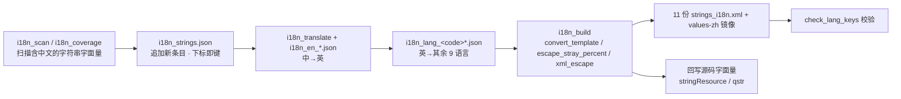

# 国际化架构（i18n）

把 11 种界面语言的取串、切换、AI 回复语言约束收敛成「一条追加式词表 + 两个取串入口 + 一个提示词注入器」。

## 1. 职责边界

**负责**

- 维护 11 份 `values-*/strings_i18n.xml` 资源文件的生成与对齐。
- 为 UI 层提供两处取串入口：`@Composable` 内的 `stringResource`、非 Composable 处的 `qstr()`。
- 应用内语言切换（不重启进程即可生效），含「跟随系统」策略。
- 把「界面语言」翻译成「AI 应当用什么语言回复」的提示词约束，注入到全部提示词构建点。
- 提供翻译流水线脚本：抽取 → 英文词典 → 各语言词表 → 生成 XML → 回写源码 → 覆盖率校验。

**不负责**

- 不翻译**数据型字符串**：工具输出标记、意图关键词、画布路由词、TTS 标签值等（见 `LOGIC_SKIP_FILES`）。
- 不做运行时机器翻译：所有译文在编译期落盘为资源，运行时只做资源查找。
- 不管理 `strings.xml`（应用名、无障碍描述、权限说明等手写字串），那部分不在本流水线范围内。
- 不负责大模型「是否真的遵守语言约束」——只负责把约束以最高优先级注入到位。

## 2. 分层与关键类

| 文件路径 | 职责 |
|---|---|
| `app/src/main/res/values/strings_i18n.xml` | 默认（中文）资源，生成物 |
| `app/src/main/res/values-zh/strings_i18n.xml` | 中文显式镜像，保证选 `zh` 与默认资源完全一致 |
| `app/src/main/res/values-{en,ar,de,es,fr,hi,ja,ko,pt,ru}/strings_i18n.xml` | 其余 10 种语言资源，生成物 |
| `app/src/main/java/com/ai/assistance/quro/util/QuroLocale.kt` | 语言策略中心：偏好读写、`wrap()`、`apply()`、`recreateAll()`、语言显示名表 |
| `app/src/main/java/com/ai/assistance/quro/util/QuroI18nRt.kt` | 非 Composable 取串运行时；维护按当前语言派生的 localized `Context`；导出 `qstr()` |
| `app/src/main/java/com/ai/assistance/quro/core/QuroReplyLanguage.kt` | AI 回复语言统一注入器：`resolveTag` / `nameOf` / `directive` / `shortDirective` / `turnNudge` / `tailReminder` |
| `app/src/main/java/com/ai/assistance/quro/activity/QuroApplication.kt` | `attachBaseContext` 里 `QuroLocale.wrap`；注入 `QuroI18nRt.appContext`；`QuroLocale.track` + `apply` |
| `scripts/i18n_strings.json` | **权威词表**：数组下标即资源键序号，字段 `text` / `fmt` / `file` / `line` |
| `scripts/i18n_translate.py` + `scripts/i18n_en_*.json` | 中→英词典（手工确认的译文） |
| `scripts/i18n_lang_<code>.json` + `scripts/i18n_lang_<code>_N.json` | 其余 9 种语言的批量译文词表 |
| `scripts/i18n_build.py` | 流水线主程序：生成 11 份 XML + 镜像 `values-zh` + 安全回写源码字面量 |
| `scripts/append_new_strings.py` | 把新文案**追加**进词表并打印 `text → qk_%05d` 映射 |
| `scripts/check_lang_keys.py` | 校验各语言词表的键是否与词表精确匹配，统计覆盖率 |
| `scripts/i18n_ctx.py` | 字符串/注释感知的括号匹配，判定某处是否处在 `@Composable` 区间 |

## 3. 数据流 / 调用链

### 3.1 翻译流水线（编译前，离线）



`resolve_value` 的回落顺序：`本语言译文` → `英文（EN）` → 原文。**英文是完整兜底**，因此任何语言都不会漏出中文。

### 3.2 运行时取串

```mermaid
flowchart TD
    S1[Composable 内] -->|stringResource(R.string.qk_xxxxx)| R[resources 按配置 locale 取串]
    S2[非 Composable 处<br/>remember / 协程 / onClick] -->|qstr(R.string.qk_xxxxx, *args)| Q[QuroI18nRt.get]
    Q --> QC{langTag == system?}
    QC -->|是| Q1[用 appContext]
    QC -->|否| Q2[createConfigurationContext 派生 localized Context]
    Q1 --> R
    Q2 --> R
    R --> FMT{args 为空?}
    FMT -->|是| N[直接返回]
    FMT -->|否| SF[String.format —— 无条件执行]
```

### 3.3 语言切换

1. 用户在设置里选择 → `QuroLocale.apply(language)`。
2. 写偏好 `SharedPreferences("quro_ui").app_language`。
3. `AppCompatDelegate.setApplicationLocales(locales)` —— 对本应用内的 `AppCompatActivity` 生效。
4. `QuroI18nRt.setLocale(tag)` —— 让 `qstr()` 走重派生路径。
5. `QuroLocale.recreateAll()` —— 重建所有已追踪的 Activity，新语言立即生效。
6. 每个 Activity 重建时走 `attachBaseContext` → `QuroLocale.wrap(base)`，把 locale 包进 Context。

### 3.4 AI 回复语言注入

`QuroReplyLanguage.resolveTag(ctx)` 判定语言 → `needsDirective` 判定是否注入（**zh 不注入**）→ 四个注入点按场景取用：

| 注入点 | 用在哪 | 长度 |
|---|---|---|
| `directive(ctx)` | 云端大模型系统提示词靠前位置 | 完整版（英文强约束 + 中文点破陷阱） |
| `tailReminder(ctx)` | 系统提示词最末尾复述 | 1 段 |
| `turnNudge(ctx)` | 消息列表最后一条 `system`（只进 API payload，不进历史） | 1 句 |
| `shortDirective(ctx)` | 本地小模型（MNN / LLAMA_CPP）极简分支 | 双语各 1 句 |

## 4. 关键设计决策

### 4.1 资源键 `qk_%05d`，索引即键，只能追加

- **为什么**：键名由 `scripts/i18n_strings.json` 的数组下标直接格式化得到（`'qk_%05d' % idx`）。好处是键无需人工命名、天然唯一；代价是**下标与语义强绑定**。
- **规则**：词表只允许 `append`。插入、删除、重排都会让该位置之后的所有键整体位移 —— 已有源码引用、11 份译文词表、覆盖率清单全部错位，且不报编译错误（旧键指向了另一条文案）。
- **副作用**：并非词表里每条都会生成资源。只有「英文已覆盖且模板可解析」（`template_ok`）的条目才落盘，因此键序列存在空洞 —— 当前词表 3905 条，实际生成 3518 条，最大键 `qk_03908`。这是预期行为，不是缺译。
- **指标**：11 份 XML 各 3518 条，全量对齐。

### 4.2 🔴 `getString(id, *args)` 无条件 `String.format`，裸 `%` 会崩溃

- **现象**：Android 的 `Resources.getString(id, *args)` 实现是**无条件**执行 `String.format(locale, raw, args)`。
- **坑 1**：`formatted="false"` 只是给 aapt 的编译期标记，**没有任何运行时保护作用**。加了它照样 `String.format`。
- **坑 2**：中文原文 `工具：与 AI 对话内工具 100% 同源（共 %1$s 个）` 里的 `% ` 被 Java 解析成「空格 flag + 转换符 `s`」→ `FormatFlagsConversionMismatchException` 真机崩溃（`QuroMcpSettingsScreen` 的 MCP 页）。
- **对策**：`i18n_build.py` 的 `escape_stray_percent` 把非法规格的裸 `%` 转义成 `%%`。当前资源里有 4 处 `%%`（如 `部署中 %1$s%%`、`已下载 %1$s%% (%2$s / %3$s)`）。
- **白名单刻意写窄**：`_FORMAT_SPEC_RE = r'%(?:\d+\$)?s'` 只承认 `%s` 与 `%N$s`（`%%` 由前置的 `s[i:i+2] == '%%'` 分支单独消化）。放宽到 flags/width 会让 `100% same` 里的 `% s` 被判成合法规格而漏网。
- **只对会带参调用的条目转义**：`escape_stray_percent` 仅在「中文原文含 Kotlin 模板」时执行，否则 `%%` 会在界面上字面显示成两个百分号。

### 4.3 两套取串入口，而不是一套

- `stringResource()` 只能在 `@Composable` 作用域调用；但项目里大量文案出现在 `remember {}` / `ifBlank {}` / 协程 / `onClick` / 顶层函数里。
- 曾尝试静态推断「此处是否可见 Context」决定是否注入，误判率过高，最终统一退化为运行时取串 `qstr()`。
- **不能直接用 `applicationContext`**：`AppCompatDelegate.setApplicationLocales()` 在 Android 12 及以下只更新 Activity 的配置，**不更新 Application 的 resources**。直接拿 `applicationContext` 取串，切语言后仍是系统语言（表现为「切了还是全中文」）。`QuroI18nRt` 因此按当前语言 `createConfigurationContext` 派生一个 localized Context 并缓存，语言切换时置空重派生。
- 规模：约 250 个文件用 `qstr(R.string...)`，约 103 个文件用 `stringResource(R.string...)`。

### 4.4 `QuroLocale.wrap()` 必须由每个 Activity 自己调

- `AppCompatDelegate` 只对 `AppCompatActivity` 生效；本应用主界面是 `ComponentActivity`，切语言后界面会一直是中文。
- 因此额外提供 `wrap(base)`，由各 Activity 在 `attachBaseContext` 里调用。当前有 8 个 Activity + `QuroApplication` 接入。
- `apply()` 之后必须 `recreateAll()`，否则要等下次冷启动才换语言，用户会以为「切了没反应」。

### 4.5 「跟随系统」要先落到支持语言集合内

- 系统是泰语、而 UI 资源回落到 `values/`（中文）时，会出现「UI 中文、AI 说泰语」的错配。
- `QuroReplyLanguage.SUPPORTED` 与 `values-*` 目录一一对应（11 个）；系统语言不在集合内 → 回落 `zh`。

### 4.6 AI 回复语言要在四个位置重复注入

- 基座系统提示词（`QuroPlatformManifest.SYSTEM`）+ 工具清单 + 人格层**整篇中文**，模型天然倾向用中文作答。
- 只放开头会被后面的中文历史稀释（模型顺着上一轮自己的中文回复继续）；只放开头也扛不住 16k+ 字符提示词的近因偏好。
- 因此：`directive`（开头）+ `tailReminder`（末尾）+ `turnNudge`（生成前最后一条）+ `shortDirective`（本地小模型分支）。
- 中文**不注入**：基座提示词本身就是中文，多写是浪费 token。

### 4.7 数据型字符串整文件跳过 i18n

- `LOGIC_SKIP_FILES` 列出的 8 个文件里的中文字面量是**比较/匹配/分派的键**，不是给人看的文案：`Verifier.kt`（工具失败标记）、`DeliverabilityJudge.kt`、`CanvasRouter.kt`、`QuroExperienceEngine.kt`（意图关键词）、`IntentRouter.kt`、`FluidCloudBridge.kt`、`QuroCloudTtsCatalog.kt`（直接进合成请求）、`ToolCapabilityDirectory.kt`（子串匹配）。
- 一旦被翻译，非中文语言下 `contains` / `==` 永不命中 —— **不报错，只是没反应**，极难排查。

### 4.8 译文清洗的两条反直觉规则

- 「值 == 中文原文」判定为未翻译并剔除，**但对 `ja` 不能启用**：日文与中文大量同形（一/二/三/四/日等），会把正确译文删掉并回落成英文。
- 同理，不能按「含中日韩统一表意文字」粗暴过滤 —— 日文汉字本就在该区间。
- 已存在的 `%1$s` 必须先藏起来（`_SENTINEL`）再扫 Kotlin 模板，否则 `%1$s` 里的 `$s` 会被当成变量二次包装成 `%1%1$s`（真机显示乱码）。

### 4.9 aapt2 的撇号检查

- aapt2（8.13）对 ASCII 撇号 `'` 一律报 `unescaped apostrophe`，即使 `formatted="false"` 也不豁免。
- `xml_escape` 统一把 `'` 替换成花体撇号 `’`（U+2019），该字符不在检查范围内，对格式串与非格式串都安全。

## 5. 对外接口 / 契约

### 5.1 语言偏好

| 项 | 值 |
|---|---|
| SharedPreferences 名 | `quro_ui`（`QuroLocale.PREFS`） |
| 键 | `app_language`（`QuroLocale.KEY`） |
| 取值 | `"system"` 或 BCP-47 标签（`zh` / `en` / `ja` / `ko` / `fr` / `de` / `es` / `ru` / `pt` / `ar` / `hi`、`zh-rCN`、`zh-rTW`） |

### 5.2 支持语言集合

`zh`（默认 `values/` + 镜像 `values-zh`）、`en`、`ar`、`de`、`es`、`fr`、`hi`、`ja`、`ko`、`pt`、`ru` —— 共 11 种，与 `QuroReplyLanguage.SUPPORTED` 一一对应。

### 5.3 取串入口

```kotlin
// @Composable 作用域
stringResource(R.string.qk_00005, count)

// 非 Composable 作用域（remember / 协程 / onClick / 顶层函数）
qstr(R.string.qk_00005, count)
```

`QuroI18nRt.get(@StringRes id, vararg args: Any): String` —— 取串失败返回空串，不抛异常。

### 5.4 `QuroReplyLanguage` 公开 API

| 成员 | 签名 | 说明 |
|---|---|---|
| `resolveTag` | `(Context) -> String` | 判定回复语言标签；系统语言不在支持集合内时回落 `zh` |
| `needsDirective` | `(String) -> Boolean` | `zh` 返回 false |
| `nameOf` | `(String) -> String` | 返回 `English / English（en）` 形式的「英文名 / 本族名（代码）」 |
| `directive` | `(Context) -> String` | 云端完整指令 |
| `shortDirective` | `(Context) -> String` | 本地小模型精简指令 |
| `turnNudge` | `(Context) -> String` | 生成前提醒，作为最后一条 `system` 注入 |
| `tailReminder` | `(Context) -> String` | 系统提示词最末尾复述 |

调用方：`QuroAssistant` / `QuroBotReplyEngine` / `ZorvBrain` / `ChatViewModel` / `QuroChatViewModel` / `QuroVideoCallService` / `QuroVoiceBallService`。

### 5.5 资源键命名与格式约定

| 约定 | 值 |
|---|---|
| 键格式 | `qk_%05d`（5 位零填充十进制） |
| 参数占位 | `%1$s` / `%2$s` …（由 Kotlin `$var` / `${expr}` 转换而来） |
| 字面百分号 | `%%` |
| 非定位格式串属性 | `formatted="false"`（由 `i18n_build.py` 自动附加） |
| 定位格式串属性 | 无 `formatted` 属性 |

### 5.6 扩展点

- **加一门新语言**：新建 `values-<code>/` 目录 → 在 `i18n_build.py` 的 `LANG_DIRS` 里加一项 → 提供 `scripts/i18n_lang_<code>.json` → 在 `QuroReplyLanguage.SUPPORTED` / `nameOf` 与 `QuroLocale.LANGUAGE_NAMES` / `MAJOR_LANGUAGES` 里各加一项。四处不同步会出现「界面能切、AI 不认」或反向错配。
- **加一条新文案**：只往 `scripts/i18n_strings.json` 尾部追加（用 `append_new_strings.py`），然后重跑 `i18n_build.py`。

## 6. 已知约束与待办

- **词表只可追加**：重排 / 删除会导致全量键位移且无编译期报错。流水线未提供防止误操作的校验脚本。
- **词表与资源不同步**：当前词表 3905 条、资源 3518 条，差值 387 条为「英文未覆盖」或「模板无法解析」而保留源码字面量的条目。增量跟进时须留意这部分。
- **残留模板字面量**：极少数条目在资源里保留了未转换的 Kotlin 模板片段（如 `qk_00033`、`qk_00035`、`qk_00042` 含 `${...}`），系源码整串抽取时模板解析失败（`convert_template` 返回 `None`）留下的产物，界面上会显示源码片段。待清理。
- **回写源码有白名单限制**：`DISPLAY_PARAMS` 只覆盖 `text` / `label` / `title` / `placeholder` / `summary` / `hint` 等显示用途参数名；刻意排除了 `name` / `message` / `description` / `body`，因为这些字段常作为普通类属性出现在非 Composable 上下文，注入 `stringResource` 会触发编译错误。未被覆盖的文案仍以字面量形式留在源码里。
- **无 CI 校验**：`git-hooks/pre-commit` 与 `pre-push` 只拦截签名材料，不校验 i18n 词表追加合法性、各语言键对齐、裸 `%`。全靠人工跑 `check_lang_keys.py`。
- **`LANGUAGE_NAMES` 部分显示名仍走资源**：`system` 用 `qk_03872`、`ja` 用 `qk_02504`，其余是本族语硬编码。语言选择列表本身的语言一致性未完全统一。
- **AI 语言约束无回归测试**：`directive` / `turnNudge` / `tailReminder` 的效果靠真机观察，未建立自动化断言。
- **`LANGUAGE_NAMES` 含 `zh-rTW`：有显示名但无对应资源目录**，选繁体中文时 Android 会回落到默认中文资源。
