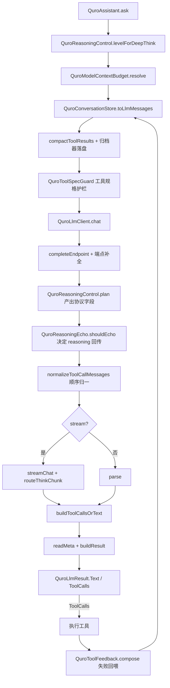

# 云端推理架构（思考协议 / 工具调用 / 上下文预算）

云端推理链路负责把「深度思考」开关、工具调用闭环与上下文预算三条线在一次 `/chat/completions` 调用里落实：思考协议按厂商家族编译、工具调用跨多轮保持自洽、输入 token 始终落在模型真实窗口内。

---

## 1. 职责边界

**负责**

- 把统一的思考档位编译成**该厂商认得**的协议字段，并保证一次只发一种。
- 请求构造与传输韧性：端点补全、超时、取消、重试、错误落盘诊断。
- 响应解析与元数据保留：`finish_reason` 归一化、token 用量、思考/正文分流。
- 上下文预算解析与历史裁剪、工具结果压缩与归档。
- 工具规格合法性护栏与工具失败的回喂措辞。

**不负责**

- 本地 / 端侧推理（见 `docs/architecture/inference-native/README.md`）。
- 工具的实际执行与权限判定（`QuroToolRouter` / `QuroToolEngine`）。
- 各厂商协议本身的定义与变更——本层只做「翻译 + 兜底」，不替厂商做语义承诺。

---

## 2. 分层与关键类

| 文件路径 | 职责 |
|---|---|
| `app/src/main/java/com/ai/assistance/quro/core/QuroAssistant.kt` | 主 Agent 循环（`ask`）。思考档位选择、预算接线、工具结果归档器、死循环检测 |
| `app/src/main/java/com/ai/assistance/quro/core/network/QuroLlmClient.kt` | 单次调用：请求体构造、流式/非流式、超时与重试、响应解析 |
| `app/src/main/java/com/ai/assistance/quro/core/network/QuroReasoningControl.kt` | 思考协议编译：`ThinkingLevel` × `Family` → `ReasoningPlan` |
| `app/src/main/java/com/ai/assistance/quro/core/network/QuroReasoningEcho.kt` | 历史中 assistant `reasoning_content` 是否回传的策略 |
| `app/src/main/java/com/ai/assistance/quro/core/QuroLlmMeta.kt` | `finish_reason` 归一化与 token 用量的判定层（纯 Kotlin，无 `org.json`） |
| `app/src/main/java/com/ai/assistance/quro/core/network/QuroModelContextBudget.kt` | 单次输入预算的三级解析（接口值 → 模型名族 → 保守值） |
| `app/src/main/java/com/ai/assistance/quro/core/QuroConversation.kt` | 历史裁剪、孤儿工具消息清理、工具结果压缩（`compactToolResults`） |
| `app/src/main/java/com/ai/assistance/quro/core/tools/QuroToolSpecGuard.kt` | 工具名 / `parameters` 的协议合法性护栏（发送边界） |
| `app/src/main/java/com/ai/assistance/quro/core/tools/QuroToolFeedback.kt` | 工具失败的分类与「下一步」回喂文案 |

---

## 3. 数据流



编号步骤：

1. `ask()` 由 `deepThink` 得到 `QuroReasoningControl.levelForDeepThink(deepThink)`；同时把自然语言指令 `buildDeepThinkDirective` 追加进 system（软层，对不支持思考字段的普通模型仍有效）。
2. `QuroModelContextBudget.resolve(cfg.model, cfg.provider, cfg.modelContextLength, cfg.contextWindow)` 得到 `effContextWindow`。
3. `store.toLlmMessages(system, effContextWindow, effHistoryRounds, toolArchiver)` 组装历史，内部做 `compactToolResults` 与孤儿清理。
4. `chat()` 补全端点、由 `plan()` 产出思考字段、由 `QuroReasoningEcho.shouldEcho` 决定是否带 `reasoning_content`、`normalizeToolCallMessages` 修正工具调用顺序、`QuroToolSpecGuard` 逐项过滤 `tools`。
5. 传输：非流式最多重试 2 次（仅 429/5xx），流式只在首 token 前重试。
6. 解析：流式走 `routeThinkChunk` 状态机，非流式走 `stripThinkBlocks`；`readMeta` 取 `finish_reason` 与 `usage`，`buildResult` 挂载 `QuroLlmMeta` 并把「被风控且空内容」转成明确错误。
7. 若返回 `ToolCalls`，执行工具；失败时用 `QuroToolFeedback.compose` 包装后回到步骤 3。

---

## 4. 关键设计决策

### 4.1 思考协议由编译层产出，一次只发一种

**为什么**：四家协议字段名完全不同且互斥——OpenAI 顶层 `reasoning_effort`、Anthropic `thinking:{type,budget_tokens}`、Qwen3 `chat_template_kwargs.enable_thinking`、DashScope 顶层 `enable_thinking`。若同时发两种，多数网关直接 400，且报错不指向具体字段。

**踩过的坑**：改造前「深度思考」开关只往 system prompt 塞一段自然语言，**请求体与关闭时逐字节相同**（缺口 C1），用户开了开关看不到任何协议层变化。另外早期用 `^o[0-9]` 正则识别 reasoning 模型，GPT-5 全系漏网 → 「一选 GPT-5 就报错」（o 系/GPT-5 不接受 `temperature`、只认 `max_completion_tokens`）。现统一由 `plan()` 的 `suppressTemperature` / `useMaxCompletionTokens` 给出，并用全组合单测钉死「绝不一次产出两种协议」。

### 4.2 关闭思考 = `AUTO` 而非 `OFF`

**为什么**：用户关掉「深度思考」的语义是「别额外命令模型想更深」，不是「禁止 o 系原生推理」。`AUTO` 意味着**一个思考字段都不发**，与改造前行为逐字节一致，避免对已有模型造成回归。

**踩过的坑**：直接下发 `OFF` 会让部分厂商把模型降级成完全不同的行为模式，用户反馈「关了开关之后模型变傻了」。

### 4.3 Anthropic 思考预算按 max_tokens 比例折算

**为什么**：Claude 的 `thinking.budget_tokens` 是**绝对 token 数**，且必须小于 `max_tokens`；直接下发配置值会与输出上限冲突。`ANTHROPIC_BUDGET_RATIO = 0.6` 把预算压在输出上限的 60%。

**踩过的坑**：早期全额下发 `maxTokens`，触发上游 `budget_tokens must be < max_tokens` 的 400，表现为「开启深度思考后 Claude 直接不回复」。

### 4.4 「reasoning 是否回传」与「用哪个 token 字段」去耦合

**为什么**：改造前写作 `messageToJson(m, emitReasoning = !isReasoningModel)`，而 `isReasoningModel` 的真实语义是 `plan.useMaxCompletionTokens`（请求参数**格式**问题）。「上游认不认识 `reasoning_content`」是**字段兼容性**问题，两者无关。今天恰好同答案（o 系 / GPT-5 都是「是」），一旦某家族也改用新 token 字段，这行会**静默**关掉它的 reasoning 回传 → AI 失忆、多步工具编排断链，且日志无线索。现由 `QuroReasoningEcho.shouldEcho` 显式判定。

**踩过的坑**：`OPENAI_EFFORT` 家族回传 `reasoning_content` 会被上游**整轮拒收**；Anthropic 侧不回传思考块（带 `signature`）会让多轮工具编排断链。因此默认 `true`，只对确知不认识的家族返回 `false`。判定错了不报错、只让模型失忆，所以 `diagnosis()` 必须打进 Logcat。

### 4.5 `finish_reason` 与 `usage` 不再丢弃

**为什么**：改造前 `parse()` 只取 `choices[0].message`，`finish_reason` 与顶层 `usage` 被逐字丢弃（缺口 C3），导致三类用户可感知故障无法归因：回复被截断却当成功（`length`）、被风控拦截显示为空回复（`content_filter`）、思考开销不可见（`reasoning_tokens`）。

**踩过的坑**：
- 用量未知必须用 `-1`（`QuroLlmMeta.UNKNOWN`）而不是 0：把「未知」当 0 会让「思考占比」算出假数据，看起来像「思考没花钱」。
- `content_filter` 且内容全空时，旧逻辑返回成功 → 用户看到「AI 不回复」。`buildResult` 现将其转成明确错误。
- 各家用量键名不一致（`prompt_tokens` / `input_tokens`、`completion_tokens_details.reasoning_tokens` / `reasoning_tokens`），用 `intOf(o, *keys)` 多键探测。

### 4.6 `tools` 数组逐项护栏

**为什么**：`tools` 是一整段 JSON，只要**一个**工具的 `name` 非法，严格上游**整段拒收**（400），结果不是少一个工具而是全部工具调用一起失效，日志只有一句上游 400。

**踩过的坑**：
- 全中文技能名经旧 `sanitizeToolName` 全部坍缩成 `skill__skill`，再被 `distinctBy { it.name }` 去重到只剩一个——用户装了 N 个中文技能，能调用的只有 1 个，且无日志。现 `QuroToolSpecGuard.sanitizeName` 在**净化发生信息丢失时**追加 `-<原名 SHA-256 前 8 位>`。
- 只查「字符丢失」会漏掉**纯 ASCII 超长名**：那种名字净化后与原文相同、不带哈希尾缀，截断后两个共享长前缀的名字直接撞名（实测抓到的 bug）。因此丢失检测必须同时看 `body != base || base.length > limit`。
- 护栏必须用在**注册/生产端**，若在发送边界改名，模型会调用一个注册表里不存在的名字。

### 4.7 工具调用顺序在发送前归一化

**为什么**：工具执行循环会插入可见的「⏳ 正在执行」进度占位气泡（role=assistant、无 toolCalls），它随历史进入上下文，落在 `assistant[tool_calls]` 与 tool 结果之间，触发 DeepSeek 严格校验 400（*"An assistant message with 'tool_calls' must be followed by tool messages…"*）。

**踩过的坑**：`normalizeToolCallMessages` 单次顺序扫描里，遇到「open 集合非空时的非 tool 消息」就剔除插队消息——但不能在此重置 `open`，因为结果可能排在插队消息之后。终态仍非空时还要从原 assistant 剥离 dangling `tool_calls`，否则「声明调用却无结果」同样 400。

### 4.8 工具参数在落地时立刻修成合法 JSON

**为什么**：模型（尤其快速并发发多个 `tool_call` 时）常产出未引号键、单引号、尾逗号、被截断的 `arguments`。原样回传给严格上游会被服务端解析失败 → 500 `Upstream Response Error` → 触发 500 重试，1 秒内连发数次失败请求。

**踩过的坑**：`sanitizeToolArguments` 先尝试直接解析，失败才启发式修复，修复后仍非法则回退 `{}`。**绝不把脏数据甩给上游，也绝不因此让整轮对话失败**。流式路径的 `buildToolCallsOrText` 对分片拼接结果走同一函数。

### 4.9 上下文预算三级解析，未知一律保守

**为什么**：改造前 `hardMax = if (modelContextLength > 0) 它 else 1048576`。1M 同时充当「未知兜底」，而大量第三方中转不返回 `context_length` → 预算被当成 1M → **裁剪几乎永不触发**，而模型真实上限可能只有 32K → 超限直接上游 500。这个「安全网」恰在它最该生效的场景里等于不存在。

**踩过的坑**：关键字匹配里，短关键字（≤3 字符）必须要求词边界，否则 `4o` 会误命中一堆名字；`FAMILIES` 必须**先具体后宽泛**有序匹配。`Budget.inferred` 用于告知用户「这个预算是猜的」。

### 4.10 工具结果压缩与「落盘承诺」兑现

**为什么**：工具输出（构建日志、长文本）会挤占目标上下文（context rot）。压缩保留「头 + 关键行 + 尾」，常量 `TOOL_RESULT_CAP = 1600`、`TOOL_RESULTS_TOTAL_CAP = 24_000`、`TOOL_RESULT_CAP_TIGHT = 400`。

**踩过的坑**：改造前的截断文案写着「完整日志见本机文件」，但**没有任何代码真的落盘**——模型据此去找一个不存在的文件，要么白跑一轮，要么直接编造文件内容。现 `toolOutputArchiver(context)` 真正写盘：`filesDir/tool_outputs/tool_<MD5 前 8 位>.txt`（`TOOL_ARCHIVE_DIR = "tool_outputs"`，先写 `.tmp` 再 rename 保证原子性；目录按 `TOOL_ARCHIVE_KEEP = 60` 淘汰旧文件），并把真实路径给回模型。文件名取内容摘要保证幂等——每轮上下文组装都会重新压缩同一批结果。

### 4.11 工具失败必须带「下一步」

**为什么**：改造前回喂给模型的只有一行原始错误文本，模型最常见的反应是**原样重试**，这正是 `QuroAssistant` 中 `repeatStreak >= 10` 强制停止被频繁触发的原因——不是模型笨，而是它从未被告知「这类错误重试没用」。`QuroToolFeedback` 每类都显式回答「重试有意义吗？没用该做什么？」

**踩过的坑**：
- 分类**只对失败调用**。工具正常返回里可能含 "not found"（如搜索的 "no matches found"），对成功结果也跑分类会把成功伪装成失败。
- 关键词表顺序即优先级：`CANCELLED` 必须在最前（取消信息常带 "connection closed"），`PERMISSION` 早于 `NOT_FOUND`（"permission denied: no such file" 堵点是权限），`INVALID_ARGS` 早于 `NOT_FOUND`（"required parameter 'path' not found" 是参数问题），最宽泛的「失败」放最后否则吞掉全部具体分类。
- `kindOf(FailureType)` 用**穷尽 `when`、不写 `else`**：`FailureType` 新增枚举值时编译失败，逼迫作者同步回喂措辞。

### 4.12 流式思考段用状态机跨 delta 分流

**为什么**：DeepSeek-R1 / Qwen-Think 等把 `<think>…</think>` 直接混进 `content` 流，不剥离会渲染进正文气泡。标签可能跨 delta 分片，必须用状态机而非逐片正则替换。

**踩过的坑**：早期把空 `content` 用 `reasoning` 兜底，导致思考文本同时写入 `content` 与 `reasoning` 两个字段，UI 既渲染正文气泡又渲染 ThinkBubble，出现「思考内容错乱到其他地方」。现 `content` 为空就返回空串，`reasoning` 只走 `reasoning` 字段。

### 4.13 死循环检测不靠「低轮次封顶」

**为什么**：真实排查任务连续多轮只发工具调用、不出文本是常态；低轮次封顶会腰斩合法长任务。现用滑动窗口 `LOOP_WINDOW = 16` 捕获「签名原地重复」，合法多步探索（不断发新调用）不误伤。安全天花板 `roundLimit` 云端 2000 / 本地 12，`round >= 16` 注入一次收尾提示、`round >= 80` 强制退出。

### 4.14 超时与取消不用 `withTimeout`

**为什么**：OkHttp 的 `execute()` 是阻塞调用，协程超时打不断它；用户点停止后最长要等 `readTimeout`（120s）才生效，且 `IOException("Canceled")` 会被当成网络错误气泡。现改为 `NET_CALL_TIMEOUT_MS = 90_000L` 的独立计时器 + `call.cancel()`，并在 `catch` 里三分支区分「硬超时 / 用户取消 / 真实网络错误」。

**踩过的坑**：计时器协程写、执行线程读，普通 `Boolean` 有可见性竞态 → 用 `AtomicBoolean`（局部被捕获变量无法标 `@Volatile`）。流式与非流式两条路径**各自**都要注册取消钩子。

---

## 5. 对外接口 / 契约

**`QuroReasoningControl`**

```kotlin
enum class ThinkingLevel { AUTO, OFF, LOW, MEDIUM, HIGH }
enum class Family { OPENAI_EFFORT, ANTHROPIC_THINKING, QWEN3_TEMPLATE, DASHSCOPE_TOGGLE, ALWAYS_ON, NONE }

data class ReasoningPlan(
    val family: Family, val level: ThinkingLevel,
    val reasoningEffort: String?, val thinkingType: String?, val thinkingBudgetTokens: Int?,
    val chatTemplateEnableThinking: Boolean?, val topLevelEnableThinking: Boolean?,
    val suppressTemperature: Boolean, val useMaxCompletionTokens: Boolean, val notes: List<String>,
) { fun summary(): String }

fun detectFamily(provider: String, baseUrl: String, model: String): Family
fun plan(provider: String, baseUrl: String, model: String, level: ThinkingLevel, maxTokens: Int): ReasoningPlan
fun levelForDeepThink(deepThink: Boolean): ThinkingLevel   // true → HIGH，false → AUTO
// private const val ANTHROPIC_BUDGET_RATIO = 0.6
```

**`QuroReasoningEcho`**

```kotlin
fun shouldEcho(provider: String, baseUrl: String, model: String): Boolean  // 仅 OPENAI_EFFORT → false
fun diagnosis(provider: String, baseUrl: String, model: String): String
```

**`QuroLlmMeta`**

```kotlin
data class QuroLlmMeta(
    val finishReason: String? = null,
    val promptTokens: Int = UNKNOWN, val completionTokens: Int = UNKNOWN,
    val reasoningTokens: Int = UNKNOWN, val cachedTokens: Int = UNKNOWN, val totalTokens: Int = UNKNOWN,
) {
    val truncated: Boolean; val filtered: Boolean; val refused: Boolean; val normal: Boolean
    val reasoningSharePercent: Int          // 数据不足返回 -1，不返回 0
    fun truncationHint(): String?; fun filterHint(): String?; fun summary(): String
    companion object {
        const val UNKNOWN: Int = -1
        const val F_STOP = "stop"; const val F_LENGTH = "length"
        const val F_TOOL_CALLS = "tool_calls"; const val F_CONTENT_FILTER = "content_filter"
        const val F_REFUSAL = "refusal"
        fun normalizeFinishReason(raw: String?): String?   // end_turn/max_tokens/tool_use/safety… → 内部值
    }
}
```

**`QuroModelContextBudget`**

```kotlin
const val ABSOLUTE_MAX_INPUT_TOKENS: Int = 1_048_576
const val CONSERVATIVE_INPUT_TOKENS: Int = 32_768
// private const val MIN_SENSIBLE_TOKENS: Int = 1_024
enum class Source { API_META, MODEL_TABLE, USER_SETTING, CONSERVATIVE }
data class Budget(val inputTokens: Int, val hardLimit: Int, val source: Source, val familyHint: String? = null) {
    val inferred: Boolean get() = source == Source.MODEL_TABLE || source == Source.CONSERVATIVE
}
fun resolve(modelName: String, provider: String = "", apiContextLength: Int = 0, userContextWindow: Int = 0): Budget
fun describe(budget: Budget): String
```

**`QuroLlmClient`**

```kotlin
class QuroLlmClient(private val client: OkHttpClient = /* connectTimeout 15s, readTimeout 120s */) {
    companion object { const val MAX_RESPONSE_BYTES = 4 * 1024 * 1024 }
    suspend fun chat(
        baseUrl: String, apiKey: String, model: String, messages: List<QuroChatMessage>,
        temperature: Float, maxTokens: Int, tools: List<QuroToolSpec> = emptyList(),
        stream: Boolean = false, onToken: ((String) -> Unit)? = null, onThinking: ((String) -> Unit)? = null,
        provider: String = "OPENAI",
        thinkingLevel: QuroReasoningControl.ThinkingLevel = QuroReasoningControl.ThinkingLevel.AUTO,
    ): QuroLlmResult
}
// private const val MAX_OUTPUT_TOKENS = 131_072
// private const val NET_CALL_TIMEOUT_MS = 90_000L
// 重试：maxRetries = 2，retryableCodes = {429, 500, 502, 503, 504}，4xx 不重试
```

**`QuroToolSpecGuard` / `QuroToolFeedback`**

```kotlin
object QuroToolSpecGuard {
    const val MAX_TOOL_NAME_LEN = 64
    const val EMPTY_SCHEMA = """{"type":"object","properties":{}}"""
    fun isLegalName(name: String): Boolean
    fun sanitizeName(raw: String, maxLen: Int = MAX_TOOL_NAME_LEN): String   // 幂等
    fun hash8(s: String): String                     // SHA-256 前 8 位十六进制
    fun normalizeParametersJson(s: String?): String
    fun dedupe(specs: List<QuroToolSpec>): DedupeResult   // 报出被丢弃的重名，绝不静默
}
object QuroToolFeedback {
    const val MARKER = "[工具失败]"
    fun kindOf(type: FailureType): ToolFailureKind        // 穷尽 when，无 else
    fun kindOfText(raw: String?): ToolFailureKind
    fun directiveOf(kind: ToolFailureKind): String
    fun compose(toolName: String, raw: String?, known: ToolFailureKind? = null): String
    // private const val MAX_REASON_CHARS = 600
}
```

**`QuroConversation`（压缩侧）**

```kotlin
internal const val TOOL_RESULT_CAP = 1600
internal const val TOOL_RESULTS_TOTAL_CAP = 24_000
internal const val TOOL_RESULT_CAP_TIGHT = 400
internal const val KEY_LINE_SCAN_LIMIT = 2_000_000
internal const val KEY_LINE_MAX_SOURCE = 2_000
internal fun compactToolResults(...)
internal fun truncateToolResult(...)
internal fun extractKeyLines(...)
class QuroConversationStore { fun toLlmMessages(...): List<QuroChatMessage> }
```

---

## 6. 已知约束与待办

- **家族判定依赖 provider + baseUrl + model 三个弱信号**：三者都可能缺失或填写不规范（用户常把裸 host 当 baseUrl），判错时表现为「思考没生效」而非报错。目前只能靠 `Log.i(TAG, ">>> REASONING …")` 一行日志定位。
- **`QuroReasoningEcho` 默认回传是有意保守**：除 `OPENAI_EFFORT` 外一律 `true`，依据是「改造前行为 + 现网已验证」，未经真机验证的家族没有收紧。
- **预算推断只覆盖 `FAMILIES` 表内模型族**：未命中的新模型一律落到 `CONSERVATIVE_INPUT_TOKENS = 32_768`，对真实 128K 窗口的模型会过度裁剪。需持续补表或改用 `/models` 元数据。
- **`MAX_RESPONSE_BYTES` 截断丢的是尾部**：MiMo 等超长 `reasoning_content` 被裁时 `usage` 可能一并丢失，诊断会显示「上游未回 usage」；`tools` 数量亦无硬上限（仅 >25 告警），部分中转静默丢弃整个 `tools` 字段且无探测机制。
- **未核实项**：`QuroToolRouter.PROGRESSIVE` 渐进式工具披露与本链路的交互细节未在此展开，以 `QuroToolRouter.kt` 为准。
