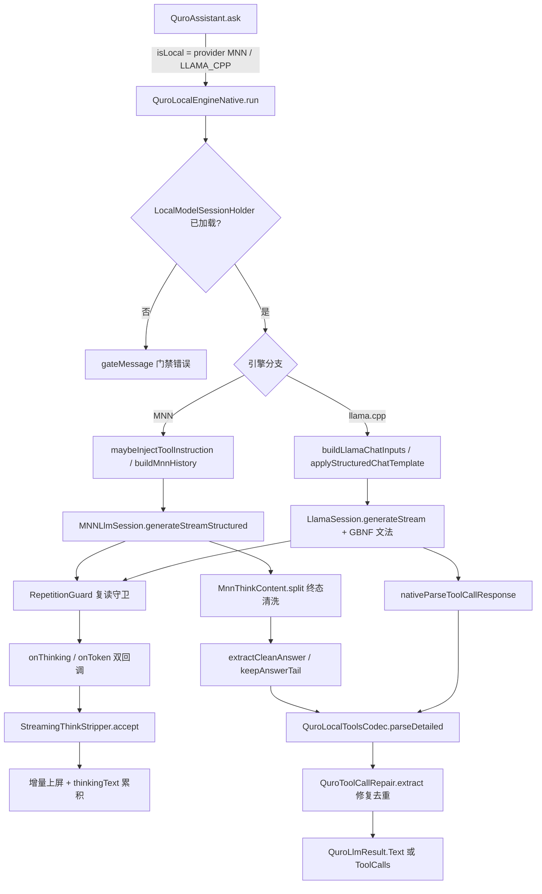

# 端侧推理架构（MNN / llama.cpp）

端侧推理链路负责把本地模型（MNN 模型目录 / llama.cpp GGUF）在一次会话里跑通：加载与门禁、prompt 构造、思考段与正文分流、工具调用编解码与容错修复、生成串行化与取消。

---

## 1. 职责边界

**负责**

- 本地模型会话的生命周期：`LocalModelSessionHolder` 持有已加载会话，`QuroLocalEngineNative.run()` 在会话未就绪时直接返回门禁错误，不隐式加载。
- 两家引擎的差异化适配：MNN 走 `generateStreamStructured` / `generateStream`，llama.cpp 走 `applyStructuredChatTemplate` / `applyChatTemplate` + `nativeParseToolCallResponse`。
- 思考段与可见正文的**流式**分离（`StreamingThinkStripper` + 原生 `ThinkSplitter` + `MnnThinkContent.split`）。
- 工具调用的编码（提示词注入）与解码（宽松解析 + 纠错去重），以及展示文本的净化。
- 生成串行化（`genLock`）、取消透传（`isCanceled`）、复读兜底（`RepetitionGuard`）。

**不负责**

- 云端 /chat/completions 协议（见 `docs/architecture/inference-cloud/README.md`）。
- 工具的实际执行与权限（由 `QuroToolRouter` / `QuroToolEngine` 承担）。
- 会话历史的裁剪与 token 预算（由 `QuroConversation.toLlmMessages` 与 `QuroModelContextBudget` 承担；端侧只通过 `compactForLocal` 做本地兜底瘦身）。

---

## 2. 分层与关键类

自上而下共六层，L0–L4 在 `llm/` 模块内，L5–L6 在 `app` 内。

| 层 | 文件路径 | 职责 |
|---|---|---|
| L6 驱动 | `app/src/full/java/com/ai/assistance/quro/core/network/QuroLocalEngineNative.kt` | 端侧唯一入口。门禁、引擎分支、流式回调、终态清洗、工具温度钳制 |
| L5 编解码 | `app/src/main/java/com/ai/assistance/quro/core/network/QuroLocalToolsCodec.kt` | 工具规格 → JSON、工具指令注入、消息序列编码、`parseDetailed` 委托解析 |
| L5 修复 | `app/src/main/java/com/ai/assistance/quro/core/network/QuroToolCallRepair.kt` | 宽松 JSON 解析、多标签族、参数别名摊平、工具名三级纠错、按身份去重 |
| L4 会话 | `llm/mnn/src/main/java/com/ai/assistance/mnn/MNNLlmSession.kt` | MNN 会话：采样链构造、`generateStreamStructured`、复读守卫 |
| L4 会话 | `llm/llama/src/main/java/com/ai/assistance/llama/LlamaSession.kt` | llama 会话：结构化 chat template、GBNF 文法挂载、思考开关 |
| L4 能力 | `llm/mnn/src/main/java/com/ai/assistance/mnn/MnnModelCapabilities.kt` | 从模型目录 / `llm_config.json` 探测 `supportsThinkingToggle` / `emitsThinkBlock` |
| L4 清洗 | `llm/mnn/src/main/java/com/ai/assistance/mnn/MnnThinkContent.kt` | MNN 终态思考/正文切分（`split`），供 L6 无条件补推 |
| L4 兜底 | `llm/mnn/src/main/java/com/ai/assistance/mnn/RepetitionGuard.kt` | 流式复读检测与退化尾部裁剪（`accept` / `trimDegenerateTail`） |
| L3 引擎抽象 | `llm/core/include/quro/engine.h` | 纯虚 `Engine` 接口：`load` / `prefill` / `decode` / `generate` / `cancel` / `resetKv` |
| L3 类型 | `llm/core/include/quro/engine_types.h` | `TokenChunk`（含 `isThinking`）、`GenParams`、`Callbacks`、`Phase` |
| L4 思考分流 | `llm/core/include/quro/think_splitter.h` | `ThinkSplitter` 状态机：标签跨 token 缓冲、思考段内 `<tool_call>` 保留 |
| L5 资源 | `llm/core/include/quro/resource.h` / `thermal.h` / `memory_arbiter.h` / `backend_policy.h` | 设备画像、温控降档、内存仲裁、按 `Phase` 选后端 |
| L5 句柄 | `llm/core/include/quro/handle_registry.h` / `engine_factory.h` | `jlong` 句柄池与按模型格式（GGUF / MNN）选引擎 |
| L0 JNI | `llm/llama/src/main/cpp/llama_jni.cpp`、`llm/mnn/src/main/cpp/mnn_jni.cpp` | JNI 方法表与回调桥（`kLlamaNativeCount` 需与实际注册数一致） |

---

## 3. 数据流



编号步骤：

1. `run()` 取 `LocalModelLoaders.get() as? LocalModelSessionHolder`，未加载直接走 `gateMessage(snap, model)`。
2. 按 provider 分派到 `runMnn` / `runLlama`；MNN 优先借用常驻会话，借不到才临时加载。
3. 构造输入：MNN 侧 `buildMnnHistory` + 可选 `MNN_NO_THINK_GUARD` 注入；llama 侧 `buildLlamaChatInputs` 产出 prompt，工具场景改用 `applyStructuredChatTemplate`。
4. 进入 `genLock` 临界区后调用生成；回调分 `onThinking` 与 `onToken` 两路。
5. 每个 token 先过 `RepetitionGuard.accept`，命中复读则终止并裁剪退化尾部。
6. `StreamingThinkStripper.accept` 按 `<think` / `</think>` 分流，`rawText` 供终态、`thinkingText` 供思考气泡。
7. 终态：MNN 侧无条件用 `MnnThinkContent.split` 再洗一遍，并由 `extractCleanAnswer` 兜住「只思考没正文」。
8. 工具场景：`parseDetailed(raw, knownNames)` → `QuroToolCallRepair.extract`；产物按 `QuroLlmResult.ToolCalls` 回传。

---

## 4. 关键设计决策

### 4.1 两家引擎共用一份 Kotlin 驱动，只在生成函数处分叉

**为什么**：MNN 与 llama.cpp 的会话模型不同（MNN 需要模型目录 + 采样链，llama 需要 GGUF + GBNF），但门禁、历史构造、思考剥离、工具解析、取消语义完全一致。若各写一份，任何一处修复都要做两遍。

**踩过的坑**：早先两套实现各自剥离思考，行为不一致（一侧吞掉 `<tool_call>`，另一侧不吞），最终统一收敛到 `QuroToolCallRepair` + 同一组标签表。

### 4.2 思考与否由 `TokenChunk::isThinking` 表达，而不是上层猜标签

**为什么**：JNI 边界只传 `jlong` 句柄与基础类型，C++ 对象不外泄；思考归属必须在产出侧就定下来，否则上层在流式拼接时无法区分「正文里的字面 `<think>`」与「真思考段」。

**踩过的坑**：`GenerationCallback.onThinking(String): Boolean` 是**抽象方法**（llama 与 MNN 两侧签名一致，`onThinking(Ljava/lang/String;)Z`）。曾把它写成带默认实现，导致漏实现的一侧静默把思考文本当正文流出。

### 4.3 思考分流状态机下沉到 C++（`ThinkSplitter`），Kotlin 侧再叠一层

**为什么**：token 边界不保证与标签边界对齐，`<think` 可能被切成 `<` + `thi` + `nk>`。C++ 侧 `ThinkSplitter` 用 `Config.maxTagLength = 16` 缓冲可能的标签前缀，未闭合的尾部暂不吐出；`keepToolCallsInThinking = true` 保证思考段里的 `<tool_call>` 不被当成思考文本吃掉。

**踩过的坑**：
- 早期 Kotlin 三份实现各自漏掉「标签跨 token」与「全角标签」，模型用全角 `<ｔｈｉｎｋ>` 时思考全文直接进正文。现由 `normalizeWidth` 全角转半角统一预处理。
- 分流器**每轮未 `reset()`**，上一轮残留的 `inThink` 状态把下一轮开头吞掉。
- `addMarkers` 必须做成幂等并集，否则重复注册同一组标签会重复切分。

### 4.4 MNN 侧另加无标签明文推理兜底

**为什么**：部分 MNN 模型不吐 `<think>` 标签，而是直接输出「让我分析一下…」式明文推理。`StreamingThinkStripper` 与 `stripResidualThink` 只认标签，对这种输出完全失效，用户看到整段推理当正文。

**踩过的坑**：先试 `MNN_NO_THINK_GUARD`（在 system 侧加输出约束），但小模型不总能遵守；因此终态仍用 `extractCleanAnswer` + `keepAnswerTail` 按推理导言行（`REASONING_HEADER` / `REASONING_LINE` / `PLAIN_REASONING_LINE`）从末尾回溯出答案尾部，并用 `LOCAL_ANSWER_EMPTY_HINT` 显式告知「只完成了思考」。

### 4.5 工具调用场景把 temperature 钳到 0.3

**为什么**：本地小模型在高 temperature 下几乎必然产出畸形参数，工具解析失败率陡增。`TOOL_CALL_MAX_TEMPERATURE = 0.3f` 只在带工具规格时生效（`temperature.coerceAtMost(...)`），纯对话不受影响。

### 4.6 全局静态生成锁 + 会话借用

**为什么**：两家引擎的原生会话都不支持并发生成；同时两块显存/内存开销极易触发 OOM。`genLock`（`ReentrantLock`）把生成串行化，`LocalModelSessionHolder.borrowMnn()` / `returnMnn()` 复用常驻会话以避免反复加载。

**踩过的坑**：曾在 `return` 前提前 `unlock`，异常路径漏 `returnMnn()`，导致会话泄漏、后续全部走临时加载路径（表现为「每次回复都要重新加载模型」）。现统一 `try/finally`。

### 4.7 GBNF 文法约束工具输出，但必须真正注册

**为什么**：llama.cpp 侧用 `nativeSetToolCallGrammar(sessionPtr, grammar, triggerPatterns)` 在采样层约束输出，能把「工具调用格式错误」从概率问题变成确定性问题。

**踩过的坑**：JNI 实现写完了但忘了加到方法表，`kLlamaNativeCount` 仍是旧值（14），注册数与实际不符 → 调用侧 `UnsatisfiedLinkError`。修复时同步把 `kLlamaNativeCount` 改为 17。

### 4.8 工具调用解析必须容错（宽松 JSON + 纠错）

**为什么**：本地模型产出的 `arguments` 常见未引号键、单引号、尾逗号、被截断；也可能把工具名写作近义词或加前缀。`QuroToolCallRepair` 自实现 `LooseJson`（不依赖 `org.json`，因为 Android 单测里 `org.json` 是桩）。

**踩过的坑**：
- 工具名纠错阈值取 `minOf(3, maxOf(1, target.length / 4))`：写死 3 会把短名（如 `ls`）纠到任意一个编辑距离 ≤3 的工具上。
- 必须按 `(name, arguments)` 去重（键为 `name + "\u0000" + arguments`），否则模型复读时同一调用被执行 N 次。
- `RESERVED_KEYS` 必须包含 `ARG_ALIASES`，否则 `{"arguments":{...}}`（模型漏写 `name`）会被当成一个名叫 `arguments` 的假工具。
- 扫描上限 `MAX_SCAN_CHARS = 200_000`，避免超长输出上做 O(n²) 扫描。

### 4.9 端侧历史强制收口

**为什么**：1.2B–3B 小模型在长历史下会把早期轮次当当前指令「回放/续写」，表现为乱回复、继续早已完成的任务。原生层每轮都 `reset` 并从完整 history 重新 prefill，因此根因不在 KV 残留，而在喂进去的上下文无界。

**踩过的坑**：曾试图用 `session.reset()` 修乱恢复（同层冗余、无效）。现由 `QuroAssistant` 对本地路径在未显式设置时强制 `effHistoryRounds = 12`，并额外跑 `compactForLocal`（保头裁尾 + `compactToolResults` + 孤儿工具消息剔除）。

---

## 5. 对外接口 / 契约

**`QuroLocalEngineNative`（`app/src/full/.../network/QuroLocalEngineNative.kt`）**

```kotlin
class QuroLocalEngineNative : QuroLocalEngine {
    override fun run(
        model: QuroLocalModel,
        modelName: String,
        messages: List<QuroChatMessage>,
        temperature: Float,
        maxTokens: Int,
        contextWindow: Int,
        toolSpecsJson: String?,
        onToken: ((String) -> Unit)?,
        onThinking: ((String) -> Unit)?,
        isCanceled: () -> Boolean,
    ): QuroLlmResult
}
```

- `private const val TOOL_CALL_MAX_TEMPERATURE = 0.3f`
- `private const val LOCAL_ANSWER_EMPTY_HINT = "（本地模型仅完成了思考过程，未生成可展示的回复。）"`
- `private const val MNN_NO_THINK_GUARD = "【输出约束】直接给出最终回答。绝对不要输出任何思考过程、分析步骤、…"`
- `companion object { private val genLock = ReentrantLock() }`

**`StreamingThinkStripper`（同文件，`internal`）**

```kotlin
internal class StreamingThinkStripper {
    /** 喂入一个增量 token，返回**当前完整可见文本**（剔除思考块及未闭合思考尾部）。 */
    fun accept(chunk: String): String
    fun rawText(): String        // 完整原始累积文本（保留思考段），终态解析唯一依据
    fun thinkingText(): String   // 累积思考文本，供 UI 思考气泡
    fun reset()
    // private const val OPEN_MARKER = "<think"
    // private const val CLOSE_TAG   = "</think>"
}
```

**`QuroLocalToolsCodec`**

```kotlin
object QuroLocalToolsCodec {
    fun encodeTools(specs: List<QuroToolSpec>): String
    fun buildToolInstruction(toolsJson: String): String
    fun withToolInstruction(system: String?, toolsJson: String?): String
    fun encodeMessages(messages: List<QuroChatMessage>): String
    fun parseToolCalls(rawOrJson: String): List<QuroToolCall>
    fun parseDetailed(rawOrJson: String): ParseResult
    fun parseDetailed(rawOrJson: String, knownNames: Collection<String>): ParseResult
    fun toolNamesOf(toolsJson: String?): List<String>
    fun sanitizeForDisplay(text: String): String
    data class ParseResult(val calls: List<QuroToolCall>, val sawMarker: Boolean, val diagnostic: String?)
}
```

**`QuroToolCallRepair`**

```kotlin
object QuroToolCallRepair {
    fun extract(raw: String, knownNames: Collection<String> = emptyList()): Outcome
    fun sanitizeVisible(raw: String): String
    data class Outcome(val calls: List<QuroToolCall>, val sawMarker: Boolean,
                       val repairs: List<String>, val diagnostic: String?)
    // private const val MAX_SCAN_CHARS = 200_000
    // private const val TOOL_CALLS_SENTINEL = "[TOOL_CALLS]"
    // private const val NOTE_UNCLOSED = "检测到未闭合的 <tool_call>（生成可能被最大长度截断），已尽力解析"
    // 内部表：TAG_PAIRS / ARG_ALIASES / RESERVED_KEYS / LITERAL_WORDS
}
```

**原生侧契约（`llm/core/include/quro/`）**

```cpp
struct TokenChunk { const char* text; size_t len; bool isThinking = false; };
enum class Phase { PREFILL, DECODE };
class Engine { /* name/available/load/unload/tokenize/prefill/decode/generate/cancel/resetKv/stats/resolvedBackend */ };
class ThinkSplitter {
    struct Config { bool emitThinking = true; bool keepToolCallsInThinking = true;
                    std::string toolCallOpen = "<tool_call>"; std::string toolCallClose = "</tool_call>";
                    size_t maxTagLength = 16; };
    ThinkSplit feed(const char* data, size_t len);   // 返回 {thinking, visible}，可两段同时非空
    ThinkSplit feed(const std::string& data);
    ThinkSplit finish();                             // 吐出暂缓尾部：未闭合思考段仍归思考
    Segment segment() const;
    bool inThinking() const;
    bool inToolCallInThinking() const;
    void reset();                                    // 换会话/换模型必须调
    static std::vector<Marker> defaultMarkers();     // 6 条：半角 think/thinking + 全角
    void addMarkers(const std::vector<Marker>& extra);  // 幂等并集
    void setConfig(const Config& config);
};
```

规则：`Engine` 不抛异常（错误经 `std::string* err` 返回）；`cancel()` 可在任意线程调用；跨 JNI 只传 `jlong` 句柄。后端选择按 `Phase` 分：`PREFILL` 走 GPU 有优势，`DECODE`（batch=1、显存带宽受限）实测骁龙 8 Elite 上 llama.cpp 的 OpenCL 反而慢于 CPU，因此 `BackendPolicy::resolve(Phase, Backend, BackendCaps)` 按阶段裁决，不全局一刀切。

**JNI 方法（`LlamaNative` / `MNNLlmNative`）**

```kotlin
// llama
nativeSetThinkingMode(sessionPtr: Long, mode: Int)
nativeSupportsThinking(sessionPtr: Long): Boolean        // 语义对齐 supports_thinking = reasoning.mode != NONE
nativeSetToolCallGrammar(sessionPtr: Long, grammar: String?, triggerPatterns: Array<String>?)
nativeClearToolCallGrammar(sessionPtr: Long)
nativeApplyStructuredChatTemplate(...)
nativeParseToolCallResponse(sessionPtr: Long, text: String): String
// mnn
nativeSetThinkMarkers(llmPtr: Long, openTags: Array<String>, closeTags: Array<String>)
nativeGenerateStreamStructured(...)
// 两侧 GenerationCallback 一致
interface GenerationCallback {
    fun onToken(token: String): Boolean
    fun onThinking(token: String): Boolean   // 抽象，无默认实现
}
```

---

## 6. 已知约束与待办

- **思考开关三态未完全对齐**：MNN 侧 `setThinkingMode` 由 `MnnModelCapabilities.emitsThinkBlock` 推导，llama 侧由 `nativeSupportsThinking` 推导；两者语义不同（前者是「会不会吐思考块」，后者是「模型配置是否允许思考」）。跨引擎切换时行为可能不一致，未做统一映射表。
- **`extractCleanAnswer` 是启发式**：对无标签明文推理，靠正则导言行回溯答案尾部；模型改换措辞即失效，只能靠 `LOCAL_ANSWER_EMPTY_HINT` 兜底。需要更稳的判据（待办）。
- **`compactForLocal` 的瘦身是「保头裁尾」**：丢最旧非 system 消息，长任务的早期结论会被裁掉；裁完后要再跑 `pruneOrphanToolMessages`，否则孤儿 tool 消息会让模型乱回复。
- **`RepetitionGuard` 只覆盖 MNN**：llama.cpp 侧暂未接入复读守卫，复读只能靠采样参数抑制（待办）。
- **GBNF 文法覆盖面有限**：目前只在 llama.cpp 侧挂载；MNN 侧没有等价约束，仍靠 `QuroToolCallRepair` 事后修复。
- **串行生成**：`genLock` 是全进程单锁，多会话并发（如子智能体并行）会被完全串行化。
- **未核实项**：`kLlamaNativeCount` 当前值需以 `llama_jni.cpp` 实际注册数为准；本文档写作时依据实施记录为 17。
