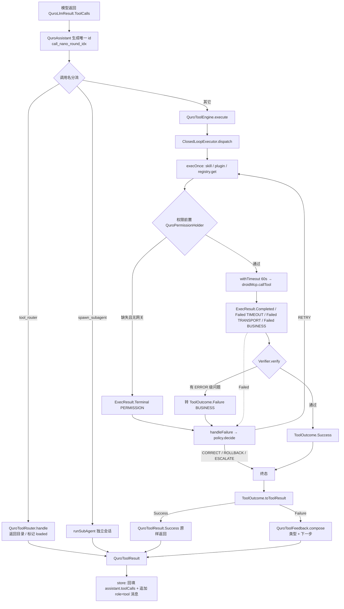

# 工具系统架构

ZorvAI 的 220+ 内置工具从「注册 → 下发 → 执行 → 失败回喂」的全链路治理层。

盘点时间 2026-10-01。所有类名 / 常量 / 数值均已对照源码核实，未核实的已标注。

---

## 1. 职责边界

**负责：**

- 工具的**注册与生命周期**（内置 / 导入 / 技能 / APK 插件贡献 四类来源汇入同一注册表）
- 工具**规格下发**前的合法性护栏（名字字符集、长度、去重、schema 形状）
- 工具**执行**的统一咽喉点（权限前置、超时、失败分类、闭环重试决策）
- 失败结果**回喂模型**的文案组装（分类 + 可执行「下一步」）
- 可选的工具**渐进式披露**（路由目录 + 按需加载）

**不负责：**

- 决定「这一轮要不要调工具」——那是 `QuroAssistant` 的 ReAct 循环（见 `../agent-loop/README.md`）
- 工具结果的截断 / 压缩 / 归档——那是 `QuroConversation.compactToolResults`（压缩在上下文组装侧，归档器由 `QuroAssistant` 注入）
- 单个工具的业务实现——各 `QuroTools*.kt` 自持
- 协议适配（OpenAI `tools` 数组的 JSON 拼装）——由 `QuroLlmClient` 完成

---

## 2. 关键类与文件

| 文件路径 | 职责 |
|---|---|
| `core/tools/QuroTool.kt` | `QuroTool` 接口 + `QuroToolRegistry`（注册表）+ `QuroToolEngine`（执行引擎）三者同文件 |
| `core/tools/QuroBuiltInTools.kt` | `buildQuroRegistry(context)`：内置工具注册入口（README 记为 226 项；文件内 `r.register(...)` 调用 231 处） |
| `core/tools/QuroToolAdapter.kt` | `QuroTool.toMcpTool(engine)`：原创工具适配进 vendored droid-mcp 引擎；`jsonSchemaToToolParameters` / `mapToJson` / `jsonToMap` |
| `core/tools/QuroToolSpecGuard.kt` | 工具名 / 参数的**协议合法性护栏**（N5） |
| `core/tools/QuroToolFeedback.kt` | 工具失败的**分类回喂**（N4）：`ToolFailureKind` + 关键词表 + 「下一步」指令 |
| `core/tools/QuroToolRouter.kt` | 渐进式工具披露（tool_router 目录 + 按需加载） |
| `core/tools/ToolCapabilityDirectory.kt` | 工具能力目录：分类、意图匹配、每工具的 useCases/examples/tips/relatedTools |
| `core/tools/QuroToolUsageHints.kt` | `TOOL_USAGE_HINTS`：每工具的「用户各种口语说法」映射，注入系统提示词 |
| `core/tools/QuroPermissionGate.kt` | `QuroPermissionHolder`：`isGranted(context, perms)` / `requester`（Activity 注入的授权网关） |
| `core/tools/QuroImportedTool.kt` | 导入工具（AI 自写 / 用户粘贴 JSON）与 `QuroImportedToolRegistry` |
| `core/tools/QuroSkillTool.kt` | 技能工具（`skill__<name>`）运行时实例 |
| `core/tools/QuroToolsUiActions.kt` | `uiActionToolNames()`：UI 动作工具名集合，并入 `coreNames` |
| `core/agent/loop/ClosedLoopExecutor.kt` | 闭环执行器：感知-判断-执行-反馈-校验-修正 |
| `core/agent/loop/FailurePolicy.kt` | `RecoveryAction` / `ScenarioFailurePolicy` / `DEFAULT_TABLE` / `FailurePolicyRegistry` |
| `core/agent/loop/ToolOutcome.kt` | `ToolOutcome` 密封接口 + `FailureType` 枚举 |
| `core/agent/loop/Verifier.kt` | `Verifier` 接口 + `DefaultVerifier` |

---

## 3. 数据流 / 控制流

一轮工具调用的完整时序（从「模型吐出 tool_calls」到「结果回灌」）：



关键分支说明：

1. **id 唯一化**：`call_${System.nanoTime()}_${round}_${idx}`。旧实现把整轮所有 call 复用同一 id，撞 id 后结果对不上，模型批量并发调用会整轮错乱。
2. **`skill__` / `plugin__` 分支不走 droid-mcp**：技能读实时指令回灌；插件走 `QuroPluginHost.executePluginTool`。
3. **闭环只在引擎内部循环**，不会额外占用 `QuroAssistant` 的 ReAct 轮次。

---

## 4. 关键设计决策

### 4.1 规格下发必须过护栏，且失败要「响亮」

**为什么**：`tools` 是一整段 JSON，只要**任意一个**工具名不合规，严格上游会**整段 400** —— 结果是「所有工具调用一起失效」，而不是少一个工具。用户看到的是「AI 突然不会用工具了」，日志里只有一句上游 400，完全没有线索指向那个坏工具。

**踩过的坑**：① `distinctBy { it.name }` 会**静默**丢同名工具 —— 全中文技能名经 `sanitizeToolName` 后全部坍缩成 `skill__skill`（每个非 ASCII 字符 → `-` → 折叠 → 空 → 回退 `"skill"`），被去重到只剩一个，用户装 N 个中文技能实际只能调 1 个，零日志。② 只查「净化结果 ≠ 原文」会漏掉**纯 ASCII 超长名**：它与原文相同、不带哈希尾缀，截断后两个共享长前缀的名字直接撞名 —— 这个 bug 是被单测抓出来的。

**现在**：`QuroToolSpecGuard.dedupe` 返回被丢弃的名字，`QuroToolRegistry.guardSpecs` 对重复打 `Log.w`、对非法名打 `Log.e` 并剔除 —— 把「全挂」换成「少一个且看得见」。

### 4.2 净化必须发生在「注册端」而非「下发端」

**为什么**：若在下发边界才改名，模型会调用一个注册表里不存在的名字 → 必然「未知工具」。所以 `sanitizeName` 只用于 `QuroSkill.toolNameOf`、导入工具入库等生产端，保证 `registry.get(name)` 与模型看到的名字是同一个。

哈希尾缀取**净化前原文（trim 后）的 SHA-256 前 8 位**：同一技能名永远得到同一工具名，反向查找不会失效。

### 4.3 失败回喂必须说清「重试有没有用」

**为什么**：改造前失败只回喂一行原始错误文本，模型最常见反应是**原样重试** —— 这正是 `QuroAssistant` 里「连续重复失败」检测被频繁触发的原因。那些停止不是模型太笨，而是它从未被告知「这类错误重试没用」。

**踩过的坑**：分类必须基于**原始文本**。兜底占位文案「未提供失败原因」本身含「失败」二字，若拿它去分类会把自己判成 BUSINESS，把「什么都不该假设」的场景伪装成业务失败。

### 4.4 成功结果绝不包装

**为什么**：工具正常输出里可能恰好含 `"not found"`（搜索类工具的「no matches found」）。对成功结果也跑失败分类，会把成功染上失败标记，凭空制造假故障。`toToolResult` 里 `Success` 分支原样返回。

### 4.5 关键词表的顺序即优先级

`KEYWORD_TABLE` 从具体到宽泛，且刻意安排了几处反直觉的先后：

- `CANCELLED` 最前 —— 取消信息常带其它词（"cancelled: connection closed"），先判 TRANSPORT 会得出「可重试」的错误结论，而取消**绝不能**自动重试。
- `TIMEOUT` 早于 `TRANSPORT`（"connect timeout" 同时含 connection）；`PERMISSION` 早于 `NOT_FOUND`（"permission denied: no such file" 堵点是权限）；`INVALID_ARGS` 早于 `NOT_FOUND`（"required parameter 'path' not found" 是参数问题）。
- 刻意不用宽泛的 `"json"` —— 「JSON 文件不存在」属于 NOT_FOUND。
- `BUSINESS`（"失败"/"error"）放最后 —— 放前面会吞掉上面所有具体分类。

### 4.6 两套失败词汇，用穷尽 `when` 防漂移

`FailureType`（闭环自动恢复决策用，6 值）与 `ToolFailureKind`（回喂模型用，9 值）**不是同一件事**：`NOT_FOUND` / `ENV_MISSING` / `INVALID_ARGS` 在闭环里都归 BUSINESS，但回喂时必须区分「别用同一参数重试」「重试无效换工具」「对照 Schema 改」。

`kindOf(FailureType)` 写成**不带 `else` 的穷尽 `when`** —— 今后给 `FailureType` 加值，编译即失败，强制同步。

### 4.7 工具集分档：coreSpecs 而非全量下发

**为什么**：全量工具 definitions 曾达 ~19.8K tokens；大量 API 中转 / 代理对工具数量或总 token 有上限（常见 20–30 个，或 6–8K token），超限后会**静默丢弃整个 `tools` 字段** —— 表现为「纯问答、不执行动作」。

`coreSpecs()` 用 `coreNames` 白名单筛（含 `uiActionToolNames()`），再并入导入工具、插件工具、技能工具；`fullSpecs()` 全量，仅在 `cfg.useFullTools` 时启用。

### 4.8 渐进式披露默认关闭

`QuroToolRouter.PROGRESSIVE` 当前为 `false`，**源码中无任何赋值点**（`QuroAssistant.kt:308` 是唯一读取处）。设计是每轮只下发 `tool_router` 目录 + `ALWAYS_ON` 常驻集 + 对话级 `loaded` 集，模型用 `get_schema(name=...)` 加载后下一轮才能直接调用，已加载集跨轮次保留、新会话清空。

---

## 5. 对外接口 / 契约

### QuroTool（`core/tools/QuroTool.kt:25`）

```kotlin
interface QuroTool {
    val name: String
    val description: String
    val parametersJson: String
    fun run(context: Context, arguments: String): String
    val requiredPermissions: List<String> get() = emptyList()
}
```

单工具执行硬超时：`private const val TOOL_EXEC_TIMEOUT_MS = 60_000L`（`QuroTool.kt:24`）。

### QuroToolRegistry（`QuroTool.kt:36`）

```kotlin
class QuroToolRegistry {
    companion object { @Volatile var active: QuroToolRegistry? = null }
    var skillToolsEnabled: Boolean = true
    var maxSkillTools: Int = 16
    fun register(tool: QuroTool)
    fun remove(name: String): Boolean            // skill__ 前缀会反向级联删技能定义
    fun get(name: String): QuroTool?
    fun all(): List<QuroTool>
    fun specs(): List<QuroToolSpec>
    fun coreSpecs(): List<QuroToolSpec>          // coreNames 白名单 + 导入 + 插件 + 技能
    fun fullSpecs(): List<QuroToolSpec>
    fun attach(context: Context)                 // 绑定 Context + mergeImported
    fun mergeImported(context: Context)
    fun mergeSkills(context: Context)
}
```

### QuroToolEngine（`QuroTool.kt:334`）

```kotlin
class QuroToolEngine(private val registry: QuroToolRegistry) {
    fun setContext(ctx: Context)
    fun specs(): List<QuroToolSpec>
    suspend fun execute(context: Context, calls: List<QuroToolCall>): List<QuroToolResult>
    fun listToolsMcpJson(): String
}
```

场景键 `scenarioFor`：`skill__` → `"skill"`、`plugin__` → `"plugin"`、其它 → `"tool"`。

### QuroToolSpecGuard（object）

| 成员 | 值 / 签名 |
|---|---|
| `MAX_TOOL_NAME_LEN` | `64`（OpenAI function name 上限） |
| `EMPTY_SCHEMA` | `{"type":"object","properties":{}}` |
| `isLegalName(name)` | 非空 + ≤64 + `^[A-Za-z0-9_-]+$` |
| `sanitizeName(raw, maxLen = MAX_TOOL_NAME_LEN)` | 净化 + 丢失时追加 `-<SHA-256 前 8 位>` |
| `hash8(s)` | SHA-256 十六进制前 8 位 |
| `looksLikeJsonObject(s)` | 仅做首 `{` 尾 `}` 形状判断（不引 `org.json`，保可测） |
| `normalizeParametersJson(s)` | 形状可疑 → `EMPTY_SCHEMA` |
| `dedupe(specs)` | 返回 `DedupeResult(specs, droppedDuplicates)`，保留先出现者 |

### QuroToolFeedback（object）· `ToolFailureKind`

| kind | `retryable` |
|---|---|
| `INVALID_ARGS` | true（修正参数后） |
| `NOT_FOUND` | **false** |
| `PERMISSION` | **false** |
| `TIMEOUT` | true |
| `TRANSPORT` | true |
| `ENV_MISSING` | **false** |
| `CANCELLED` | **false** |
| `BUSINESS` | **false** |
| `UNKNOWN` | true |

```kotlin
const val MARKER = "[工具失败]"
fun kindOf(type: FailureType): ToolFailureKind      // 穷尽 when，无 else
fun kindOfText(raw: String?): ToolFailureKind
fun isWrapped(text: String?): Boolean                // 幂等判定
fun directiveOf(kind: ToolFailureKind): String
fun compose(toolName: String, raw: String?, known: ToolFailureKind? = null): String
```

回喂文本形状：

```
[工具失败] tool=read_file kind=NOT_FOUND retryable=false
原因：No such file or directory: /sdcard/a.txt
下一步：目标不存在。不要用同一参数重试：请先用列目录/搜索类工具确认…
```

原因文本截断上限 `MAX_REASON_CHARS = 600`（private）。

### QuroToolRouter（`QuroToolRouter.kt:20`）

```kotlin
companion object { @Volatile var PROGRESSIVE: Boolean = false; val ALWAYS_ON: Set<String> }
fun setSpecs(specs: List<QuroToolSpec>)
fun reset()
fun activeSpecs(): List<QuroToolSpec>          // catalogSpec + ALWAYS_ON + loaded（跳过 tool_discovery）
fun handle(name: String, arguments: String): String
```

`tool_router` 支持 6 个 action：`list_categories` / `list_tools` / `match_intent` / `get_schema` / `get_best_practices` / `get_directory_summary`。

### 闭环契约（`core/agent/loop/`）

```kotlin
enum class FailureType { PERMISSION, TIMEOUT, TRANSPORT, PARSE, BUSINESS, UNKNOWN }

sealed interface ExecResult {
    data class Completed(val raw: String) : ExecResult
    data class Failed(val type: FailureType, val message: String, val raw: String? = null, val cause: Throwable? = null) : ExecResult
    data class Terminal(val type: FailureType, val message: String) : ExecResult   // 不重试
}

enum class RecoveryAction { RETRY, CORRECT, ROLLBACK, ESCALATE }

data class ScenarioFailurePolicy(
    val scenario: String,
    val table: Map<FailureType, List<RecoveryAction>> = DEFAULT_TABLE,
    val maxAttempts: Int = 5,
)
```

`DEFAULT_TABLE` 默认序列：

| FailureType | 序列 |
|---|---|
| `PERMISSION` | `[ESCALATE]` |
| `TIMEOUT` | `[RETRY, RETRY, ESCALATE]` |
| `TRANSPORT` | `[RETRY, RETRY, ESCALATE]` |
| `PARSE` | `[CORRECT, ESCALATE]` |
| `BUSINESS` | `[RETRY, RETRY, CORRECT, ROLLBACK, ESCALATE]` |
| `UNKNOWN` | `[RETRY, ESCALATE]` |

`DefaultVerifier` 的 `FAIL_MARKERS`：`工具执行失败` / `工具执行异常` / `工具执行超时` / `未知工具` / `需要权限`；空返回判 `EMPTY_RESULT`（ERROR 级）。

---

## 6. 已知约束与待办

| # | 约束 / 待办 | 位置 |
|---|---|---|
| 1 | `QuroToolRouter.PROGRESSIVE` 无赋值点，渐进式披露路径当前**默认未启用** | `QuroToolRouter.kt:24` |
| 2 | `QuroToolRouter.loaded` 跨 `ask()` 不重置 —— 会话内切换任务类型时，上一轮加载的工具仍在下发（启用 PROGRESSIVE 后才暴露） | `QuroToolRouter.kt:109` |
| 3 | 无 `FinishTool` 式显式结束工具，任务终止靠 `round >= 16` 收尾提示 + 系统提示约定 | `QuroAssistant.kt:376` |
| 4 | 闭环场景策略目前只有 `skill` / `plugin` / `tool` 三个键，均走 `DEFAULT_TABLE`（`FailurePolicyRegistry` 无注册点被调用） | `QuroTool.kt:368` |
| 5 | 无 token 成本护栏：工具调用次数 / 累计 token 未设上限 | — |
| 6 | 工具名长度上限 64 是总长，调用方自带前缀（`skill__`）需自行扣减，易在新增前缀时踩坑 | `QuroToolSpecGuard.kt:45-51` |
| 7 | `coreSpecs()` 的 `coreNames` 是硬编码白名单，新增内置工具若忘记加入则默认配置下模型看不到（注释里已有 `get_active_notifications` 的踩坑记录） | `QuroTool.kt:115` |
