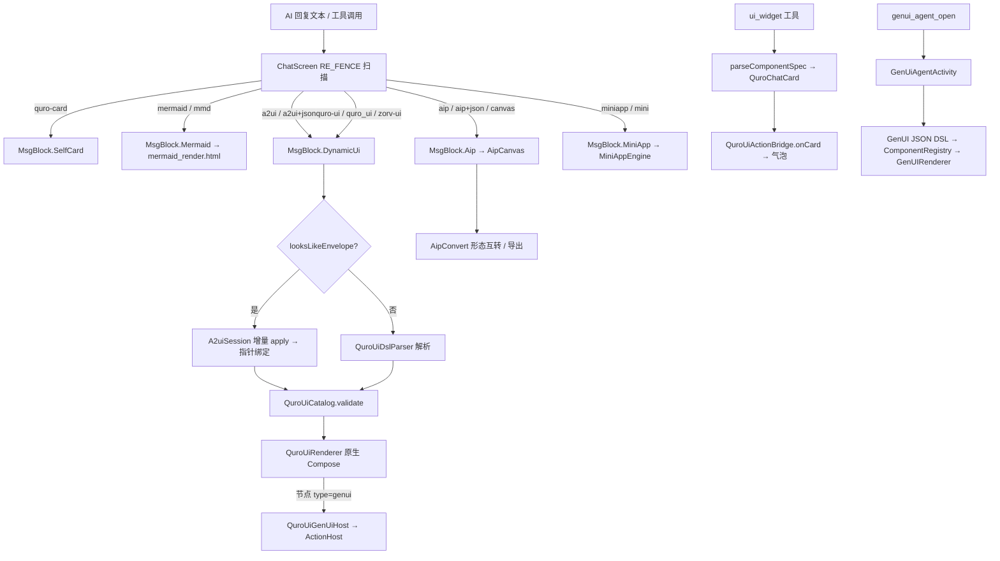

# UI 与渲染架构

把 AI 在对话框里产出的「长文排版 / 单张卡片 / 成体系界面 / 原生小应用 / 网页工程 / 图表」分派到各自独立的渲染管线，全部在端上原生解释执行。

## 1. 职责边界

**负责**
- 消息内围栏的分派（`ChatScreen` 的 `MsgBlock` 路由）。
- 五类渲染管线：AIP 文档排版、`ui_widget` 富卡片、`quro-ui` 动态 UI、GenUI Agent 原生组件、MiniApp Web 应用；外加 Mermaid 图表。
- 卡片 / 节点树的 schema 白名单校验与降级。
- 卡片交互回灌 AI（`QuroUiActionBridge` / `ActionHost` / `callback`）。

**不负责**
- 对话流式传输、工具调用循环（属 agent-loop / tool-system）。
- 端侧代码执行的语言运行时（`QuroLanguageRunner` / `PyEngine` / QuickJS 沙箱）。
- APK 构建（属端侧构建台）、浏览器内核（属浏览器 2.0）。

## 2. 四套装置的分工与边界（最易混淆处）

| | ① `ui_widget` 富卡片 | ② `quro-ui` 动态 UI | ③ GenUI Agent | ④ MiniApp Web 应用 |
|---|---|---|---|---|
| **入口** | 工具 `ui_widget` / `ui_card` / `ui_control` | ` ```quro-ui ` 或 ` ```a2ui ` 围栏 | 工具 `genui_agent_open` | 工具 `miniapp` / ` ```miniapp ` 围栏 |
| **AI 产出** | 单张组件卡的 JSON `spec` | 组合式 JSON DSL 节点树 / A2UI JSONL 信封 | **GenUI JSON DSL** | HTML + JS + CSS |
| **运行时** | `parseComponentSpec` → Compose 卡片 | `QuroUiDslParser` + `A2uiInterpreter` → `QuroUiRenderer`（纯 Compose） | `:genuiagent-sdk`：`ComponentRegistry` → 原生 Compose 组件树 | `MiniAppEngine` WebView + `native.*` 桥 + `Page()` 运行时 |
| **产物落点** | 对话框气泡内 / 底部卡片栏 | 对话框内面板 | 独立全屏 `GenUiAgentActivity`（也可经 `QuroUiGenUiHost` 嵌进 quro-ui） | 对话框卡片 + `filesDir/studio/miniapp/<name>/` 工程目录，与工具箱「Web 应用」面板同一份文件 |
| **适用** | 一个数据点、一组快捷操作 | 表单 + 图表 + 列表联动的**成体系界面** | **原生控件**形态的可交互界面（计算器 / 看板 / 小游戏） | 网页形态、需要 `native.*` 调本机能力的**工程** |

**旁系（非上述四套，别混）**
- `miniapp_sdk`（`:miniapp-sdk`）：WXML/WXSS/JS + `wx.*` + 自研 Canvas/FlexLayout 引擎，落工具中心「小程序（原生引擎）」面板。与 `miniapp`（HTML + WebView）是两套引擎。
- `game_ui`：不是新管线，只是「用 ` ```quro-ui ` 渲染棋盘 + `callback` 回收操作 + AI 维持状态」的用法约定。
- **已下线**：旧「生成式 UI 对话画布」`genui_open` 与原生 UI 引擎 `genui_native_ui`（旧名 `create_miniapp`）已随 `:genui` 模块在 v1.0.96 删除；`ChatScreen.isGenUiLang()` 恒返回 `false`。

**选择规则**：一张流程图 / 架构图 → ` ```mermaid ` 围栏；一个网页成品 → ` ```html ` 围栏；一个指标 / 一组按钮 → `ui_widget`；表单 + 图表 + 列表联动 → ` ```quro-ui `；要原生控件的小应用 → `genui_agent_open`；要 `native.*` 能力的 Web 工程 → `miniapp`；要微信小程序语法 → `miniapp_sdk`；长文档 / PPT / 导图 → `aip_compose`。

## 3. 分层与关键类

| 层 | 文件 | 职责 |
|---|---|---|
| 围栏分派 | `app/.../ui/ChatScreen.kt` | `RE_FENCE` 扫描 → `MsgBlock`；`isSelfCardLang` / `isDynamicUiLang` / `isGenUiLang` 判定顺序 |
| AIP 协议 | `app/.../core/canvas/Aip.kt` | 信封结构、Block 密封类、四级降级枚举 `Degradation` |
| AIP 转换 | `app/.../core/canvas/AipConvert.kt` | doc ↔ deck ↔ mindmap 互转、`toMarkdown` / `toPptxText` |
| AIP 路由 | `app/.../core/canvas/CanvasRouter.kt` | 三档通道 A/B/C + 五级决策 |
| AIP 工具 | `app/.../core/tools/AipComposeTool.kt` | `aip_compose`，L1 字段修复 + blocks 自动合成 |
| AIP 渲染 | `app/.../ui/canvas/AipCanvas.kt` | Compose 原生块级渲染 |
| 富卡片 | `app/.../core/tools/QuroToolsUiWidget.kt`、`QuroToolsUiCards.kt` | `ui_widget` / `ui_card` 工具 |
| 富卡片 | `app/.../core/cards/QuroCardCatalog.kt`、`QuroChatCard.kt`、`QuroChatCardStore.kt` | 卡片模板目录、卡片密封类、卡片栏状态 |
| 富卡片 | `app/.../core/tools/QuroUiActionBridge.kt` | `onCard` 桥 → 挂进当前助手消息气泡；`request` 分发 |
| 动态 UI | `app/.../core/ui/dynamicui/QuroUiDslParser.kt` | 围栏提取 → JSON 语法修复 → 逐字段建树 |
| 动态 UI | `app/.../core/ui/dynamicui/A2uiEnvelope.kt` | JSONL 信封 `createSurface` / `updateComponents` / `updateDataModel` / `deleteSurface` |
| 动态 UI | `app/.../core/ui/dynamicui/QuroUiCatalog.kt` | A2UI 第①层：组件 / 动作白名单与约束校验 |
| 动态 UI | `app/.../core/ui/dynamicui/A2uiInterpreter.kt` | 总装：信封增量 apply / DSL 解析 → Catalog 校验 → 节点树 |
| 动态 UI | `app/.../core/ui/dynamicui/QuroUiNode.kt`、`QuroUiRenderer.kt`、`QuroUiColor.kt`、`QuroUiIcons.kt`、`QuroUiPointer.kt` | 节点模型、Compose 渲染、颜色解析、图标、指针绑定 |
| 动态 UI | `app/.../core/ui/dynamicui/QuroUiGenUiHost.kt` | 把 GenUI 组件交互桥回 quro-ui 回调循环 |
| GenUI SDK | `genuiagent-sdk/.../sdk/GenUI.kt` | SDK 入口 |
| GenUI SDK | `genuiagent-sdk/.../sdk/dsl/` | `UISpec` / `UIComponent` / `StyleBuilder` / `Dimension` / `GenUIAction` / `GenUIEvent` / `DslParser` / `StreamingParser` |
| GenUI SDK | `genuiagent-sdk/.../sdk/render/` | `ComponentRegistry` / `GenUIRenderer` / `StyleResolver` / `RenderContext` |
| GenUI SDK | `genuiagent-sdk/.../sdk/interaction/` | `ActionExecutor` / `ActionHost` / `DefaultActionHost` / `FormState` |
| GenUI SDK | `genuiagent-sdk/.../sdk/state/GenUIStateStore.kt`、`skill/GenUISkill.kt`、`skill/DynamicRegistry.kt` | 组件级状态、运行时注册新组件 |
| GenUI SDK | `genuiagent-sdk/.../sdk/components/BuiltinComponents.kt` | 545 处 `register()`，内置组件族 |
| GenUI App | `app/.../genui/aiapp/GenUiAgentActivity.kt`、`brain/ZorvBrain.kt`、`tools/RegisterComponentTool.kt`、`tools/GenUITool.kt` | 独立全屏应用、主设置装配、`register_component` |
| MiniApp | `app/.../core/miniapp/MiniAppEngine.kt`、`MiniAppBridgeInterface.kt`、`AciModule.kt`、`CryptoModule.kt`、`LocationModule.kt`、`SqlStorageModule.kt` | WebView 运行时、`@JavascriptInterface` 原生桥与扩展模块 |
| MiniApp | `app/.../core/tools/MiniAppTool.kt`、`MiniAppManual.kt`、`MiniAppSdkTool.kt`、`app/.../tools/MiniAppAliasTool.kt` | `miniapp` CRUD / run / manual；`miniapp_sdk`；`workbench` |
| Mermaid | `app/src/main/assets/libs/mermaid.min.js`、`app/src/main/assets/www/mermaid_render.html` | 离线 Mermaid.js 与 SVG 注入桥接页 |
| 多语言运行器 | `app/.../core/terminal/QuroLanguageRunner.kt` | JS / Python / HTML / JSON / CSS / XML / C / C++ / Java 的检测与渲染 |

## 4. 数据流



## 5. 关键设计决策

**1. A2UI 铁律：模型输出永远是「数据」不是「代码」，端上绝不执行 AI 生成的代码**
- 为什么：旧 `:genui` 走 WebView 执行 AI 自写 JSX/HTML，既不可控又与「原生可交互」目标冲突。
- 结果：该路径整体删除，`isGenUiLang()` 恒 `false`，任何 `zorv*` / `quro*` 围栏统一走原生解释器。

**2. 六层 A2UI 栈，各层职责不重叠**
① Catalog 白名单定契约 → ② System Prompt 教用法 → ③ JSONL 信封传数据 → ④ Pointer 做绑定 → ⑤ Kotlin 解析器当翻译 → ⑥ Compose 出像素。`QuroUiCatalog` 校验不过的节点就地降级成静态文本，**绝不「尽量渲染」**——宁可少渲染，也不渲染未经许可的结构。

**3. 围栏判定顺序：`quro-card` 必须先于 `quro-ui`**
- 踩过的坑：`isDynamicUiLang` 对含 `quro` / `zorv` 的任意 lang 都返回 `true`，若不先拦截，```quro-card 会被劫持成 quro-ui 节点树，表现为「自研卡片不渲染、围栏残留」。

**4. AIP 四级降级，永不空白气泡**
L1 字段级修复 → L2 块级降级（单块 → `Block.Fallback`）→ L3 通道降级（回退增强 Markdown）→ L4 纯文本兜底（JSON 源码不上界面）。流式期间用 `lastSafeCut` 做截断修复，残缺信封也能部分渲染。

**5. `CanvasRouter` 三档通道 + 五级决策**
优先级：硬指令（用户说「做成 PPT」）> 信封头信号（流式前 120 token 的 `kind`）> 意图分类（关键词规则表）> 复杂度启发式（长度 > 1500 或 h2 ≥ 3 或含表格图表）> 兜底 A 通道。模型自报形态优先于分类器——模型最清楚自己要输出什么。

**6. `ui_widget` 卡片挂气泡而非全局卡片栏**
`QuroUiActionBridge.onCard` 把卡片挂进当前助手消息；桥未连接时才退回全局卡片栏兜底。

**7. GenUI Agent 复用 ZorvAI 主设置，不自带配置页**
`brain/ZorvBrain.kt` 装配：模型配置读 `QuroModelConfigRepository`（同一份 `quro_model_config`）、灵魂人格走 `QuroSoulPromptEngine.build(SoulContext(...))`、工具集复用 `QuroToolRegistry.active`，执行走 `QuroToolEngine.execute(...)`（权限预检 / 超时 / 重试全继承）。

**8. `QuroUiGenUiHost` 必须实现 `ActionHost` 的全部方法**
- 踩过的坑：GenUI 组件是「拼」出来的，渲染与交互能力与宿主无关；只桥接部分方法会让 `navigate` / `showDialog` / `openScreen` / `playMedia` 在对话框里变成空操作，给人「只能在全屏用」的错觉。

**9. MiniApp 是「两步交付」**
`miniapp(action="create", ...)` 写工程 → `miniapp(action="run", ...)` 才产出可内嵌渲染的自包含 HTML。工程落 `filesDir/studio/miniapp/<name>/`，与工具箱「Web 应用」面板同一份文件，AI 写完面板里立刻能看到。

**10. `MiniAppManual` 是唯一真相源**
手册由引擎源码反推（页面运行时与 `native.*` 桥 → `MiniAppEngine`；打回条件 → `MiniAppTool`），禁止写「微信支持所以应该也行」。引擎改了必须同步改手册。

**11. Mermaid 对人与 AI 同时开放**
库内联进 APK（`assets/libs/mermaid.min.js`），不依赖 CDN；用户自己发 ```mermaid 围栏也渲染。

## 6. 对外接口 / 契约

**`MsgBlock` 类型**（`ChatScreen`）
`Text` / `Heading` / `Code` / `Quote` / `Table` / `Rule` / `Mermaid` / `Aip` / `DynamicUi` / `MiniApp` / `SelfCard`。

**围栏语言标识**
- `mermaid` / `mmd`
- `aip` / `aip+json` / `canvas`
- `a2ui` / `a2ui+json`
- `miniapp` / `mini`（另：` ```html ` 内容带 bridge 运行时标记时也按 MiniApp 渲染）
- `quro-ui` / `quro_ui` / `zorv/ui` / `zorv-ui` / `zorv_ui` / 含 `quro` 或 `zorv` 的任意标签
- `quro-card` / `quro_card` / `zorv-card` / `zorv_card`

**AIP v1 信封**
```json
{ "v": 1, "kind": "doc | deck | mindmap",
  "meta": { "title": "...", "subtitle": "...", "author": "..." },
  "theme": { "name": "...", "accent": "#RRGGBB" },
  "blocks": [ { "id": "b1", "type": "heading", "data": { "level": 1, "text": "..." } } ] }
```
块类型：`heading` `section` `paragraph` `list` `table` `chart` `quote` `callout` `code` `html` `steps` `timeline` `columns` `image` `mindmap` `slide` `divider`，未知类型走 `fallback`。
降级枚举：`Aip.Degradation { Ok, FieldRepair, BlockDown, ChannelDown, TextDown }`；`PROTOCOL_VERSION = 1`。
工具参数：`aip_compose(kind, title, subtitle, author, accent, blocks[].{id,type,data}, export=docx|pptx|md|pdf)`；`blocks` 可省略，从 `sections` / `content` / `markdown` / `text` 自动合成。

**`ui_widget` spec**
`{ "type": "...", "title": "...", "id": "可选", ...各类型字段 }`，解析统一走 `parseComponentSpec`。
`command` 语法：`ui_open_*` / `ui_toggle_*` / `linux:install` / `run:<命令>` / `widget:<自定义>` / `open:<url>` / `copy:<文本>` / `ai:<提示词>` / `screen:<名称>`。
覆盖 Input / Data / Media / Layout / Action / Navigation / Decoration 七大归类，另有 `mermaid` / `html` / `miniapp` / `composite`（`stack` / `tabs` / `accordion`，可嵌套）与 legacy 的 `todo` / `chart` / `note` / `actions`。

**`quro-ui` 节点树**
```json
{ "root": { "type": "column", "children": [
  { "type": "text", "props": { "text": "任务看板" } },
  { "type": "button", "props": { "label": "新建", "command": "ui_open_todo" } } ] } }
```
`QuroUiCatalog.COMPONENTS` 白名单含 `column` `row` `box` `card` `pane` `text` `image` `icon` `badge` `progress` `divider` `spacer` `markdown` `video` `audio` `browser` `code` `html` `button` `text_input` `checkbox` `switch` `select` `slider` `list` `tabs` `chips` `mermaid` `stat` `table` `alert` `rating` `gauge` `countdown` `steps` `timeline` `todo` `expandable` `pie` `compare` `radar` `heatmap` `kanban` `carousel` `timer` `tagcloud` `avatargroup` `counter` `breadcrumb` `color` `media` `form` `game_board` `genui`。
`ACTIONS` 白名单：`callback` `toggle` `open_url` `copy` `tool_call` `skill` `open_app` `open_screen` `render_html` `render_vispro` `visual_popup` `visual_ask`。

**A2UI JSONL 信封**（`application/a2ui+json`）
每行一条：`createSurface` / `updateComponents` / `updateDataModel` / `deleteSurface`，字段 `type` + `surface` + 载荷。

**工具名清单**：`ui_widget` / `ui_card` / `ui_control` / `ui_tree` / `game_ui` / `aip_compose` / `miniapp` / `miniapp_sdk` / `workbench` / `genui_agent_open` / `register_component`。

## 7. 已知约束与待办

- **README 与源码不一致（待同步）**：`README.md` §1.8 仍写「三套装置并存（Web 应用 / 生成式 UI 画布 / GenUI Agent）」，其中「生成式 UI 画布 `genui_open`」已在 v1.0.96 随 `:genui` 模块删除；§1.9 的 `ui_widget`「可视化」归类里列出的 `genui` 子类型，实际指向的是 `QuroUiCatalog` 中 `type="genui"` 节点经 `QuroUiGenUiHost` 桥接 GenUI SDK 的路径，不是旧画布。
- **两套 DSL 在渲染层有耦合**：`QuroUiRenderer` 直接 `import com.ai.assistance.quro.genui.sdk.GenUI` 与 `GenUITheme`，即 quro-ui 的渲染依赖 `:genuiagent-sdk`。改动 SDK 主题会影响动态 UI。
- **AIP C 通道（WebView）未独立建设**：`CanvasRouter.Channel.C` 枚举与判定保留，实际渲染复用既有 html 工件路径。
- **`ui_widget` 与围栏路径并存**：`mermaid` / `html` / `miniapp` 既能作为 `ui_widget` 的 `type`，也能作为独立围栏，两条渲染路径需保持一致（否则同一种内容在不同入口表现不同）。
- **quro-ui 的容错边界**：只有 DSL 解析器的严格 JSON 解析会产出 `Failure`；其后所有字段读取都是 best-effort，单节点坏掉不影响整棵树，但这也意味着「结构写错」不会显式报错，只表现为降级文本。
- **MiniApp 同目录资源**：预览时转 `data URI`，与面板内 `app://` 渲染保持一致；工程名/路径做安全化以防 `..` 越界写入。
- **待核实**：`MsgBlock.SelfCard` 的 `selfCard` 开关默认取值；`AipCanvas` 是否已覆盖全部 17 种块类型的流式渲染；`QuroUiPointer` 与 `updateDataModel` 的绑定在 `ui_widget` 路径下是否可用（该路径目前未见指针绑定）。
