# 小程序工作室 技术构架

> ZorvAI · MiniAppFramework（AI 生成 HTML/JS 内联渲染）

## 构架介绍

**小程序工作室**是 ZorvAI 内「AI 生成即可运行」的可视化小程序工作台，核心是 **MiniAppFramework**：把 LLM 产出的 HTML/JS 在应用内渲染容器中沙箱运行，支持同目录资源（图片自动转 `data URI`）、私有 `app://` 协议、对话框内联预览与独立面板编辑。用户/AI 可在面板新建、编辑、运行小程序，无需打包上架。

它把「写代码」变成「对话即产物」：AI 生成 → 安全化写入 studio 目录 → 面板/对话框内联渲染 → 运行/分享，形成低门槛的可编程能力面，是 ZorvAI 工具生态的轻量扩展通道。

- **内联渲染**：HTML/JS 跑在应用内 WebView/内联容器，免安装、即写即跑。
- **资源自包含**：同目录图片在预览时转 `data URI`，与面板内 `app://` 渲染一致，避免路径错位。
- **安全写入**：工程名/路径做安全化，防止 `..` 越界写入 studio 目录外。
- **双入口**：对话框内联预览 + 独立小程序面板编辑，互相打通。

## 分层技术构架

```mermaid
graph TB
  subgraph L5[集成层]
    A1[对话框内联渲染] --> A2[工具中心小程序面板]
    A2 --> A3[节点编辑器联动 / 分享导出]
  end
  subgraph L4[运行层]
    B1[MiniAppFramework Runtime] --> B2[app:// 协议解析]
    B2 --> B3[资源解析 data URI / 生命周期]
  end
  subgraph L3[编辑层]
    C1[小程序面板 新建/编辑/删除] --> C2[run 对话框预览]
    C2 --> C3[模板示例 / 快照状态]
  end
  subgraph L2[生成层]
    D1[AI 代码生成 HTML/JS] --> D2[安全化校验 防越界]
    D2 --> D3[writeFlow 工程写入]
  end
  subgraph L1[存储层]
    E1[小程序工程目录] --> E2[同目录资源 / 配置元数据]
  end
  subgraph L0[引擎层]
    F1[WebView / 内联渲染内核] --> F2[JS 执行沙箱]
  end
```

## 核心组件

| 组件 | 职责 | 说明 |
|---|---|---|
| MiniAppFramework | 小程序运行内核 | 内联渲染 HTML/JS、沙箱隔离 |
| 小程序面板 | 可视化编辑/管理入口 | 新建示例、编辑、删除、运行 |
| run 对话框预览 | 对话框内联运行 | 同目录图片转 data URI，与 app:// 一致 |
| app:// 协议 | 私有资源寻址 | 面板内资源定位，与预览同源 |
| writeFlow | 工程写入 | 工程名/路径防 `..` 越界 |

## 关键流程

1. **发起**：用户在小程序面板「新建示例」或对话框请求 → AI 生成 HTML/JS
2. **校验**：对工程名/路径做安全化，防止越界写入 studio 目录外
3. **写入**：`writeFlow` 落盘到 studio 工程目录（含同目录资源）
4. **渲染**：MiniAppFramework 内联渲染；预览时同目录图片转 `data URI`，`app://` 资源定位一致
5. **运行/分享**：面板或对话框内运行，支持导出/分享

## 与系统其它模块的关系

- **终端 4.0**：小程序可调用本地命令
- **技能 Skills**：AI 生成逻辑复用技能工作流
- **MCP**：小程序内唤起连接器动作
- **语音服务**：语音驱动小程序交互
- **节点编辑器**：可视化编排对接小程序
