# 浏览器 2.0 技术构架

> ZorvAI · 内置 AI 浏览器（GeckoView 内核 + 自动化）

## 构架介绍

**浏览器 2.0** 是 ZorvAI 内置的新一代 AI 浏览器：以 **GeckoView**（Mozilla 开源引擎，独立于系统 WebView、版本可控、扩展性强）为内核，叠加「AI 理解 + 自动化操作」能力，让浏览器从「看网页」升级为「替用户办事」的 Agent 入口。脱胎于项目内 TitaniumBrowser 参考实现，对接 `agent-browser` 技能与 `browser_act` 动作引擎，支持页面总结、问答、表单填写、点击导航、截图理解等任务，结果回流到 ZorvAI 对话框与数字人。

- **双内核兜底**：主力 GeckoView，低端机或受限环境回退系统 WebView，保证可用性。
- **AI 原生**：页面 DOM/视觉双通道理解，配合 LLM 做总结、抽取、决策。
- **自动化闭环**：`browser_act` 把「打开→定位→操作→取数」串成可重放动作流。
- **跨模块联动**：可被语音指令驱动、被技能/MCP 唤起、与终端 4.0 协同。

## 分层技术构架

```mermaid
graph TB
  subgraph L6[服务层]
    A1[后台下载/推送] --> A2[保活常驻 / 跨设备同步]
  end
  subgraph L5[联动层]
    B1[语音驱动浏览] --> B2[技能/MCP 唤起]
    B2 --> B3[终端4.0 协同 / 对话框回显]
  end
  subgraph L4[安全层]
    C1[追踪/广告拦截] --> C2[权限管理 / 无痕 / 安全浏览]
  end
  subgraph L3[AI 层]
    D1[browser_act 动作引擎] --> D2[agent-browser 技能]
    D2 --> D3[页面理解 DOM/视觉 / 总结翻译 / 截图]
  end
  subgraph L2[界面层]
    E1[Compose 浏览器 UI] --> E2[标签条/工具栏 / 阅读模式 / 下载管理]
  end
  subgraph L1[核心层]
    F1[SessionManager 多标签] --> F2[Navigation / 历史书签 / Cookie]
  end
  subgraph L0[内核层]
    G1[GeckoView] --> G2[System WebView 兜底 / 网络栈]
  end
```

## 核心组件

| 组件 | 职责 | 说明 |
|---|---|---|
| GeckoView | 渲染内核 | 官方仓库 `maven.mozilla.org`，独立于系统 WebView |
| SessionManager | 多标签会话 | 每标签一个 GeckoSession，生命周期管理 |
| browser_act | 自动化动作引擎 | open/click/fill/extract/screenshot 标准化动作 |
| agent-browser | 浏览器操控技能 | 把自然语言转为 browser_act 动作流 |
| 页面理解 | DOM+视觉双通道 | 抽取可交互元素，供 AI 决策 |
| 隐私拦截 | 追踪/广告过滤 | 规则订阅 + 无痕模式 |

## 关键流程（一次 AI 自动填表）

1. **唤起**：语音/对话框指令 → 浏览器 2.0 打开目标页（GeckoView Session）
2. **理解**：页面理解模块抽取 DOM 可交互元素 + 截图视觉校验
3. **规划**：LLM 生成 browser_act 动作序列（定位字段→填值→提交）
4. **执行**：agent-browser 逐动作回放，必要时视觉纠偏
5. **取数**：结果页抽取 → 总结回对话框/数字人
6. **联动**：如需本地处理，转 terminal_exec 走终端 4.0

## 与系统其它模块的关系

- **终端 4.0**：网页取数 → 本地命令处理
- **技能 Skills**：浏览器类技能复用 agent-browser
- **MCP**：浏览器触发连接器（飞书/云盘…）
- **语音服务**：语音指令驱动浏览与填表
- **数字人**：浏览结果口播/演示
