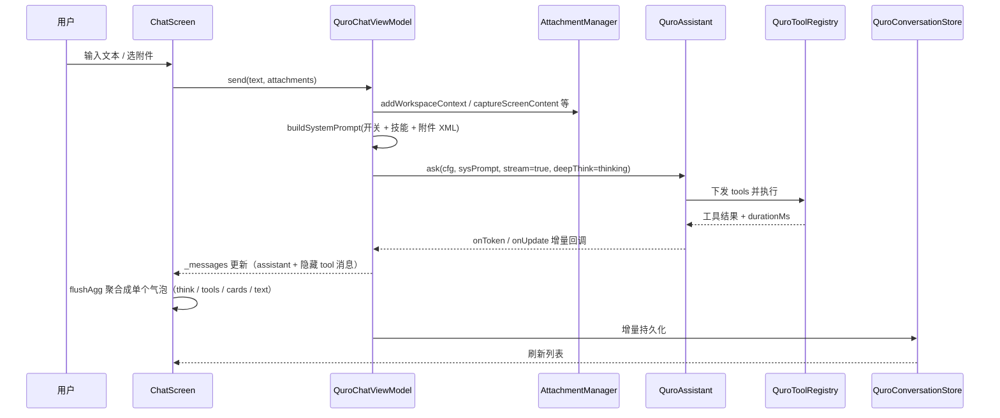

# 智能对话核心（Chat & Messages）

对话框是 ZorvAI 的主界面：发一句话能看到 AI 的思考过程、工具调用、耗时和产出物（网页 / 图 / 卡片）都在同一条气泡里，不用跳转到别的 App。

## 1. 能力清单

| 能力 | 具体表现 |
|---|---|
| 流式输出 | 云端与本地共用同一套增量回调，`assistant.ask(...)` 的 `onUpdate` 边生成边上屏（`ui/QuroChatViewModel.kt:814`、`:1006`） |
| Markdown 渲染 | 围栏代码块、标题、引用、列表、行内 HTML，渲染器见 `ui/QuroMarkdown.kt` |
| 代码块双 Tab | `lang` 为 `html` / `htm` / `markup`（或内容明显是 HTML 标签）时额外提供「代码 \| 预览」双标签页，`showPreview` 默认 `true`（HTML 块直接渲染）；另有复制与「运行」按钮（`ui/ChatScreen.kt:7442` 起） |
| 围栏级 Mermaid | 对话框里写 ` ```mermaid `（或 ` ```mmd `）直接用离线 `assets/runtimes/mermaid.min.js` 渲染成可缩放矢量图；流式未闭合时也同步渲染（`ui/ChatScreen.kt:6850`、`:7015`） |
| 思考段可视化 | `<think>` 内容折叠进气泡内的 `ThinkBlock`（`ui/data/ChatData.kt:50`，渲染见 `ChatScreen.kt:4643`），受「深度思考」开关控制 |
| 工具调用可视化 | `ToolCallBlock`（`ui/ChatScreen.kt:3944`）展示工具名、入参、状态（运行 / 成功 / 警告 / 失败）、执行耗时与结果；耗时 < 1000ms 显示 ms、≥ 1000ms 显示 s（`:4211`） |
| 多轮聚合 | 相邻用户消息之间的 assistant(+隐藏 tool) 消息聚合成单个气泡连续增长（`ui/ChatScreen.kt:470` 的 `flushAgg`） |
| 富组件融进气泡 | AI 经 `ui_widget` / `ui_card` 下发的卡片渲染进气泡（`core/cards/QuroChatCard.kt`） |
| AI 跑代码的产出物直接成卡 | `run_code` 返回 HTML/SVG 时自动转成 `HtmlPreviewCard` 内联网页预览卡（`ui/ChatScreen.kt:535` 起）；返回 `🖼️ IMAGE_PATH:` 转媒体卡 |
| 消息操作栏 | 每条 AI 气泡下方放 复制 / 追问 / 分享 / 删除 / 重试 五个 `BubbleActionButton`（`ui/ChatScreen.kt:3461`） |
| 精确删除 | `onDelete(msg.uids)` 按底层消息 id 列表删除，会连带清理隐藏的 tool 结果消息 |
| 文件附件 | 选中的图片 / 视频 / 文件复制到 `filesDir/quro_uploads` 后持久化（`core/QuroAttachment.kt`） |
| 上下文附件 | 屏幕内容、通知、位置、工作区、ACI 绑定、技能清单可作为 `<attachment>` 内联进用户消息（`core/attachment/AttachmentManager.kt`） |
| 历史会话 | 创建 / 删除单条 / 清空全部，侧栏会话列表；消息持久化在 `QuroConversationStore` |
| 会话导出 | 「导出对话 → 导出为文本」，实现为 `ui/ChatScreen.kt:8318` 的 `exportConversation` |
| 回到底部 | 内容超一屏时右下角浮现浮动按钮 |
| 可视化弹窗 / 询问 | AI 用 `visual_popup` / `visual_custom_popup` / `visual_question` / `visual_action` 拉起结构化交互，用户结果回传给 AI |
| 对话框 IDE 入口 | 输入框「+」菜单拉起终端、工具箱、上传；AI 侧可用 `ui_open_terminal` / `ui_open_editor` / `ui_open_toolbox` / `ui_open_upload` 等工具直接唤起（`core/tools/QuroToolsUiActions.kt:54-87`） |
| 语音球 / 视频通话入口 | 设置项里开关语音球（`appearance_voice_ball`）；视频通话入口先申请相机+麦克风、再校验悬浮窗权限，最后拉起 `QuroVideoCallService`（`ui/ChatScreen.kt:9328`） |

## 2. 怎么用

### 2.1 日常对话

1. 在输入框打字 → 点发送（回车发送由 `enter_send` 开关控制，默认开）；
2. AI 回复以流式上屏；若开了「深度思考」，先出现折叠的思考段再出正文；
3. 回复结束后气泡下方出现操作栏；气泡右侧无需悬浮，滚动即可回到底部。

### 2.2 让 AI「做」而不是「说」

- 直接说需求，AI 自行调用 `run_code` 并把 HTML 产出物渲染成气泡内网页；
- 想自己画图：在输入框写 ` ```mermaid ` 围栏，发送后即渲染成图；
- 想跑命令 / 看文件：输入框「+」→ 终端 / 工具箱 / 上传。

### 2.3 传文件 / 传上下文

- 「+」→ 上传 → 选择图片 / 视频 / 文件，附件进入 `quro_uploads` 并随会话持久化；
- 「+」→ 选择屏幕内容 / 通知 / 位置 / 工作区 / ACI，会以 `<attachment>` XML 内联到本轮用户消息里。

### 2.4 AI 主动询问

AI 遇到缺信息时调用 `visual_question` / `visual_action`，弹出选择题或按钮弹窗。询问类弹窗 `dismissOnBackPress=false, dismissOnClickOutside=false`（`ui/VisualQuestionDialog.kt:68`、`:263`），必须回答，AI 才能继续。

### 2.5 语音球与视频通话

- 语音球：设置行 `appearance_voice_ball` 开关，开启后由 `QuroVoiceBallService` 提供悬浮球；
- 视频通话：设置入口点击 → 未授权则弹权限申请 → `Settings.canDrawOverlays` 未通过则跳转系统悬浮窗设置页 → 通过后 startForegroundService 拉起 `QuroVideoCallService.ACTION_START`。

## 3. 技术实现

| 文件 | 职责 |
|---|---|
| `app/src/main/java/.../ui/ChatScreen.kt`（9347 行） | 消息列表渲染、聚合、气泡、操作栏、Mermaid / 代码 / 卡片、附件、弹窗宿主、设置入口 |
| `app/src/main/java/.../ui/QuroChatViewModel.kt`（2695 行） | 发消息编排、附件管理、系统提示词拼装（`buildSystemPrompt`）、开关持久化 |
| `app/src/main/java/.../ui/QuroMarkdown.kt` | Markdown 解析与 Compose 渲染 |
| `app/src/main/java/.../ui/data/ChatData.kt` | `Message` / `Attachment` / `ThinkBlock` / `ToolCallUi` 等 UI 侧数据模型 |
| `app/src/main/java/.../core/cards/QuroChatCard.kt` / `QuroCardCatalog.kt` | 气泡内富卡片模型与类型目录（含 `MermaidCard` / `HtmlPreviewCard`） |
| `app/src/main/java/.../core/QuroAttachment.kt` | 附件摄取：`QuroAttachmentKit.fromUri` 复制到 `quro_uploads`，`typeOf` 判定 image/video/file |
| `app/src/main/java/.../core/attachment/AttachmentManager.kt` | 上下文附件（屏幕 / 通知 / 位置 / 工作区 / ACI / 技能 / 时间）→ XML 片段 |
| `app/src/main/java/.../core/tools/VisualPopupTool.kt` / `VisualActionTool.kt` / `VisualQuestionTool.kt` / `VisualCustomPopupTool.kt` | 四个可视化交互工具：`CountDownLatch` 阻塞等待用户，`latch.await(timeout)` 超时返回 `{"cancelled":true,"error":"timeout"}` |
| `app/src/main/java/.../ui/VisualPopupDialog.kt` / `VisualQuestionDialog.kt` / `VisualCustomPopupDialog.kt` | 对应弹窗 UI |
| `app/src/main/java/.../service/VisualPopupOverlayService.kt` | `visual_custom_popup` 的系统级悬浮窗通道 |
| `app/src/main/java/.../service/QuroVoiceBallService.kt` / `ui/QuroVoiceBallView.kt` | 悬浮语音球 |
| `app/src/main/java/.../service/QuroVideoCallService.kt` | 视频通话前台服务（WindowManager 悬浮通话界面） |
| `app/src/main/java/.../core/QuroPlatformManifest.kt` | 下发模型的「能力环境」说明，含端侧 IDE 与 mermaid 用法 |

### 一轮消息的处理时序



## 4. 关键设计决策

**为什么「工具调用 / 思考」做成气泡内卡片而不是隐藏管道。**
决策依据是可验证性：用户需要看到 AI 调了什么工具、参数是什么、花了多久、成功还是失败。所以 `ToolCallBlock` 直接读 `c.durationMs` 上屏，状态按结果前 200 字启发式判定（避免把正文误判成失败），而不是再叠一层浮层或独立页面。

**为什么多轮 assistant(+tool) 要聚合。**
一轮 ReAct 会产生多条 assistant 消息与若干隐藏 tool 消息。逐条渲染会出现「每段输出重开一个气泡」的碎片。聚合逻辑在 `flushAgg()`：累积 `think / tools / text / cards / attachments` 到单个 `Message`，遇到下一条可见用户消息才 flush。

**为什么弹窗用 `CountDownLatch` 而不是回调。**（坑：`VisualPopupQueue` 的 2s 延迟清理）
工具是同步 `run()`，必须阻塞到用户作答或超时。选 `latch.await(timeout, SECONDS)` 让工具线程等 UI 线程的结果。踩过的坑在 `VisualPopupQueue.submitResult`：原实现 `postDelayed` 2s 才 `removeAt`，期间 `getCurrentPopup()` 已过滤掉 COMPLETED 项，导致「当前弹窗指针」还停在旧 id，新弹窗进不来。修法是先发 `PopupUpdated` 让小卡片切状态，再立即 `removeAt` + 发 `PopupRemoved`。

**为什么 `visual_question` 强制不可关闭。**
它的语义是「AI 缺信息必须问」。一旦允许返回键或点击外部关闭，AI 就会拿到空结果然后凭猜测继续。`VisualQuestionDialog` 两处 Dialog 都硬编码了 `dismissOnBackPress=false, dismissOnClickOutside=false`。

**为什么 `visual_custom_popup` 的 `overlay` 默认是 true。**
README 只说「支持 overlay=true 模式」，但实现里默认值是 `true`（`VisualCustomPopupTool.kt:177`）：AI 自写 UI 的定位是「App 外也能看到」，缺省就直接申请 `SYSTEM_ALERT_WINDOW`，无权限时先引导授权再回退普通 Dialog。

**为什么代码块预览必须开 JS（与 README 的说法相反）。**
`ui/ChatScreen.kt:7630` 明确 `val needsJs = true`，注释写明「Python/JS 等代码需要 JS 来执行语法高亮，HTML/SVG/JSON 预览也需要 JS」。语法高亮走 Highlight.js，HTML 预览本身就要跑脚本，禁用 JS 会让预览页变成纯文本。README 里「预览用 WebView 且已禁用 JS」的描述已过时。代价是：AI 生成的 HTML 在预览通道里可以执行脚本（`domStorageEnabled` / `databaseEnabled` 也一并打开），这条通道不应用于不可信来源的内容。

**为什么 `run_code` 的 HTML 结果要转成卡片而不是留在代码块里。**
`run_code` 的产物不是源码而是成品网页，留在代码块里用户还得手动点「预览」。所以这类结果在聚合阶段单独特判：`looksLikeHtml(r) || r.contains("<svg")` → `HtmlPreviewCard`，直接渲染成气泡内的网页卡片。两条通道最终都用同一个允许 JS 的 WebView，区别只在「是否自动展开」。

**为什么视频通话要先查悬浮窗权限。**
通话界面是 `QuroVideoCallService` 用 `WindowManager` 画的悬浮窗。少了 `canDrawOverlays` 就直接跳系统设置页并 Toast 提示，避免「点了没反应」。

## 5. 配置项与开关

持久化在 `SharedPreferences("quro_ui")`，读取点均在 `QuroChatViewModel.kt`：`uiPrefs.getBoolean/getInt`。

| Key | UI 名称 | 默认值 | 影响范围 |
|---|---|---|---|
| `thinking` | 深度思考 | `true` | 是否下发 `<think>` 推理链路；关闭后 `ThinkBlock` 不渲染 |
| `enter_send` | 回车发送 | `true` | 输入框回车行为（发送 / 换行） |
| `auto_save_memory` | AI 自动保存记忆 | `true` | 是否把对话提炼进 `QuroMemoryRepository` |
| `sub_agent_enabled` | 子智能体 | `true` | 是否允许拆分子任务并行执行 |
| `historyRounds`（会话字段） | 历史轮数 | 会话级，缺省回落到 `0` | 每轮携带多少历史上下文 |
| `dark_mode` | 深色模式 | `false` | 主题 |
| `sound_on` | 音效 | `true` | 交互音效 |
| `font_tier` | 字号档位 | `1` | 全局文字缩放，气泡内所有字走 `scaled()` |
| `ai_reply_notify` | AI 回复通知 | `true` | 后台完成时是否发通知 |
| `appearance_voice_ball` | 语音球 | 设置项由 `ChatScreen.kt:5901` 读写入口 | 是否启用悬浮语音球 |

工具侧默认值（`core/tools/VisualPopupTool.kt` 等）：

| 参数 | 默认值 | 位置 |
|---|---|---|
| `timeout`（visual_popup / visual_action / visual_question） | `60` 秒 | `VisualPopupTool.kt:283`、`VisualActionTool.kt:72`、`VisualQuestionTool.kt:193` |
| `cancelable`（visual_popup） | `true` | `VisualPopupData.cancelable` |
| `overlay`（visual_custom_popup） | `true` | `VisualCustomPopupTool.kt:177` |
| 按钮 `style` | `primary` | `PopupButton.style` |
| 输入框 `type` | `text` | `PopupInput.type` |

## 6. 已知约束与待办

- **代码块预览并非禁用 JS**：`ChatScreen.kt:7630` 起 `needsJs = true`，README「已禁用 JS」的描述已过时。配合 `domStorageEnabled` / `databaseEnabled` / `allowContentAccess`，预览通道可读写 WebView 本地存储；不可信 HTML 不应在此渲染。
- **工具状态是启发式判定**：按结果前 200 字判断成功 / 警告 / 失败，长结果里靠后才出现的错误串会被判成成功。
- **`run_code` 的 C/C++/Java 不能直接编译**：端侧沙箱只能出语法高亮与逻辑文本，真编译要借助 `workspace_write` + Zorv 构建台。
- **Mermaid 资产存在三份**：`assets/libs/`、`assets/runtimes/`、`assets/www/` 各有一份 `mermaid.min.js`，改版需三处同步，否则渲染失败时排查困难。
- **视频通话依赖两个敏感权限**：`CAMERA` / `RECORD_AUDIO` 与 `SYSTEM_ALERT_WINDOW`，任一缺失都走引导而非降级。（Android 14+ 前台服务类型 `camera|microphone` 要求运行时权限先授予。）
- **附件与上下文附件是两套数据**：`QuroAttachment`（真实文件，进 `quro_uploads`）与 `AttachmentManager.AttachmentInfo`（文本上下文，内联 XML）不共用持久化路径，清理时需分别调用 `clearAttachments()` 与 `QuroAttachmentKit` 侧。
- **待核实**：README 提到的「询问方式选择器 5 种类型（选择题 / 输入框 / 评分 / 开关 / 自由 HTML）」未在 `VisualQuestionTool.kt` 中看到对应分发分支，实际可用类型以工具入参为准。
