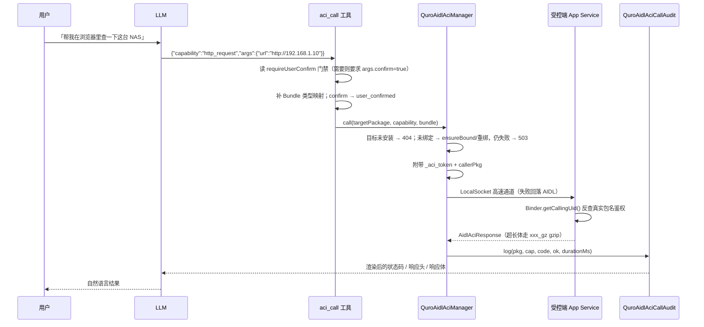

# 设备控制 / 权限 / Shizuku / ACI

让 AI 在这台 Android 设备上「动手」：不 Root 也能读屏点击，拿到授权后能跑 shell、冻结/安装 App，还能经同设备 ACI 直接调用其它 App 暴露的能力。

> 本文所有类名、工具名、权限字符串均已对照源码核实。若 README 的概要描述与源码不一致，以源码为准并在文中标注。

---

## 1. 能力清单

按「特权层级 → 可用工具」排列。工具名即 LLM 实际调用的函数名。

| 层级 | 能力 | 工具名 | 出处 |
|------|------|--------|------|
| L1 无障碍 | 读无障碍节点树（非截图） | `read_screen` | `core/tools/QuroToolsAccessibility.kt:36` |
| L1 无障碍 | 模拟点击 / 长按 / 滑动 / 滚动 | `tap_screen` `long_press_screen` `swipe_screen` `scroll_screen` | 同上：176 / 361 / 458 / 587 |
| L1 无障碍 | 文本输入、系统全局动作 | `input_text` `global_action` | 同上：529 / 636 |
| L1 无障碍 | 读前台 App、屏幕状态 | `get_foreground_app` `get_screen_state` | 同上：110 / 146 |
| L2 Shizuku | 以 shell UID 执行任意命令 | `shizuku_exec` | `core/tools/QuroToolsShizuku.kt:24` |
| L2 Shizuku | 以 root 执行命令（需 Shizuku root 模式） | `shizuku_root_exec` | 同上：42 |
| L2 Shizuku | 冻结 / 解冻 App（走 `pm disable-user --user 0`） | `freeze_app` | 同上：64 |
| L2 Shizuku | 静默安装 APK（走 `pm install -r`） | `install_app` | 同上：96 |
| L2 Shizuku | 查询安装 / 授权 / 版本状态 | `shizuku_status` | 同上：120 |
| L3 设备管理员 | 锁屏、禁用/恢复摄像头、查询管理员状态 | `lock_screen` `set_camera_disabled` `device_admin_status` | `core/tools/QuroToolsDeviceAdmin.kt` |
| L4 ROOT | 执行 root 命令、查询是否可用 | `root_exec` `root_status` | `core/tools/QuroToolsRoot.kt` |
| LSPosed | Xposed/LSPosed 模块桥接 | `lsposed` | `core/tools/QuroLsposeTool.kt` |
| 泛特权 | 统一特权执行入口 | `priv_exec` | `core/tools/QuroPrivExecTool.kt` |
| ACI | 列出已发现受控端与其能力 | `aci_list` | `core/aidlaci/QuroAidlAciTools.kt:19` |
| ACI | 调用指定受控端能力 | `aci_call` | 同上：41 |
| ACI | 本地 HTTP 调试服务启停 | `aci_http_server` | 同上：241 |
| MCP-ACI | 列出/调用/刷新外部 MCP 工具桥接 | `mcp_aci_list` `mcp_aci_call` `mcp_aci_bridge` | `core/mcp/QuroMcpAciTools.kt` |

UI 入口：`ui/QuroPermissionScreen.kt`（权限审计入口）、`ui/QuroAidlAciCenterScreen.kt`（ACI 管理中心）。

### L1–L5 特权层的分级含义

| 层级 | 通道 | 能做什么 | 前置条件 | 缺口时的表现 |
|------|------|----------|----------|--------------|
| **L1** | `AccessibilityService`（`QuroAccessibilityService`） | UI 自动化：点击、输入、滚动、读节点树 | 在系统「无障碍」设置里开启本服务 | 所有 L1 工具返回未开启 |
| **L2** | Shizuku / ADB 桥（uid 0 或 2000） | 系统级 shell、冻结 App、静默安装 | 装 Shizuku v12+（`moe.shizuku.privileged.api`）并在其「已授权应用」里放行本 App | `QuroShizukuBridge.state()` 给出「未安装 / 未连接 / 未授权 / UID 异常」四选一文案 |
| **L3** | `DevicePolicyManager`（`QuroDeviceAdminReceiver`） | 锁屏、禁用摄像头（E-5 起不再声明 wipe-data / reset-password） | 在系统里激活设备管理员 | 只能在问候时降级为「仅 2 项操作」文案引导 |
| **L4** | `su`（`QuroRootGateway`） | 内核级操作、改系统文件 | 设备已 root 且 Magisk 放行 | 不可用时不静默失败，明确报「未获取 Root」 |
| **L5** | `proot` + Linux rootfs（`assets/linux_env/`、`app/src/full/jniLibs/arm64-v8a/libproot.so`） | 应用内真 Linux 用户态 | 需 rootfs 就位；Android 15+ 的 `MANAGE_VIRTUAL_MACHINE` 未授予时降级 QEMU/proot | 见下方约束 |

> ⚠️ **代码现状差异**：`PrivilegeLevel` 枚举目前只有 `L1, L2, L3, L4`（`core/privilege/QuroPrivilegeManager.kt:34`）。README §特权/权限层 描述的 L5（应用内 Linux）在 `QuroApplication.kt:34` 的注释与 `assets/linux_env/proot` 中存在，但**尚未纳入 `probe()` 的四层探测**。写 L5 相关逻辑前请先确认当前分支。

---

## 2. 怎么用

**开启某一层（以 L2 Shizuku 为例）**

1. 安装并运行 Shizuku App（v12+ 主流包 `moe.shizuku.privileged.api` 优先）。
2. 在 Shizuku 里把 Zorv AI 加入「已授权应用」。
3. 进入 **对话框 → 设置 → 系统权限**（`QuroPermissionScreen`），找到 **L2 Shizuku**，点「请求授权」。
4. 页面显示「Shizuku 已就绪 [AIDL]」后，直接在对话里说「冻结某某 App」即可。

**让 AI 调用另一个 App**

1. 该 App 需已安装并声明 ACI Service（`ai.aci.core.ACTION_BIND`）。
2. 打开 **ACI 管理中心**（`QuroAidlAciCenterScreen`），可点「刷新」重新发现、搜索本机软件名并拉起。
3. 可把它设为**默认应用**（存在 `aci_app_preferences`，之后 `aci_call` 无需再填 `target_package`）。
4. 对话中直接下指令，LLM 会自行 `aci_list` → `aci_call`。

**手动操作受控端（不经 LLM）**

在 ACI 管理中心里，对暴露了 `console_ui` 能力的受控端点「打开控制台」，由本地 `AciConsoleScreen` 渲染它下发的 SDUI 快照。

---

## 3. 技术实现

| 文件 | 职责 |
|------|------|
| `core/privilege/QuroPrivilegeManager.kt` | 权限仲裁大脑：探测 L1–L4、四阶段提权（Intent → Policy → 确认 → 审计）、生成引导 Intent |
| `core/privilege/QuroShizukuBridge.kt` | Shizuku 安装/连接/授权三维探测 + 严格模式执行（未就绪明确报错，绝不降级到 App 自身 UID） |
| `core/privilege/QuroRootGateway.kt` | su 执行唯一收敛点（echo 回显校验 + 5s 超时 + FD 回收） |
| `core/privilege/QuroPrivilegeAudit.kt` | 提权审计写入 |
| `core/privilege/QuroTerminalPrivilegeBridge.kt` | 把 root / shizuku / adb / lsposed / storage 五项接给终端权限面板 |
| `core/shizuku/QuroShizuku.kt` `QuroShellService.kt` `QuroShizukuPkg.kt` | Shizuku Binder IPC 执行层 + 包名判定（v12 优先） |
| `core/policy/QuroPolicyStore.kt` | 三态策略 `ALLOW` / `DENY` / `ASK`（默认 `ASK`） |
| `core/aidlaci/QuroAidlAciManager.kt` | ACI 控制端核心：发现 → 绑定 → 拉能力 → 调用 → 生成能力清单（1235 行） |
| `core/aidlaci/QuroAidlAciTools.kt` | `aci_list` / `aci_call` / `aci_http_server` 三个 LLM 工具 |
| `core/aidlaci/QuroAidlAciCallAudit.kt` | 每次 ACI 调用持久化到 `filesDir/aci_call_audit.json`（最多 500 条） |
| `core/aidlaci/QuroAidlAciCredentialVault.kt` | 每目标 App 独立 Token（`AciTokenManager`） |
| `core/aidlaci/AidlAciConsoleModel.kt` `AidlAciConsoleScreen.kt` | SDUI 控制台：JSON 快照 → Compose 组件 |
| `core/permissions/QuroPermissionHelper.kt` | 10 类权限的统一探测 + 跳转 Intent（`QuroPermissionItem`） |

### 一次 `aci_call` 的完整链路

---

## 4. 关键设计决策

1. **Shizuku 包名不许硬编码**
   `QuroPrivilegeManager.launchIntentFor(L2)` 一律经 `QuroShizukuPkg.installed()` 拿设备上真实安装的包名拉起。
   *坑*：旧代码写死 v11 旧包 `moe.shizuku.manager`，在装了 v12+ 的机器上 `getLaunchIntentForPackage` 返回 null，跳去商店装一个不存在的 App —— 这就是历史上「请求授权点了没反应」的直接原因。

2. **Shizuku 授权状态只信 Shizuku 自己**
   `isAuthorized()` 只在 `QuroShizuku.isAlive` 时用 `Shizuku.checkSelfPermission()` 判定。
   *坑*：`moe.shizuku.manager.permission.API_V23` 是 Shizuku 内部托管的签名级权限，`PackageManager` 永远返回 DENIED；Binder 没活时据 PM 判定会大面积误报「未授权」。另做过一次修补：补 `getUid() ∈ {0, 2000}` 校验，与执行网关 `isReady` 对齐，解决了「权限页显示可用但所有命令返回未就绪」。

3. **无障碍开启状态三重信号兜底**
   `isAccessibilityEnabled()` 依次看：服务实例非空 → `Settings.Secure.ENABLED_ACCESSIBILITY_SERVICES` 精确匹配 → AccessibilityManager 列表结尾匹配。
   *坑*：部分机型 `AccessibilityServiceInfo.id` 返回短格式（`pkg/.Svc`），只做长格式相等比对会误判未开启。

4. **root 判定收敛到单一网关**
   `checkRoot()` 只调 `QuroRootGateway.isRootAvailable()`，并用 `probeAsync()` 把阻塞切到 IO 线程。
   *坑*：旧实现 `waitFor(2s)` 判「是否在 2s 内退出」，导致 su 被拒秒退→误报可用、Magisk 首次弹框超时→误报不可用；还会卡主线程 ANR、泄漏 FD。

5. **提权必须过 Policy + 用户确认，且全量审计**
   `requestElevation()`：`ALLOW` 直接放行、`DENY` 直接拒绝、`ASK` 才弹确认框（`Suspend` 回调由 UI 层实现）。
   *为什么*：三态集中一处，避免「工具 A 不拦、工具 B 拦」的策略撕裂（BUG-E 就是 `shizuku_root_exec` 漏了 DENY 拦截）。

6. **高危能力由控制端兜底拦截**
   受控端基类历史上把 `requireUserConfirm` 只当展示用、从不真拦。`aci_call` 在参数层自己捞 `getCapabilityIndex()` 查该标记，未带 `confirm:true` 直接返回引导文案，同时把 `confirm` 翻译成 `user_confirmed` 传给被调方做纵深防御。

7. **按 Binder 接口描述符选契约，而不是靠 `asInterface` 是否返回 null**
   *坑*：AIDL 的 `asInterface` 对远端 Binder 永远返回非 null 的 Proxy，旧写法让「旧契约兜底分支」成了死代码 —— 浏览器的 `ai.aci.core.IACIService` 被当成新契约包装，`getCapabilities()` 事务码对不上抛 `RemoteException`，能力永远是 0。现改为读 `binder.getInterfaceDescriptor()` 判 `"ai.aidl.aci.core.IAidlAciService"` / `"ai.aci.core.IACIService"`，未知则用双契约 ping 探活。

8. **传输双通道 + 明确超时**
   优先抽象命名空间 LocalSocket（`socketOk` 缓存，任一异常即置 false 回落）→ AIDL（CountDownLatch 3s 同步等待绑定）→ 15s 调用超时返 504。绑定侧还有 `DeathRecipient` 即时重绑、指数退避 `scheduleRebind`、10s 周期心跳 `healthCheck`。
   *为什么*：跨进程调用如果不给明确错误码，LLM 会臆测成「权限不足」再去调 dumpsys/root 瞎排障 —— 所以每个失败都给了专用文案（404 未安装 / 503 未绑定 / 504 超时）。

9. **控制台走 SDUI 本地渲染**
   受控端只暴露 `console_ui`（返回 JSON 快照）与 `console_action`（处理动作）两个能力，控制端用 `AidlAciConsoleModel.parse()` 解析渲染。
   *坑*：早期版本误建了「App 自连 127.0.0.1 环回 HTTP 控制台」（`lanui` 模块），2026-07-31 彻底移除；现在纯本地、零网络，WiFi 和移动网都能用。

10. **权限由主程序定义、受控端剥离**
    主 App 定义 `ai.aci.permission.CALL/DISCOVER`（`protectionLevel="normal"`）；受控端用 `tools:node="remove"` 摘掉权限声明再 `<uses-permission>` 引用，避免同一权限被不同 App 以不同保护级别定义导致安装失败。

---

## 5. 配置项与权限

**AndroidManifest（`app/src/main/AndroidManifest.xml`）**

| 权限 | 用途 |
|------|------|
| `ai.aci.permission.CALL` / `ai.aci.permission.DISCOVER` | 作为 ACI 控制方调用 / 发现受控端（normal 级，随安装获得） |
| `ai.aci.permission.CALL_DANGEROUS` | 由 `aidl-aci-core` 定义为 `dangerous`；主 App 未申请（见 §6） |
| `moe.shizuku.manager.permission.API` / `API_V23` | Shizuku Binder 调用（★运行时在 Shizuku App 内授权，非系统弹窗） |
| `SYSTEM_ALERT_WINDOW` | 悬浮窗 / 语音球 |
| `POST_NOTIFICATIONS` + `USE_FULL_SCREEN_INTENT` | 全屏通知 |
| `SCHEDULE_EXACT_ALARM` | 精确闹钟 |
| `MANAGE_EXTERNAL_STORAGE` + `READ_MEDIA_*` | 媒体与文件管理（★高敏感） |
| `BIND_NOTIFICATION_LISTENER_SERVICE` | 通知监听（`QuroNotificationListenerService`，★高敏感） |
| `MANAGE_VIRTUAL_MACHINE` / `USE_CUSTOM_VIRTUAL_MACHINE` | Android 15+ 虚拟化；未授予时降级 QEMU/proot |
| `FOREGROUND_SERVICE_MEDIA_PROJECTION` | 录屏 |
| `WAKE_LOCK` | 点亮屏幕 |

> 完整「用途 / 授予方式 / 隐私边界」清单见仓库根 [PERMISSIONS.md](../../PERMISSIONS.md)。

**设置项（SharedPreferences）**

| 文件 | 键 | 默认值 | 含义 |
|------|-----|--------|------|
| `quro_policy` | `priv` | `ASK` | CapOS 权限子系统三态策略（`ALLOW`/`DENY`/`ASK`） |
| `quro_policy` | `cms` | `ASK` | CMS v2 能力模块三态策略 |
| `aci_app_preferences` | `default_aci_package` | `null` | 默认受控端包名（`aci_call` 省略 `target_package` 时使用） |
| `aci_app_preferences` | `default_aci_app_name` / `recent_aci_packages` / `auto_select_aci_app` | `null` / 空 / — | 默认 App 显示名、最近使用列表、自动选择开关 |

**协议常量**

| 常量 | 值 | 位置 |
|------|-----|------|
| 绑定 Intent action | `ai.aci.core.ACTION_BIND` | `QuroAidlAciManager.ACI_ACTION` |
| 唤醒受控端广播 | `ai.aci.core.ACTION_WAKE` | `QuroAidlAciManager.ACI_WAKE_ACTION` |
| 调用超时 | `15_000 ms` | `callTimeoutMs`，可用 `setCallTimeout()` 改 |
| SDUI schema | `aci-sdui-v1` | `AIDL_ACI_SDUI_SCHEMA_VERSION`（缺失按 v1 兼容，不一致仅告警） |
| HTTP 调试端口 | `8848` | `aci_http_server action=start` 默认端口 |

---

## 6. 已知约束与待办

1. **L5 未进 `probe()`**：`PrivilegeLevel` 只有 L1–L4，proot Linux 层目前没有 UI 状态项，无法在权限页统一展示/引导。
2. **`CALL_DANGEROUS` 是死通道**：`aidl-aci-core`、受控端 `aci-app` / `aidl-aci-browser` 都声明了它，主 App 却没申请 —— 若未来要做分级危险能力，需先补申请与 consent 流程。
3. **`ai.aci.permission.*` 无法按敏感能力细分**：目前凡是跨 App 调用统一要 `CALL`，粒度偏粗。
4. **受控端生态的 5 个官方 App 是外部仓库**：WeatherAci / DocAci / TermAci / Zorv 构建台（BuildAci）/ FileAci 及其版本号、能力数来自 README 表格，本仓库内查不到源码，**版本与能力数以各自仓库 Release 为准**。
5. **旧 `lanui` 环回 HTTP 控制台已移除**：任何依赖 127.0.0.1 老接口的受控端需迁移到 SDUI。
6. **`allowUniversalAccessFromFileURLs` 已被废弃**：3D WebView 仍依赖它加载 Draco wasm，后续 WebView 版本可能失效（详见 digital-human 文档约束）。
7. **设备管理员能力范围受限**：自 E-5 起只保留锁屏与禁用摄像头两项，旧文档提到的擦除数据已移除。
