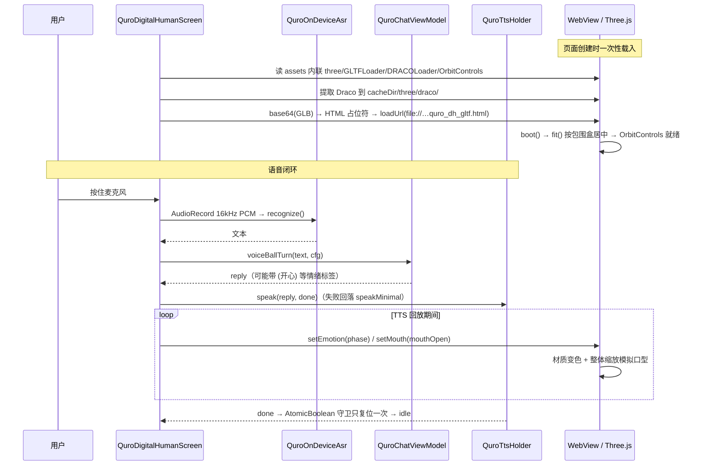

# 数字人 / 3D 模型查看器 / 知识库·记忆·人格·机器人 / 定时·日程·天气

四条独立的「让 AI 更像个常驻室友」的能力线：能看能说的 3D 数字人、能离线渲染的 GLB/glTF 查看器、能长期记住你的知识库与人格系统、以及会自己到点提醒你的定时任务。

> 类名 / 工具名 / 偏好键均已对照源码核实。3D 查看器与「天气」的实现边界见 §1.4 与 §6。

---

## 1. 能力清单

### 1.1 数字人（`ui/QuroDigitalHumanScreen.kt`，871 行）

| 能力 | 说明 | 依据 |
|------|------|------|
| 语音全闭环 | 按住麦克风说话 → 离线 ASR → LLM → TTS 朗读，头像随音频动嘴 | `startListeningSession` / `ask` / `speakReply`（:539 / :510 / :473） |
| 离线 ASR | `QuroOnDeviceAsr`，底层为 **sherpa-ncnn 流式 transducer**（不是 sherpa-onnx / Whisper）；16 kHz / MONO / PCM_16BIT，`AudioRecord` 直采；识别跑在独立 `:asr` 进程 | :563–:614、`core/tools/QuroAsrModels.kt` |
| LLM 可切换 | 「云端口」跟随全局模型配置，或「离线」自定义 OpenAI 兼容端点 | :104–:120 |
| 口型同步 | 5 Hz 正弦载波 × 0.8 Hz 包络，`setMouth` 驱动；时长按「字数 × 200 ms，下限 900 ms」估算 | `animateMouth` / `estimatedSpeakMs`（:457–:471） |
| 情绪驱动 | 按 `phase` 映射 `neutral` / `thinking` / `happy` / `angry`，经 JS `window.Zorv3D.setEmotion` 改材质色 | :628–:640、脚本 :834 |
| 文本备用输入 | 不想说话时可打字 | :125 `inputText` |
| 阶段环形指示 | `PhaseRing` 显示 idle / listening / recognizing / thinking / speaking / error | :354 |

### 1.2 3D 模型查看器（GLB / glTF，离线 Three.js + Draco）

| 能力 | 说明 |
|------|------|
| 格式 | `.glb` / `.gltf`（走 `GLTFLoader.parse`，支持 base64 内联） |
| 离线 | `three.min.js`、`GLTFLoader.js`、`BufferGeometryUtils.js`、`DRACOLoader.js`、`OrbitControls.js` 全部在 `app/src/main/assets/www/three/`，APK 内联，断网可用 |
| Draco 压缩 | 运行时把 `draco_decoder.js` / `draco_wasm_wrapper.js` / `draco_decoder.wasm` 解包到 `cacheDir/three/draco/`（`extractDracoAssets`，:445） |
| 交互 | `OrbitControls` 手动旋转 + 双指缩放（`enableZoom` / `enableRotate`，禁用 Pan） |
| 自动取景 | `fit()` 按包围盒居中缩放（目标尺寸 2.0），相机距离由半宽/半高与真实画布宽高比反算，留 1.5 倍边距 |
| 可视报错 | WebGL 不可用、引擎缺失、GLB 解析失败、脚本异常全部落到画布底部红色 `#msg` 条；同步写 `Download/QuroAI_logs/`（`GLB` / `GLB-JS` 标签） |

### 1.3 知识库 / 记忆 / 人格 / 机器人

| 对象 | 工具名 / 入口 | 实现 |
|------|--------------|------|
| 知识库语义检索 | `knowledge_rag_search`（支持 `action=reindex` / `count`） | `core/knowledge/QuroKnowledgeRag.kt:506` |
| 知识库关键词检索 | `knowledge_search` | `core/tools/QuroToolsKnowledge.kt:26` |
| 知识库写入 | `knowledge_add` | `core/tools/QuroToolsKnowledge.kt:110` |
| 知识库增删查导入 | `knowledge_manage`（add / search / list / import / delete） | `core/tools/QuroToolsKnowledgeManage.kt:13` |
| 记忆保存 / 列出 / 检索 / 删除 | `memory_save` `memory_list` `memory_search` `memory_delete` | `core/tools/QuroMemoryTools.kt` |
| 人格卡 | `core/QuroPersona.kt`、`ui/QuroSoulUi.kt`、`ui/QuroPersonaViewModel.kt` | — |
| 灵魂提示词 | `core/soul/QuroSoulPrompt.kt`（`QuroSoulPromptEngine.build(SoulContext)`） | — |
| Bot 管理 | `core/bot/QuroBotManager.kt`、`QuroBotReplyEngine.kt` | — |
| Bot 适配器 | `QuroQqBotAdapter` `QuroDirectBotAdapter` `QuroFeishuBotAdapter` `QuroWechatIlinkBotAdapter` `ILinkClient` `ClawBotPoller` | `core/bot/adapters/` |
| Bot 配置 | `ui/QuroBotSettingsScreen.kt` | — |

### 1.4 定时 / 日程 / 天气

| 能力 | 工具名 / 类 | 实现 |
|------|------------|------|
| 创建定时任务 | `schedule_task` | `core/tools/QuroScheduledTask.kt:639` |
| 列出定时任务 | `list_scheduled_tasks` | 同上：708 |
| 删除定时任务 | `delete_scheduled_task` | 同上：729 |
| 闹钟 | `set_alarm` `cancel_alarm` `list_alarms` | `core/tools/QuroToolsAlarm.kt` |
| 日历读写 | `read_calendar` `write_calendar` | `core/tools/QuroToolsCalendar.kt` |
| 日程 UI | `QuroScheduleScreen`（列表 + 新建/编辑，支持仅一次 / 重复两种模式） | `ui/QuroScheduleScreen.kt:102` |
| 天气**卡片视觉库** | `ui/weather/WeatherCard.kt` | `WeatherCardStyle` + `WeatherCardPresets`，4 种布局 `Normal` / `Ring` / `Split` / `Dashboard` |

> ⚠️ **天气数据本身不是内置工具**。`ui/weather/ToolCallIcon.kt` 里的 `weather_now` / `weather_forecast` / `weather_alert` / `air_quality` 属于 100 款工具调用图标设计库（文件头写明「Tool Call Icon Library」），不是已实现的工具。真实天气数据目前由外部 **WeatherAci** 受控端经 ACI 提供（见 device-control 文档 §受控端生态）。

---

## 2. 怎么用

**用数字人**

1. 进入数字人屏（`QuroDigitalHumanScreen`）。
2. 右上角设置里选 LLM 来源：保持「云端口」跟随全局；要全离线就选「离线」并填 `baseUrl` / `apiKey` / `model`。
3. 点「上传 GLB」用 SAF 选一个自己的 `.glb` 模型（会被拷到 `cacheDir/quro_dh_model.glb`）。
4. 首次点麦克风会请求 `RECORD_AUDIO`；授权后按住讲话，或直接打字。

**让 AI 长期记住你**

- 直接说「记住我偏好 XXX」→ AI 调 `memory_save`；下次问「我之前说过什么」→ `memory_search`。
- 把规范 / 领域资料丢进知识库：用 `knowledge_manage action=import` 导入，或 `action=add` 直接写 `md` / `txt` / `json` / `csv` / `docx` / `xlsx` / `pptx`。
- 想要不同语气：在人格卡里设「角色设定 / 聊天设定」，挂若干人格标签（`QuroTag` 的 `hint` 会注入系统提示词）。

**定一个到点执行的任务**

1. 打开日程屏（`QuroScheduleScreen`）点新建，或直接让 AI：「每天早上 9 点提醒我站会」。
2. AI 会调 `schedule_task`，参数优先走 `scheduleType` + `rrule`（如 `FREQ=WEEKLY;BYDAY=MO,WE,FR`）。
3. 到点后 `QuroScheduleReceiver` 触发，任务 `prompt` 被写进会话让 AI 执行；完成后推一条全屏通知。

---

## 3. 技术实现

| 文件 | 职责 |
|------|------|
| `ui/QuroDigitalHumanScreen.kt` | 数字人主屏：语音采集、聊天编排、GLB WebView 宿主、HTML 模板生成 |
| `app/src/main/assets/www/three/*` | 离线 Three.js UMD + GLTFLoader + DRACOLoader + OrbitControls + Draco wasm |
| `core/model/QuroDigitalHumanConfig.kt` | 数字人配置持久化（`QuroDigitalHumanConfigRepository`） |
| `core/knowledge/QuroKnowledgeRag.kt` | RAG 流水线：`QuroRemoteEmbedder` / `QuroLexicalEmbedder` / `QuroSqliteVectorStore` / `QuroRagPipeline` |
| `core/memory/QuroMemoryStore.kt` | 记忆持久化（`QuroMemoryRepository`，`filesDir/quro_memory`）+ 进程级写锁 |
| `core/QuroPersona.kt` | 人格卡 / 标签 / 语音组合（`QuroPersona` `QuroTag` `QuroVoiceProfile`） |
| `core/soul/QuroSoulPrompt.kt` | 人格 + 标签 + 记忆 + 语音风格 → 灵魂层系统提示词 |
| `core/bot/*` | Bot 管理与各 IM 适配器 |
| `core/tools/QuroScheduledTask.kt` | 任务存储、排程、开机恢复、完成通知，及 3 个 AI 工具 |
| `ui/weather/WeatherCard.kt` | 天气卡片视觉库（与 `design/weather-viz-library/showcase.html` 一一对应） |

### 数字人一次对话 + GLB 加载链路

---

## 4. 关键设计决策

1. **3D 引擎离线内联，而不是 CDN 或 file:// 相对路径**
   `buildGltfHtml()` 把 `three` / `GLTFLoader` / `DRACOLoader` / `OrbitControls` 的整段源码用占位符替换塞进单个 HTML。
   *坑*：早期靠相对路径或 CDN，遇到 WebView 跨域限制与断网就全黑；现在断网也能出图。

2. **首帧显式 `setSize` + `resize()` 循环兜底**
   *坑*：曾经黑屏的根因是 `position:fixed` 的 canvas 高度塌成 0，被误判成「透明合成问题」。现在 `boot()` 里先读 `clientWidth/clientHeight` 显式 `renderer.setSize(W,H,false)`，`loop()` 每帧再检查尺寸变化并 `updateProjectionMatrix()`。

3. **`fit()` 用真实画布宽高比反算相机距离**
   *坑*：相机写死在 `(0,1,3)` 会让大模型截顶或被挤出画面；后来试过「猜 180° 旋转」，仍然看到背面，因为模型正面方向本来就未知。
   *为什么*：最终改为「整体框入 + 1.5 倍边距 + 交给 OrbitControls 由用户手动转」，不再猜朝向。

4. **PBR 材质必须有环境贴图**
   `PMREMGenerator` 生成一张灰色环境贴图挂在 `scene.environment`。
   *坑*：金属度/物理材质没有 IBL 会渲成纯黑，在深色舞台上等同于「加载了但看不见」。

5. **所有 mesh 强制 `THREE.DoubleSide`**
   *为什么*：用户自制模型法线朝向不可控，单面渲染会整块消失。`fit()` 里检测包围盒退化（`box.min.x === box.max.x`）时只告警不崩，保证模型始终居中可见。

6. **报错必须看得见**
   `window.onerror` + `WebGLRenderer` 构造 try/catch + `loader.parse` 错误回调，全部汇到 `showMsg(t, true)` 红色条；同时经 `WebChromeClient.onConsoleMessage` 转 `QuroDiag` 落盘到 `Download/QuroAI_logs/`。
   *为什么*：用户在手机上拿不到 adb，不落盘就完全没法排障。

7. **RAG 双模式自动降级**
   有 Embedding Key 走 `/v1/embeddings` 向量余弦；无 Key 或远程报错自动降级到「CJK 二元分词 + 词频余弦」本地词法检索。
   *坑*：旧版用弱哈希向量，无 Key 时命中近乎随机。另外索引支持 `.csv` —— `AiwpsCreateTool` 会产出 csv，索引器不收录就会出现「UI 看得见、AI 搜不到」。

8. **索引增量同步**
   pipeline 记录文件指纹 manifest（路径 + 修改时间 + 大小），每次检索/同步增量比对，增删自动跟进，避免「知识库不对」的体感。

9. **记忆库加进程级写锁**
   *坑*：`QuroMemoryRepository` 在 ViewModel / 语音球服务 / 记忆工具里各自 new 实例，并发写会互相覆盖，故在 `companion object` 里加了进程级锁。

10. **TTS 完成回调只复位一次**
    *坑*：`speak` 返回 -1/-2 时内部已同步触发 `done`，随后 codepath 又调 `speakMinimal(同 done)`，末尾判断再调一次 —— `done` 最多被跑 3 次，导致相位反复复位。现在用 `AtomicBoolean.compareAndSet` 守卫，与语音球实现对齐。

11. **显示文本与合成文本分离**
    情绪标签（如 `(开心)`）保留给 TTS 做情感合成，气泡显示用 `QuroVoiceStyle.strip(reply)` 剥离。
    *坑*：数字人气泡直接 `Text(reply)` 会把原始标签露给用户，看起来像「AI 不会用情绪标签」。

12. **灵魂提示词只管「我是谁」，不管「我能做什么」**
    `QuroSoulPromptEngine` 刻意不含平台基座（`QuroPlatformManifest`）与工具清单，那些由调用方在外层拼。
    *为什么*：身份层与能力层解耦后，换人格不会意外改变工具可见性。

13. **定时任务走 RRULE，旧字段自动换算**
    优先 `scheduleType` + `rrule`；只给了旧式 `hour/minute/repeatType` 时由 `rruleFromLegacy` 转换。开机 / `MY_PACKAGE_REPLACED` / `QUICKBOOT_POWERON` 三种广播都会 `scheduleAll` 重排。

---

## 5. 配置项与权限

**数字人配置 — SharedPreferences `quro_digital_human`**

| 键 | 默认值 | 含义 |
|-----|--------|------|
| `llm_mode` | `cloud` | `cloud`=跟随全局模型配置；`offline`=用下面三项 |
| `offline_base_url` | `""` | 自建 OpenAI 兼容端点（LM Studio / Ollama / 端侧 LLM） |
| `offline_api_key` | `""` | 端点密钥 |
| `offline_model` | `""` | 端点模型名 |
| `avatar_source` | `custom` | 头像来源（当前仅 `custom`） |
| `custom_model_path` | `""` | GLB 模型在应用缓存中的路径 |

> 离线模式下的隐式预设：`provider=OPENAI`、`enableTools=false`、`maxToolRounds=0`、`temperature=0.7`、`maxTokens=4096`（源码 :107–:116）。

**数据与缓存路径**

| 路径 | 内容 |
|------|------|
| `filesDir/quro_personas.json` + `quro_persona` prefs | 人格卡列表与当前激活 id |
| `filesDir/quro_memory` | 长期记忆 |
| `filesDir/knowledge_base`（`QuroKnowledgeFiles.dir`） | 用户知识库文档 |
| `assets/knowledge_base/` | 随包内置知识（如 `quro_ai_overview.md`） |
| `quro_rag.db`（`QuroSqliteVectorStore`） | RAG 向量索引 |
| `cacheDir/quro_dh_model.glb` | 用户选取并拷贝进来的 GLB |
| `cacheDir/quro_dh_gltf.html` | 生成的 Three.js 预览页 |
| `cacheDir/three/draco/` | 运行时解包的 Draco 解码器 |
| `Download/QuroAI_logs/` | `GLB` / `GLB-JS` 诊断日志 |

**权限**

| 权限 | 用途 | 备注 |
|------|------|------|
| `RECORD_AUDIO` | 数字人麦克风采集 | 运行时申请，首点是 mic 触发 |
| `POST_NOTIFICATIONS` | 定时任务完成推送 | `ScheduleTaskTool.requiredPermissions` 显式声明 |
| `SCHEDULE_EXACT_ALARM` / `USE_EXACT_ALARM` | 精确时间排程 | Android 12+ 需用户授予 |
| `RECEIVE_BOOT_COMPLETED` | 开机重排定时任务 | `QuroScheduleBootReceiver` |
| `READ_CALENDAR` / `WRITE_CALENDAR` | 日历读写 | 危险权限 |
| `INTERNET` | 在线 LLM / 远程 Embedding | 纯离线模式下可无网运行（ASR/TTS/3D 渲染均不走网络） |

---

## 6. 已知约束与待办

1. **Three.js 版本无法精确核实**：`three.min.js` 是压缩 UMD（约 603 KB，版权头为 Copyright 2010–2021）。README 标注 r128，但从 min 文件里取不到 `REVISION` 常量，写升级/迁移方案前请先运行时打 `THREE.REVISION` 确认。
2. **`allowUniversalAccessFromFileURLs` / `allowFileAccessFromFileURLs` 已废弃**：离线加载 Draco wasm 仍依赖这两个开关取 File 跨域，后续 WebView 版本可能失效，届时需要改用 `WebViewAssetLoader` 或把 Draco 也 base64 内联。
3. **废弃另外一个 `[未知组件: ?]` 兜底**：SDUI 里未知组件类型会退化成一段文本而不是报错（同样情况见 device-control 的 `AciConsoleModel`）。
4. **口型是「整体缩放」模拟，不是 blenshape**：`__setBlend` 直接对 `model.scale` 乘 `1 + open*0.06`，只有当模型包含 `ARKit` / `VRM` 面部 morph targets 时才能真正做嘴形，当前未实现。
5. **情绪驱动会永久改写材质基色**：`Zorv3D.setEmotion` 直接 `m.color.setHex()` 赋白 / 金 / 蓝 / 红，会覆盖用户自制模型的原始配色且不会自动恢复 —— 每次调用都重写 `material.color`，长时间使用会丢掉模型原色。
6. **`weather_*` 图标不代表已实现工具**：100 款工具图标里有 `weather_now` / `weather_forecast` / `weather_alert` / `air_quality`，但仓库内没有对应工具实现；天气数据请经 WeatherAci 受控端获取。
7. **`IncubationWorkshopScreen`（AI 人格孵化界面）尚未实现**：`QuroSoulPrompt.kt` 注释里把它列为 B2 里程碑，`QuroPersona.incubation` 字段已预留但 UI 缺失。
8. **Bot 沙箱期限制**：QQ 机器人沙箱期仅私聊（C2C）可用，群 @ 需官方审核开通（涉及 intent `1<<25 | 1<<30`）。
9. **重复任务 `endAt` 仅 recurring 生效**：传了 `once` 会被忽略，写 UI/工具时应显式处理。
