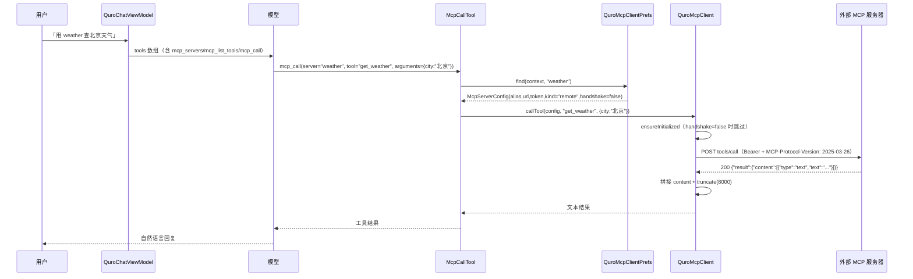

# MCP（Model Context Protocol）

ZorvAI 同时扮演 MCP 的三种角色：**调别人**（客户端调外部 MCP 工具）、**给别人调**（把 App 的全部工具暴露成本地 MCP Server）、**中转**（把外部 MCP 工具映射成 ACI 能力给受控端用）。

## 1. 能力清单

### 1.1 作为客户端（调外部 MCP 服务器）

| 能力 | 具体表现 |
|---|---|
| 工具清单 | `QuroMcpClient.listTools(config)` → JSON-RPC `tools/list`，返回 `List<McpExternalTool>(name, description, parametersJson)`；兼容 `inputSchema` 与 `parameters` 两种字段写法 |
| 调工具 | `QuroMcpClient.callTool(config, toolName, arguments)` → `tools/call`；`result.content` 数组里所有 `text` / `resource` 片段全部拼接（不再只读第一条），最后 `truncate` 到 8000 字符 |
| 资源 / 提示 / 补全 | `listResources`（`resources/list`）、`getPrompt`（`prompts/get`）、`complete`（`completion/complete`） |
| 连通性与取消 | `ping`；`cancelRequest` 发 `notifications/cancelled`（通知，不等响应） |
| 会话握手 | `McpServerConfig.handshake=true` 时先跑 `initialize`（协议版本 `2025-03-26`），再 best-effort 发 `notifications/initialized`，并跟踪响应头 `Mcp-Session-Id` 在后续请求携带 |
| 传输：HTTP / SSE | `rpcRaw` 单 POST，`Accept: application/json, text/event-stream`；`parseBody` 兼容 `data:` 逐行 SSE |
| 传输：WebSocket | `config.kind == "ws"` 时走 `QuroMcpWsClient`，带 `Authorization: Bearer` 与 `MCP-Protocol-Version: 2025-03-26`，收到首个非通知响应即关闭连接 |
| 可读错误 | OkHttp 对 4xx/5xx 不抛异常，`rpcRaw` 主动捕获并构造 `HTTP <code> <message>：<前 400 字符>` 错误对象，最终由 `callTool` 转成「MCP 工具调用失败: …」 |

### 1.2 作为服务器（把本机能力暴露出去）

| 能力 | 具体表现 |
|---|---|
| 本地 HTTP Server | `QuroMcpHttpServer` 基于 `java.net.ServerSocket` 手写最小 HTTP/1.1，仅绑定 **127.0.0.1**，端口随机分配 |
| 前台服务保活 | `QuroMcpService`（前台服务，通知 id `8803`、渠道 `quro_mcp`、`FOREGROUND_SERVICE_TYPE_DATA_SYNC`） |
| 支持的 method | `initialize`、`ping`、`tools/list`、`tools/call`；通知类（无 `id`）返回 202 空响应 |
| 工具同源 | 工具实现直接复用 `buildQuroRegistry(appContext)` 的全部 `QuroTool`（经 `QuroToolEngine` 派发），与对话内的工具调用 100% 同源 |
| 客户端配置样例 | 设置页直接给出 `{ "mcpServers": { "quro": { "url": "http://127.0.0.1:<port>/mcp" } } }` 并支持一键复制 |

### 1.3 AI 自己部署 MCP（`mcp_deploy`）

| 能力 | 具体表现 |
|---|---|
| 部署 | `QuroLocalMcpManager.deploy(context, alias, toolDefs)` 校验 JSON 数组（每项必须有 `name`）→ 起本地 Server → 持久化为 `kind="local"` 配置，url 写 `http://127.0.0.1:<port>/mcp` |
| 入参规整 | `McpDeployTool.run` 落地前对每个工具补默认值：缺 `handler_type` → `echo`；缺 `parameters` → `{}`；缺 `name` 时报错并指出第几个工具 |
| 注销 | `undeploy(context, alias)` 停服务 + 删配置（只删 `kind=="local"` 的项） |
| 启动自恢复 | `QuroApplication.kt:184` 调 `QuroLocalMcpManager.startAll`，重建所有已持久化的本地 MCP 并回写新端口 |
| 工具实际能干活 | `QuroLocalMcpDispatcher` 按 `handler_type` 执行 `echo` / `http_get`（支持 `${param}` 模板替换）/ `time` / `file_read`，全部基于 OkHttp / 文件 / 时间，不依赖 python / node / proot |

### 1.4 MCP-ACI 桥接

| 能力 | 具体表现 |
|---|---|
| 工具 → 能力映射 | `McpAciBridge.refreshMcpServers` 遍历所有服务器 `listTools`，用 `alias::toolName` 作 key 建 `mcpToolToAciMap` |
| 能力 id | 统一 `mcp_{toolName}`，`requireUserConfirm=false`，参数由 MCP `inputSchema.properties` 逐字段转换 |
| 初始化 | `QuroAidlAciManager.kt:165` 调 `McpAciBridge.init(appContext)`，内部立即 `refreshMcpServers` |

### 1.5 注册给 AI 的 9 个 MCP 工具

在 `QuroBuiltInTools.kt:500-512` 注册（顺序即源码顺序）：

| 工具 | 实现文件 | 关键入参 |
|---|---|---|
| `mcp_servers` | `QuroToolsMcpClient.kt:17` | `{}` |
| `mcp_list_tools` | `QuroToolsMcpClient.kt:32` | `server`（别名或地址） |
| `mcp_call` | `QuroToolsMcpClient.kt:57` | `server`、`tool`、`arguments` |
| `mcp_aci_list` | `QuroMcpAciTools.kt:17` | `{}` |
| `mcp_aci_call` | `QuroMcpAciTools.kt:53` | `capability`（形如 `mcp_{工具名}`）、`args` |
| `mcp_aci_bridge` | `QuroMcpAciTools.kt:126` | `action`（`refresh` / `status`） |
| `mcp_deploy` | `QuroToolsMcpLocal.kt:30` | `name`（服务器别名）、`tools`（工具定义数组，每项含 `name` / `description` / `parameters` / `handler_type` / `handler_config`） |
| `mcp_undeploy` | `QuroToolsMcpLocal.kt:65` | `name`（别名） |
| `mcp_list_local` | `QuroToolsMcpLocal.kt:85` | — |

## 2. 怎么用

### 2.1 接一个外部 MCP 服务器

1. 打开 **设置 → MCP 服务** → 找到「MCP 客户端」区段；
2. 在下方三个输入框分别填 **别名**、**URL**、**Token** → 点添加；
   - 别名是 `mcp_call` 里 `server` 字段用的引用名（如 `weather`）；
   - URL 可以是远端 `https://example.com/mcp`，也可以填本机另一个 App 暴露的 `http://127.0.0.1:<port>/mcp`；
   - Token 走 `Authorization: Bearer <token>`，留空则不带该头；
3. 添加后列表里出现该条目，点条目右侧「测试」会跑一次 `listTools` 并 Toast 出工具数量（失败则提示连接失败）；
4. 在对话框里对 AI 说「用 weather 查一下北京天气」，AI 自行走 `mcp_servers` → `mcp_list_tools` → `mcp_call`。

> ⚠️ 当前 UI **没有**「类型 kind」下拉与「握手 handshake」勾选框——见 §4 与 §6 的 README 偏差说明。实际落库就是 `QuroMcpClient.McpServerConfig(alias, url, token)`，`kind` 取默认值 `remote`、`handshake` 取默认值 `false`。

### 2.2 把 ZorvAI 自己的工具给别的客户端用

1. **设置 → MCP 服务** 顶部开关打开本地 MCP Server；
2. 开关下方显示 `http://127.0.0.1:<port>/mcp`（端口异步分配，开启后约 500ms 回读），可点复制图标；
3. 页面下方只读文本框给出该地址 + 工具数量的配置样例，以及 `{ "mcpServers": { "quro": { "url": "..." } } }`；
4. 在任意支持 MCP 的客户端里填入该地址即可；**仅本机可达**（服务只绑回环地址）。

### 2.3 让 AI 自己写一个 MCP 部署进来

直接对 AI 说「起一个本地 MCP，暴露查天气的工具」。AI 会调用 `mcp_deploy(name, tools)`：

```
{"name": "weather",
 "tools": [ { "name": "get_weather", "handler_type": "http_get",
              "handler_config": { "url": "https://wttr.in/${city}?format=j1" } } ]}
```

部署成功后 AI 立刻能用 `mcp_call(server="weather", tool="get_weather", arguments={"city":"Beijing"})` 调用，`QuroLocalMcpDispatcher` 做模板替换后发 HTTP GET。可用 `handler_type` 只有 `echo` / `http_get` / `time` / `file_read` 四种。

用 `mcp_undeploy(name)` 注销；用 `mcp_list_local` 查看当前部署（输出别名 / 地址 / 工具数）。

> README 里写的 `mcp_deploy(alias, toolDefs)` 与实际参数名不符，实际是 `name` 与 `tools`。

### 2.4 通过 ACI 调用 MCP

AI 侧：`mcp_aci_list` 查看可用能力 → `mcp_aci_call({"capability":"mcp_web_search","args":{"query":"AI 新闻"}})`。
受控端侧：`McpAciBridge.callMcpTool(serverAlias, toolName, arguments)` 返回 `AidlAciResponse`，Bundle 里带 `mcp_result` / `server_alias` / `tool_name`。

## 3. 技术实现

| 文件 | 职责 |
|---|---|
| `app/src/main/java/.../core/mcp/QuroMcpClient.kt`（398 行） | 客户端主逻辑：`listTools` / `callTool` / `listResources` / `getPrompt` / `complete` / `ping` / `cancelRequest` / `initialize`；`rpcRaw` 处理 Accept、Session-Id、4xx/5xx 捕获；`parseBody` 处理 SSE；`truncate` 8000 字符上限 |
| `app/src/main/java/.../core/mcp/QuroMcpWsClient.kt` | WebSocket 传输，`suspendCancellableCoroutine` 等待首个非通知响应 |
| `app/src/main/java/.../core/mcp/QuroMcpHttpServer.kt` | 本地 MCP Server：`ServerSocket` 手写 HTTP，按 method 路由到 `initialize` / `ping` / `tools/list` / `tools/call` |
| `app/src/main/java/.../core/mcp/DroidMcp.kt` | 工具清单聚合（被 `QuroMcpHttpServer` 用 builder 装载全部注册表工具） |
| `app/src/main/java/.../service/QuroMcpService.kt` | 前台服务生命周期、`startForeground`、`quro_mcp` Prefs 记录 `port` / `enabled` |
| `app/src/main/java/.../core/mcp/QuroMcpClientPrefs.kt`（79 行） | `SharedPreferences("quro_mcp_client")` → key `servers`；`load` / `save` / `loadLocal` / `add` / `remove` / `find`（先别名后 URL） |
| `app/src/main/java/.../core/mcp/QuroLocalMcpManager.kt`（95 行） | `deploy` / `undeploy` / `startAll` / `runningCount`，alias→server 内存表 |
| `app/src/main/java/.../core/mcp/QuroLocalMcpServer.kt` | AI 部署的本地 Server 实例（daemon 线程，进程存活期有效） |
| `app/src/main/java/.../core/mcp/QuroLocalMcpDispatcher.kt` | `handler_type` 派发：`echo` / `http_get` / `time` / `file_read`，返回值同样截断到 8000 字符 |
| `app/src/main/java/.../core/mcp/McpAciBridge.kt`（278 行） | MCP↔ACI 映射：`mcpToolToAciMap`、`getMcpCapabilities`、`callMcpTool`、`isMcpAciCapability`、`extractMcpToolFromCapability` |
| `app/src/main/java/.../core/mcp/QuroMcpAciTools.kt`（177 行） | `mcp_aci_list` / `mcp_aci_call` / `mcp_aci_bridge` 三个 AI 工具 |
| `app/src/main/java/.../core/tools/QuroToolsMcpClient.kt` | `mcp_servers` / `mcp_list_tools` / `mcp_call` |
| `app/src/main/java/.../core/tools/QuroToolsMcpLocal.kt` | `mcp_deploy` / `mcp_undeploy` / `mcp_list_local` |
| `app/src/main/java/.../ui/QuroMcpSettingsScreen.kt`（248 行） | 本地 Server 开关 + 端点展示 + 客户端服务器列表 + 新增表单 + 本地 MCP 列表 |
| `app/src/main/java/.../activity/QuroApplication.kt:184` | 启动时 `QuroLocalMcpManager.startAll` |
| `app/src/main/java/.../core/aidlaci/QuroAidlAciManager.kt:165` | 启动时 `McpAciBridge.init` |

### AI 调用外部 MCP 工具时序



## 4. 关键设计决策

**为什么本地 Server 要手写 `ServerSocket` 而不是用 `com.sun.net.httpserver.HttpServer`。**
注释写得很直白：Android 运行时**不含** `com.sun.net.httpserver`（它不是 Android 核心库的一部分，运行时必抛 `ClassNotFound`）。所以直接基于 `java.net.ServerSocket` 实现最小 HTTP/1.1，零三方依赖。

**为什么本地 Server 只绑 127.0.0.1。**
它对外暴露的是整个 ZorvAI 工具注册表（`buildQuroRegistry` 全量），包含文件读写、Shell、ACI 等能力。绑定回环地址 + 随机端口，让「外部网络不可达」成为默认状态，不用额外做鉴权。

**为什么 Socket 要在替 OkHttp 之外额外捕获 4xx/5xx（踩过的坑）。**
OkHttp 对 4xx/5xx **不抛异常**，如果不主动检查 `resp.isSuccessful`，错误响应体会被当成正常 JSON 去 parse，导致错误信息被吞掉、`callTool` 返回「MCP 服务器未返回结果」而不是真正的 401/500 原因。`rpcRaw` 现在主动构造 `HTTP <code> <message>：<前 400 字符>`，README 里说的「失败会返回带 HTTP 状态码的可读错误」正是这条路径。

**为什么 content 要全部拼接而不是只读第一条。**
标准 MCP 允许 `result.content` 是数组（多段文本 / 混合资源）。旧实现只读第一条会静默丢内容。现在逐 item 按 `type` 取 `text` / `resource` 再 join。

**为什么 `mcp_deploy` 的 handler 只用 OkHttp / 文件 / 时间。**
注释明确：目标是「在任意安卓设备上 100% 可用」。依赖 python / node / proot 会让低端设备或没装沙箱的机器直接不可用。代价是能力有限——只有四种 handler。

**为什么 `startAll` 要回写端口。**
本地 Server 端口是随机分配的，进程重启后一定不同。持久化里存的旧 url 不刷新就会指向死端口，所以 `startAll` 每次重建后都会把新端口写回 Prefs。

**为什么 ACI 能力 id 用 `mcp_{toolName}` 而不带服务器别名。**
简化 AI 侧的调用串（`mcp_web_search` 比 `mcp_weather__web_search` 好写）。代价写在 §6：跨服务器同名工具会冲突。

**为什么 `mcp_aci_call` 要经 `QuroAidlAciManager` 而不是直接调 `McpAciBridge.callMcpTool`。**
`mcp_aci_call` 的注释定位是「让 AI 通过 ACI 调用」——走 ACI 通道（`call("mcp_bridge", capability, bundle)`）才能与受控端的鉴权 / 审计链路保持一致；`McpAciBridge.callMcpTool` 是给 ACI 控制方直接用的另一条入口。

## 5. 配置项与开关

### 服务器配置（`SharedPreferences("quro_mcp_client")` → key `servers`，JSON 数组）

| 字段 | 默认值 | 由谁写 | 影响范围 |
|---|---|---|---|
| `alias` | 用户填 | UI 新增 / `QuroLocalMcpManager.deploy` | `mcp_call` 的 `server` 路由键；同名 alias 会被覆盖（`add` 先 `removeIf`） |
| `url` | 用户填 / `http://127.0.0.1:<port>/mcp` | UI / `deploy` / `startAll` | JSON-RPC 端点 |
| `token` | `""` | UI | 非空时加 `Authorization: Bearer <token>` |
| `kind` | `"remote"` | `deploy` 写 `"local"`；UI 不提供选择 | `ws` → 走 `QuroMcpWsClient`；`local` → 被 `loadLocal` 筛出给 `startAll` |
| `toolDefs` | `""` | `deploy` | 仅 `local` 使用，AI 定义的工具 JSON 数组 |
| `handshake` | `false` | **无人写入**（Prefs 不持久化该字段） | `true` 时 `ensureInitialized` 才跑 `initialize` |

### 本地 Server（`SharedPreferences("quro_mcp")`）

| Key | 默认值 | 影响范围 |
|---|---|---|
| `enabled` | `false` | 本地 MCP Server 是否运行（`QuroMcpService.isEnabled` 直接读它，不读 service 状态） |
| `port` | `0` | 当前监听端口；服务停止时写回 `0` |

### 协议与超时常量

| 常量 | 值 | 位置 |
|---|---|---|
| 协议版本 | `2025-03-26` | `rpcRaw` 的 `MCP-Protocol-Version` 头、`QuroMcpWsClient` 握手头、`initialize` 参数 |
| `clientInfo` | `{"name":"Zorv AI","version":"1.0"}` | `QuroMcpClient.initialize` |
| OkHttp connect / write / read 超时 | 20s / 20s / 60s | `QuroMcpClient.client` |
| WS ping 间隔 | 20s | `QuroMcpWsClient.client` |
| 结果截断阈值 | 8000 字符 | `truncate`；`QuroLocalMcpDispatcher.httpGet` / `fileRead` 同口径 |
| 错误体截取长度 | 400 字符 | `rpcRaw` 的 put("message") |
| 前台服务通知 id / 渠道 | `8803` / `quro_mcp` | `QuroMcpService` |
| 前台服务类型 | `FOREGROUND_SERVICE_TYPE_DATA_SYNC`（API ≥ Q） | `QuroMcpService.onCreate` |
| ACI 虚拟包名 | `mcp_bridge` | `McpAciBridge.MCP_PACKAGE`、`mcp_aci_call` 的 `call()` 第一参 |
| ACI 能力 `requireUserConfirm` | `false` | `createCapabilityFromMcpTool` |

## 6. 已知约束与待办

- **UI 不支持选择 `kind` 与勾选 `handshake`（与 README 5.1 不符）**：`QuroMcpSettingsScreen` 只有别名 / URL / Token 三个输入框，新增时构造 `McpServerConfig(a, u, newToken.trim())`。想用 `ws` 传输必须改代码，想开握手也得改代码。
- **`handshake` 无法持久化**：`QuroMcpClientPrefs.load/save` 只读写 `alias/url/token/kind/toolDefs` 五个字段，`handshake` 不在其中。即使后续 UI 加了勾选框，重开也会丢失。
- **`mcp_aci_call` 入参与 README 不符**：README 写 `serverAlias` / `toolName` / `arguments`，实际是 `capability`（`mcp_{工具名}`）/ `args`。
- **`mcp_aci_bridge` 的 action 取值与 README 不符**：README 写 `refresh|list`，实际是 `refresh|status`。
- **ACI 能力 id 不含服务器别名**：`mcp_{toolName}` 不含 server，两个服务器暴露同名工具时后映射的会覆盖先映射的（`mcpToolToAciMap` 用 `alias::toolName` 做 key 不冲突，但能力 id 冲突，`extractMcpToolFromCapability` 只能返回第一个匹配）。
- **`createCapabilityFromMcpTool` 的兜底分支有死代码**：`Capability.fromJSONArray` 返回空时，兜底分支里又判断了 `capabilities.isNotEmpty()`（必然为 false），最终必然抛 `IllegalStateException`，注释所说的「虚拟能力」实际不会被返回。
- **`MCP_PACKAGE = "mcp_bridge"` 与能力 id 前缀 `mcp_` 不一致**：一个是含下划线的包名，一个是能力前缀，`isMcpAciCapability` 只认后者。
- **本地 Server 与本地 MCP 的生命周期是同一进程**：`QuroLocalMcpServer` 跑在守护线程上，进程被杀后所有 AI 部署的 MCP 失效，直到下次 `startAll` 重建。
- **`QuroMcpService.isEnabled` 读的是 Prefs 而非服务真实状态**：若服务被系统杀死但 Prefs 没更新（`onDestroy` 未执行），设置页会显示「运行中」但端口实际不可用。
- **当前 handlers 只有 4 种**：AI 部署的 MCP 不能跑任意代码，`echo` / `http_get` / `time` / `file_read` 之外的 `handler_type` 会 fallback 到 `echo`（返回参数原文）。
