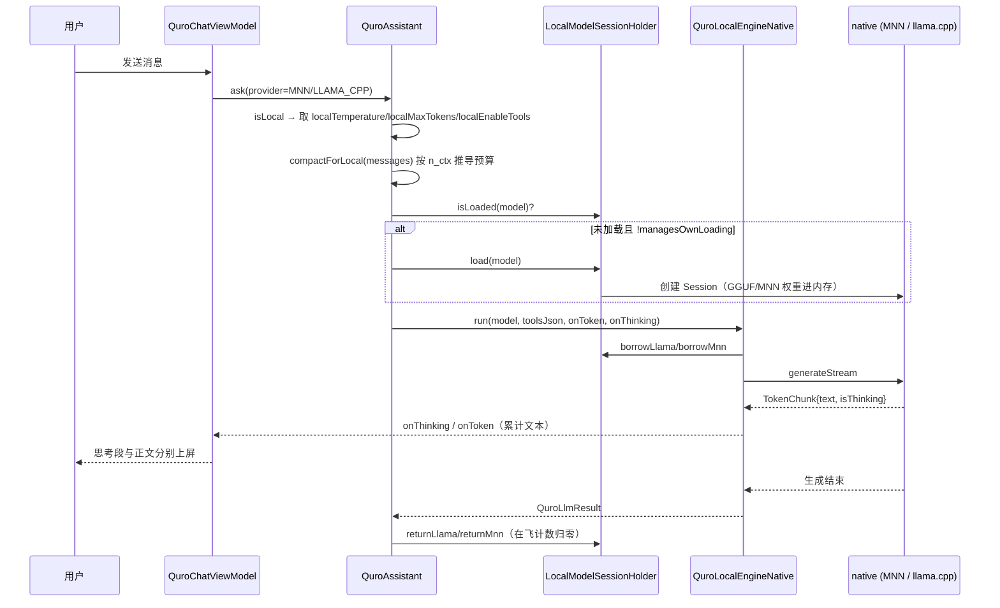

# 离线 LLM 引擎（MNN / llama.cpp）

把 GGUF / MNN 权重放进手机，在没有网络、没有 API Key 的情况下也能在对话框里对话、调本地工具。

## 1. 能力清单

| 能力 | 具体表现 |
|---|---|
| 双后端推理 | `QuroLocalModelType.MNN`（MNN 目录模型）与 `QuroLocalModelType.LLAMA_CPP`（`.gguf`）两个后端，界面按内容自动判定类型 |
| 模型导入 | 三种入口：①选文件夹（含 `llm_config.json` → MNN，含 `.gguf` → llama.cpp）；②直接选单个 `.gguf` 文件；③`QuroModelHubScreen` 从 HuggingFace / ModelScope 检索并下载 |
| 模型格式 | `.gguf`（含 `-00001-of-000NN` 分片）、MNN 模型目录（`llm_config.json` + `*.mnn` + tokenizer） |
| 会话常驻 | 一次显式「加载」后原生会话常驻内存，跨多轮对话复用，不再每条消息重新加载权重 |
| 流式输出 | 首 token 到达即建气泡，边生成边上屏 |
| 思考段上屏 | `<think>` 内容走独立通道流式上屏，与正文分流 |
| 离线工具调用 | 本地模型可调用一组**裁剪过的**离线工具集（设备/系统/记忆/ACI/工作区），不走云端 |
| 运行参数可调 | 每个模型独立配置 线程数 / 上下文长度 / GPU 层数 / mmap / KV 统一 / 后端 / 精度 / 内存模式 |
| 能力识别 | 导入后展示「架构 / 是否支持思考 / 是否支持工具」摘要 |
| 温控自适应 | decode 循环里按温度主动下调线程数（可选开关） |
| 进程隔离 | 推理可搬到 `:llm` 独立进程，避免 GB 级权重撑爆主进程 native heap（可选开关） |

## 2. 怎么用

### 2.1 导入模型

1. 打开 **设置 → 模型配置 → 01 导入模型 → 本地离线模型**；
2. 三选一：
   - **选文件夹** → 递归复制到 `filesDir/quro_local_models/<uuid>/`，按内容判定类型；
   - **选单个 .gguf 文件** → 复制到同样的私有目录后登记；
   - **模型中心**（`QuroModelHubScreen`）→ 搜 GGUF / MNN → 下载并登记，随后可直接加载。
3. 导入记录写入 `filesDir/quro_local_models.json`。

> 分片 GGUF（`xxx-00001-of-00003.gguf` …）由 `QuroGgufNaming.collapseShards` 折叠成**一个**模型名，
> 不会把 3 个分片当成 3 个模型。

### 2.2 加载并对话

1. 在模型列表点选目标模型 → 自动写入 `provider = MNN / LLAMA_CPP`、`localModelPath`、模型名；
2. 点「**加载**」→ 模型进内存常驻（首次加载 GGUF 在手机上需数十秒）；
3. 回到对话框直接发消息。

未加载就发消息会被**门禁**拦截，气泡里直接给出可执行提示（区分「从未加载 / 加载失败 / 正在加载 / 加载的是另一个模型」四种情形）。

### 2.3 调运行参数

模型卡片上打开参数面板，可设 `threads` / `contextSize` / `gpuLayers` / `useMmap` / `kvUnified` / `backend` / `precision` / `memoryMode`。
不设时走自动值，见 §5。

## 3. 技术实现

| 文件 | 职责 |
|---|---|
| `app/src/main/java/.../core/model/QuroLocalModelRepository.kt` | 模型登记与持久化（`quro_local_models.json`）、`.gguf` 扫描、能力摘要 |
| `app/src/main/java/.../core/model/QuroGgufNaming.kt`（同文件内 `object QuroGgufNaming`） | 分片命名规约：**导入侧与加载侧共用**，避免两侧各写一套扫描逻辑 |
| `app/src/main/java/.../core/network/QuroLocalEngine.kt` | 引擎接口 `QuroLocalEngine` + `managesOwnLoading` 标志 + `QuroLocalEnginePrefs` 开关 |
| `app/src/main/java/.../core/network/QuroLocalToolsCodec.kt` | 工具定义 OpenAI 格式编解码、`<tool_call>` 反解、`parseDetailed` 失败诊断 |
| `app/src/full/java/.../core/network/QuroLocalEngineNative.kt` | 驱动层：`runMnn` / `runLlama`、流式回调、门禁、思考分流兜底 |
| `app/src/full/java/.../core/network/LocalModelSessionHolder.kt` | 进程级常驻会话持有器、加载/卸载生命周期闸门、门禁快照 |
| `app/src/main/java/.../ui/QuroModelConfigScreen.kt` | 模型配置界面、`LocalModelDialog` 导入与加载 UI |
| `app/src/main/java/.../ui/QuroModelHubScreen.kt` | 离线模型下载中心（GGUF / MNN / 我的模型 三个 Tab） |
| `app/src/main/java/.../core/model/QuroHuggingFace.kt` | HuggingFace / ModelScope 检索与下载，镜像连通性探测排序 |
| `app/src/main/java/.../core/QuroAssistant.kt` | `routeLocal` 分流：选模型、自动加载、裁剪工具集与 prompt |
| `llm/core/{include/quro/think_splitter.h, src/think_splitter.cpp}` | 引擎无关思考段状态机（C++，223 条断言单测） |

### 一次本地推理的时序

## 4. 关键设计决策

### 4.1 🔴 云端与本地设置完全隔离

**做法**：`QuroModelConfig` 里 `localTemperature` / `localMaxTokens` / `localEnableTools` 与云端的
`temperature` / `maxTokens` / `enableTools` 是**两套独立字段**，各存各的 key（`local_temperature` /
`local_max_tokens` / `local_enable_tools` vs `temperature` / `max_tokens` / `enable_tools`）。
`QuroAssistant.ask` 用 `isLocal = provider == "MNN" || provider == "LLAMA_CPP"` 决定读哪一套
（`QuroAssistant.kt:266-280`）。

**为什么**：此前离线和云端**共用**同一组字段，用户为了让 1.2B 本地模型别乱说话把 temperature 调低、
maxTokens 调到 512，结果切回云模型时也被一起带歪——长文和工具编排被腰斩。这是用户明确定位的痛点。

**坑**：`contextWindow` 也隔离——云端按 `contextWindow`（默认 1048576）裁历史，
本地 n_ctx 由原生层按 prompt 自适应，云端那个 1M 值不下传给本地。

### 4.2 分片命名收敛到一处

**做法**：`QuroGgufNaming` 放在 `main` 源码集，导入侧 `collapseShards` 与加载侧
`resolveLlamaModelFileStatic` **都只准调它**。

**为什么**：历史上导入侧（`walkTopDown`）和加载侧（`listFiles`）各写一套扫描逻辑，
直接导致「导入成功、点加载却静默失败、聊天被门禁拦」。llama.cpp **只接受首分片路径**
（内部按 `split.count` 找齐其余分片），传非首分片必失败。

**坑**：Android ext4 的 `readdir` 是哈希序不是字典序，不 `sorted()` 会导致「每台设备选到的分片都不一样」
（PC 的 NTFS 恰好字典序，会掩盖这个 bug）。

### 4.3 线程数默认留 2 核给系统

`resolveThreads()` 自动值 = `availableProcessors() - 2`，夹在 2..6。

**为什么**：本地推理是纯 CPU 密集型，8 核开满 8 线程会把主线程饿死，
表现为 UI 冻住 + AnrMonitor 误判 ANR（realme RMX8899 实测）。留核后体感卡顿与误报同时消失。

### 4.4 门禁按真实状态给提示

`gateMessage()` 按 `LocalModelLoader.State` 分支：
`Failed` 直接把真实失败原因抛给用户，`Loading` 提示「首次加载需数十秒」，
`Loaded` 但不是同一个模型时明确写出「常驻的是 A，你选的是 B」。

**为什么**：用户拿不到 adb 日志，聊天气泡是他唯一的诊断面板。原来四种情况文案一模一样，
用户只能反复去点那个注定失败的「加载」按钮。

### 4.5 卸载必须等在飞生成归零

`unload()` 先置 `closing` 并 `cancel()` 在飞会话，**等 `activeGen` 归零（≤20s）才真正 release**。

**为什么**：原生 `llama_decode` 是跑在 IO 线程上的阻塞调用。若此时另一线程「卸载」直接 `release()`，
在飞生成会读已释放内存 → SIGSEGV @ `ggml_vec_dot_q5_K_q8_K` + SIGABRT @ `free`。

### 4.6 思考分流上移到 native（已完成）

原先 Kotlin 侧有三份 `<think>` 文本剥离实现（`StreamingThinkStripper` / `MnnThinkContent.split` /
`stripResidualThink`），native 的 `TokenChunk.isThinking` 全栈硬编码 `false`。
现已在 `llm/core` 实现引擎无关 `ThinkSplitter`，两栈 chunk 发射点全部过一遍，
并新增运行期 `addMarkers()` 把 llama.cpp 模板 detector 探测到的真实标签（`[THINK]`、
`<|channel|>analysis<|message|>` 等）注入。

**为什么**：只认 `<think>` 的模型换个不带标签的思考模型就整套失效。

### 4.7 离线工具集是裁剪过的，不是全量

`routeLocal` 只下发 `deviceToolNames` 白名单（手电筒、振动、电量、WiFi、网络、传感器、剪贴板、
应用、通知、蓝牙、时间、设备信息、计算、TTS、闹钟、`aci_list`/`aci_call`、
`workspace_*`）+ `autoSaveMemory` 开启时的 `memory_*`。

**为什么**：把 60+ 技能工具塞给 1.2B 模型会卡死/乱码。但也不能只留 `memory_*`——
此前一刀切导致「打开手电筒」这类离线设备指令完全调不动。

## 5. 配置项与开关

### 5.1 本地推理参数（`QuroModelConfig`，UI 在模型配置「04 参数」区，**仅本地模式显示**）

| 设置项 | 字段 / key | 默认值 | 影响范围 |
|---|---|---|---|
| 本地温度 | `localTemperature` / `local_temperature` | `0.7` | 仅本地采样温度；不影响云端 `temperature` |
| 本地生成上限 | `localMaxTokens` / `local_max_tokens` | `2048` | 仅本地；原 512 太短，思考模型连思考都不够 |
| 本地工具调用 | `localEnableTools` / `local_enable_tools` | `true` | 仅本地；关闭后不下发任何工具 schema |

### 5.2 引擎运行开关（`QuroLocalEnginePrefs`，SharedPreferences 文件 `quro_ui`）

| 键名 | 常量 | 默认值 | 影响范围 |
|---|---|---|---|
| `local_engine_isolated_process` | `KEY_ISOLATED_PROCESS` | `false` | true = 推理跑在 `:llm` 独立进程 |
| `local_engine_thermal_adaptive` | `KEY_THERMAL_ADAPTIVE` | `false` | true = decode 循环按温度主动降档，采样间隔 2000ms |

两者都默认关闭：进程隔离出问题会崩（一眼可见），温控出问题只是变慢（极难归因）。
**越是无声的失败，默认值越要保守。**

### 5.3 每模型运行参数（`QuroLocalModel`）

| 字段 | 默认 | 解析规则 |
|---|---|---|
| `threads` | `0` | `>0` 照办（夹 1..16）；`0` → `核数-2` 夹 2..6 |
| `contextSize` | `0` | `0` = 自动（llama 按 prompt 估算，MNN 由 `llm_config.json` 决定） |
| `gpuLayers` | `0` | `0` = 纯 CPU（手机端绝大多数 GGUF 构建无 GPU 后端） |
| `useMmap` | `false` | 外部存储上的 GGUF 用 mmap 会卡死加载 |
| `kvUnified` | `true` | 统一 KV 缓存，单序列省内存、加载更快 |
| `backend` | `""` | `""`/`cpu`/`opencl`/`opengl`/`vulkan`，空 → `cpu` |
| `precision` | `""` | `""`/`low`/`normal`/`high`，空 → `low` |
| `memoryMode` | `""` | 空 → CPU 后端 `low`、GPU 后端 `normal` |

> ⚠️ 老版本 JSON 无这些键，`parse()` 用 `optXxx` 兜底，**兜底值必须与默认值一致**
> （`useMmap=false` / `kvUnified=true`），否则老记录读出来会退回「卡加载」的旧行为。

## 6. 已知约束与待办

1. **必须先显式加载**：未加载就对话会被门禁拦。跨进程引擎（`managesOwnLoading == true`）跳过主进程加载，
   由 `:llm` 进程自行确保就绪。
2. **fdroid 风味无原生运行时**：`LocalModelLoaders.get()` 反射失败回退 NoOp，
   `QuroLocalEnginePlaceholder.run()` 返回「已登记，原生运行时未接入」的明确错误，不崩溃。
3. **MNN 侧无 GBNF 文法约束**：MNN 上游（`transformers/llm/engine`）完全没有 grammar 支持，
   工具调用只能靠 Kotlin 侧 `QuroLocalToolsCodec` 反解。llama 侧 `applyStructuredChatTemplate` 内部
   已自动装载 GBNF，`nativeSetToolCallGrammar` 是手动覆盖入口。
4. **`llm/core` 引擎无关 `tool_call_parser` 未做**：让 MNN 不再依赖 Kotlin 反解、两端结果一致。
   属设计层重构，两端当前各自可用，无功能性 bug。
5. **`StreamingThinkStripper` 降级未显式化**：当前已通过「native 通道优先 + stripper 兜底 +
   `nativeThinkingSeen` 去重」达成互斥共存，可再显式化一层。
6. **端到端联调未做**：JNI 路由 + stripper + parser 串起来跑真实模型，需真机。
7. **进程隔离默认关闭**：真机验证通过后把 `DEFAULT_ISOLATED_PROCESS` 改成 `true` 即完成切换（一处改动）。
8. **能力摘要仅用于 UI 展示**：`localModelCapabilitySummary` 判定保守，不参与推理路径决策；
   llama.cpp 侧按文件名家族推断（GGUF 二进制元数据读取成本过高），可能不准。
