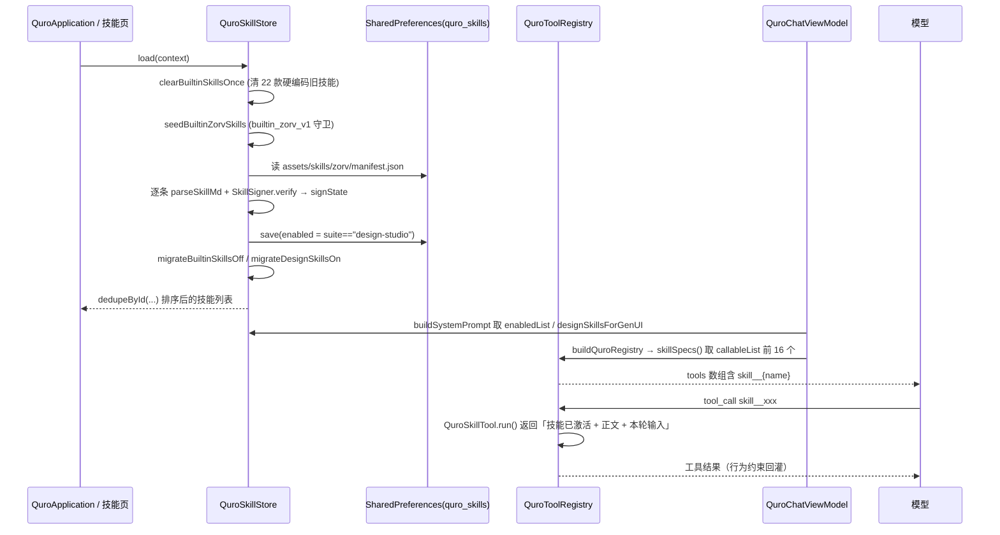

# 内置技能 Skills

技能是一段「注入系统提示词的行为约束 + 能力说明」，让 AI 在执行某类任务时按固定套路走；首次启动从随包资产播种进本地技能库，可在「设置 → 技能」里启停、编辑、导入导出。

## 1. 能力清单

| 能力 | 具体表现 |
|---|---|
| 随包内置 | `app/src/main/assets/skills/zorv/` 下 **67 个** SKILL.md + 一份 `manifest.json`（实测 `manifest.json` 的 `skills` 数组长度 = 67，`version = 1`，且每一项 `file` 都存在、无重复 id / 无重复 name） |
| 稳定 id | 每项形如 `zorv_<sha1>`（`zorv_a6d437ca54ec`…）；`zorv_` 前缀由 `BuiltinSkillAssetsTest` 断言 |
| 套件分组 | manifest 里的 `suite` 字段归并成 **25 个**套件（`design-studio` / `frontend-design` / `search` / `deploy` / `douyin-tiktok` / `github` / `weather` / `music` / `humanizer` …），技能页按套件折叠；`QuroSkillSuites.ORDER` 与 `LABELS` 恰好覆盖这 25 个 |
| 幂等播种 | `QuroSkillStore.seedBuiltinZorvSkills` 用 `builtin_zorv_v1` 前缀守卫：已存在 id 跳过，用户删过不会被强制加回 |
| 完整性签名 | 每项带 `signature`（HMAC-SHA256 of `id\|name\|content`，salt `zorv-ai-builtin-skill-sign-v1`）；播种时校验并写 `signState`：`verified` / `failed` / `unsigned` |
| 签名排查 | 技能页「验证签名」调 `verifyBuiltinSignatures` 返回 `SkillVerifyReport(total, verified, failed, unsigned, failedNames)` |
| 常驻注入 | `buildSystemPrompt`（`QuroChatViewModel.kt:1608`）只注入 `enabledList(appContext).filter { it.alwaysOn }`；且 `isLocal`（本地离线模型）时注入空列表（`:2026`） |
| 按需注入 | 每轮发送时 `matchTriggerSkills(t, appContext).filter { !it.alwaysOn }`，命中结果作为 `hidden=true` 的 user 消息预注入本轮（`:751`、`:930`、`:957`） |
| 手动选技能 | 对话框「选择技能」选中的技能同样作为隐藏 user 消息注入，仅作用于本轮（`:763`） |
| 技能工具化 | `callableList(context)`（enabled && callable && prompt 非空）注册为 `skill__{name}` function-calling 工具，由 `QuroSkillTool` 执行 |
| GenUI 强注入 | `designSkillsForGenUI` **忽略 enabled 开关**，永远给 GenUI 注入 design-studio 套件；用户技能库为空时直接从 assets 兜底解析 |
| 三种导入 | `QuroSkillsScreen` 的导入按顺序试：SKILL.md → 应用内技能 JSON → 工具规格 JSON（`QuroSkill.fromToolSpec`，工具→技能转换） |
| 两种导出 | 单技能导出开放标准 SKILL.md（`toSkillMd()`，与 anthropics/skills 兼容）；多选导出应用内 JSON 数组（`toExportJson()`，可被本 App 重新导入） |
| 自建 / 编辑 | `SkillEditorDialog` 编辑 名称 / 简介 / 指令正文 / 触发词 / 参数 Schema / 可作为工具调用 / 常驻 / 启用 |
| 重复 id 兜底 | `dedupeById` 在读取侧去重，防止历史残留重复 id 触发 LazyColumn key 冲突崩溃 |

### 默认状态（与 README 不一致，以源码为准）

README 写「首次启动自动注入为默认启用」，源码是 `QuroSkill.kt:334` 起的另一套策略：

| 套件 | `enabled` | `callable` | `alwaysOn` |
|---|---|---|---|
| `design-studio`（5 个） | `true` | `false` | `false` |
| 其余套件（62 个） | `false` | `false` | `false` |

也就是说 67 个技能**全部**会被播种进来，但只有 design-studio 套件默认生效（`enabled=true`）。原因写在 `migrateBuiltinSkillsOff` 的注释里：旧版把 62 个技能默认 `enabled=true && callable=true`，一旦用户给本地 1.2B 模型开工具调用，整套云端工具集加 60+ 技能工具会把它压垮（表现为「一直提示正在处理」/ 一调工具就乱码）。

### 注入发生在两处（很重要）

`alwaysOn` 决定技能走哪条路：

- `alwaysOn = true` → 进 `buildSystemPrompt` 的「## 已启用技能（Skills）」段，**常驻**每条请求的系统提示词；
- `alwaysOn = false` → 不进系统提示词，**只在 `trigger` 命中时**作为隐藏 user 消息注入本轮（注释：避免重复注入）。

内置 Zorv 技能播种时 `alwaysOn=false`，且 `trigger` 缺省回落为技能名本身——意味着「只有用户消息里出现该技能名（或它声明的触发词）时才会被加载」。本地离线模型（provider = MNN / llama.cpp）直接走 `emptyList()`，**一个技能都不注入**。

## 2. 怎么用

### 2.1 查看与启停

1. 打开 **设置 → 技能**（`QuroSkillsScreen`），也可由 AI 调 `ui_open_skills` 直接跳转到该页；
2. 页面顶部显示「`N` 启用 / `M` 共」；
3. 每条技能右侧开关即 `enabled`——关掉立即不再注入系统提示词；
4. 按套件折叠，点套件表头展开。

### 2.2 让 AI 用某个技能

- **注入式 / 触发式**：技能页开启（`enabled=true`）后，`alwaysOn=true` 的技能常驻系统提示词；`alwaysOn=false` 的技能要命中 `trigger` 才在本轮加载。二者互斥（源码里两侧各用 `.filter { it.alwaysOn }` 和 `.filter { !it.alwaysOn }` 分开处理），不会出现重复注入。
- **调用式**：在编辑器里勾选「可作为工具调用」（`callable=true`），AI 就能用 `skill__{name}` 直接调用，入参按「参数 Schema」填。

> 调用式受总开关 `QuroTool.skillToolsEnabled`（默认 `true`）与上限 `QuroTool.maxSkillTools`（默认 `16`）约束，取 `updatedAt` 最新的 16 个。
> 本地离线模型不走这条路：`buildSystemPrompt` 在 `isLocal` 时技能列表直接给 `emptyList()`。

### 2.3 导入外部技能

「导入」选择一个文件即可，解析器会依次尝试：

1. SKILL.md（`---` frontmatter 里的 `name` / `description` / `trigger`）→ 走 `parseSkillMd`；
2. 应用内技能 JSON（`id/name/description/prompt/enabled/…`）→ 走 `parseSkillJson`；
3. 工具规格 JSON（`{"name": "skill__xxx", "description": …, "parameters": …}`）→ 走 `QuroSkill.fromToolSpec`。

三者都不匹配才报导入失败。从开放标准导入的技能默认 `enabled=true, callable=true, alwaysOn=false`。

### 2.4 导出

- 单技能 → 导出 `<name>.skill.md`（标准 SKILL.md，别的技能系统也能读）；
- 多选 → 导出 `quro_skills_<n>_<ts>.json`（应用内格式，可回导）。

### 2.5 排查被篡改的内置技能

点「验证签名」：`verifyBuiltinSignatures` 直接比对 assets 源（不依赖已播种的 SharedPreferences），返回 failed 数量与失败项清单。签名口径为三元组 `id|name|fileContent`（`SkillSigner.sign`）。

## 3. 技术实现

| 文件 | 职责 |
|---|---|
| `app/src/main/assets/skills/zorv/manifest.json` | 随包技能清单：`{version, skills:[{id,name,description,file,size,suite,signature}]}`，实测 67 条 |
| `app/src/main/assets/skills/zorv/*.md` | 67 份 SKILL.md 正文（frontmatter `name` / `description` / `trigger` + 指令正文） |
| `app/src/main/java/.../core/skill/QuroSkill.kt` | 全部技能逻辑：`QuroSkill` 数据类、`QuroSkillSuites`、`SkillSigner`、`QuroSkillStore` |
| `app/src/main/java/.../core/tools/QuroSkillTool.kt` | 技能适配器：把技能包成 `QuroTool`，`run()` 返回「指令回灌」文本而非执行动作 |
| `app/src/main/java/.../core/tools/QuroTool.kt`（`skillSpecs()` / `mergeSkills()`，`:299`–`:324`） | 下发 `skill__*` 工具规格并把它们并进运行时注册表 |
| `app/src/main/java/.../ui/QuroSkillsScreen.kt`（504 行） | 技能列表 / 套件折叠 / 编辑 / 导入 / 导出 / 验证签名 |
| `app/src/test/java/.../core/skill/BuiltinSkillAssetsTest.kt` | 纯 JVM 资产测试：签名复现、id 前缀、design-studio 数量==5 且必有 trigger |
| `app/src/main/java/.../genui/aiapp/brain/GenUiRules.kt`（被上述测试引用） | GenUI 界面规则，测试同时校验规则里没有 SDK 未注册的「幽灵组件类型」 |

### 播种与注入时序

## 4. 关键设计决策

**为什么内置技能默认不启用、不注册成工具（踩过的坑：离线模型被压垮）。**
`seedBuiltinZorvSkills` 的注释写明了代价：把 60+ 技能全部注册成 `skill__*` 工具，本地小模型一旦开启工具调用就会被整份工具集淹没。内置技能的定位是「提示词层的手艺」，不是「可执行函数」。所以播种时统一 `callable=false, alwaysOn=false`，只有 design-studio 例外地 `enabled=true`——因为它是 GenUI 渲染质量的地基。旧设备由一次性迁移 `migrateBuiltinSkillsOff`（`builtin_zorv_offline_callable_fix_v1` 守卫）兜底修正。

**为什么 GenUI 强制注入 design-studio、忽略用户开关。**
`designSkillsForGenUI` 的注释：GenUI 每轮都在写界面，没有「界面手艺 / 设计系统 / 自检评分」这套规范就会裸奔，表现为组件难看、大片空白、文字叠印。用户在技能页随手关掉不能让界面质量崩掉，所以 GenUI 走的是绕过开关的另一条读取路径。

**为什么工具名要 `sanitizeToolName` 而不是简单地替换非法字符（issue #10）。**
旧实现把每个非 ASCII 字符替换成 `-` 再折叠，结果是**所有中文技能名都坍缩成同一个 `skill__skill`**（「视频号账号诊断」「合同风险审查」「抖音热榜」→ 全部同名）。紧接着 `specs()` 的 `distinctBy { it.name }` 把它们去重到只剩一个——用户装了 N 个中文技能，AI 实际只能调用 1 个，且没有任何日志。现委托 `QuroToolSpecGuard.sanitizeName`：净化丢信息时追加原名哈希尾缀找回唯一性，并把总长压进 64 字符（OpenAI function name 上限，超了整段 tools 会被服务端拒收）。反向查找依赖「确定性」，即 `toolNameOf(skill.name) == call.name`，无需存额外映射。

**为什么读取侧还要做 `dedupeById`（崩溃修复 #3）。**
旧版 manifest 曾短暂播种过重复 id（注释点名 `zorv_ff8e876ec646`），部分设备 `SharedPreferences` 残留两条同 id 记录。技能页 `LazyColumn` 用 `skill.id` 作 key，重复 key 直接抛 `IllegalArgumentException: Key "xxx" was already used` 崩进程。播种是幂等的、不会主动清理，所以在**读取侧**兜底去重，让任何残留重复都到不了 UI。

**为什么 `QuroSkillTool.run()` 不真的执行动作。**
技能没有独立执行逻辑——它的「执行」本质是把指令实时回灌进上下文，让 AI 严格按技能规则作答。`run()` 返回「【技能「X」已激活，请严格按以下规则回答用户，不要复述规则本身】+ 正文 + 本轮输入」。`QuroToolEngine.execute` 里的 `skill__` 分支行为一致，属于双保险。

**为什么内置技能要分「常驻」和「按需」两条注入路径。**
一次性把 60+ 技能正文塞进系统提示词，会挤掉真正重要的能力说明，也让每条请求的 token 开销不可控。所以 `buildSystemPrompt` 只收 `alwaysOn=true` 的技能，`alwaysOn=false` 的改由 `matchTriggerSkills` 在命中时作为隐藏 user 消息插进本轮——注释写明这是为了「避免重复」。内置 Zorv 技能全部走后者。

**为什么导出要出两套格式。**
`toSkillMd()` 面向生态互通（别的技能系统能读），`toExportJson()` 面向无损往返（含 `callable` / `alwaysOn` / `suite` / `signState` 这些 ZorvAI 私有字段，标准 SKILL.md 放不下）。

## 5. 配置项与开关

### 技能级字段（`SharedPreferences("quro_skills")` → key `skills`，JSON 数组）

| 字段 | 默认值 | 影响范围 |
|---|---|---|
| `enabled` | 播种时：`suite == "design-studio"`；导入时 `true` | 是否进入 `enabledList` → 是否注入系统提示词 |
| `callable` | 播种时 `false`；导入时 `true` | 是否注册为 `skill__*` function-calling 工具 |
| `alwaysOn` | 播种时 `false`；导入时 `false` | `true`=常驻系统提示词；`false`=仅 `trigger` 命中时注入 |
| `trigger` | SKILL.md frontmatter 的 `trigger`，缺省回落为技能名 `name` | `matchTriggerSkills` 的命中键，逗号分隔 |
| `parametersJson` | `{"type":"object","properties":{"input":{"type":"string",...}}}` | callable 时模型填参的 JSON Schema |
| `suite` | manifest 的 `suite`，导入的技能为 `""` | 技能页折叠分组；`design-studio` 有默认启用与 GenUI 强注入的特殊语义 |
| `signState` | `"unknown"`，取值范围 `verified` / `failed` / `unsigned` / `unknown` | 技能页展示校验标记（`zorv_` 前缀且非 unknown 时才显示） |

### 全局开关（`QuroTool.kt`）

| 字段 | 默认值 | 影响范围 |
|---|---|---|
| `QuroTool.skillToolsEnabled` | `true` | 关闭后 `skillSpecs()` 与 `mergeSkills()` 都直接返回空，所有技能工具不下发 |
| `QuroTool.maxSkillTools` | `16` | `callableList` 按 `updatedAt` 倒序取前 N 个 |
| `QuroToolSpecGuard.MAX_TOOL_NAME_LEN` | `64` | 工具名总长上限，`skill__` 前缀（7 字符）参与预算 |
| `SkillSigner.SALT` | `"zorv-ai-builtin-skill-sign-v1"` | HMAC 密钥，与构建期签名脚本及单元测试一致 |

### 一次性迁移守卫（执行过即不再跑）

| Key | 作用 |
|---|---|
| `builtin_cleared_v2` | 清除 22 款旧硬编码内置技能 |
| `builtin_zorv_v1` | 已播种 Zorv 内置技能 |
| `builtin_zorv_offline_callable_fix_v1` | 把已播种的内置技能翻成 enabled/callable/alwaysOn 全 false |
| `builtin_zorv_design_on_v1` | 把 design-studio 翻转回 enabled=true |

## 6. 已知约束与待办

- **README 的技能数量不准确**：README 多处写「63 个」，源码 manifest 实测 **67** 条（分布在 25 个套件，`design-studio` 5 个 + 其余 62 个，正文总 size 586510 字节）；另有历史注释提到「62 个」（`migrateBuiltinSkillsOff`），是当时的另一版本。本档以源码为准。
- **README 的「默认启用」不准确**：实际只有 design-studio 5 个默认启用，其余 62 个需手动开启（见 §1 表格与 §4 第一条）。
- **本地离线模型完全拿不到技能**：`buildSystemPrompt` 在 `isLocal` 时把技能列表置空（`:2026`），这与「用本地模型也能用技能」的直觉不符，但是「不给小模型塞长提示词」这一取向的直接后果。
- **trigger 命中是子串匹配**：`matchTriggerSkills` 用 `userText.lowercase().contains(it)`，短触发词容易误命中。
- **`callableList` 只取最新 16 个**：用户开了超过 16 个 callable 技能时，早期的会被 `take(maxSkillTools)` 截掉，且 UI 不提示。
- **签名校验对换行敏感**：`SkillSigner.verify` 未做换行归一化，而单元测试 `BuiltinSkillAssetsTest` 里明确做了 `\r\n → \n`。若 assets 文件被 Git 按 CRLF 检出，真机会误报 `failed`。建议把归一化下沉到 `SkillSigner`（待办）。
- **未启用的技能依然占包体**：67 份 SKILL.md 无论是否启用都随包，总 size 见 `manifest.json` 的 `size` 字段合计。
- **`QuroSkillsScreen` 的编辑不校验 JSON Schema**：「参数 Schema」填非法 JSON 时 `toToolSpecJson` 会 `getOrDefault` 回落到 `DEFAULT_SKILL_PARAMS`，但 UI 不报错，表现为「AI 永远只填 input」。
- **旧硬编码技能名清单依赖 `qstr(R.string.qk_03368)`**：`BUILTIN_NAMES` 里有一项走字符串资源，多语言环境下名称可能变化，理论上有清理不到的风险。
