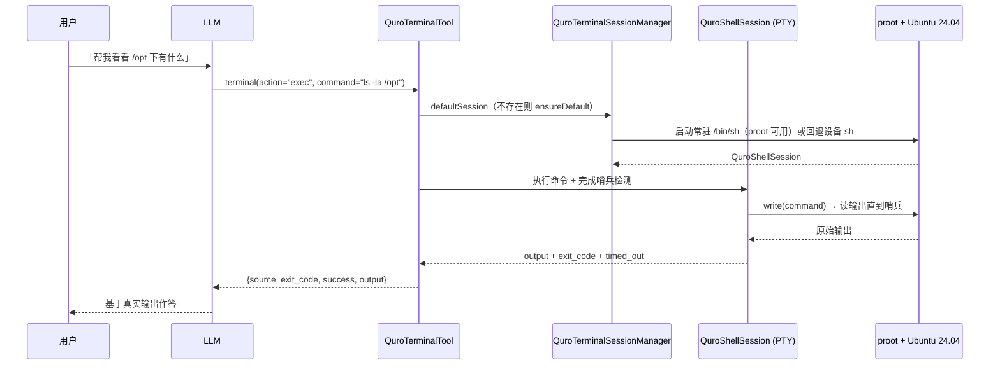

# 应用内终端与 Linux 沙箱

在手机里开一个真的 Ubuntu 24.04 ARM64 用户空间，能敲命令、能装包、能跑 Python / Node / Go / Rust，
并且 AI 可以直接替你敲、替你看输出。

## 1. 能力清单

| 能力 | 具体表现 |
|---|---|
| 真 Linux 用户空间 | proot 用户空间模拟，**无需 ROOT**，跑 Ubuntu 24.04 LTS (Noble) ARM64 |
| 交互式 PTY 会话 | `/dev/ptmx` 伪终端 + `fork/exec` + `TIOCSWINSZ` 窗口大小，支持 `vim` / `python` REPL 这类全屏交互程序 |
| 多会话 | 默认会话 / 额外会话 / UI 会话 三类 + 跨进程重启保留的历史会话元数据，可 `session_new` / `session_switch` / `session_kill` |
| 会话共享 | AI 工具层、终端界面、CMS 开发环境**共用同一个默认共享会话**，不再各自起 proot |
| 多后端 | `Backend.LINUX_PROOT` / `DEVICE_SH` / `VM_LINUX`，proot 不可用时自动回退设备 `sh` |
| 包管理 | `linux_install` 装 apt 包；apt 源自动切 `ubuntu-ports`（arm64）；执行前自动释放 stale 的 dpkg/apt 锁 |
| CMS 共享运行时 | 按需供给 NODE / PYTHON / SSH / JAVA / RUST / GO，`cms_engine_status` 查就绪态与部署进度 |
| 前台服务保活 | `specialUse` 前台服务持有 shell 子进程，15 秒巡检，息屏/切 App 不被杀 |
| 开机自启动 | `QuroTerminalBootReceiver` 监听 `BOOT_COMPLETED`（`installIfMissing=false`，避免开机无网络时误下载） |
| 跨进程调用 | ACI 12 个能力 + ContentProvider + Deep Link + 透明 Intent Activity + BroadcastReceiver 五种接入方式 |
| 轻量沙盒 | `quroterm_exec` 走自研 NovaTerm 沙盒（`/data/local/tmp/quroterm/root`），独立虚拟文件系统，比 proot 更快更轻 |
| 特权执行 | `priv_exec` 走 ZorvAI 授权 / Shizuku / ROOT 自动降级；`adb_term` 走本机 ADB shell 与无线调试开关 |
| 会话增强 | `tmux` 会话管理、`terminal_keys` 自定义按键绑定 |
| 中断 | 软中断（写 ETX）失败则强杀 shell 并重建会话、恢复到中断前的 cwd |

## 2. 怎么用

### 2.1 打开终端

三条路径：

1. 对话框输入框左侧「**+**」→ 选「终端」（`UiNavigationEvent.OpenScreen("terminal")` → `showTerminal = true`）；
2. AI 在对话中主动调用 `ui_open_terminal`；
3. 外部应用用 Deep Link：`quro://terminal/exec?cmd=uname -a`。

首次打开会跟随安装 Linux 环境（`installIfMissing=true`）：下载 Ubuntu base rootfs → 解压 → 配置 apt 源。
这个过程是秒级～分钟级，UI 有进度提示。

### 2.2 让 AI 用终端

AI 侧有**一个统一工具 `terminal`**（`QuroTerminalTool`，注册于 `QuroBuiltInTools`），用 `action` 分发 10 个子能力；
原先的 10 个独立工具名（`terminal_run` / `terminal_exec` / `terminal_write` …）作为子工具实例被复用，逻辑完全一致。

| action | 作用 |
|---|---|
| `run` | 应用沙盒内一次性执行（设备 `sh`，无 proot），返回 `{exit_code, success, timed_out, output}` |
| `exec` | 在 proot/Linux 执行，不可用时回退设备 `sh`，返回 `{source, exit_code, success, timed_out, output}` |
| `write` | 向当前交互式会话写一行输入并回车（可用于喂 python REPL） |
| `kill` | 销毁当前交互式会话 |
| `status` | 会话状态（模式 / 是否忙碌 / cwd / last_exit / last_interrupted）+ 全部会话列表 |
| `interrupt` | 中断正在跑的命令（等价 Ctrl+C） |
| `sessions` | 列出所有会话（id / 名称 / 后端 / 是否默认 / 是否存活） |
| `session_new` | 新建会话（可选 `name`，不自动成为默认） |
| `session_switch` | 把指定 id 的会话设为默认共享会话 |
| `session_kill` | 销毁指定 id 会话（缺省 `default`） |

另有一组 Linux 环境专用工具：`linux_run` / `linux_install` / `linux_start` / `linux_stop` / `linux_status`，
以及包管理（`install/remove/update/upgrade/search/list/info/clean/detect`）。

典型对话：
- 「在 Linux 里跑一下 `nproc` 和 `free -h`」→ `terminal(action="exec", command="...")`
- 「装个 Python 环境」→ `linux_install` / CMS 供给 PYTHON
- 「帮我 `pip install requests` 然后跑个脚本」→ `linux_run`

### 2.3 外部应用调用

| 方式 | 入口 |
|---|---|
| ACI AIDL | `bindService()` 绑 `QuroTerminalAciService`，12 个能力（`exec` / `create_session` / `send_input` / `get_session_env` / `get_audit_log` …） |
| ContentProvider | `content://com.ai.assistance.quro.terminal/sessions` \| `/exec?cmd=ls` \| `/status` |
| Deep Link | `quro://terminal/exec?cmd=...` \| `/sessions` \| `/create?name=...` \| `/status` |
| Intent Activity | `com.ai.assistance.quro.action.TERMINAL_EXEC`（extras: `command`, `timeout`）+ 另外 7 个 Action + `ACTION_SEND` + `ACTION_PICK` |
| BroadcastReceiver | 7 个 Action，结果通过 `TERMINAL_RESULT` 回传（`output` / `exit_code` / `error`） |

## 3. 技术实现

| 文件 | 职责 |
|---|---|
| `app/src/main/java/.../core/terminal/QuroTerminalController.kt` | 终端控制器：默认共享会话委托给会话管理器，`runCommand` / `sendToShell` / `sendKey` / `interrupt` |
| `app/src/main/java/.../core/terminal/QuroShellSession.kt` | PTY Shell 会话载体：`/dev/ptmx`、`fork/exec`、`TIOCSWINSZ`、输出流读取、`cwdState` |
| `app/src/main/java/.../core/terminal/QuroTerminalSessionManager.kt` | 多会话管理（DEFAULT / EXTRA / UI_TERMUX），持久化 `quro_terminal_sessions.json`，跨进程访问 |
| `app/src/main/java/.../core/linux/QuroLinuxEnv.kt` | proot + Ubuntu 24.04 ARM64：rootfs 下载/解压、apt 源配置、`APT_LOCK_RELEASE_PROLOGUE`、非交互 `run` |
| `app/src/main/java/.../service/QuroTerminalKeepAliveService.kt` | `specialUse` 前台服务保活，直接持有 shell 会话，15 秒巡检 |
| `app/src/main/java/.../service/QuroTerminalAciService.kt` | ACI 受控端服务，暴露 12 个能力 |
| `app/src/main/java/.../core/terminal/TerminalProvider.kt` | ContentProvider |
| `app/src/main/java/.../core/terminal/TerminalDeepLinkHandler.kt` | `quro://terminal/...` |
| `app/src/main/java/.../core/terminal/TerminalIntentActivity.kt` | 透明 Activity，外部 Intent 标准入口 |
| `app/src/main/java/.../core/terminal/TerminalBroadcastReceiver.kt` | 广播接收，7 个 Action |
| `app/src/main/java/.../core/tools/QuroTerminalTool.kt` | AI 侧统一 `terminal` 工具（10 action 分发） |
| `app/src/main/java/.../core/tools/QuroTermTool.kt` | `quroterm_exec`：NovaTerm 自研轻量沙盒 |
| `app/src/main/java/.../core/tools/QuroPrivExecTool.kt` | `priv_exec`：特权通道（Shizuku→su 自动降级） |
| `app/src/main/java/.../core/tools/QuroAdbTermTool.kt` | `adb_term`：ADB shell 与无线调试 |
| `app/src/main/java/.../core/cms/CmsEnvProvisioner.kt` | NODE / PYTHON / SSH / JAVA / RUST / GO 按需供给 |

### AI 用终端跑一条命令

## 4. 关键设计决策

### 4.1 三方共用同一个默认会话

**做法**：AI 工具层、终端界面、CMS 开发环境统一走 `QuroTerminalSessionManager.defaultSession`。

**为什么**：此前三方各自独立起 proot 进程，AI 装了包、用户在界面里看不到；用户在界面 `cd` 到某目录、
AI 执行命令又在另一个 cwd。共用会话后这些「两边状态不一致」的问题消失。

### 4.2 会话建在前台服务进程里

**做法**：`QuroTerminalKeepAliveService` 直接 `heldSession = QuroShellSession.create(...)`，
shell 子进程是服务进程的 fork。

**为什么**：前台服务调 `startForeground()` → 系统不杀这个进程 → 进程内 fork 的 shell 子进程也不会被杀。
这是「息屏 / 切 App 不被杀」的唯一可靠做法（普通进程里的子进程会被 LMK 带走）。

### 4.3 中断要走「杀进程 + 重建」

**做法**：`interrupt()` 先试软中断（写 ETX），失败则记住 cwd → 杀进程 → 重建默认会话 → `cd` 回去。

**为什么**：本会话的 stdin 是**管道不是 PTY**，内核不会把 `^C` 转成 SIGINT 发给前台进程组。
`ping`（无 `-c`）、`cat`（无参）这类命令**只能**靠杀进程停下来。

### 4.4 rootfs 运行时下载，不打包进 APK

**做法**：`assets/linux_env/` 只放 `proot` / `libproot-loader.so` / `libproot-loader32.so` / `setup_fake_sysdata.sh`；
Ubuntu base rootfs 首次使用时从 `UBUNTU_ROOTFS_MIRRORS`（阿里云 → 清华 → cdimage）下载。

**为什么**：一个完整 rootfs 几百 MB，打进 APK 会让安装包大到不可接受。用 HTTP 而非 HTTPS 是为了规避部分网络下的 SSL 问题。

**坑**：arm64 架构的 apt 源必须用 `ubuntu-ports`，**不是** `ubuntu`。写成 `ubuntu` 会 404。

### 4.5 apt 执行前先释放 stale 锁

`APT_LOCK_RELEASE_PROLOGUE` 逐个检查 `/var/lib/dpkg/lock`、`lock-frontend`、`/var/cache/apt/archives/lock`、
`/var/lib/apt/lists/lock`：**仅当锁存在且无进程占用**才删除，最后 `dpkg --configure -a`。

**为什么**：上次安装中断/崩溃会残留锁文件，导致后续 `apt-get` 卡死或报
「Could not get lock ... - open (11: Resource temporarily unavailable)」。
只删 stale 锁是为了不误杀正在运行的 apt。

### 4.6 `createSession` 必须在后台线程调用

`QuroTerminalController.createSession` 用 `runBlocking` 阻塞当前线程直到会话就绪，
而会话创建可能包含 rootfs 安装与 proot 进程启动。UI 侧请改用
`QuroTerminalSessionManager.ensureDefault`（suspend，内部已切 IO 线程）。

**坑**：在主线程调用会直接 Input dispatching timed out ANR。

### 4.7 轻量沙盒与重终端互补

`quroterm_exec`（NovaTerm 自研沙盒）与 proot 终端是**两条独立链路**：
轻量命令走自研沙盒（更快更轻、独立虚拟文件系统），需要 apt / python3 / 完整 Linux 环境时走 proot。

## 5. 配置项与开关

| 设置项 / 键名 | 位置 | 默认值 | 影响范围 |
|---|---|---|---|
| `use_chroot` | SharedPreferences `quro_linux_env` | — | proot 与 chroot 的后端选择 |
| APT 镜像源 | `SourceManager`（`PackageManagerType.APT`） | `http://mirrors.aliyun.com/ubuntu-ports` | 容器内 apt 下载源；失败依次回退清华、ports.ubuntu.com |
| rootfs 镜像 | `UBUNTU_ROOTFS_MIRRORS` | 阿里云 ubuntu-base 24.04 release | 首次安装 rootfs 的下载地址 |
| 前台服务类型 | `AndroidManifest` | `specialUse` + `PROPERTY_SPECIAL_USE_FGS_SUBTYPE` | Android 14+ 保活兼容性 |
| 巡检间隔 | `QuroTerminalKeepAliveService` | 15 秒 | 会话死亡自动重建的检查频率 |
| 开机自启动 | `QuroTerminalBootReceiver` | 监听 `BOOT_COMPLETED` | 重启后是否自动拉起终端服务 |
| `installIfMissing` | `ensureDefault(context, installIfMissing)` | 界面打开 `true` / 开机自启 `false` | 是否触发 rootfs 下载安装 |
| 会话持久化 | `filesDir/quro_terminal_sessions.json` | — | 额外会话与历史会话元数据 |

## 6. 已知约束与待办

1. **`^C` 对部分命令无效**：stdin 是管道不是 PTY，`ping`（无 `-c`）、`cat`（无参）等需走「杀进程 + 重建会话」路径，
   用户体验上表现为「中断后终端重新回到原目录」。
2. **proot 不是真容器**：无内核级隔离，`--bind` 挂载系统目录；部分需要真 root / 内核特性的程序（如 Docker、iptables）跑不了。
3. **rootfs 首次安装耗时长**：需下载数百 MB 并解压，弱网下体验差；已有镜像回退链但不做断点续传（待核实）。
4. **非交互输出有长度上限**：`QuroLinuxEnv.MAX_OUTPUT_LENGTH = 15_000`，超长输出（构建日志、`ls -R`）会被截断。
   上层另有 `QuroConversation` 的就地压缩兜底。
5. **历史会话不可恢复**：跨进程重启后只保留会话**元数据**（`alive=false`），进程已消亡，不能复活。
6. **proot 与设备 shell 行为不一致**：同一条命令在 `LINUX_PROOT` 与 `DEVICE_SH` 后端下工具集不同
   （Android 的 toybox 无 `apt` / `python3`）。AI 用 `exec` 时返回里的 `source` 字段可判断实际走了哪条路。
7. **ARCH 限制**：rootfs 为 ARM64；非 arm64 设备只能走 `DEVICE_SH` 或 `VM_LINUX` 后端。
8. **文档中 `assets/linux_env/ubuntu-noble-aarch64-pd-v4.18.0.tar.xz` 已过时**：实际资产目录只有
   `proot` / `libproot-loader.so` / `libproot-loader32.so` / `setup_fake_sysdata.sh`，rootfs 为运行时下载。
