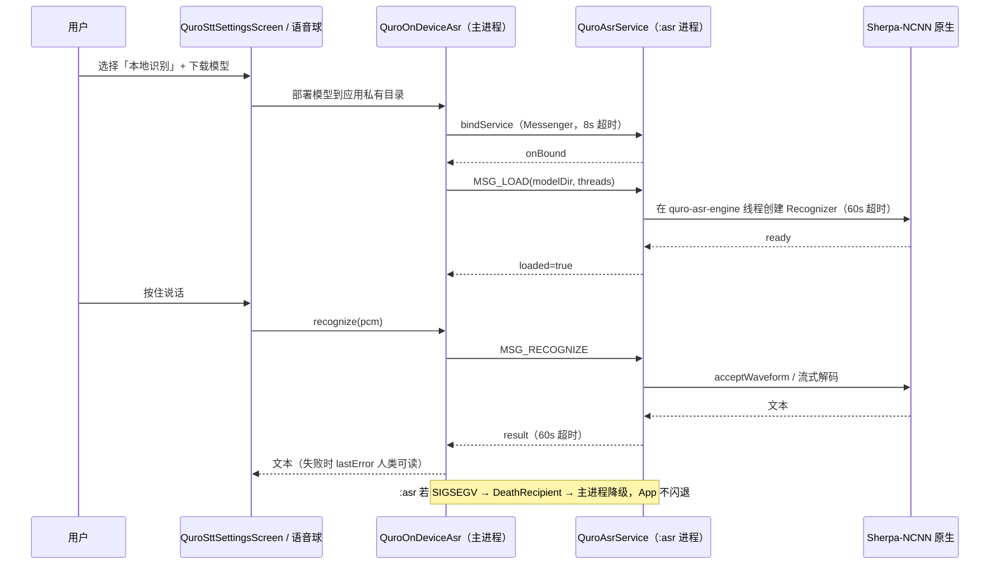

# 语音 / TTS / STT / 媒体 / 浏览器 / 文档

把「说话、听写、朗读、放歌、放视频、开网页、读写 Office 文档」都收进同一个对话框，
AI 可以主动调用，用户也可以当普通播放器 / 阅读器用。

## 1. 能力清单

### 1.1 语音（TTS / STT）

| 能力 | 具体表现 |
|---|---|
| 云端 TTS 多供应商 | `QuroTtsProvider` 内置 13 个 provider：`edge`（免费无 Key）/ `openai` / `minimax` / `siliconflow` / `tts302` / `cozecn` / `gizwits` / `acgn` / `aliyun` / `mimo` / `volcengine` / `iflytek` / `tencent` |
| 情绪标签 | 情绪标签（如 `(开心)`）按原样写在文本里；`emotion_tags_enabled` 开启后构建 system prompt 时自动注入所选服务商的标签表 |
| AI 自主语音 | `speak` 工具：AI 主动播报，**与「自动朗读」开关完全解耦**；可多次调用按序串行播放；`voice` 参数指定音色实现分角色演绎 |
| 停止播报 | `stop_speak` |
| 音色路由 | `voice_color_routing` 开启时 AI 按内容自动为段落分配不同音色，边播边合成 |
| 端侧 STT | `QuroOnDeviceAsr` + `QuroAsrService`，跑在独立 `:asr` 进程，Sherpa-NCNN **流式 transducer**，完全离线 |
| 端侧模型可选 | `AsrModelCatalog` 5 个内置模型：zipformer-zh-14M（22MB，推荐）/ lstm-transducer-small（18MB）/ zipformer-en-20M（37MB）/ zipformer-bilingual（141MB）/ conv-emformer（27MB） |
| 系统识别 | Android `SpeechRecognizer`（`QuroSttPrefs.SOURCE_LOCAL`，默认） |
| 云端转写 | `SOURCE_MODEL` 走云端转写 |
| 悬浮语音球 | `QuroVoiceBallView` + `QuroVoiceBallService`，可拖拽，可绑定指定对话框 |
| 崩溃隔离 | `:asr` 进程若因 Sherpa 原生 SIGSEGV 崩溃，`IBinder.DeathRecipient` 触发，主进程优雅降级，**App 不闪退** |

### 1.2 媒体

| 工具 / 界面 | 能力 |
|---|---|
| `local_music_player` | 后台播放音频，对话框出现播放/暂停卡片，可切曲目 |
| `local_video_player` | 视频播放 |
| `list_media` | 列出媒体库图片 / 视频（名称 + 大小 + 日期），参数 `kind` / `limit` |
| `music_play` | 音乐播放 |
| `ffmpeg` | `info` / `convert` / `execute` 三种 action：探测、转码（`-vf scale=640:-1 -b:v 1M` 等）、执行原始 FFmpeg 参数 |
| `QuroMediaBrowser` | 媒体库浏览界面 |
| `QuroMusicPlayerScreen` / `QuroVideoPlayerScreen` | 音乐 / 视频播放界面 |

### 1.3 浏览器

| 能力 | 具体表现 |
|---|---|
| 内置浏览器 | `QuroBrowserScreen`（`android.webkit.WebView`），`ui_open_browser` 或输入框「+」菜单打开 |
| `open_web` | **被动**展示：在内置浏览器打开 URL 供用户看。AI 无法在其中点击/填表/翻页 |
| `ai_browser` | AI 自动化浏览器 + 联网搜索 + 文件下载；`action="automate"` 在**单次调用内**完成「搜索 → 抓正文 → 合并成带出处的研究简报」 |
| 受控端浏览器（ACI） | 包名 `com.ai.assistance.quro.browser`，暴露 31 项能力：`browser_open` / `browser_read` / `browser_crawl` / `browser_search` / `browser_script` / `browser_elements` / `browser_action` / `browser_screenshot` / `browser_capture` / `browser_snapshot` / `browser_restore` / `browser_tab*` / `browser_mouse` / `http_request` / `inject_touch` … |
| Python ↔ 浏览器会话桥 | `QuroSessionBridge`（`window.QuroSession`）：Cookie 经全局 `CookieManager` 双向同步，Storage 经 `SharedPreferences` 镜像；Python 侧 `browserAct()` 直接驱动 `QuroBrowserController` |
| 抓包 | `browser_capture` 记录完整链路：请求体 + 响应头 / 状态码 / 响应体 |

### 1.4 文档

| 工具 / 界面 | 能力 |
|---|---|
| `aiwps_create` | 生成**真** Office 二进制 `docx` / `xlsx` / `pptx` / `pdf`，零外部依赖，可用 WPS / Office 打开 |
| `aiwps_read` | 读取已有文档内容（AI 上传文档后系统提示词会引导调用） |
| `aiwps_edit` | 「整篇重写」语义：`aiwps_read` 读 → 改写正文 → `aiwps_edit` 落盘；支持 `overwrite` |
| `enhanced_doc_create` | 17 种文本类格式：md / txt / csv / json / xml / yaml / html / css / js / svg / odt / epub / rtf 等，创建后对话框渲染预览 |
| `aip_compose` | 后台 AIP 排版合成，整篇长文档 / PPT / 报告以工具调用形式产出 |
| `QuroDocumentViewer` | 应用内文档查看 |
| `QuroDocOpener` | 文档打开统一入口：**WPS 优先**（`cn.wps.moffice_eng` / `com.kingsoft.wpsoffice`），未安装回退系统选择器 |
| `QuroOnlyOfficeScreen` | ONLYOFFICE 入口 |
| `QuroDocEditorScreen` | 文档编辑界面 |

## 2. 怎么用

### 2.1 语音

1. **悬浮语音球**：设置 → 语音设置 → 开「悬浮语音球」。球可拖拽；可绑定固定对话框（默认「跟随当前正在看的对话框」）。
2. **听写引擎**：语音设置里三选一 —— 系统识别（`local`，默认）/ AI 模型（`model`，云端转写）/ 本地识别（`ondevice`，端侧模型）。
3. **端侧模型**：选「本地识别」后在模型列表下载（推荐 zipformer-zh-14M，22MB），下载解压到应用私有目录后自动部署。
   设置页有「测试引擎」按钮，直接验证当前引擎能否跑通。
4. **自动朗读**：语音设置 → 开「自动朗读」，AI 回复完成后 TTS 朗读。
5. **让 AI 主动说话**：直接说「用语音给我讲个故事」/「分角色读这段」——AI 调 `speak`，
   每段单独一次调用并带 `voice`，自然形成多音色演绎。**即使关闭自动朗读也照常播报。**

### 2.2 媒体

- 说「放一下周杰伦的歌」→ `local_music_player`，对话框出现播放卡片；
- 说「把这个视频压到 640 宽」→ `ffmpeg(action="convert", input=..., output=..., options="-vf scale=640:-1")`。

### 2.3 浏览器

- 用户看网页：`ui_open_browser` 或输入框「+」→ 浏览器；
- AI 查资料：`ai_browser(action="automate")` —— **一次调用**拿回带出处的研究简报；
- AI 像人一样操作网页（点击、填表、翻页）：`aci_call` 调受控端浏览器的
  `browser_open → browser_elements → browser_action → browser_read`；
- Python 脚本驱动浏览器：Python 控制台里 `window.QuroSession.browserAct(action, args)`，
  与浏览器**共享 Cookie 和 Storage**，「先浏览器登录 → Python 复用登录态」。

### 2.4 文档

- 「帮我写一份季度汇报的 pptx」→ `aiwps_create(type="pptx")`；
- 「把这份合同第 3 条改成…」→ `aiwps_read` 读 → `aiwps_edit` 落盘（默认生成新文件，`overwrite=true` 才覆盖）；
- 「生成一份 config.yaml」→ `enhanced_doc_create`，创建后对话框直接预览；
- 查看已有文档 → `QuroDocumentViewer`；要编辑 → `QuroDocOpener`（WPS 优先）。

## 3. 技术实现

| 文件 | 职责 |
|---|---|
| `app/src/main/java/.../core/tools/QuroTtsProvider.kt` | TTS 供应商定义（id / name / kind / defaultBaseUrl） |
| `app/src/main/java/.../core/tools/QuroTtsHolder.kt` | TTS 单例 + `speak` / `stop_speak` 工具 + 串行播报队列 |
| `app/src/main/java/.../core/tools/QuroCloudTts.kt` / `QuroTtsClients.kt` | 各供应商客户端实现 |
| `app/src/main/java/.../core/tools/QuroVoiceStyle.kt` | 情绪标签 / 音色 |
| `app/src/main/java/.../core/tools/QuroSttRecorder.kt` | 录音 |
| `app/src/main/java/.../core/tools/QuroOnDeviceAsr.kt` | 端侧 ASR 门面（Messenger IPC 到 `:asr` 进程，含 `DeathRecipient` 降级） |
| `app/src/main/java/.../core/tools/QuroAsrService.kt` | `:asr` 进程内的 Sherpa 引擎（`quro-asr-engine` HandlerThread） |
| `app/src/main/java/.../core/tools/QuroAsrModels.kt` | 端侧模型目录 `AsrModelCatalog`、下载解压部署 |
| `app/src/main/java/.../ui/QuroSttSettingsScreen.kt` | 语音识别设置：引擎选择 / 模型下载 / 测试引擎 |
| `app/src/main/java/.../core/tools/QuroVoiceFeaturePrefs.kt` | 语音功能开关统一持久化（`quro_voice_features`） |
| `app/src/main/java/.../service/QuroVoiceBallService.kt` | 悬浮语音球服务 |
| `app/src/main/java/.../ui/QuroBrowserScreen.kt` / `core/tools/QuroBrowserController.kt` | 内置浏览器界面与控制器 |
| `app/src/main/java/.../core/tools/QuroSessionBridge.kt` | Python ↔ 浏览器会话桥（`window.QuroSession`） |
| `app/src/main/java/.../core/tools/QuroToolsAiBrowser.kt` | `ai_browser` 工具 |
| `app/src/main/java/.../core/tools/QuroFfmpegTool.kt` | `ffmpeg` 工具 |
| `app/src/main/java/.../core/tools/QuroToolsMediaPlayer.kt` / `QuroToolsMedia.kt` | 播放器与媒体库工具 |
| `app/src/main/java/.../core/tools/QuroAiwpsTool.kt` / `AiwpsReadTool.kt` / `AiwpsEditTool.kt` | `aiwps_create` / `aiwps_read` / `aiwps_edit` |
| `app/src/main/java/.../core/tools/EnhancedDocTool.kt` | `enhanced_doc_create` |
| `app/src/main/java/.../ui/QuroDocOpener.kt` / `QuroDocumentViewer.kt` / `QuroOnlyOfficeScreen.kt` | 文档打开 / 查看 / ONLYOFFICE |

### 一次端侧语音识别（跨 `:asr` 进程）

## 4. 关键设计决策

### 4.1 `speak` 与「自动朗读」彻底解耦

**做法**：`speak` 是独立语音通道，不受「自动朗读」开关限制。
`QuroTtsHolder` 标记「AI 本轮主动用 speak 播报」后，自动朗读**让位**，不会重复念同一段。

**为什么**：关闭自动朗读的用户照样希望 AI 唱歌 / 讲故事 / 分角色演绎；
而开启自动朗读时若两者都播，用户会听到两遍。
播报文本还可以与回复文字不同（如「回复里写步骤、语音里念一句话总结」）。

### 4.2 端侧 ASR 跑在独立 `:asr` 进程

**做法**：`QuroOnDeviceAsr` 只是 Messenger IPC 门面，真正的 Sherpa-NCNN 在 `QuroAsrService`（`:asr`）里，
跑在专用的 `quro-asr-engine` HandlerThread 上。

**为什么**：Sherpa 原生会 SIGSEGV。若在主进程里跑，一次崩溃就是整 App 闪退。
放到独立进程后，`IBinder.DeathRecipient` 触发 → 主进程标记不可用、返回空 → **App 不闪退**。

### 4.3 端侧模型全部选流式 transducer

**做法**：`AsrModelCatalog` 5 个模型**全部**是 Sherpa-NCNN 流式 transducer，
默认推荐 zipformer-zh-14M（22MB）。

**为什么**：这是对「原 215MB SenseVoice 不适合手机」的直接答复——手机上要的是体积小、延迟低、内存省。
随包 `.so` 只实现了流式 transducer，所以设置页的模型类型下拉**只列引擎真正能跑的类型**，
不再假装可部署 SenseVoice / ONNX。

**坑**：历史遗留的 SenseVoice / ONNX 部署目录本机引擎跑不了，设置页会给出迁移提示；
自定义链接的模型类型下拉保留仅为将来扩展。

### 4.4 端侧引擎按 CPU 核数推荐线程数

`recommendedThreads()`：≥8 核 → 3，≥4 核 → 2，否则 1。

**为什么**：手机大小核调度，线程数过高反而更慢。

### 4.5 端侧 STT 有架构限制

只支持 `arm64-v8a`；其余架构禁用下载/部署，**不再假装可部署**。

### 4.6 文档打开统一「WPS 优先」

**做法**：`QuroDocOpener.WPS_PACKAGES = ["cn.wps.moffice_eng", "com.kingsoft.wpsoffice"]`，
命中则用 WPS 打开，未安装回退系统选择器（含用户已装的 ONLYOFFICE）。

**为什么**：旧实现硬编码 ONLYOFFICE 包名优先，与「文档」这个命名自相矛盾。

**坑**：`FileProvider.getUriForFile` 在文件不存在或路径未被 `res/xml/file_paths.xml` 覆盖时会抛
`IllegalArgumentException` → 整页崩溃。统一走 `safeUri()` 捕获返回 null，由调用方优雅降级。

### 4.7 `aiwps_create` 与 `enhanced_doc_create` 分开

- `aiwps_create` → **真** Office 二进制（docx / xlsx / pptx / pdf），适合分享给他人用 WPS / Office 打开；
- `enhanced_doc_create` → 17 种文本类格式，创建后**对话框直接渲染预览**。

两者不是替代关系：要「能发出去的正式文件」用前者，要「代码 / 配置 / Markdown」用后者。

### 4.8 浏览器分「被动看」和「主动操作」两条路

- `open_web`：**被动**，只给用户看，AI 无法点击 / 填表 / 翻页；
- 受控端浏览器（ACI，31 项能力）：AI 像人一样操作网页；
- `ai_browser(action="automate")`：研究类任务**必须且只调用一次**，单次调用内完成搜索 + 抓正文 + 合并简报。

**为什么**：把研究拆成「先 search 再逐个 read」会产生大量重复工具调用、严重拖慢对话、容易卡死。

## 5. 配置项与开关

开关统一持久化在 SharedPreferences `quro_voice_features`（`QuroVoiceFeaturePrefs`）：

| 键名 | 读取方法 | 默认值 | 影响范围 |
|---|---|---|---|
| `voice_ball` | `getVoiceBall` | `false` | 悬浮语音球总开关 |
| `auto_read` | `getAutoRead` | `false` | AI 回复自动朗读；**不影响 `speak` 工具** |
| `dialog_voice_button` | `getDialogVoiceButton` | `false` | 对话框输入框是否显示语音输入按钮（暴露为 StateFlow，切换即时重组） |
| `voice_name` | `getVoiceName` | `""` | 默认音色（自然语言描述） |
| `voice_ball_session` | `getVoiceBallSessionId` | `""` | 语音球绑定的对话框 id；空串 = 跟随当前正在看的对话框 |
| `autostart` | `getAutostart` | `false` | 开机后自动拉起常驻语音球（含通知栏） |
| `emotion_tags_enabled` | `getEmotionTagsEnabled` | `false` | LLM 自动组合情绪标签总开关 |
| `emotion_provider_id` | `getEmotionProviderId` | `""` | 情绪标签来源服务商；空串 = 自动（回落全局已选风格标签 → 云 TTS 兜底词库） |
| `voice_color_routing` | `getVoiceColorRoutingEnabled` | `true` | AI 自动分配角色音色，仅云端 / 小米 MiMo 生效 |

语速 / 语音来源**不**在本文件里另存，统一复用 `QuroTtsPrefs`（`getRate` / `getSource`）——
语音播放链路实际读取的唯一数据源，避免「改了不生效」。

STT 引擎选择存在 SharedPreferences `quro_stt`（`QuroSttPrefs`，键 `stt_source`）：
`local`（系统 `SpeechRecognizer`，默认）/ `model`（云端转写）/ `ondevice`（端侧 Sherpa-NCNN）。

## 6. 已知约束与待办

1. **端侧 STT 仅 arm64-v8a**：其他架构直接禁用下载/部署。
2. **端侧模型只支持流式 transducer**：SenseVoice / ONNX 目录本机引擎跑不动，需迁移。
3. **F-Droid 版本无预编译原生库**：安装包内找不到 `libsherpa-ncnn-jni.so` 时提示改用「本地识别」或「AI 模型」引擎。
4. **`open_web` 是被动的**：AI 想真正操作网页必须走 ACI 调受控端浏览器（`browser_*`）。
5. **`aiwps_edit` 是整篇重写语义**：不保留原文档的局部格式（复杂样式 / 图片）。
6. **README 描述的端侧 STT 与实际实现不一致（已订正）**：README 原写 `sherpa-onnx-whisper-tiny`（约 85MB onnx），
   源码命中的是 **sherpa-ncnn 流式 transducer**（22MB 起），且 `QuroAsrModels` 明确写着
   「不含任何 OfflineRecognizer 符号」。以源码为准；README 段落待更新。
7. **GeckoView 使用情况待核实**：`app/build.gradle.kts:306` 声明了
   `org.mozilla.geckoview:geckoview:140.0.20250707120347` 依赖，但 `QuroBrowserScreen` 实际
   import 的是 `android.webkit.WebView`，全仓 `.kt` 未命中 GeckoView 符号。具体使用位置待核实。
8. **`list_media` 权限受 targetSdk 34 影响**：API 33+ 上 `READ_EXTERNAL_STORAGE` 已被
   `READ_MEDIA_IMAGES/VIDEO` 取代且不可通过对话框授予，需单独处理。
